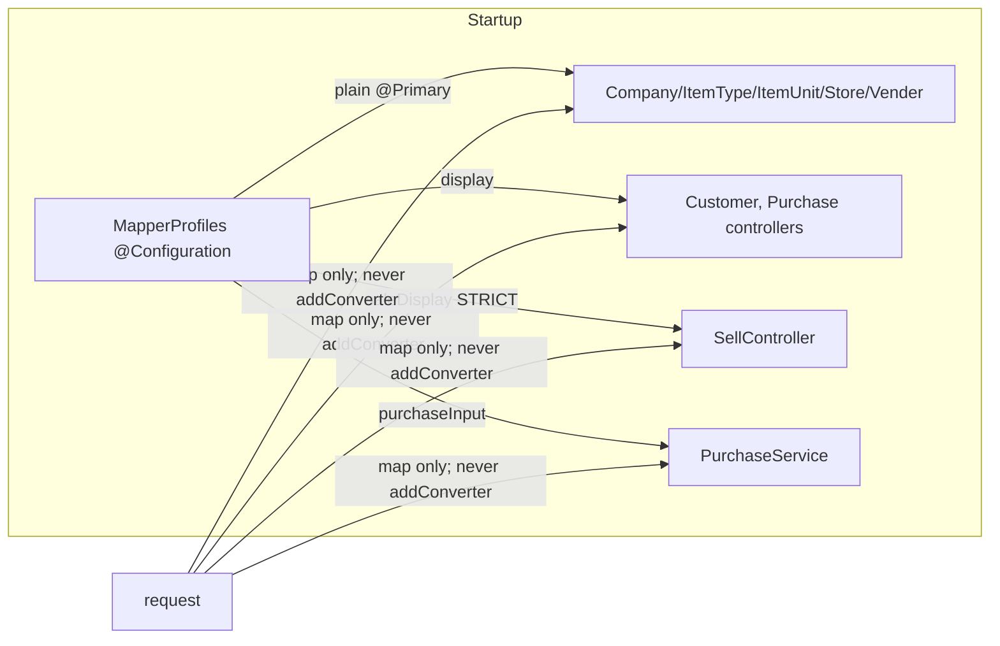

# MM-1: mappers are configured once at startup, never per request

**Status:** BUILT (2026-10-04). User: *"go ahead with the latest and best solution"*, after the merge review declined
`refactor/modelmapper-typemaps`. Supersedes that branch; see "Why not the June branch" below.

## 1. Document — the defect
business-service copies entities ⇄ screen DTOs with ModelMapper. Each controller kept its **own** mapper in a field.
Four of them also **added the date converters inside request handlers**, on that shared singleton. A mapper's
behaviour therefore depended on **which request reached it first after a deploy**:

| Call | Before its sibling ran (cold) | After (warm) |
|---|---|---|
| `PurchaseController.getAllPurchase` | Purchase `dated` → ModelMapper's default String (`2026-10-04T10:20:30`) | `04-10-2026 10:20:30` |
| `SellController.loadSR` / `getAllSell` / invoice customer | default form | `dd-MM-yyyy …` |
| `CustomerController.addOwner` reply | default form | formatted |

It also mutates a mapper's configuration while other threads are mapping with it. ModelMapper's guidance is to
configure first and share afterwards.

## 2. Rule 0 — counted
- **business-service:** 13 `new ModelMapper()` and 34 `map()` calls in 15 files, configured as follows.
  - **9 plain** (STANDARD, no converters): Company, ItemType, ItemUnit, Store and Vender controllers.
  - **2 display** (STANDARD + LocalDate/LocalDateTime → String): Customer and Purchase controllers.
  - **1 sale display** (STRICT + the same two converters): SellController.
  - **1 purchase input** (STANDARD + String → LocalDate/LocalDateTime, empty → null): PurchaseService.
  - **1 unused** (SellService field, 0 calls).
  - **ObjectMapperUtils:** static STRICT, configured in a static block and never mutated. Already correct; untouched.
- **Other services:** 9 plain per-class instances, while each application already declares a plain `@Bean ModelMapper` that **nothing injected**.
  - agriculture 3, analytics 2, campaign 3, welfare 1.
  - These now use the bean. The configuration is identical (`new ModelMapper()`), so there is zero behaviour change.
  - appointment already used a configured bean; untouched.

## 3. Design — named pattern: **configure-at-startup, immutable profiles** (one bean per mapping profile)

| Standard | Applied as |
|---|---|
| Thread-safe sharing | Each mapper is fully configured in its `@Bean` method, before any request |
| Zero behaviour change | Each profile = the WARM state its class reached before (same strategy, same converters). `MapperProfilesTest` builds the old warm mapper the old way and asserts identical output for every type pair |
| Deliberate fix | Cold-start output now equals warm output, for every call |
| DI over `new` | Constructor or field injection by `@Qualifier`; no `new ModelMapper()` left in a request path |

## 4. Why not the June branch (`refactor/modelmapper-typemaps`)
It made ONE bean and set `MatchingStrategies.STRICT` for **all** mappings. Today only SellController is STRICT. STRICT
silently drops fields that STANDARD matches (nested `stock.*`, the `Customer.getId()` → `customerId` delegation), so
purchase, stock and customer screens would lose values with no error.

## 5. Found by the gate: MM-2 (FIXED 2026-10-04, follow-up commit)
`getAllPurchase` and `getAllSell` map every row to a DTO and then **return `objs`, the raw JPA entities**, discarding the
DTOs. That breaks "never return entities", and it's why their dates are ISO (`2026-09-26T14:23:59`), while `getUserPurchase`
and `getUserSell` serve `26-09-2026 14:23:59` for the same rows. No screen calls them. Their only readers are
`multi-location.cy.js` (reads `storeId` ×6) and `price-override.cy.js` (reads `catalogPrice`), and neither field exists
on the DTO. Returning the DTOs therefore needs those fields added to the DTOs first, so it is its own slice.

**Fix:** both endpoints now return their mapped DTOs. `SellDTO` gained `storeId`, which is **read-only on the wire**
(`@JsonProperty(access = READ_ONLY)`): a sale's store is decided by the server's location scope. No code reads it from
a DTO and no input path copies DTOs wholesale (both checked). `catalogPrice` was already on the DTO. Proof:
`SellDtoStoreIdTest` 2/2 (input ignored, output carried). The MM-1 gate now covers all 5 endpoints, 6/6 (it was red
on these two). The readers pass: multi-location 11/11, price-override 2/2. `getAllPurchase` has no reader, so the 17
entity-only Purchase fields it used to leak (batch, rates, void details…) are simply no longer exposed there; the
screens use `getUserPurchase`.

## 6. Next (not this slice)
MapStruct (compile-time mappers, `unmappedTargetPolicy = ERROR`) is the long-term best practice. Migrate one type pair
at a time, each under `MapperProfilesTest`'s characterization fixtures, so any field that changes fails the build.

## 7. Tests
- `MapperProfilesTest`: per type pair, old warm vs the new profile; cold == warm; profiles are not mutated by mapping.
- Cypress regression: the business grids and documents that render these DTOs (customer, purchase, sale, invoice,
  receipt, vendor, company, store).
