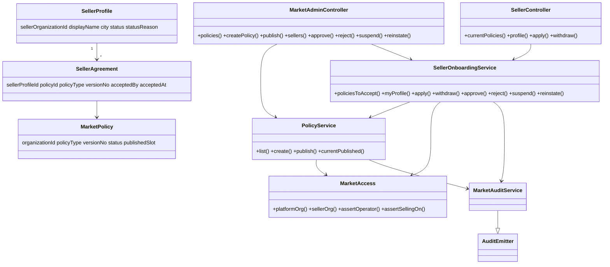
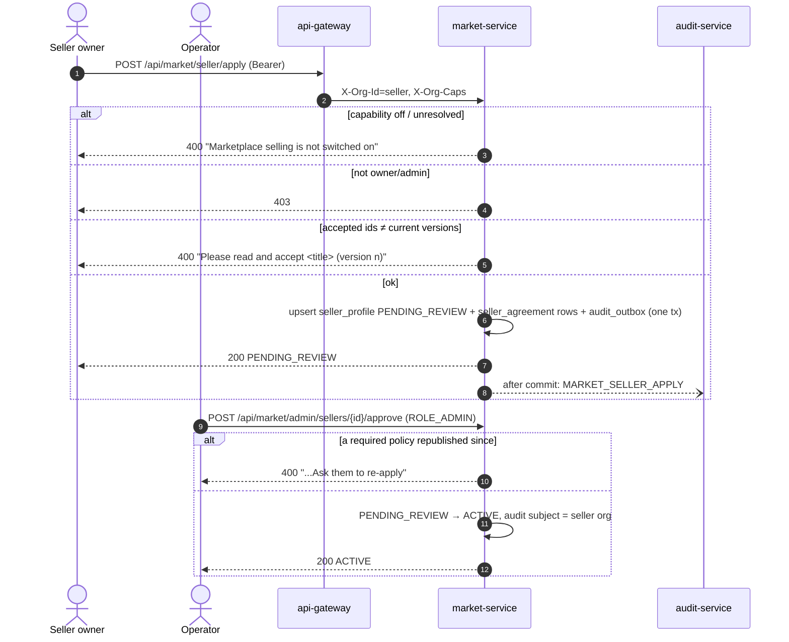

# MP-0 — Marketplace foundation: opt-in selling, versioned policies, seller onboarding

**Status:** IMPLEMENTED on `feature/platform-marketplace`, unit-green: market-service 22/0/0 (Skipped 0, including
`MarketFlywayMigrationTest` 2/2 on a real MySQL 8.0 container), common-settings 70/0/0. Cypress gate
`cypress/e2e/market/mp-0-foundation.cy.js` (11 cases) written FIRST, **not yet run** — it needs the deployed stack.
Programme: [`../platform-marketplace-design.md`](../platform-marketplace-design.md) §6. Rulings R-1, R-2, R-3.

## 1. Document

Before anything can be sold on the MaxTheService marketplace, three things must exist (source design §20,
Phase 0): a way for a tenant to choose to sell (and for every other tenant to see nothing new), the documents
that bind sellers — versioned, because "which terms did this seller accept?" must stay answerable — and an
onboarding decision made by the operator, not by the seller.

- **MP-0a** — capability `MARKETPLACE_SELLING` (`marketplaceSelling`), opt-in through the EX-0a mechanism.
- **MP-0b** — the new `market-service` (port 8098, `myplusdb_market`, gateway `/api/market/**`), policies with
  versions, seller applications with recorded acceptances, operator decisions, everything audited.

## 1b. Standards

| Dimension | Rule |
|---|---|
| **Business / domain** | Contract acceptance as evidence: each acceptance row names the document version, the person and the time, and is never updated (append-only). A published version is immutable; a change is a new version. |
| **SaaS multi-tenancy** | Seller org = `CurrentUser.organizationId()`; no DTO has an org field. Policies belong to the configured platform org. Operator endpoints are `ROLE_ADMIN` (class-level `@PreAuthorize` AND `MarketAccess.assertOperator()` in every service method). A seller's profile read is by its own org only. |
| **Live-modules rule** | Opt-in capability, default OFF, not in `Plan.FREE`; no existing table altered; `marketplace-service` untouched. `capability-shapes.cy.js` OPT_IN list updated so the regression keeps asserting the default. |
| **Microservice boundaries** | New service justified: owns marketplace data, lifecycle and (later) external integrations. Reuses common-web, common-audit, common-outbox, commerce-contracts. |
| **Design patterns** | State (`SellerStatus.ALLOWED`, 8 moves); DB-enforced invariant (`UNIQUE(organization_id, published_slot)` = one published version per type); Transactional outbox for audit (`MarketAuditService extends AuditEmitter`). |
| **SOLID / DRY** | One `MarketAccess` for every permission decision; one `PolicyService.currentPublished()` read by both apply and approve. |
| **Testing standard** | Unit (`SellerOnboardingServiceTest` 12, `PolicyServiceTest` 6, `SellerStatusTest` 2); Flyway boot under `ddl-auto=validate` with "no ENUM/TEXT columns" assertion (2); headed Cypress gate with the real-UI case first, OFF, cross-tenant, ladder and audit cases. |

## 1c. RULE 0 trace

| Item | Count / finding |
|---|---|
| Places that enumerate opt-in capabilities | **2**: `OptInCapabilityTest` asserted "Expense is the only opt-in" (updated); `capability-shapes.cy.js:121` `OPT_IN` list (updated). `CapabilityServiceTest:255` sizes against `Capability.values().length` (adapts). `cert/business-settings.cy.js` lists capabilities for certification only (not exhaustive; unchanged). |
| Shape presets that could leak it ON | **0**: `Shape.GENERAL = defaultOnSet()` excludes opt-in; no other shape lists it (unit-asserted for every shape). |
| Plans | FREE excludes it (asserted); TRIAL/DEMO/PRO include `allOf` (asserted for PRO). |
| Registration points for a new service | **7**, all done: parent pom, gateway route, docker-compose, init-db.sql (create + grant), start-all, stop-all, deploy.ps1 `$schemaOf`. No config-server file (expense-service has none either). |
| Column types vs entities | 4 tables; statuses VARCHAR; no TEXT (`summary VARCHAR(2000)` + optional `document_url`); verified by the Flyway test under `validate`. |
| `audit_outbox` columns | Copied from expense-service V1 (`AbstractAuditOutbox`); validated by the boot test. |

## 2. Design (decisions)

- **Policy types (9):** `SELLER_AGREEMENT`, `DATA_SHARING`, `COMMISSION`, `RETURNS_REFUNDS` (seller must accept)
  and `CUSTOMER_TERMS`, `COD`, `WARRANTY`, `COMPLAINTS`, `PRODUCT_APPROVAL` (operator-side, used from MP-1+).
- **Policy body:** title (160) + summary (2000) + optional `https://` document link. The legal text lives in the
  linked document; no TEXT column (STANDARDS §0).
- **Apply** is an upsert on `UNIQUE(seller_organization_id)`. The client sends the policy ids it showed; any id
  that is not the current published version of a required type is refused, naming the document and version.
- **Approve** re-checks acceptance of the *current* versions — a policy republished while an application waits
  blocks approval until the seller re-applies.
- **Withdraw** (seller) gives a path back to `PENDING_REVIEW`; refused while suspended.
- **Platform org** = `market.platform-org-id` (`MARKET_PLATFORM_ORG_ID`); the platform org cannot apply as a
  seller (platform stock is Phase 3). ⚠ Must be set to the operator's org id on deploy (ruling R-2).

## 3. Implement (done)

- [x] `Capability.MARKETPLACE_SELLING` opt-in; `OptInCapabilityTest` updated (+1 test); `capability-shapes.cy.js` OPT_IN.
- [x] `market-service` module: pom, Dockerfile, application/bootstrap yml, `SecurityConfig` (HeaderAuthFilter, stateless).
- [x] `V1__market_baseline.sql`: `market_policy`, `seller_profile`, `seller_agreement`, `audit_outbox`.
- [x] Entities, repositories, `PolicyService`, `SellerOnboardingService`, `MarketAccess`, `MarketAuditService`.
- [x] Controllers: `MarketAdminController` (`/api/market/admin`), `SellerController` (`/api/market/seller`).
- [x] Registration: pom module, gateway route, docker-compose, init-db, start/stop scripts, deploy schema check.
- [ ] Seller screen (business dashboard → Marketplace: policies to accept, apply form, status) — next, with MP-2's offer screen.
- [ ] Operator screen (platform console → Marketplace: policies, seller queue) — next.
- [ ] Set `MARKET_PLATFORM_ORG_ID` on the deployed stack; run the gate headed; record counts in the Status line.

## 4. Cypress gate (written FIRST) — `cypress/e2e/market/mp-0-foundation.cy.js`

1. Real UI: Configuration shows "Sell on the MaxTheService marketplace", unticked; ticking it saves and turns the capability ON.
2. Capability OFF: policies and apply refused; nothing written.
3. Tenant owner on `/admin/**` → 403 (×3 endpoints).
4. Operator publishes a version of each seller policy; exactly one PUBLISHED per type, old → SUPERSEDED.
5. Seller sees the four current versions; omitting one is refused, naming it.
6. Ladder: user tier cannot apply (403).
7. Apply → PENDING_REVIEW with four current agreements; a second submit returns the same profile.
8. Cross-tenant: seller B never receives seller A's profile.
9. Republish while waiting → approval refused until re-apply.
10. Approve → reject refused → suspend needs reason → seller sees reason, cannot withdraw → reinstate.
11. Audit trail of seller A's org: APPLY (MEMBER), APPROVE (PLATFORM_OPERATOR), SUSPEND, REINSTATE.

`after()` leaves seller A WITHDRAWN (re-applicable), removes capability overrides and restores plans.

## Findings during the build (RULE 0)

- `OptInCapabilityTest` encoded "Expense management is the only opt-in" — a second opt-in module had to change
  it; the new form keeps the protective intent (every *pre-EX-0a* capability stays default-ON).
- Without a way back from ACTIVE/SUSPENDED, the gate could not be re-run (marketplace rows are evidence and are
  never deleted). `WITHDRAWN` is a real product need (a seller leaving) and gives the gate its eligible start state.
