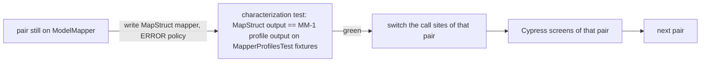

# MS — ModelMapper → MapStruct, one record type at a time

**Status:** DESIGN (2026-10-04), awaiting consent. Follows MM-1 (mapper profiles), which made today's behaviour explicit
and characterized it. That is exactly what a safe migration needs first.

## 1. Why (R&D)
| | ModelMapper (today) | MapStruct |
|---|---|---|
| When mapping is decided | Runtime, by name-matching heuristics (STANDARD/STRICT) | Compile time: generated plain Java |
| A field that silently stops mapping | Possible, and found only by a person (MM-1 §4) | **Build fails** with `unmappedTargetPolicy = ERROR` |
| Speed | Reflection | Plain getters/setters (commonly cited as 10–100× faster) |
| Debugging | Inside the library | Generated source you can read in `target/generated-sources` |
| Industry use | Declining for new code | Default in Spring ecosystems (JHipster, most Spring Boot templates) |

**Versions:** MapStruct 1.6.3 with `lombok-mapstruct-binding` 0.2.0. Processor order: Lombok, then MapStruct, then the
binding. All must be in `maven-compiler-plugin` `annotationProcessorPaths`, beside Lombok's existing entry.

## 2. Rule 0: scope, counted
business-service has 34 `map()` calls across 4 profiles (MM-1) and 15 type pairs. The other services hold ~37 plain maps
(agriculture 8, analytics 3, appointment 16 with typemaps, campaign 6, welfare 4).
**This programme covers business-service only.** The others stay on ModelMapper until their own slice.

## 3. Method: the strangler, per type pair

- Each pair has its own mapper interface (`StoreMapper`, `VenderMapper`…). The date formats come from one shared
  `DateFormats` helper that holds the same patterns `AppUtil` uses today.
- The **oracle is the MM-1 profile.** MapStruct must produce field-for-field the same output on the fixtures, or the
  difference is listed and decided field by field. A field is never left to fall out quietly.
- `unmappedTargetPolicy = ERROR` forces every target field to be mapped or explicitly `ignore`d, with a comment saying why.

## 4. Order (lowest risk first)
| Slice | Pair(s) | Profile | Why this order |
|---|---|---|---|
| MS-1 (pilot) | Store → StoreDTO | plain | 4 calls, small, proves the toolchain and the oracle |
| MS-2 | Company, ItemType, ItemUnit, Vender (both ways) | plain | Simple, no dates |
| MS-3 | Customer ↔ DTO, Purchase → DTO | display | The date converters |
| MS-4 | Sell, CustomerHistory, Customer (sale screens) | saleDisplay STRICT | Money screens; heaviest Cypress regression |
| MS-5 | PurchaseDTO → Purchase | purchaseInput | **Writes money/stock**: last, with the trial balance asserted |
| MS-6 | Remove ModelMapper from business-service | — | Only when no call remains |

## 5. Tests per slice
- **Unit:** the characterization test against the MM-1 profile, plus the build itself, which fails on any unmapped field.
- **Cypress:** the specs that render that pair (the MM-1 regression list), plus `mm-1-mapper-dates.cy.js`.
- **Test Book:** a short section per slice: nothing on those screens should look different.
