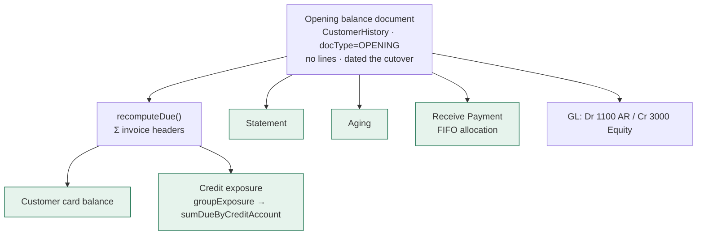

# OB-1 — opening balances at cutover: design

**Status:** DESIGN. Gate written before the implementation, per `SAAS-BUILD-STANDARDS.md`.
**Analysis:** [`ob-1-opening-balances-analysis.md`](ob-1-opening-balances-analysis.md) — read first; §2 is why
this cannot be a field on a form, and §8 carries the owner's rulings.
**Scope:** OB-1 only. OB-2 (invoice-level import), OB-3 (reconciliation + LOCKED), OB-4 (adjusting a
part-paid document) are named in the analysis §10 and deliberately not here.

---

## 1. What this slice makes true

> A shop that kept its receivables in a notebook can start using MaxTheService on a stated date, enter what
> each customer and supplier owed on that date, and have **every screen in the product agree** — the customer
> card, the statement, the aging, the credit limit and the trial balance.

---

## 2. The decision this slice turns on

**An opening balance is a DOCUMENT, not a number.**

`Customer.dueAmount` is derived: `recomputeDue()` sums the invoice headers and overwrites the column on every
sale and every receipt. A figure written directly into it survives until that party's next transaction and
then vanishes — silently, with no error.

The document shape is not merely correct, it is the shape where **everything already works**:



**Everything in green is free.** Not one of those five needs a line of code in this slice — they read the
invoice headers already. A column-only figure would have needed five separate integrations and would have got
some of them wrong.

⚠ **Q4 is therefore already answered by the shape.** Credit exposure sums `Customer.dueAmount` via
`CreditStandingService.groupExposure`; an opening document posts, `recomputeDue` runs, and the shared-pool
rule and the warn/block policy apply to it with nothing added.

---

## 3. The patterns, named (standard 7b)

* **Opening entry (accounting).** The standard migration posting: assets debited, liabilities credited,
  balanced against **owner's equity** — never through revenue.
* **Document-as-state.** The balance is not stored anywhere; it is the arithmetic of documents. This slice
  adds a document type rather than a second source of truth. The alternative — a stored opening figure added
  to the derived one — is the "two answers to one question" failure `installment_plan.guarantor_party_id` was
  left unwritten to avoid.
* **Idempotent command.** Entry goes through `idempotency_record` (`once(...)`), so a double-click or a
  retried timeout returns the first document rather than a second one.

---

## 4. Design

### 4a. The document

An opening balance is a `CustomerHistory` (or `Purchase`) with:

| Field | Value |
|---|---|
| `doc_type` | **`OPENING`** — new column, `SALE` for everything that exists today |
| `invoice_no` | `OB-<seq>` from the per-org document sequence, so it cannot collide with `INV-` |
| `dated` | the tenant's **cutover date**, never today |
| lines | **none.** An opening balance is an amount owed, not goods sold |
| `grand_total` | the amount owed |
| `paid_amount` | 0 |
| `due_amount` | `−grand_total` (the existing convention: negative while owing) |

⚠ **`doc_type` defaults to `SALE` and every existing row is backfilled to it.** A nullable discriminator read
as "not an opening balance" would be one `IS NULL` away from a report that silently counts opening balances as
trade — which is the migration failure this slice exists to prevent.

### 4b. The cutover date

```
org setting   business.cutoverDate            (DATE, no default — the owner states it)
org setting   business.cutoverLocked          (BOOL, set true by the FIRST posting)
```

* **No default**, per Q3. A defaulted cutover date is a wrong one on every tenant that did not notice the
  field, and the whole migration is anchored to it.
* **Confirmed twice**, in the owner's words: *"I confirm that MaxTheService becomes the system of record for
  this organization from [date] onward."*
* **Locked by the first posted document.** Changing it afterwards would re-date documents already in the
  ledger. Reopening is OB-3's audited workflow; until then the refusal names it.

### 4c. The GL posting

```
Customer opening:   Dr 1100 Accounts Receivable      Cr 3000 Owner's Equity
Supplier opening:   Dr 3000 Owner's Equity           Cr 2000 Accounts Payable
```

⚠ **Never 4000 Sales.** That books last year's trade as this month's revenue and carries it into the tax
register. Both accounts are already in the seeded chart.

⚠ **This is a NEW POSTING PATH, and `project_gl_outbox_drops_new_fields` is the standing warning about
exactly that**: a new event needs all five places or the field vanishes and the books drift silently. **The
gate's headline case is the TRIAL BALANCE**, not the document — Σ debits = Σ credits after a migration, or
the slice is wrong however good the screen looks.

### 4d. What OB-1 refuses, and says why

| Attempt | Response |
|---|---|
| reverse a **partially paid** opening document | refused, naming OB-4 — a full reversal would break the payment allocation |
| enter a balance with **no cutover date set** | refused, naming the setting |
| change the cutover date **after the first posting** | refused, naming the lock |
| enter a second opening balance for the same party | allowed — Q1 supports several, and OB-2 makes it the preferred path |

⚠ **Refusing is the feature.** Control 3 in the analysis says the product must state what it does not do; a
slice that approximated the part-paid case would produce a wrong ledger rather than a clear refusal.

### 4e. Artefacts

| Where | Artefact | New/changed |
|---|---|---|
| business-service | `V59__doc_type.sql` — `doc_type` on `customer_history` + `purchase`, backfilled `SALE` | new |
| business-service | `OpeningBalanceService` — validate, post, reverse | new |
| business-service | `OpeningBalanceController` — 4 endpoints, `ADMIN_PRIVILEGE` | new |
| business-service | `BusinessSettingsCatalog` — `business.cutoverDate`, `business.cutoverLocked` | changed |
| finance-service | opening posting event → Dr AR / Cr Equity | changed |
| monolith | proxies + the Opening balances screen | changed |
| monolith | `messages*.properties` × 6 | changed |
| cypress | `e2e/business/opening-balances.cy.js` | new |

---

## 5. UI/UX

Settings → **Opening balances**, owner/admin only, and the screen states its own limits:

```
┌ Opening balances ───────────────────────────────────────────────┐
│  MaxTheService is the system of record from                     │
│  [ 1 September 2026 ]   ⚠ cannot be changed after the first     │
│                            balance is posted                    │
│                                                                 │
│  ⓘ This records what customers and suppliers owed on that date. │
│    It does NOT migrate cash, bank, stock value, loans, tax or   │
│    fixed assets — those are still to be set up separately.      │
│                                                                 │
│  Customer            Owed on 1 Sep      Reference               │
│  [ Imran Ali    ▾ ]  [ 45,000      ]    [ notebook p.12    ]    │
│                                          [ + Add another ]      │
│                                                                 │
│  ⚠ Summary balance — invoice-level aging is not available for   │
│    these. Import your old invoices instead to keep true aging.  │
│                                                                 │
│                          [ Cancel ]  [ Post 1 balance ]         │
└─────────────────────────────────────────────────────────────────┘
```

* **The limits are ON the screen**, not in a manual. Control 3 exists because a shop will otherwise believe
  its whole books came across.
* **The summary-mode warning is permanent**, per Q1: a summary balance must never look like it has 30/60/90
  aging.
* **The button counts** — "Post 1 balance" — so the operator sees what is about to happen to the ledger.
* Capability-free: this is not a capability, it is a migration step every tenant does once.

---

## 6. The gate — `cypress/e2e/business/opening-balances.cy.js`

| # | Case | Guards |
|---|---|---|
| 1 | ⭐⭐ **The TRIAL BALANCE still balances** after posting an opening customer balance | §4c — the only case that proves the books |
| 2 | ⭐ It posts **Dr 1100 / Cr 3000**, and **nothing to 4000 Sales** | §4c — the damaging mistake |
| 3 | ⭐ The amount appears in the customer's **balance** | `recomputeDue` sees the document |
| 4 | ⭐ …and in the **credit exposure**: a limit is breached by an opening balance alone | Q4, which the shape gives free |
| 5 | ⭐ …and on the **statement** and in **aging** | §2 — the five green boxes |
| 6 | ⭐ A **receipt allocates against it** (FIFO), and the balance falls | §2 — otherwise the debt is uncollectable |
| 7 | ⭐ Posting with **no cutover date** is refused, naming the setting | Q3 |
| 8 | ⭐ The cutover date **cannot be changed after the first posting** | Q3's lock |
| 9 | ⭐ Reversing an **unpaid** opening document restores the balance to zero | Q2 |
| 10 | ⭐⭐ Reversing a **PARTIALLY PAID** one is **refused**, naming OB-4 | Q2's refinement — the slice's sharpest edge |
| 11 | ⭐ Posting the same batch **twice** returns the first result, not a second document | control 4 |
| 12 | ⭐ A supplier opening posts **Cr 2000 / Dr 3000** and shows in the payable | the AP half |
| 13 | The opening document is **not counted as a sale** in the Sale Detail Report or the tax register | §4a — the `doc_type` discriminator earning its place |
| 14 | ⭐ A **USER** (not admin) is refused | §7 of the analysis — this writes to the ledger |
| 15 | The screen states what is NOT migrated | control 3, and an API test cannot see it |

**Case 1 is the headline and case 10 is the sharpest.** A gate that only asserted the balance appeared would
pass a build that posted opening balances through Sales — inflating revenue and tax, exactly as a shop
faking it with backdated invoices does today.

---

## 7. Out of scope — and this list is part of the product, not an apology

* **Invoice-level import** (OB-2) — the distributor case, and the preferred method per Q1.
* **Reconciliation and the LOCKED state** (OB-3).
* **Adjusting a part-paid opening document** (OB-4). Refused by name until then.
* **The rest of the balance sheet** — cash, bank, inventory valuation, loans, tax, fixed assets, equity.
  Control 3: the screen says so, because a shop will otherwise assume its whole books migrated.
