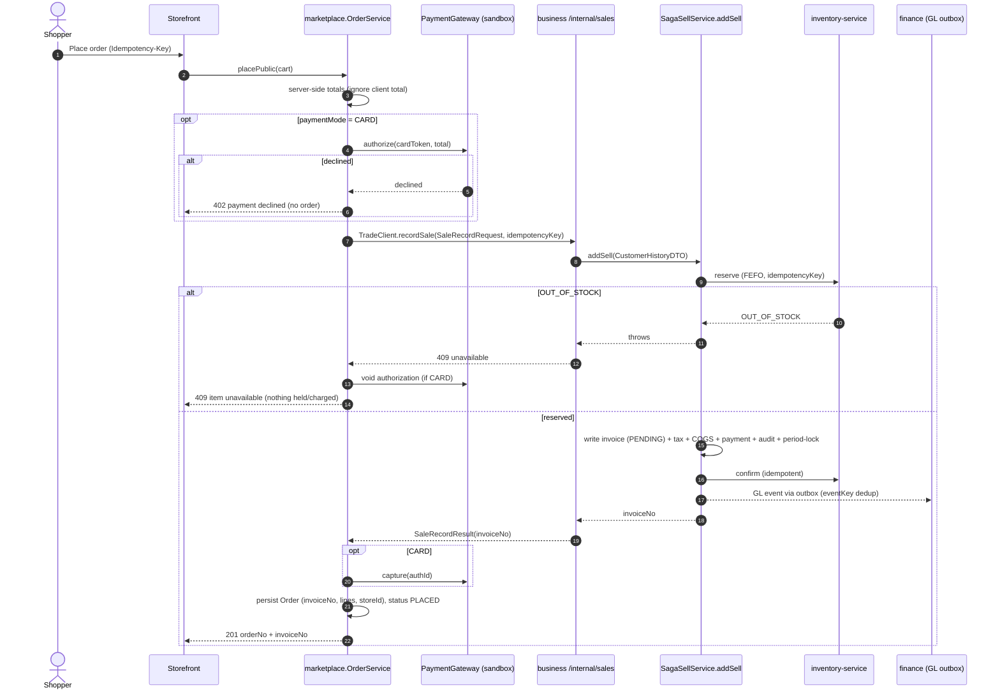

# Slice O1 — Storefront revenue reaches the books

**Phase:** P1 Correctness (OMS) · **Branch:** `feature/oms` · **Fixes:** OMS-1 (+ OMS-5 client-total).
**Cadence:** Document → **Design (this doc — awaiting approval)** → Implement → headed Cypress gate.
**Parent:** [`platform-oms-master-reference.md`](../platform-oms-master-reference.md) §3.4 · [`order-management-design.md`](../order-management-design.md) §2.4/§3.3 (reused, not redrawn).

---

## 1. Document

**Problem (verified on `feature/oms`, 07-31).** `marketplace.OrderService.placePublic` runs its *own* reserve → sandbox-charge → confirm saga (`InventoryClient` directly) and writes an `Order`, but **never creates a trade sale**: no `Finance/Trade` client is wired, `invoiceNo` is only copied from the inbound DTO. So a storefront sale decrements stock and charges a card, yet produces **no invoice, no revenue journal, no tax-register line, no AR, no `payment` row, no receipt**. POS orders carry `invoiceNo` (POS recorded the sale first), which hides the asymmetry. → P&L, trial balance, tax register, period close and day-close are silently wrong for every online sale.

**Goal.** Every order, in every channel, produces exactly **one invoice through exactly one revenue path** — `business-service`'s existing sale path. `business-service` stays the sole author of trade sales; `finance-service` the sole author of journals. **No new money logic** — a wiring change.

**Why it's cheap (verified):** `SagaSellService.addSell(CustomerHistoryDTO)` already does reserve → write PENDING invoice → confirm → GL outbox → tax → COGS → audit → period-lock, is **idempotent on `dto.idempotencyKey`** (replays the same invoice; race-safe unique index), and throws on `OUT_OF_STOCK` (nothing charged). `CustomerHistoryDTO` already carries customer, sale lines, tenders, tax totals and the idempotency key.

## 2. Design

### 2.1 The seam — a new internal contract

```java
// commerce-contracts (new) — the missing seam; business-service already has everything behind it.
@HttpExchange(accept = "application/json", contentType = "application/json")
public interface TradeClient {
    /** Record a sale for a completed order; returns the invoice number. Idempotent on idempotencyKey. */
    @PostExchange("/internal/sales")
    SaleRecordResult recordSale(@RequestBody SaleRecordRequest request);
}
// SaleRecordRequest: idempotencyKey, orgId, channel, customer{name,contact,partyId}, lines[{productId,qty,unitPrice,taxCodeId}],
//                    tenders[{method,amount,ref}], notes.   SaleRecordResult: invoiceNo, customerHistoryId, status.
```

`business-service` adds a thin **`/internal/sales`** controller (internal-secret gated, `runAs` the order's org/user) that maps `SaleRecordRequest` → `CustomerHistoryDTO` → `SagaSellService.addSell(dto)` and returns `invoiceNo`. Nothing else in business-service changes.

### 2.2 Card-charge ordering (the one real decision in O1)

`addSell` reserves **and** confirms atomically, so there is no reserve→charge→confirm window at the marketplace edge. Correctness-first choice for O1 (full PSP auth/capture is a deferred non-goal — sandbox stays):

- **COD** (default `paymentMode=COD`): call `recordSale` directly → invoice created, a `COD` tender recorded, payment settles on delivery (later slice). No PSP.
- **CARD**: **authorize** on the sandbox gateway first → `recordSale` (reserve+invoice+confirm) → on `OUT_OF_STOCK`, **void the authorization** and block (nothing charged, nothing held); on success, **capture** and pass the `CARD` tender (with `chargeId`) into the sale so it becomes a `payment` row + hits day-close/GL.

This keeps money authoring in business-service while the PSP call stays at the edge. Server computes every total; the client `total` is ignored (fixes OMS-5's client-total path).

### 2.3 Sequence



### 2.4 Data & cleanup

- **Flyway `V10__order_invoice_link.sql`** (marketplace): ensure `orders.invoice_no` indexed; add `books_status` (`POSTED` / `LEGACY_UNPOSTED`) to flag pre-existing storefront orders that predate O1 (default `LEGACY_UNPOSTED`; new orders `POSTED`). No back-posting into closed periods (see decision #4).
- **Delete** the duplicated storefront reservation path in `placePublic` (reserve/confirm/release now happen inside `addSell`) and `OrderSagaRecoveryRelay` — `SagaRecoveryRelay` in business-service becomes the single relay (DRY win). `PaymentGateway` seam stays for the CARD auth/void/capture.
- **Reconciliation report:** `GET /orders?booksStatus=LEGACY_UNPOSTED` (or a small report) listing orders without an invoice.

### 2.5 What O1 deliberately does NOT do (later slices)
State machine / `@Version` / order-no / anti-IDOR tracking → **O2**. `order.*` config → **O3**. Real PSP auth/capture/webhooks → PSP slice. `returnSale`/credit-note reversal → paired with the returns/refund slice.

## 3. Implement (only after design approval)
- [ ] `commerce-contracts`: `TradeClient` + `SaleRecordRequest` / `SaleRecordResult` (+ a `TenderDTO`/`LineDTO` if not reusable).
- [ ] `business-service`: `InternalSalesController` `/internal/sales` → maps to `SagaSellService.addSell`; internal-secret gated; `runAs` org/user from the request.
- [ ] `marketplace-service`: `TradeClientConfig` (load-balanced `@HttpExchange`, identity-forwarding like `MarketplaceClientsConfig`); `placePublic` builds `SaleRecordRequest` + calls `recordSale`; CARD auth→(record)→capture / void-on-OOS; persist `invoiceNo`; drop the local reserve/confirm + `OrderSagaRecoveryRelay`.
- [ ] Flyway `V10`; `books_status` flag + reconciliation read.

## 4. Test (the gate)
**Java (mvn test):** `TradeClientMappingTest` (SaleRecordRequest→CustomerHistoryDTO), `IdempotentRecordSaleTest` (same key → one invoice). **Cypress (headed, you run):** `business/order-to-ledger.cy.js` — place a storefront order → an invoice exists → a GL journal exists → the tax register shows the line → P&L revenue moves by the order total → the order carries `invoiceNo`; a repeat submit with the same key yields **one** invoice; an out-of-stock line charges nothing.

## 5. Exit criteria
Storefront order → invoice + GL + tax-register + AR/payment, `orders.invoice_no` set, `books_status=POSTED`; duplicate storefront saga + `OrderSagaRecoveryRelay` deleted; gate green.
