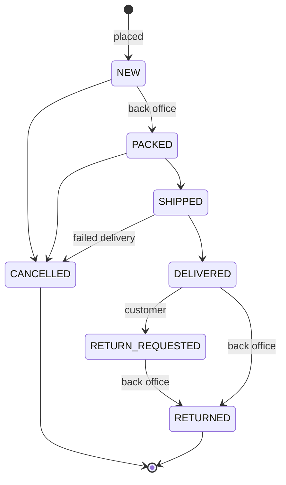
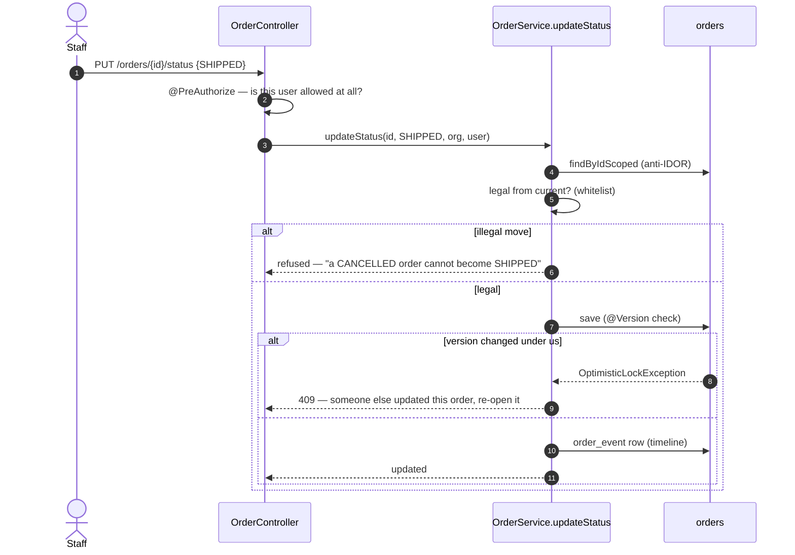
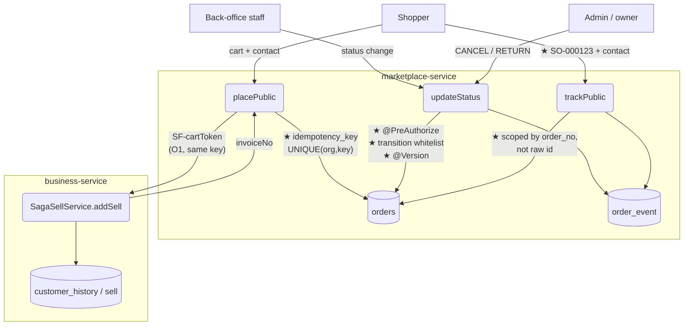

# Slice O2 — Order lifecycle, authority and safety

**Phase:** P1 Correctness (OMS) · **Fixes:** OMS-2, OMS-3, OMS-4, OMS-8 · **Branch:** `feature/b2b-b2c`
**Status:** ✅ **COMPLETE & GATED 2026-08-06** — `order-lifecycle.cy.js` **7/7**, `FulfilmentStatusTest`
**9/9** (pure logic, runs on `mvn test`), regression **31/31** across storefront + order + quote specs.
Flyway **V11** applied. **This clears the last P0 in the gap register.**
**Cadence:** Document → Design → Implement → headed Cypress gate ✅.
**Parent:** [`platform-oms-master-reference.md`](../platform-oms-master-reference.md) §Part III · follows
[O1](oms-O1-storefront-to-books.md).

> **Why this and not Phase 5.** The gap register puts OMS-2/3/4/8 at **P0 — correctness/security**, the only
> remaining P0 now O1 has landed; Phase 5's contents are P1/P2 "capability". Open decision #1 is already settled
> in writing: *"OMS correctness first (chosen)"*. B2B (4a/4b) was an explicitly parallel track and is complete,
> so the main line resumes here.

---

## 1. Document

**Verified against the code on 2026-08-06** — not taken from the 07-31 snapshot, because O1 has since changed
parts of this area.

| # | Defect | Verified state today | What it costs |
|---|---|---|---|
| **OMS-2** | No state machine, no authority on status change | `OrderService.updateStatus` does `FulfilmentStatus.valueOf(...)` and assigns it. `OrderController.updateStatus` has **no `@PreAuthorize`** — unlike `/refund` and `/return`, which are `ADMIN_PRIVILEGE`-gated | Any authenticated user can mark an order DELIVERED, or move CANCELLED → DELIVERED. History becomes unauditable, and DELIVERED is what a return is judged against |
| **OMS-3** | No idempotency on placement | O1 made the SALE idempotent (`SF-<cartToken>` → same invoice). The **order row** is not: a second checkout on the same cart replays the invoice but still inserts a second `orders` row | Duplicate orders pointing at one invoice; picked and shipped twice |
| **OMS-4** | No optimistic locking | `Order` has no `@Version` (`SalesQuote` got one in 4b precisely to avoid this) | Two packers overwrite each other; a cancel racing a dispatch silently loses |
| **OMS-8** | Public tracking on a raw id | `GET /public/order/track?ref={id}&contact=` → `repo.findById(ref)`, **unscoped**. Contact must match, but `ref` is a guessable auto-increment | Enumeration probe across tenants; no merchant-usable reference to quote on the phone |

**The four are one slice** because they are the same aggregate's integrity: what may change, who may change it,
how often it may be applied, and how it is safely named to the outside world. Splitting them would mean touching
`Order` four times.

## 2. Design

### 2.1 State machine (OMS-2)

One guarded write path, the same shape as `SalesQuoteService.transition` (4b) and
`PartyService.setAccountParent` (4a): a **whitelist** of legal moves, everything else refused. A whitelist, not
a blacklist — the failure mode of a missed illegal transition is an order that ships after it was cancelled.

**Authority.** `PUT /orders/{id}/status` gains `@PreAuthorize`. Fulfilment is shop-floor work, so the gate is
deliberately *not* owner-only — but it must be *someone*: the current state lets any authenticated user of any
role mark an order delivered. Proposal: **`ADMIN_PRIVILEGE` for CANCELLED and RETURNED** (they reverse money and
stock, matching `/refund` and `/return`), and any authenticated staff user for the forward moves
(PACKED/SHIPPED/DELIVERED).

### 2.2 Idempotent placement (OMS-3)

The order row gets the same treatment the sale already has:

- `orders.idempotency_key`, **UNIQUE per (organization_id, key)** — the DB, not a read-then-write check, is what
  makes it race-safe. Two concurrent submits: one inserts, the other hits the constraint and returns the FIRST
  order.
- The key is the checkout's cart token (`SF-<cartToken>`), which is exactly what O1 already feeds the sale — so
  order and invoice deduplicate on the *same* key and can never disagree about how many exist.

### 2.3 Optimistic locking (OMS-4)

`@Version` on `Order`, and the status path returns a **409 Conflict** with a re-read hint rather than a 500 on
`OptimisticLockException`. 4b proved the value on quotes; orders have the higher exposure because several people
touch one order through a working day.

### 2.4 Order number (OMS-8)

A per-org `order_no` in its own series — `SO-000123` — allocated exactly like `invoice_seq`, `credit_note_seq`
and 4b's `quote_seq`: MAX+1 inside the creating transaction, made safe by `UNIQUE(organization_id, order_seq)`.

Public tracking then moves to `?ref=SO-000123&contact=…`, resolved by **order number + contact within one org**,
never by raw id. Two gains: a merchant can quote it on the phone, and the id space stops being enumerable.

> **Back-compat:** existing orders have no number. `V11` backfills `SO-` numbers for every existing row in id
> order per org, so old orders remain trackable and no customer link breaks. Tracking accepts the legacy numeric
> `ref` for one release, logged at WARN, so an emailed link from last week still works.

### 2.5 Sequence — a guarded status change

### 2.6 Data flow — where each fix lands

Squares = external actors · rounded = processes · `[( )]` = data stores · **★** = an O2 change.

**Reading it as the four defects:**

| Flow | Today | After O2 |
|---|---|---|
| `Shopper → Place → orders` | second submit inserts a second order | **★** UNIQUE(org, key) returns the first order — same key the sale already uses |
| `Staff → Status → orders` | any user, any transition, last write wins | **★** authority gate + whitelist + `@Version` |
| `Shopper → Track → orders` | raw auto-increment id, **unscoped** read | **★** `SO-` number resolved within one org |

The `Place → Sale` edge is O1's and is unchanged — it is drawn only to show that **order and invoice share one
idempotency key**, which is why they can never disagree about how many exist.

## 3. What O2 deliberately does NOT do

- **No partial/split fulfilment, pick/pack, carrier or TTL holds** — that is O5, and the master reference puts it
  at P1 capability, below this.
- **No `order-service` extraction** — O6, deliberately after the defects are repaired in place, so the new
  service does not inherit them.
- **No unbounded-read fix (OMS-7)** — pagination is O4's back-office slice. Noted so it is not assumed done.

## 4. Test

**Java (`mvn test`, pure logic — the Testcontainers suites skip on this machine):**
`OrderTransitionTest` — every illegal move refused, every legal one allowed, terminal states terminal.

**Cypress (headed):** `order-lifecycle.cy.js` —
1. a legal path NEW → PACKED → SHIPPED → DELIVERED succeeds;
2. an illegal move (CANCELLED → SHIPPED) is refused and the order is unchanged;
3. a non-admin cannot CANCEL, an admin can (authority, not just legality);
4. the same cart submitted twice yields **one** order (not just one invoice — the O1 gate covers the invoice);
5. tracking works by `SO-` number + contact, and a **wrong-tenant order number is not found**;
6. a stale update (two reads, two writes) is refused with a conflict rather than silently overwriting.

## 5. Exit criteria

Illegal transitions refused; status change authority-gated; duplicate placement yields one order; `@Version`
conflict surfaces as 409; every order has an `SO-` number and public tracking uses it; gate green; no regression
in `order-to-ledger` / `order-cancel` / `storefront-saga`.

## 6. Checklist

- [x] Design reviewed and approved; **`SHIPPED → CANCELLED` dropped** on review — cancelling drives the O1 void,
      which returns stock, and goods on a van are not back on the shelf. A failed delivery goes
      `SHIPPED → DELIVERED → RETURNED`, restoring stock only when it physically arrives.
- [x] Transition whitelist on `FulfilmentStatus` + guarded `OrderService.updateStatus`
- [x] Authority on `PUT /orders/{id}/status` — admin for the reversals, staff for forward fulfilment
- [x] `orders.idempotency_key` + UNIQUE(org, key); pre-check **and** duplicate-key catch for the concurrent race
- [x] `@Version` on `Order`
- [x] `order_seq` + `order_no` (`SO-`) + Flyway `V11` incl. backfill; tracking by number, legacy numeric ref
      accepted for one release (logged at WARN)
- [x] `FulfilmentStatusTest` 9/9 + `order-lifecycle.cy.js` 7/7
- [x] Regression 31/31 — storefront, order-to-ledger, order-cancel, storefront-saga, track, timeline, quote

## 7. What the build surfaced

- **A regression I introduced in O1**, caught by `storefront.cy.js`: the out-of-stock message had been replaced
  with a generic *"an item in your cart is no longer available"*, losing both the word "stock" and the server's
  actual reason. A shopper cannot act on that and support cannot either. The underlying message is now relayed
  (falling back to wording that names stock), matching how a declined payment is already handled.
- **The status proxy swallowed refusals.** `updateOrderStatus` in the monolith returned a bare
  `{success:false}` while `refundOrder` beside it relayed via `relayError` — so a refused transition reached the
  operator as a silent failure. Made consistent.
- **`marketplace-service` did not depend on `commerce-domain`.** A compile with `-am` masked it; the standalone
  build failed. Added, so `SO-` uses the same formatter as `INV-`/`CRN-`/`QTE-` rather than marketplace inventing
  its own padding.
- **The storefront handed the shopper the wrong reference.** Checkout printed the raw id as "your order
  reference", but tracking now resolves the `SO-` number — the printed reference would not have worked. Fixed,
  and the tracking panel no longer renders a redundant `#` before a number that carries its own prefix.

## 8. Still open (not O2's scope)

- **OMS-7 unbounded reads** — `findScoped` still returns every order. Pagination is O4.
- **A 409 for an optimistic-lock conflict is not surfaced as such.** `@Version` is enforced by the DB, but the
  conflict currently propagates as a 500 rather than a "someone else updated this order" 409. Worth a small
  follow-up; the data is safe either way, the message is not helpful.
