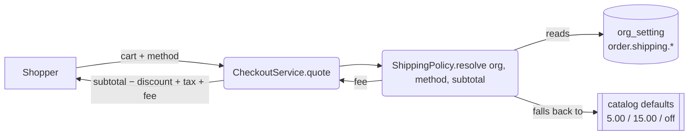

# Slice O3 — `order.*` per-org configuration

**Phase:** P1 (OMS) · **Fixes:** the 🔒 config gap on marketplace · **Branch:** `feature/b2b-b2c`
**Status:** 📝 DESIGN — awaiting approval.
**Cadence:** Document → **Design (this doc)** → Implement → headed Cypress gate.
**Parent:** [`platform-oms-master-reference.md`](../platform-oms-master-reference.md) · follows
[O1](oms-O1-storefront-to-books.md) and [O2](oms-O2-lifecycle-authority-safety.md).

---

## 1. Document

**Verified in the code 2026-08-06.** `ShippingOption` is an enum with **literal fees**:

```java
PICKUP  (new BigDecimal("0.00"),  false),
STANDARD(new BigDecimal("5.00"),  true),
EXPRESS (new BigDecimal("15.00"), true);
```

Marketplace has **no `common-settings` consumer at all** — Flyway V1–V11 contain no `org_setting`, and nothing
in the service reads one.

**Why that matters for a multi-tenant product.** Every store on the platform charges exactly 5.00 for standard
delivery and 15.00 for express, and every store offers all three methods. A shop that delivers free, or only
does collection, or charges 250 in its own currency, cannot express that — the "fix" today is a code change and
a redeploy, for all tenants at once. This is the same class of defect as the hardcoded credit rules Phase 1
moved into `common-credit`: policy living in code instead of per-tenant configuration.

**Scope: four settings**, each justified by something a real shop cannot do today.

| Setting | Type | Default | Why |
|---|---|---|---|
| `order.shipping.standardFee` | money | `5.00` | the literal above |
| `order.shipping.expressFee` | money | `15.00` | the literal above |
| `order.shipping.freeOverAmount` | money | `0` (off) | "free delivery over 5,000" is table-stakes e-commerce and is currently impossible |
| `order.payment.codEnabled` | bool | `true` | a shop that will not take cash on delivery has no way to turn it off; the storefront always offers it |

Deliberately NOT here: which methods are offered (that is presentation, and PICKUP/EXPRESS availability belongs
with the carrier work in O5), coupon rules (already per-org **data** in the `coupon` table — not config), and
tax (owned by business-service; a second tax setting is how two systems disagree about one invoice).

## 2. Design

### 2.1 A missing typed reader — fix the library, do not copy the parse

`common-settings` has `getBool`, `getInt`, `getText`, `getChoice` — **no decimal**. Shipping fees are money, and
`INT` would lose the minor units.

4b already needed a decimal (`sales.quote.discountApprovalThreshold`) and read it with `getText` + a local
`new BigDecimal(...)` + try/catch. O3 is the **second consumer**, and §5c of the programme plan is explicit:
*the second consumer moves it to a library, it does not get copied*.

So: add `SettingEntry.money(...)` and `SettingsService.getDecimal(key, fallback)` — mirroring `getInt` exactly,
including its rule that a malformed override returns the fallback rather than throwing (a settings typo must not
take down checkout). Then **4b's local parse is deleted and switched to it**, so the duplicate I introduced
yesterday does not survive this slice.

### 2.2 Shipping becomes a resolved policy, not an enum constant



`ShippingOption` keeps `requiresAddress` (a structural fact — collection needs no address) and **loses `fee()`**.
The fee is resolved per org by a small `ShippingPolicy`, which is also where the free-over threshold applies:

```
fee = PICKUP                      -> 0
      subtotal >= freeOverAmount  -> 0        (when the threshold is configured > 0)
      STANDARD                    -> order.shipping.standardFee
      EXPRESS                     -> order.shipping.expressFee
```

**One resolver, used by both `quote()` and `place()`.** They must agree — a quote that shows free delivery and a
checkout that charges for it is the same class of defect as the client-supplied total O1 removed.

### 2.3 COD toggle

`place()` refuses a `COD` order when `order.payment.codEnabled` is false, with a message naming the reason. The
storefront also hides the option, but the **server** is the control — a hidden radio button is not a policy.

### 2.4 Which tenant's policy? (found during the gate, before ship)

The first cut of `ShippingPolicy` read settings through `SettingsService.effective(key)`, which resolves the org
from `CurrentUser.organizationId()` — the JWT. **The storefront is anonymous.** There is no JWT anywhere on the
public checkout path, so `organizationId()` is null there and every read fell through to the catalog default: a
shop could configure a delivery fee, see it saved, see it applied when *staff* placed an order, and have every
real customer charged the platform default. The slice would have looked complete and delivered nothing.

The fix makes the tenant **explicit rather than ambient**:

* `SettingsService` gains `effectiveFor(org, key)` / `getBoolFor` / `getDecimalFor`. The existing ambient methods
  delegate to them, so no other consumer changes.
* `ShippingPolicy.feeFor(option, subtotal, org)` and `codEnabled(org)` take the store as a **required parameter**
  — there is no overload that can silently resolve to "whoever is signed in".
* `CheckoutService` passes `org` (it always has it: the org identifies the cart).

This is a read of tenant *configuration*, not tenant *data* — it grants no access to another org's rows, so it is
not an IDOR route. Rule for future slices: **any policy read on a public path must name its tenant.**

`ShippingPolicyTest` locks it with `policyIsReadForTheNamedStore` (verifies the org reaches the settings call and
that the ambient method is never used) and `twoStoresPriceIndependently`.

### 2.4b The engine was never switched on (found by the gate)

`common-settings` activates on `@ConditionalOnBean(SettingsStore.class)` — a service opts in by supplying its own
table-backed store. marketplace had the catalog, the `V12` migration and the resolver, but **no `SettingsStore`**,
so no `SettingsService` and no `/settings` endpoint were ever created. `ShippingPolicy` injected the service with
`required = false`, which turned a missing engine into "every store silently keeps the platform default fee"
instead of a failure. The owner screen returned `{"success": false}` and nothing else complained.

Two changes, because the missing class and the silence are separate defects:

* `JpaSettingsStore` + `OrgSetting` + `OrgSettingRepository` in marketplace, onto its own `org_setting` table.
* The injection is now **required**. A service that means to be configurable must refuse to start
  unconfigurable; optional injection of a capability is only honest when the fallback is genuinely acceptable,
  and "all tenants share one hardcoded price list" is not.

### 2.5 The storefront must not offer what the store refuses

COD is the **pre-selected** payment tab. With the server rule alone, a shopper at a card-only store fills the whole
checkout form and is refused at the last click. The quote — already public and already refetched on every change —
now carries `codEnabled`, and the storefront hides the COD tab and moves selection to CARD. The server rule is
unchanged and is still the control; this only stops the UI advertising what will be refused.

## 3. What O3 does NOT do

Carrier rates by weight/zone, tracking numbers, per-store method availability → **O5**. Pagination (OMS-7) →
**O4**. No change to coupons or tax.

## 4. Test

**Java (`mvn test`, pure logic):** `ShippingPolicyTest` — defaults when unset; per-org override honoured; free
threshold applies at and above the boundary but not below; PICKUP always zero; a malformed setting falls back to
the default rather than throwing.

**Cypress (headed):** `order-config.cy.js` — a quote shows the default fee; after an owner sets
`order.shipping.standardFee`, the quote AND the placed order both use the new fee (proving one resolver); with a
free-over threshold set, a large cart ships free; with COD disabled, a COD checkout is refused server-side.

## 5. Exit criteria

Shipping fees and the free threshold are per-org and honoured identically by quote and place; COD can be turned
off and the server enforces it; `getDecimal` lives in `common-settings` with 4b switched onto it; gate green; no
regression in the storefront/checkout specs.

## 6. Checklist

- [x] Review this design
- [x] `common-settings`: `SettingEntry.money` + `SettingsService.getDecimal`; **switch 4b off its local parse**
- [x] `MarketplaceSettingsCatalog` (the service's first) with the four entries
- [x] `ShippingPolicy.resolve` — one resolver, used by `quote()` and `place()`
- [x] **§2.4 explicit tenant** — `effectiveFor(org, …)`; `feeFor`/`codEnabled` take the store as a parameter
- [x] COD refusal server-side + storefront hides the option (**§2.5** — `codEnabled` on the quote)
- [x] Owner screen: `/getOrderConfig` + `/saveOrderConfig` proxy, "Order settings" under Store, i18n ×6
- [x] **Platform fix:** all four Configuration screens saved `el.checked` for every control, so any
      SELECT/INT/TEXT/MONEY setting was written as `"false"`. Now read by control type.
- [x] `ShippingPolicyTest` (13) + `CheckoutServiceTest` (10) — `mvn test` green, 67 run / 0 failures
- [x] `order-config.cy.js` — **9/9 green**
- [x] Regression **25/25 green**: `storefront`, `storefront-saga`, `storefront-payment`, `order-to-ledger`,
      `order-lifecycle`, `order-cancel`

**O3 COMPLETE** — gate green, no regression.

### Fixed along the way (not O3 scope, found by the gate)

* **`store.html` sticky cart had no height bound** — account + cart + checkout + card form + tracking is taller
  than a laptop viewport, so the card form and Place-order button sat below the fold with no way to reach them
  (a stuck element cannot be scrolled into view by the page). Now `max-height:calc(100vh - 36px)` with internal
  scroll, and it stacks on narrow screens. This is why `storefront-payment.cy.js` was red **before** O3 too.
* **`storefront-payment.cy.js`** never typed a delivery address, then chose the default STANDARD — a delivery.
  The server correctly refuses that; the spec was wrong. Now fills the address, as a real shopper does.
