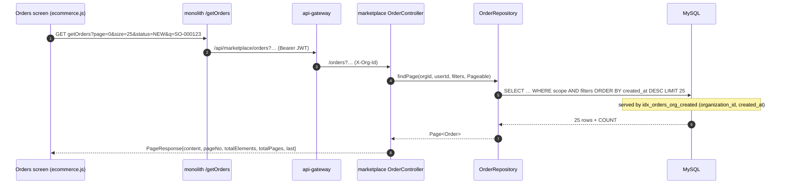
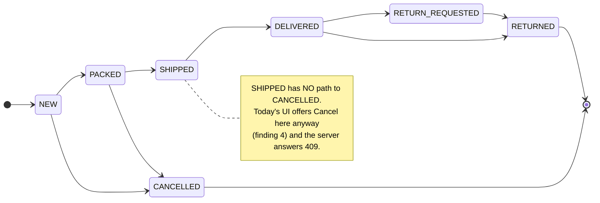

# OMS O4 — Order back office (list, detail, server-driven actions)

*Fixes OMS-7. Design gate — no code until this is approved.*

Parent: [order-management-design.md](../order-management-design.md) §2.9, §2.12 · Programme:
[oms-program-plan.md](../oms-program-plan.md) · Predecessors: O1 (books), O2 (lifecycle), O3 (config).

---

## 1. What is actually wrong today

Verified in the current tree, not carried over from the gap register.

| # | Finding | Evidence | Why it matters |
|---|---|---|---|
| **1** | **Unbounded read (OMS-7).** `findScoped` returns `List<Order>` — no `Pageable`, no filter — and `list()` maps every row to a DTO. | `OrderRepository.java:19`, `OrderService.java:296` | A merchant with 20 000 orders loads 20 000 rows and 20 000 DTOs on every visit to the Orders screen. Against the standing performance priority. |
| **2** | **No index supports the listing.** Orders carry only `idx_order_org (organization_id)`. The query sorts `ORDER BY created_at DESC`. | `V2__commerce_schema.sql:27` | Every page is a full scan of the org's orders plus a filesort. Pagination without the index just moves the cost. |
| **3** | **The UI owns a SECOND copy of the transition rules.** `ecommerce.js:10` hardcodes `NEXT = {NEW:'PACKED', PACKED:'SHIPPED', SHIPPED:'DELIVERED'}` — the same rule O2 made authoritative in `FulfilmentStatus.ALLOWED`. | `ecommerce.js:10` vs `FulfilmentStatus.java` | Two sources of truth for one rule. They have **already drifted** — see finding 4. |
| **4** | **A phantom Cancel button.** The list shows Cancel for any order that is not `CANCELLED` or `DELIVERED` — which includes **`SHIPPED`**. O2 deliberately made `SHIPPED → CANCELLED` illegal (the void would return stock that is on a van). | `ecommerce.js:30` vs `FulfilmentStatus.ALLOWED` | The operator is offered an action the server refuses with 409. A control that appears to exist and then fails is worse than no control — this is finding 3 producing a real defect. |
| **5** | **Refund and return are built, gated, and unreachable.** `POST /orders/{id}/refund` and `/orders/{id}/return` exist with `@PreAuthorize("ADMIN_PRIVILEGE")`, and the monolith proxies `/refundOrder` + `/processReturn` relay their errors properly. **Nothing in the UI calls either.** | `OrderController.java:103-117`, `ecommerce/OrderController.java:66-94`, `ecommerce.js` (90 lines, no reference) | Two shipped capabilities a merchant cannot use. Slices 70 and 71 built the hard half and stopped. |
| **6** | **No detail view.** Six columns, no lines, no payment breakdown, no timeline — although `order_events` is written on every status change and already read for the shopper's tracking page. | `ecommerce.js`, `OrderService.java:339` | The merchant sees less about their own order than the customer does. |
| **7** | **`RETURN_REQUESTED` / `RETURNED` have no actions at all.** They are absent from `NEXT`, so those orders render as inert text. | `ecommerce.js:10,25` | A customer's return request lands in a state the back office cannot act on. |

**The shape of the problem:** findings 3, 4 and 7 are all the same defect — the client deciding what the server
permits. O4 does not fix them one at a time; it removes the client's opinion.

---

## 2. Design

### 2.1 One paginated, filtered read

`GET /orders` gains `page`, `size`, `status`, `paymentStatus`, `source`, `from`, `to`, `q` and returns the shared
`PageResponse<OrderDTO>` (`common-web` — already exists, already used elsewhere, so no new envelope).

**Rules that make this safe rather than merely paged:**

* `size` is **capped server-side** (default 25, max 100). A cap the client can raise is not a cap — `?size=100000`
  reintroduces exactly the unbounded read this slice removes.
* Filtering happens **in the query**, never in Java after the fetch. Filtering a fetched list would page the
  wrong thing: 25 rows fetched, then filtered to 3, and the operator wonders where their orders went.
* `q` matches `orderNo`, `invoiceNo`, `customerName` or `customerContact` — the four things a merchant has in
  front of them when a customer calls.
* Scoping is unchanged (`SCOPE` + NULL-fallback). Filters narrow within the tenant; they never widen it.
* `toDTO` does not touch `items` (verified), so a page of 25 costs **one** query plus the count — no N+1.

**Index (Flyway `V13`):** `idx_orders_org_created (organization_id, created_at)`, matching the scope-then-sort
shape. `status` is deliberately *not* in the index: it has ~7 distinct values, so it filters poorly and would
only bloat the key.

### 2.2 The server says what is allowed

`OrderDTO` gains **`allowedTransitions`** — computed from the same `FulfilmentStatus.ALLOWED` map O2 introduced.

The screen renders one button per entry in `allowedTransitions` and **nothing else**. `NEXT` is deleted.

This is the same principle O3 applied to `codEnabled`: *do not offer what the server will refuse.* The server
remains the control — O2's whitelist is untouched and still rejects a hand-crafted request. What changes is that
the UI stops guessing, and the phantom Cancel and the dead `RETURN_REQUESTED` state both disappear as a
consequence rather than as two separate patches.

### 2.3 Order detail

`GET /orders/{id}` already exists and is scoped. It gains, in one response:

| Section | Source | Note |
|---|---|---|
| Header | `Order` | number, invoice, status, source, dates, books status |
| Lines | `order_items` | product, qty, price, line total — loaded once, for the detail only |
| Money | `Order` | subtotal, discount, tax, shipping, total, refunded |
| Payment | `Order` | mode, status, charge ref, refund ref |
| Timeline | `order_events` | already populated; the same rows the shopper's tracking page reads |
| Actions | `allowedTransitions` | §2.2 |

No new table. The timeline is the strongest argument for the whole slice: the data has been written on every
status change since slice 46 and **no merchant has ever been able to see it**.

### 2.4 Surfacing refund and return

Both endpoints exist, are admin-gated, and relay their refusals (§1 finding 5). O4 adds the buttons — on the
**detail** view, not the list, because both need context (how much is left to refund; what was returned and why).

* **Refund** prompts for an amount, defaulting to the remaining refundable, via `uiPromptConfirm` — never
  `window.confirm`, per the confirm-dialog contract.
* **Return** uses `uiConfirm` and states plainly that stock goes back and a card refund is issued.
* Both are rendered **only** when the caller holds `ADMIN_PRIVILEGE`, so a packer is not shown a button that
  will 403. Server authorisation is unchanged and remains the control.
* Both relay the server's own message on refusal ("a COD order cannot be card-refunded"), which the proxies
  already support and the current UI has no path to display.

### 2.5 CSV export

The filtered result set, server-side, reusing the CSV pattern the statements work already established. Exports
**what the filter selected**, not the current page — an operator exporting "March, unpaid" wants March, not 25 of
March. The same hard cap applies; beyond it the export refuses and says to narrow the filter, rather than
quietly truncating.

---

## 3. Not in O4

| Deferred | To | Why |
|---|---|---|
| Allocations, shipments, carrier, tracking numbers | **O5** | The entities do not exist yet. A detail view cannot show them. |
| Pick/pack workbench, bulk actions | **O5** | Needs the fulfilment model first. |
| Saved views, column chooser | later | Convenience on top of a list that must first be correct. |
| Aging/SLA colour | **O5** | Depends on promise dates, which arrive with fulfilment. |

---

## 4. Test

**Java (`mvn test`, pure logic — runs everywhere, since Testcontainers skips on this machine):**

* `OrderQueryTest` — `size` is capped and a negative page clamps to 0; a blank filter is ignored rather than
  matching the empty string; `q` builds an OR across the four fields; `from`/`to` are inclusive.
* `AllowedTransitionsTest` — the DTO's list equals `FulfilmentStatus.ALLOWED` for every state; **`SHIPPED` never
  contains `CANCELLED`** (the regression that finding 4 would reintroduce); terminal states yield an empty list.

**Cypress — `order-back-office.cy.js` (the gate):**

1. Seed enough orders to need two pages; page 2 returns different orders and the total is right.
2. `size` above the cap is clamped — the server does not return 10 000 rows on request.
3. Filter by status, then by `q` on an order number, then a date range; counts match.
4. A **SHIPPED order shows no Cancel button** — and a direct POST of that transition still returns 409.
5. A DELIVERED order offers the return action; `RETURN_REQUESTED` is actionable rather than inert.
6. Detail shows lines, the money breakdown, and a timeline with more than one event.
7. Refund a card order → `refundedAmount` moves and the timeline records it; refunding a COD order shows the
   server's own refusal message.
8. A non-admin sees no refund/return buttons **and** a direct call returns 403.

**Regression:** `order-lifecycle`, `order-to-ledger`, `order-cancel`, `order-config`, `storefront*`.

---

## 5. Exit criteria

No unbounded order read remains; the list is paginated, filtered and index-backed with a server-enforced cap;
the UI renders actions solely from `allowedTransitions` and `NEXT` is gone; refund and return are reachable and
correctly gated; detail shows lines, money and timeline; strings in six languages; gate green; no regression.

---

## 6. Checklist

- [x] **Review this design** — approved 2026-08-06
- [x] `V13` index `(organization_id, created_at)`
- [x] `findPage` + capped `OrderQuery` filter object (`MAX_SIZE=100`); every filter applied in the query
- [x] `allowedTransitions` on `OrderDTO`; detail carries lines + timeline + `refundableAmount`
- [x] Monolith proxy passes the filter/page params through; **new `/getOrder` detail proxy** — the service's
      detail endpoint has existed since slice 46 with no proxy, so the back office could never open an order
- [x] Orders screen: filter bar, pager, detail panel, server-driven actions; **`NEXT` deleted**
- [x] Refund button, admin-only (`window.canReverseOrder` via `sec:authorize`), relaying server messages
- [x] CSV export of the filtered set, refusing rather than truncating past the cap
- [x] i18n ×6 (32 keys), `.table-scroll`, `escHtml` on every rendered field
- [x] `OrderQueryTest` (10) + `AllowedTransitionsTest` (7) — `mvn test` green, 84 run / 0 failures
- [x] `order-back-office.cy.js` — **15/15 green**
- [x] Regression **52/52 green** across 9 specs: `order-back-office`, `storefront`, `storefront-saga`,
      `storefront-payment`, `order-to-ledger`, `order-lifecycle`, `order-cancel`, `order-config`,
      `ecommerce-orders`

**O4 COMPLETE** — gate green, no regression, OMS-7 closed.

### Found while implementing (not in the original design)

* **`V14`: `order_items.product_name`.** The detail view would have read "Product 42" for every line — and the
  name was not missing at write time. `cart_item` carries `product_name` and the checkout discarded it. Now
  snapshotted at write, not resolved on read: renaming or deleting a catalog product must not change what an
  already invoiced order says it sold, and opening the back office must not depend on catalog-service being up.
  Nullable, so pre-V14 rows show the product id rather than inventing a current name for a historical line.
* **`/getOrders` response shape changed** from a bare array to `PageResponse`. Seven Cypress specs read the old
  shape; all were updated, and the ones searching for a specific buyer now pass `?q=` so they assert exactly
  rather than scanning the newest 25 and hoping.

### Two stale specs the regression exposed (both pre-existing, both proved by stash-and-rerun)

A fresh instance of [slice 106](106-cypress-suite-health.md)'s **category B — "the slice deleted what these
assert"** — except this time the deleting was done by O1 and O2 themselves, and neither slice's regression set
included the spec it broke. That is the same gap that left `storefront-payment.cy.js` red through O3.

* **`order-saga-relay.cy.js` — DELETED.** It asserted `reservationStatus == 'CONFIRMED'` at placement. O1
  removed the marketplace reservation saga; business-service's sale path owns reserve/confirm now. A search for
  `setReservationStatus` across the service returns **only the DTO mapping — no writer exists**, so the field is
  permanently null and the spec could never pass again. What it guarded (stock correctness on a storefront
  order) is covered by `storefront-saga.cy.js`, which is green. Slice 106 repaired this spec on 2026-08-04 and
  O1 broke it on 08-06.
* **`ecommerce-orders.cy.js` — FIXED.** It posted `NEW → SHIPPED` and expected success: literally the defect O2
  fixed. Now walks the legal `NEW → PACKED → SHIPPED` path, **plus a new case asserting the jump is refused**, so
  the spec guards O2's rule instead of contradicting it.

### Backlog (not O4)

`Order.reservationId` and `Order.reservationStatus` are **dead columns** — read by `toDTO`, written by nothing
since O1. They should be dropped, but a column drop is irreversible and belongs in its own migration with the
D4/D5 schema-cleanup rules applied, not bolted onto a UI slice.
