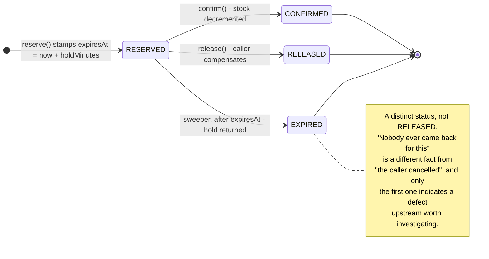
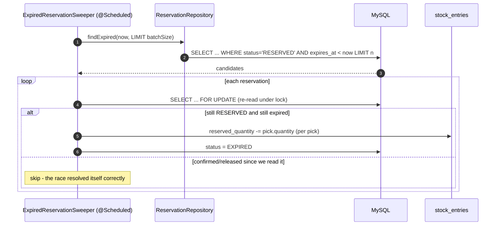

# OMS O5a — reservation expiry: stop leaking stock

*Fixes OMS-6. Design gate — no code until this is approved.*

Parent: [order-management-design.md](../order-management-design.md) · Programme:
[oms-program-plan.md](../oms-program-plan.md) · Predecessors: O1–O4.

---

## 0. Why O5 is being split

The programme lists O5 as "fulfilment engine — OMS-6 + partial/split/backorder/carrier". That is one defect and
four features, and they have nothing in common except the word *fulfilment*:

| | |
|---|---|
| **OMS-6 — reservations never expire** | A live correctness bug that is **losing sellable stock today**, silently, and compounding. |
| Partial/split shipments, backorders, carrier + tracking | New capability. Needs `Shipment`/`ShipmentLine` entities, allocation, a workbench — a large build on top of a model that does not exist yet. |

Shipping them together would put a data-loss fix behind weeks of feature work, and would make the gate for both
one enormous spec. Precedent: O1 fixed the books before O2 built the lifecycle on top.

**This slice is O5a — the defect only.** Shipments become **O5b**, and its design is unaffected by anything here.

---

## 1. What is actually wrong today

### 1.1 The code says the cleanup exists. It does not.

`SagaSellService.safeRelease` swallows a failed compensating release with this:

```java
LOG.warn("Compensating release failed for reservation {} (held stock will lapse/cleanup later)", reservationId);
```

**Nothing lapses and nothing cleans up.** `Reservation` has no `expiresAt`, no TTL, no sweeper — a search of
inventory-service for `expiresAt`/`expires_at`/`TTL` returns nothing. The comment describes a mechanism that was
never built, which is why the gap survived review: the code reads as though it were handled.

### 1.2 A leaked hold does not "delay" a sale — it removes stock permanently

`ReservationService.reserve` computes availability as

```java
available += Math.max(0f, nz(e.getQuantity()) - nz(e.getReservedQuantity()));   // line 60
```

A `RESERVED` row that is never confirmed or released holds `reserved_quantity` on its `stock_entries` **forever**.
That quantity is subtracted from availability on every later reserve. The stock is physically present, counted in
on-hand, and permanently unsellable. Every leak makes the shop a little smaller, and nothing ever gives it back.

### 1.3 Two leak sites, one of which does not even try to compensate

| Site | Behaviour |
|---|---|
| `SagaSellService` (sell saga) | reserve → … → on failure `safeRelease`, which **tries** and gives up on error (§1.1). |
| `SellController:891-897` (sale EDIT) | `reserve(...)` then `confirm(...)` with **no try/catch and no release at all**. If `confirm` throws, the hold is stranded with nothing even attempting to free it. |

The second is worse than the documented one and is not mentioned anywhere.

### 1.4 The operator cannot see it

`StockService.getLevelDetail` returns `{onHand, sellable, expired}` — deliberately honest about expiry, and
**silent about holds**. Sellable is computed net of `reserved_quantity`, so a leak shows up only as a smaller
`sellable` with no explanation. A shopkeeper sees *on-hand 16, sellable 6*, no expired batches, and has nowhere
to look. The number that would explain it is never published.

---

## 2. Design

### 2.1 A hold is a promise with a deadline



* **`reservations.expires_at`** stamped at reserve (Flyway `V6`).
* **`EXPIRED`** added to the status enum. The column is a real MySQL `enum('CONFIRMED','OUT_OF_STOCK',
  'RELEASED','RESERVED')`, so this needs an `ALTER TABLE … MODIFY` — a Java-side enum value alone fails at
  runtime with *"Data truncated for column 'status'"*.

### 2.2 The sweeper



Rules that matter more than the loop:

* **Re-read under lock before releasing.** Between the SELECT and the update, a confirm may land. Releasing then
  would return stock that has just been sold — turning a stock leak into a stock *overstatement*, which is worse,
  because it oversells. The status is re-checked inside the transaction.
* **Bounded batch.** A `LIMIT`, so the first run after this ships does not try to sweep an unbounded backlog in
  one transaction. It runs again shortly; there is no deadline on cleaning up a leak that has existed for months.
* **Idempotent.** Only `RESERVED → EXPIRED` transitions do anything; a second sweeper finds nothing.
* **Per-reservation TTL**, resolved from the reservation's OWN org (§2.3) — not from the sweeper's identity,
  because it has none.

### 2.3 The TTL is per-tenant configuration

`inventory.reservation.holdMinutes`, default **30**.

inventory-service becomes a `common-settings` consumer, which means it needs **its own `SettingsStore` + entity +
repository + migration**. O3 shipped inert for exactly this reason — the engine is `@ConditionalOnBean(
SettingsStore.class)` and does nothing without one — so:

* the store is part of this slice, not assumed; and
* `SettingsService` is injected **required**, so a missing store fails at boot instead of silently defaulting.

The sweeper runs with **no security context**, so it reads the value with `settingsService.effectiveFor(orgId,
key)` — the explicit-tenant form from O3 §2.4. Using the ambient `effective(key)` here would resolve every
tenant's TTL to the platform default, and the bug would look fixed while ignoring configuration.

`0` means **never expire** — an explicit opt-out for a merchant who would rather investigate a stuck hold than
have it disappear. It does not mean "expire immediately"; a threshold whose zero value silently means "always" is
the trap O3 hit with the free-delivery threshold.

### 2.4 Confirm stays lenient — deliberately

A hold that is **past `expiresAt` but not yet swept still physically holds its stock**, so nobody else can have
taken it. Confirming it is safe, and refusing would fail a sale for no reason during the window between expiry
and the next sweep.

So: `confirm` succeeds while the status is `RESERVED`, whatever the clock says. Only once the sweeper has actually
returned the stock does `confirm` fail — and then it must, because the goods are genuinely no longer held. The
message names the cause ("that stock hold expired; please retry the sale") instead of today's bare
*"Cannot confirm reservation in state EXPIRED"*.

### 2.5 Close the uncompensated leak site

`SellController`'s sale-edit path gets the same treatment the saga already attempts: if `confirm` fails, release
the hold. The TTL is a safety net, not a licence to leak — a net that catches something 30 minutes later is no
substitute for not dropping it.

### 2.6 Make holds visible

`getLevelDetail` / `getLevelDetailFor` gain **`held`**, alongside the existing `onHand`, `sellable`, `expired`.

This is the operator-facing half of the defect. Without it, "on-hand 16, sellable 6" has no explanation anywhere
in the product; with it, the Stock screen can say *6 sellable, 10 held* and someone can act. It is one more column
in an aggregate the screen already fetches — no new call.

---

## 3. Not in O5a

Shipments, partial/split fulfilment, backorders, carrier and tracking, pick/pack → **O5b**. Allocation by
location → O5b. Reservation *extension* (a shopper actively editing a cart pushing their own deadline out) →
deferred; the cart holds no stock today, only checkout does, so there is nothing to extend yet.

---

## 4. Test

**Java (`mvn test`, pure logic — Testcontainers skips on this machine):**

* `ReservationExpiryTest` — `expiresAt = createdAt + holdMinutes`; `0` means never; a malformed or negative
  setting falls back to the default rather than expiring everything immediately; a hold exactly at its deadline
  is not yet expired (`<` not `<=`, so a 30-minute hold lasts 30 minutes).
* `SweeperSelectionTest` — only `RESERVED` rows past `expiresAt` are candidates; `CONFIRMED`, `RELEASED` and
  `EXPIRED` are never touched; the batch limit is honoured.

**Cypress — `reservation-expiry.cy.js` (the gate):**

1. Set `inventory.reservation.holdMinutes` to a small value for this org; a second org keeps the default.
2. Create a stranded hold (reserve with no confirm), then assert `sellable` has dropped and **`held` reports the
   missing quantity** — the leak is now visible.
3. Trigger the sweep (admin-gated manual endpoint, §5), then assert the stock is sellable again and the
   reservation reads `EXPIRED`, not `RELEASED`.
4. A **confirmed** reservation is never swept — its stock stays decremented.
5. Confirming an already-swept hold is refused, with a message naming the expiry.
6. `holdMinutes = 0` means the hold survives the sweep.
7. The second org's holds are untouched — the TTL is per-tenant.

**Regression:** `sell`, `storefront-saga`, `order-to-ledger`, `order-cancel`, `order-back-office`, plus the
purchase/edit path that owns the second leak site.

---

## 5. One operational addition

A manual `POST /reservations/sweep` (owner/admin, org-scoped) that runs the sweep immediately and reports what it
freed. It exists for three reasons: the Cypress gate cannot wait for a scheduler; an operator who has just fixed
an outage wants their stock back now rather than at the next tick; and it makes the sweeper's behaviour
observable instead of something that only ever happens in a log.

---

## 6. Exit criteria

No reservation can hold stock indefinitely; expiry is per-tenant configurable with an explicit never-expire
option; the sweeper cannot race a confirm into an oversell; held stock is visible next to sellable; the
uncompensated leak site in the sale-edit path is closed; gate green; no regression.

---

## 7. Checklist

- [x] **Review this design** — approved 2026-08-07
- [x] `V6`: `reservations.expires_at` + `ALTER … MODIFY status` to add `EXPIRED` + `idx_resv_status_expires`
- [x] inventory-service `SettingsStore` + `OrgSetting` + repo + `V7 org_setting`; catalog entry
      `inventory.reservation.holdMinutes`; `SettingsService` injected **required**
- [x] `reserve()` stamps `expiresAt` from the caller's org TTL
- [x] `ExpiredReservationSweeper` — locked re-read, bounded batch, idempotent, `EXPIRED` not `RELEASED`
- [x] `confirm()` lenient until swept; clear message once swept
- [x] `SellController` sale-edit path releases on a failed confirm
- [x] `held` in `getLevelDetail` / `getLevelDetailFor`
- [x] `POST /reservations/sweep`, owner/admin, org-scoped + monolith `/sweepStockHolds` proxy
- [x] `ReservationExpiryTest` (11) + `SweeperSelectionTest` (11) — `mvn test` green, 35 run / 0 failures
- [x] `reservation-expiry.cy.js` — **8/8 green**
- [x] Regression **97/97 green** across 9 specs: `reservation-expiry`, `sell`, `purchase`, `storefront`,
      `storefront-saga`, `order-to-ledger`, `order-cancel`, `order-back-office`, `order-lifecycle`

**O5a COMPLETE** — gate green, no regression, OMS-6 closed.

### Found while implementing (not in the approved design)

* **The shared settings endpoint was unreachable through the gateway.** inventory-service maps its controllers
  at the full `/api/inventory/...` path and its gateway route has **no `StripPrefix`**, while the shared
  `SettingsController` lives in a library and is mapped at `/settings` — it cannot know any one service's
  prefix. `/api/inventory/settings` therefore arrived unchanged and missed the mapping. Fixed with an
  `inventory-settings` route carrying `StripPrefix=2`, placed before the general route — the identical pattern
  the `inventory-demo` route already uses for the shared demo-purge controller, and for the identical reason.
  **Any other full-path service that adopts `common-settings` (finance-service next) will need the same route.**
* **`ReservationExpiryWorker` is a separate bean on purpose.** `expireOne` was first written as a method on the
  sweeper, where `@Transactional(REQUIRES_NEW)` would have been **silently ignored** — Spring's transaction
  proxy is not involved in a self-invocation. The whole batch would have run in one transaction, holding locks
  across every row and rolling back already-freed holds on any single failure.

### Two spec bugs the gate exposed in itself (no product change)

* The expiry test asserted `held == 0` after sweeping, ignoring that an earlier test deliberately leaves a
  **live** 30-minute hold which the sweeper is right to leave alone. Now asserted as a delta against a captured
  baseline, so it tests the sweep rather than the absence of other tests.
* The authorisation test used `demo.business`, which carries `DEMO_ROLE` = SUPER + DEMO and is therefore
  **correctly allowed through** — it proved nothing. Switched to `user.business`, which genuinely holds neither
  `ADMIN_PRIVILEGE` nor `SUPER_PRIVILEGE`. Existence is not eligibility.

### A latent timezone flake in O4's gate, caught by running the suite after midnight

`order-back-office.cy.js` built "today" with `new Date().toISOString().slice(0, 10)` — which is **UTC**. This
machine is +05:00, so between 00:00 and 05:00 local the string resolves to YESTERDAY and a `from=today&to=today`
filter excludes the orders the test just placed. It passed every earlier run and failed the first time the
regression ran at 01:35. Now built from local date components.

Worth generalising: **any test or feature that turns "now" into a date string must use local components**, since
the server stores local time (`connectionTimeZone=+05:00`). `toISOString()` is only correct for instants.

### One unrelated stale spec repaired

`purchase.cy.js` waited on `cy.intercept('GET', '/getStock*')`. `/getStock` was **retired in slice 105** with the
legacy local-Stock proxies, and the item-select pre-fill has called `/productStock` since slice 98 — so the wait
hung until its timeout. Third instance this week of [slice 106](106-cypress-suite-health.md)'s category B.
