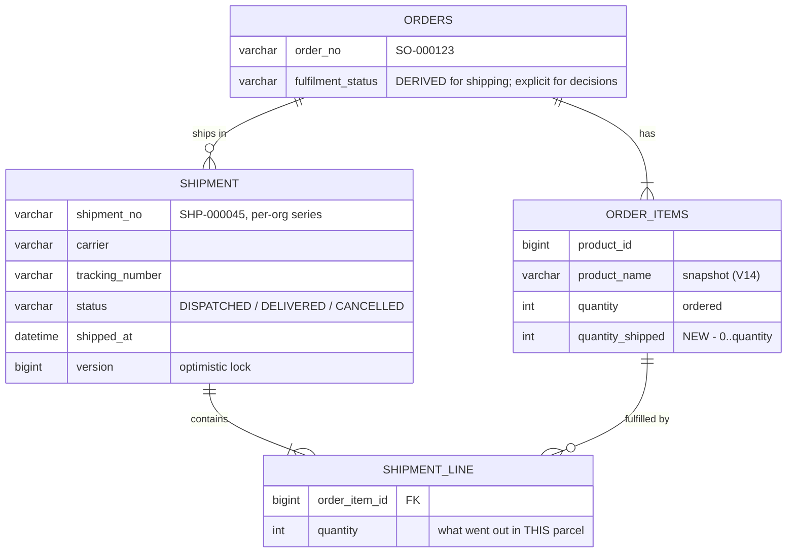
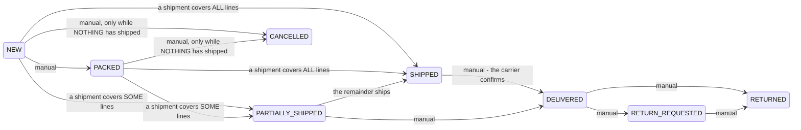

# OMS O5b — shipments: an order stops being all-or-nothing

*Design gate — no code until this is approved.*

Parent: [order-management-design.md](../order-management-design.md) §2.2 · Programme:
[oms-program-plan.md](../oms-program-plan.md) · Predecessors: O1–O4, O5a.

---

## 0. Scope, and what is deferred again

The programme's O5 listed "partial/split/backorder/carrier". O5a took the defect (OMS-6). What remains is still
four things, and they are not one slice:

| | |
|---|---|
| **O5b — this slice.** Partial and split shipments, carrier and tracking. | The capability an order actually lacks: today a merchant with 5 items and 3 in stock must ship everything or nothing. |
| **O5c — deferred.** Backorders, allocation by location, promise dates and SLA, pick/pack workbench. | Each needs a trigger or a model O5b does not build: backorders need stock-arrival events, allocation needs store routing, SLA needs promise dates. |

O5b is the smallest change that makes an order divisible, plus the carrier and tracking number without which a
shipment means nothing to the customer. O5c composes on top and is unaffected by anything here.

---

## 1. What is wrong today

| # | Finding | Evidence |
|---|---|---|
| **1** | **An order is atomic.** `OrderItem` records `quantity` only — there is nowhere to say *3 of 5 shipped*. The header carries one `fulfilmentStatus` for everything. | `OrderItem.java`; `Order.fulfilmentStatus` |
| **2** | **"Shipped" is a claim, not a record.** A packer clicks *Mark SHIPPED* and the order says SHIPPED. Nothing records what went out, when, by whom, or with what tracking. | `OrderService.updateStatus` |
| **3** | **No carrier, no tracking number.** `ShippingOption` still carries a comment saying carrier and tracking are future work. The shopper's tracking page can only ever show a status word. | `ShippingOption.java:17`; `OrderTrackDTO` |
| **4** | **Cancel reverses the WHOLE order.** `returnStockQuietly` iterates every line at full ordered quantity. That is correct today only because nothing can be partly shipped — the moment it can, cancelling would return stock that has already left the building. | `OrderService:454` |
| **5** | **Return reverses the ORDERED quantity**, for the same reason and with the same consequence. | `OrderService.processReturn` |

Findings 4 and 5 are not bugs today. They are the reason partial shipment cannot simply be bolted on: making an
order divisible without addressing them would turn a working reversal into stock invention.

---

## 2. Design

### 2.1 The model

**A shipment does not move stock.** O1 already decremented inventory when the sale was recorded; a shipment
records *what physically left*, against stock that is already gone from the books. Stating this here because the
obvious mistake — decrementing again on dispatch — would silently halve the shop's inventory, and it would look
like a plausible thing to do.

### 2.2 Header status becomes derived — for shipping only

This is the decision the slice turns on.

The rule: **shipping progress is derived from quantities; everything else stays an explicit decision.**

* You cannot *mark* an order shipped any more — you record a shipment, and the status follows. A status that can
  be set independently of the shipments is a status that can lie about them, and O4 has just finished removing
  one source of truth too many.
* `DELIVERED` stays manual: delivery is an external fact the carrier reports, not something derivable from what
  we dispatched.
* `CANCELLED`, `RETURN_REQUESTED`, `RETURNED` stay manual: they are decisions.

`PARTIALLY_SHIPPED` is a new value on a MySQL `enum` column, so it needs an `ALTER TABLE … MODIFY` — the same
step `V7__return_status_enum.sql` already took for the return lifecycle. A Java constant alone fails at runtime
with *"Data truncated for column 'fulfilment_status'"*.

**O2's whitelist survives and is still the guard** for every manual move. The derived transitions are applied by
the shipment write itself, which is why they cannot be requested through `PUT /orders/{id}/status` at all — that
endpoint will refuse `SHIPPED` and `PARTIALLY_SHIPPED` with a message pointing at the shipment endpoint.

### 2.3 Cancellation, once something has shipped

O2 already made `SHIPPED → CANCELLED` illegal, reasoning that goods in transit are not back on the shelf.
Exactly the same is true of a partly-shipped order, so `PARTIALLY_SHIPPED → CANCELLED` is illegal too — the
whitelist gets that entry and finding 4 never becomes reachable. The route for a failed delivery stays
`DELIVERED → RETURNED`, which puts stock back when it physically returns.

Cancelling remains possible while **nothing** has shipped, and there it is still whole-order — correct, because
by definition nothing has left.

### 2.4 Returns — this section was WRONG, and implementing it would have caused the bug it claimed to prevent

**Original claim:** `processReturn` reverses the ordered `quantity`, so once lines can be partly shipped it
over-returns — an order for 5 with 3 shipped would put 5 back and invent 2 units. It should reverse
`quantityShipped`.

**That is backwards.** Stock does not leave at dispatch — it leaves at the SALE, which O1 records at placement
for the full ordered quantity. Tracing the arithmetic for an order of 5 with 3 shipped:

| | |
|---|---|
| At placement (O1) | inventory decremented by **5**; invoice raised for 5 |
| After shipping 3 | 3 physically gone; **2 still on the shelf but already counted as sold** |
| Customer returns | the 3 come back; 2 never left |
| Void the whole invoice | **+5** to stock — which is exactly the 2 + 3 physically present |

So reversing the ordered quantity is correct, and reversing `quantityShipped` would return 3 where 5 were
removed — **inventing a 2-unit shortfall**, the mirror of the error the section set out to avoid.

The same holds for the pre-O1 `LEGACY_UNPOSTED` path, which reserved and confirmed the full ordered quantity at
placement and so must return the full ordered quantity too.

**No change to `processReturn` or `returnStockQuietly`.** The error was conflating "stock leaves at dispatch"
(false here) with "stock leaves at sale" (true since O1). §2.3 is what actually keeps this safe: cancelling is
forbidden once anything has shipped, so the only reversal that can reach a part-shipped order is a return of the
whole thing after delivery — where the whole-invoice void is right.

`quantity_shipped` is still backfilled by V15 for historical shipped orders, but for display honesty (a
delivered order should read 5 of 5 shipped), not for reversal arithmetic.

### 2.5 What the shopper sees

`OrderTrackDTO` gains the shipments: carrier, tracking number, dispatch date, and the lines in each parcel. A
customer who received half an order can see that the rest is on its way and quote a tracking number — today the
page can only say `PARTIALLY_SHIPPED`, which reads like a fault.

### 2.6 Back office

The O4 detail view gains a **Ship** action that opens a per-line quantity form defaulting to everything
outstanding, plus carrier and tracking, and a shipments panel listing what has gone out. `allowedTransitions`
already drives the buttons, so removing `SHIPPED` from the manual set removes the old button automatically —
no second place to edit.

### 2.7 Guards that matter

* Shipping more than is outstanding on a line is refused (`quantity_shipped ≤ quantity`, checked server-side).
* A shipment with no lines, or all-zero quantities, is refused — it would advance nothing and record nothing.
* Shipping against a `CANCELLED` or `RETURNED` order is refused.
* `@Version` on `Shipment`, and the order's existing `@Version` covers two packers dispatching at once.
* Per-org `SHP-` series via `InvoiceNumbers`, allocated MAX+1 under `UNIQUE(organization_id, shipment_seq)` —
  the same race-safe allocation as `INV-`/`CRN-`/`DBN-`/`QTE-`/`SO-`.

---

## 3. Not in O5b

Backorders, allocation by location/store routing, promise dates and SLA/aging, pick lists and packing slips,
carrier API integration and label printing → **O5c**. Carrier here is a free-text name plus a tracking number,
which is what a small merchant actually has.

---

## 4. Test

**Java (`mvn test`, pure logic):**

* `FulfilmentProjectionTest` — the derived status for every combination: nothing shipped, some shipped, all
  shipped, over-shipped (impossible, guarded), a zero-quantity line; and that a derived value never overwrites
  `DELIVERED`, `CANCELLED` or `RETURNED`.
* `ShipmentGuardTest` — cannot ship more than outstanding; cannot ship an empty shipment; cannot ship a
  cancelled order; `PARTIALLY_SHIPPED → CANCELLED` is not in the whitelist.

**Cypress — `order-fulfilment.cy.js` (the gate):**

1. Ship 2 of a 5-line order → header reads `PARTIALLY_SHIPPED`, the line shows 2 of 5, `allowedTransitions`
   offers no Cancel.
2. Ship the remaining 3 → header reads `SHIPPED`; two shipments are listed, each with its own `SHP-` number.
3. Shipping 6 of 5 is refused, with the server's own message.
4. `PUT /status` with `SHIPPED` is refused and names the shipment endpoint.
5. A cancel is allowed before any shipment and refused after one.
6. The public tracking page shows both parcels with carrier and tracking number.
7. Return after delivery reverses the SHIPPED quantity — stock rises by what went out, not by what was ordered.
8. A second org cannot see or ship against the first's order.

**Regression:** `order-back-office`, `order-lifecycle`, `order-cancel`, `order-to-ledger`, `storefront*`,
`reservation-expiry`, `sell`.

---

## 5. Exit criteria

An order can ship in parts; the header cannot disagree with its lines because it is derived from them; a
shipment records carrier and tracking and is visible to the shopper; cancelling after dispatch is impossible and
returning reverses what actually shipped; gate green; no regression.

---

## 6. Checklist

**O5b COMPLETE — gate 12/12, regression 105/105 across 13 specs, 105 unit tests green.**

- [x] **Review this design** — approved 2026-08-07
- [x] `V15`: `shipment` + `shipment_line`, `order_items.quantity_shipped`, `ALTER … MODIFY fulfilment_status`
      to add `PARTIALLY_SHIPPED`, `UNIQUE(organization_id, shipment_seq)`
- [x] `Shipment` / `ShipmentLine` entities + repos; `SHP-` numbering via `InvoiceNumbers`
- [x] `ShipmentService.ship(orderId, lines, carrier, trackingNumber)` — guards per §2.7
- [x] Derived header projection; `updateStatus` refuses `SHIPPED`/`PARTIALLY_SHIPPED` and points at the shipment
      endpoint; whitelist gains `PARTIALLY_SHIPPED` (no path to `CANCELLED`)
- [x] ~~`processReturn` reverses `quantityShipped`~~ — **withdrawn, see §2.4.** Stock leaves at the SALE, not at
      dispatch, so reversing the ordered quantity is correct and the "fix" would have invented a shortfall.
- [x] `OrderDTO` carries shipments + per-line `quantityShipped`; `OrderTrackDTO` carries parcels
- [x] Back office: Ship action + shipments panel; `/shipOrder` proxy
- [x] i18n ×6 (11 keys)
- [x] `FulfilmentProjectionTest` (9) + `ShipmentGuardTest` (12) — marketplace suite 105 run / 0 failures
- [x] `order-fulfilment.cy.js` **12/12**; regression **105/105** across 13 specs

## 7. Found while implementing

* **A `NOT NULL` FK broke the mapping I copied.** `Shipment → lines` began as a unidirectional
  `@OneToMany @JoinColumn` — the shape `Order`/`OrderItem` uses. Hibernate inserts the child with a NULL FK and
  `UPDATE`s it immediately after, which `order_items.order_id` tolerates only because it is **nullable**.
  `shipment_line.shipment_id` is `NOT NULL`, so the first insert failed with *"Field 'shipment_id' doesn't have
  a default value"*. Made bidirectional (`ShipmentLine` owns it) so the FK is written by the line's own INSERT —
  one statement, column stays non-null. The trap was that the copied pattern is a working example that only
  works because of a nullable column.
* **The refusal message pointed at the wrong fix.** The `isDerived` check sat *after* the whitelist, so
  `PUT /status` with `SHIPPED` on a NEW order answered "A NEW order cannot become SHIPPED" — telling the caller
  the move was out of sequence rather than that it is not a move at all. Moved ahead of the whitelist.
* **A line-less POS order can never ship**, which is the derived model meeting **OMS-5** (`/recordOrder` takes
  only `{invoiceNo, customerName, total}` and persists no items). It can be PACKED and no further. Recorded in
  `ecommerce-orders.cy.js` as the honest outcome rather than worked around; OMS-5 remains open.

## 8. A live defect the gate exposed in O2's code

**Public order tracking was broken for every multi-tenant deployment.** `findByOrderNo` returned an
`Optional` and queried **globally**, but `order_no` is unique only per org — the constraint is
`UNIQUE(organization_id, order_seq)` and `idx_orders_order_no` is a plain index. Every tenant's first order is
`SO-000001`, so the second tenant to place an order made tracking throw *"Query did not return a unique result:
2 results were returned"* — **for everyone**.

Fixed by returning a `List` and disambiguating on the contact, which was already the security check. Nothing is
loosened: an anonymous guest still needs no tenant identity, and still cannot see an order without matching its
contact.

This has been live since O2. It surfaced only now because this is the first gate to have two tenants with
orders — worth remembering when judging how much a green suite proves.

## 9. Three specs updated to the new contract

`order-lifecycle`, `order-back-office` and `ecommerce-orders` each drove an order to SHIPPED by *marking* it —
the exact thing this slice removes. All three now dispatch a parcel through the real path. `order-lifecycle`'s
"a CANCELLED order cannot be shipped" case is strictly stronger for it: it now exercises the endpoint that can
actually cause the defect, instead of a status write that no longer reaches dispatch.
