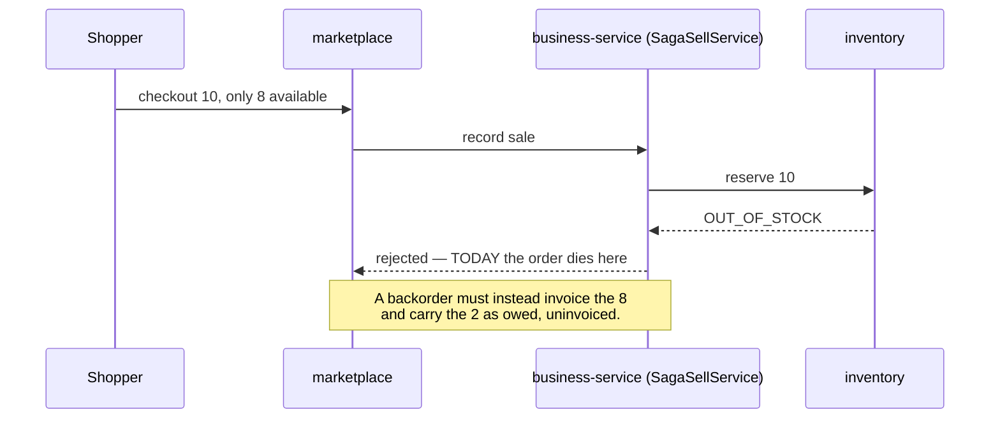
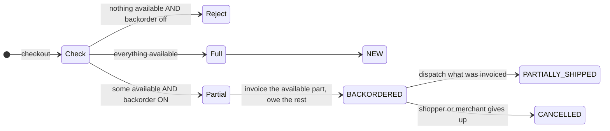

# OMS O5c — backorders: stop losing the order

*Design gate — no code until this is approved.*

Parent: [order-management-design.md](../order-management-design.md) · Programme:
[oms-program-plan.md](../oms-program-plan.md) · Predecessors: O1–O4, O5a, O5b.

---

## 0. What is left of O5, and where it should go

O5c was pencilled in as "backorders, allocation by location, promise dates/SLA, pick/pack". Checking the code
changes that grouping:

| Item | Finding | Proposal |
|---|---|---|
| **Backorders** | Insufficient stock **rejects the sale outright** — the merchant loses the order. | **This slice.** |
| **Promise dates / SLA** | No promised date anywhere; nothing to age against. | **This slice** — a backordered line is meaningless without a date. |
| **Allocation by location** | **inventory-service has no location concept at all.** No `storeId`/`locationId` on `StockEntry`, `StockLevel` or `Reservation`; `StockReservationRequest` carries none. Multi-store merchants share ONE org-wide pool. | **Not an OMS slice.** This is a foundational inventory change touching every entry, reserve, FEFO pick and level read. It belongs with the multi-location programme, not behind an order feature. |
| **Pick / pack workbench** | Shipments exist (O5b); a workbench is UI on top. | **O5d** — small, and it composes on O5b unchanged. |

---

## 1. The problem

`SagaSellService` reserves before writing anything; `OUT_OF_STOCK` throws `InsufficientStockException` and the
checkout is refused with *"Not enough sellable stock"*. A shopper who wants 10 and can have 8 gets **nothing**,
and the merchant loses a sale they could have filled in two days.

O5b already built the mechanism that resolves this — an order can ship in parts. What is missing is permission
to *accept* an order that cannot be filled today.

---

## 2. The tension this slice has to resolve first

**O1 records the SALE at placement.** That is what put storefront revenue in the books, and it is the single
revenue path. A backorder breaks its assumption: you cannot record a sale for goods you do not have without
either driving stock negative or invoicing something you have not delivered.



**Two options, and I recommend the first:**

| | |
|---|---|
| **A — invoice what you can fill (recommended)** | The sale is recorded for the AVAILABLE quantity; the shortfall is carried on the order as owed and uninvoiced. When stock arrives the remainder is dispatched and invoiced then. Matches how the books should read — you recognise revenue on what you deliver — and reuses O5b's partial shipment mechanism unchanged. Cost: `placePublic` must accept a *partial* reservation, which today is all-or-nothing by design (`reserve` verifies every line before holding anything). |
| **B — invoice the whole order up front** | Simpler in marketplace; wrong in the books. Revenue and tax recognised for goods not shipped, stock driven negative or the reservation faked. Rejected. |

Option A means the shortfall lives on the ORDER, never in inventory: **no negative stock, no phantom
reservation.** The order knows it is owed 2; inventory knows nothing about them until they exist.

---

## 3. Design

### 3.1 Model

* `order_items.quantity_backordered` — ordered, not reservable today, not yet invoiced.
  Invariant: `quantity = quantity_invoiced + quantity_backordered`, and `quantity_shipped ≤ quantity_invoiced`.
* `orders.promised_date` — when the merchant expects to complete it. Set from
  `order.backorder.promiseDays` (per-org, default 7) at placement, editable in the back office.
* New derived header state **`BACKORDERED`**: nothing shipped yet and something is owed. Enum widened by
  `ALTER … MODIFY`, as `PARTIALLY_SHIPPED` needed in V15.

### 3.2 Placement



* Gated by `order.backorder.allowed` (per-org, **default off** — accepting orders you cannot fill is a
  commercial decision, not a default). Off ⇒ today's refusal, unchanged.
* The shopper is told **before** they commit: the quote already carries a stock check, so it gains the
  shortfall and the promised date. Accepting a backorder silently is how a shop earns a complaint.
* `CANCELLED` stays reachable from `BACKORDERED` — nothing has shipped, so the O5b prohibition does not apply.

### 3.3 Resolving it

**No event broker exists** (Track C), so a **sweeper**, like O5a's: periodically look for backordered lines
whose product now has sellable stock, and flag them ready. It does **not** auto-invoice or auto-dispatch —
allocating goods to an old order ahead of a customer standing at the till is a decision a merchant makes. The
back office gets a "ready to fulfil" view; dispatch goes through O5b's existing Ship action, which invoices the
remainder as it goes.

Same properties O5a's sweeper needed: bounded batch, idempotent, locked re-read, and per-tenant config.

### 3.4 Ageing

`promised_date` in the past and not complete ⇒ **late**. The O4 list gains a promised-date column, a `late`
filter, and the aging colour §2.9 of the parent design asked for. Derived, never stored — a stored "late" flag
is wrong the moment the clock moves.

---

## 4. Not in O5c

Allocation by location (→ inventory programme), pick/pack workbench (→ O5d), carrier API integration, supplier
purchase-order raising from a backorder (→ procurement, O7).

---

## 5. Test

**Java:** `BackorderSplitTest` — available/shortfall arithmetic at the boundaries (0 available, exactly enough,
more than enough); `quantity = invoiced + backordered` holds after every operation; a backorder is never
created when the flag is off. `PromiseDateTest` — derived lateness, inclusive of the promised day.

**Cypress — `order-backorder.cy.js`:** with the flag off, an over-quantity checkout is refused exactly as today
(no regression); with it on, the order is accepted, the header reads `BACKORDERED`, the invoice covers only the
available part, and stock never goes negative; the shopper's quote shows the shortfall and promised date before
committing; shipping the invoiced part gives `PARTIALLY_SHIPPED`; adding stock and sweeping marks it ready;
dispatching the remainder invoices it and completes the order; a backordered order can still be cancelled.

**Regression:** the full order/storefront set, plus `sell` and `reservation-expiry` — this slice changes the
reserve path, which is the hottest code in the system.

---

## 6. Exit criteria

A merchant can accept an order they cannot fill today, without inventory going negative or the books recognising
undelivered revenue; the shopper is told before committing; the shortfall resolves through O5b's existing
dispatch; late orders are visible; the whole thing is off by default and behaviour is unchanged when off.

---

## 7. Checklist

- [x] **Review this design — especially §2, which changes the O1 revenue path** — approved 2026-08-07
- [x] `V16`: `quantity_backordered`, `promised_date`, `BACKORDERED` enum value, `idx_orders_org_promised`
- [x] `order.backorder.allowed` (default off) + `order.backorder.promiseDays` in the marketplace catalog
- [x] `BackorderSplit` arithmetic; `placePublic` splits before requesting the sale; promised date stamped
- [x] `BACKORDERED` status + projection (never `SHIPPED` while anything is owed) + whitelist (still cancellable)
- [x] `ShipmentService.outstanding` excludes backordered units — they are neither invoiced nor pickable
- [x] `InventoryClient.getStockLevelDetail` (sellable, not on-hand)
- [x] `BackorderSplitTest` (12) + projection cases — marketplace suite **121 run / 0 failures**

- [x] Quote carries the shortfall + promised date; the storefront shows it before commit — **gate case green**
- [x] `BackorderPolicy` shared by the quote and the checkout, so the shopper cannot be told one thing and
      charged another

## 12. GATE GREEN — 10/10 (2026-08-09)

Supersedes §10. All ten cases pass: backorders off behaves exactly as before; the shopper is warned before
committing; only the fillable part is invoiced and stock never goes negative; a backordered order stays
cancellable; owed units cannot be dispatched; the backlog view works and readiness flips on restock with no job;
the late filter is honest; and `acceptFullShortfall=off` refuses a total shortfall while still accepting a
partial one. Marketplace unit suite: **121 run, 0 failures**.

### The storefront refused orders the API accepted — in THREE places

Each was written long before backorders existed and was individually correct then. Together they made the
feature unreachable, and every one of them lives in the browser where no unit test could see it:

| | |
|---|---|
| **Disabled Add button** | `out` ⇒ `<button disabled>Out of stock</button>`. |
| **"Out of stock" label** | told the shopper the opposite of the truth for a shop that takes backorders. |
| **`addToCart`'s soft stock cap** | `inCart >= available` ⇒ with `available = 0` and an empty cart, `0 >= 0` alerted and returned, so the item never reached the cart even once the button was clickable. |

**The lesson for O5d and beyond: adding a capability means re-examining the existing REFUSALS, not just adding
a path.** A feature can be complete server-side and still be unreachable, and only an end-to-end gate finds it.
This is the third time in the programme (O4's refund/return endpoints, O4's order-detail endpoint, now this).

### Also fixed here

**The header lied at placement.** O5b made fulfilment status DERIVED from line quantities, but `placePublic`
still hardcoded `NEW`, so a backordered order claimed it was ready to pack. The projection now runs at
placement, which is where it always belonged.

## 11. The sweeper §3.3 asked for is NOT needed

§3.3 assumed a scheduled sweeper by analogy with O5a's. **The analogy does not hold.** O5a needed a job because
it had to *mutate*: a stranded hold kept stock unsellable until something released it. Here nothing needs
mutating — *"can this backorder be filled now?"* is entirely derived from stock that already exists, so a query
answers it exactly, while a stored `ready` flag would start going stale the moment stock moved and would then
need a job of its own to stay true.

So O5c ships `GET /orders/backorders[?ready=true]` — a read — instead of a sweeper. Same reasoning as `late`
being derived rather than stored. It deliberately does not allocate: taking goods for an old order ahead of a
customer at the till is a merchant's decision, and O5b's Ship action carries it out.

**Checklist correction:** ~~`BackorderSweeper`~~ → `backordersOutstanding` read + `/getBackorders` proxy. Aging
shipped as the `late` filter on the O4 list plus a Promised column, both derived.

## 10. Gate status after the no-invoice decision — 4 of 6 (superseded, see §12)

**Settled and green:** backorders off behaves exactly as before; the shopper is warned before committing; a
backordered order stays cancellable; owed units cannot be dispatched. The §9 decision was implemented as
option 1 — no sale, no invoice, no card charge until dispatch, `booksStatus = BACKORDER_PENDING` (its own value,
NOT `LEGACY_UNPOSTED`, which means an unhealthy pre-O1 order rather than a correct one). Config added:
`order.backorder.acceptFullShortfall`, default on.

### Still failing — one is a REAL product gap

1. **`the storefront shows the warning on the page`** — `cy.click()` fails because the Add button is
   **disabled**. The storefront disables Add for an out-of-stock product (slice 47 behaviour). So with
   backorders ON, **a shopper cannot place one through the UI at all** for a fully out-of-stock item — the
   commonest case, and the one the feature exists for. The API accepts it; the shop front refuses to offer it.
   Fix: when backorders are enabled, the product card must allow Add and say "available to order" instead of
   disabling. This is product work, not a spec fix.
2. **`the order is accepted, and ONLY what can be filled is invoiced`** — the PARTIAL case (10 wanted, 3
   sellable). Not yet diagnosed. Note the spec consumes the seeded 3 units across tests, so verify the actual
   sellable quantity at that point before assuming the split is wrong — the seeding may simply be exhausted.

## 9. RESOLVED — a TOTAL shortfall has no sale to record

Gate status: **2 of 6 green.** "Backorders OFF behaves exactly as before" and "the shopper is warned before
committing" both pass. The remaining four fail on one cause, and it is a hole in §2 rather than a coding slip.

§2 assumed a *partial* fill: invoice what you can, owe the rest. It never asked what happens when **nothing** is
available. The log says it plainly:

```
Backorder: invoicing 0 unit(s) now, 4 owed
```

With `fillNow == 0` the sale request has no sellable lines, `recordSale` refuses, and the checkout dies with the
ordinary out-of-stock message — so a pure backorder, which is the *most likely* kind, cannot be placed at all.

**The decision, because it touches the revenue path:** an order with a total shortfall has nothing to invoice
yet, so it must be created **with no sale and no invoice** — `BACKORDERED`, `booksStatus` not `POSTED` — and
invoiced when stock arrives and it ships.

That is correct accounting (you invoice what you deliver, and nothing has been delivered), but it deliberately
recreates the *shape* O1 removed: an order with no invoice behind it. The difference is that O1's orders had
already taken stock and money while producing no books; these have taken neither, and the `booksStatus` field
O1 added is exactly how such an order stays visible rather than silently missing from the ledger.

Not implemented, because it is a judgement about the books and I would rather it be an explicit decision than a
patch. **Options:**

1. **Accept a pure backorder with no invoice** (recommended, described above).
2. **Only accept PARTIAL shortfalls** — refuse when nothing at all is available. Smaller change, no new order
   shape, but rejects the commonest backorder and makes the feature much less useful.

Everything else in the slice is built and unit-green (121 tests); the four failing gate cases all clear once
this is settled.
- [x] ~~Partial reservation on the sale path — the one genuinely risky change~~ — **not needed, see §8.**
- [ ] Quote carries shortfall + promised date; storefront shows it before commit
- [ ] `BackorderSweeper` — bounded, idempotent, locked re-read; "ready to fulfil" view
- [ ] O4 list: promised date column, `late` filter, aging colour
- [ ] `BackorderSplitTest` + `PromiseDateTest`
- [ ] `order-backorder.cy.js` + full regression

## 8. The risky change turned out to be unnecessary

§2 said the sale path must accept a **partial reservation**, because `reserve` verifies every line before
holding anything. That would have meant editing `SagaSellService` — the single revenue path, and the hottest
code in the system.

It is avoidable. **Split the ORDER before requesting the sale, not the reservation inside it.** marketplace
reads sellable stock, decides what can be filled, and asks for a sale covering exactly that. The request is
therefore fully satisfiable, `reserve` succeeds by its existing all-or-nothing rule, and
`SagaSellService` is not touched at all.

What this trades away is worth stating: the availability read is a second opinion about what is sellable, and it
can be stale. If stock is taken between the read and the sale, the reserve refuses and the shopper gets today's
existing out-of-stock message. That is the **safe direction** — the reserve stays authoritative, the read is
only advisory, and the failure mode is the behaviour that already ships.

So the slice adds a decision *in front of* the revenue path instead of a new mode *inside* it. Same outcome for
the merchant, none of the risk.
