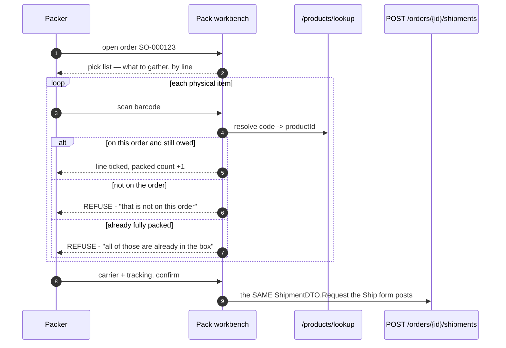

# OMS O5d — pick / pack: make dispatch workable, not just recordable

*Design gate — no code until this is approved.*

Parent: [order-management-design.md](../order-management-design.md) §2.9 · Programme:
[oms-program-plan.md](../oms-program-plan.md) · Predecessors: O1–O5c.

---

## 1. What is missing

O5b made a dispatch **recordable**: parcels, per-line quantities, carrier, tracking, and a derived header that
cannot disagree with its lines. What it did not do is make dispatch **workable**.

Today a packer:

1. reads quantities off a screen,
2. walks the shelves from memory,
3. comes back and **types those numbers in again**.

Step 3 is the problem. The Ship form defaults to "everything outstanding", so the fastest correct-looking action
is to accept the defaults — whether or not that is what physically went in the box. **The one error that
matters, packing the wrong item or the wrong count, is undetectable by the system.** Every guard O5b added is
about quantities being *arithmetically* valid; none of them can tell whether the goods are the right goods.

There is also no pick list: nothing to carry to the shelves, and nothing that groups today's work.

---

## 2. Design

### 2.1 Reuse the scanner that already exists

The POS already has barcode-first selling: `Product.barcode` plus a scoped `/products/lookup`, with a scan box
that resolves a code to a product. **O5d does not build a second scanner.** Scan-to-pack resolves the same way
and then asks a different question: *is this product on this order, and is any of it still owed?*

**The workbench writes nothing new.** It assembles the identical request the existing Ship action posts, so
O5b's `ShipmentService` stays the only writer and its guards (outstanding ≤ ordered, no empty parcel, not
cancelled/returned, backordered units unpickable) remain the single enforcement point. O5d cannot introduce a
money or stock path because it has none of its own.

### 2.2 The pick list

A printable per-order list: product, quantity outstanding, and — where inventory knows it — the FEFO batch and
expiry the sale will draw from, which `getBatches` already returns for the sell screen.

Deliberately **not** a warehouse pick path: no bins, no zones, no wave planning. Those need a location model
inventory does not have (see **INV-L**), and inventing one here would be the wrong place for it.

### 2.3 What scanning changes about trust

| | Before (O5b) | After (O5d) |
|---|---|---|
| Quantities | typed, defaulted to "everything" | counted by scans |
| Wrong product | undetectable | refused at the scan |
| Over-pack | caught by the server, after the fact | refused at the scan, before the box is sealed |
| Manual override | n/a | allowed, but **records that it was manual** |

The override matters: a barcode can be missing or damaged, and a packer who cannot proceed will simply go back
to the old screen. So typing stays available — it is just no longer the default, and the shipment records which
lines were verified by scan. That is the honest position: the system cannot claim verification it did not do.

### 2.4 The two genuine choices are settings, not decisions I make for the merchant

Where more than one answer is defensible, it belongs in configuration — the O5c pattern. Both live in a new
**"Packing & dispatch"** section, because packing is a different job done by a different person from taking an
order, and both default **OFF** so a shop that does nothing keeps working exactly as it does today.

| Setting | Off (default) | On |
|---|---|---|
| `order.pack.scanRequired` | a packer may type quantities, as now | each item must be scanned into the parcel |
| `order.pack.autoConfirm` | the packer confirms, adds carrier + tracking, then it dispatches | the shipment is recorded the moment the last outstanding item is packed |

**Why off by default matters here specifically:** not every merchant owns a scanner. A packing workflow that
assumes equipment they do not have is a workflow they cannot use at all — so requiring scans has to be something
a shop opts into once it has the hardware, never something a release imposes.

`autoConfirm` is the genuine trade the second setting exists to let a merchant make: faster for high volume,
but nobody gets a final look in the box before it leaves. Small shops usually want the look; a warehouse
usually does not.

Note what is deliberately **not** configurable: over-packing, packing a product that is not on the order, and
packing backordered units. Those are wrong in every shop, so making them optional would only let a merchant
switch off a correctness guard.

### 2.4b Status 2026-08-09 — the VERIFICATION BACKEND is in; the packer-facing half is NOT

**Built, compiling, 121 unit tests green — but NOT deployed and NOT gated:**

| | |
|---|---|
| `PACK_SCAN_REQUIRED`, `PACK_AUTO_CONFIRM` | catalog entries under "Packing & dispatch", both default false; self-render on the owner's Order settings screen (it renders from the catalog, so no UI change was needed) |
| `V17` | `shipment_line.verified`, default 0 — pre-O5d rows stay unverified, which is honest: they were typed |
| `ShipmentLine.verified`, `LineRequest.verified` | entity + DTO |
| **Enforcement** | `scanRequired` refuses a hand-typed parcel, in `ShipmentService` — the ONLY writer, so posting to the endpoint directly cannot bypass the workbench (O3's server-side COD reasoning) |
| Persistence | the scan flag is recorded per line |

**NOT built:** the pick-list read, scan resolution via `/products/lookup`, the workbench UI,
**`PACK_AUTO_CONFIRM`'s behaviour** (still an inert toggle — it needs the workbench that would trigger it),
`PackVerificationTest`, `order-pickpack.cy.js`.

⚠️ **`order.pack.autoConfirm` is currently a DEAD TOGGLE.** It appears on the settings screen and does nothing.
That is the exact failure O3 shipped with, so it must either be wired in the next session or removed from the
catalog until the workbench exists. Do not leave it visible and inert.

**Next session starts here:** §5 checklist, from the pick-list read.

### 2.5 Not in O5d

Allocation by location and bins → **INV-L**. Packing slips as designed documents → reuse `DocumentRenderer`
(already exists; a later slice). Carrier API/label printing → deferred with O5b. Multi-order batch picking →
needs the workbench to prove itself on one order first.

---

## 3. Test

**Java:** `PackVerificationTest` — a scanned product not on the order is refused; a scan beyond outstanding is
refused; scans accumulate per line; a backordered line accepts no scans at all (it is not pickable, per O5c).

**Cypress — `order-pickpack.cy.js`:** open a multi-line order → the pick list shows exactly what is outstanding;
scanning a valid barcode ticks its line and increments the count; scanning a foreign product is refused with a
message naming the problem; scanning past the outstanding quantity is refused; confirming posts ONE shipment
whose lines equal the scanned counts; the order's derived status moves exactly as O5b says it should; a
manually-entered line is accepted and flagged as unverified.

**Regression:** `order-fulfilment` (O5b owns the write path this drives), `order-backorder`, `order-back-office`,
`sell` (shares the barcode lookup).

---

## 4. Exit criteria

A packer can work from a pick list and scan items into a parcel; a wrong or excess scan is refused at the moment
it happens rather than after the fact; the workbench posts through O5b's existing endpoint and adds no second
write path; manual entry remains possible and is recorded as unverified; gate green; no regression.

---

## 5. Checklist

- [ ] **Review this design**
- [ ] Pick-list read (outstanding per line + FEFO batch/expiry from `getBatches`)
- [ ] Scan resolution reusing `/products/lookup`; verify against the order, not just the catalog
- [ ] Workbench UI: pick list, scan box, per-line packed counts, manual override marked unverified
- [ ] Confirm → the existing `POST /orders/{id}/shipments` (no new writer)
- [ ] `verified` flag on `shipment_line` (V17) so a scan-verified line is distinguishable from a typed one
- [ ] i18n ×6
- [ ] `PackVerificationTest`
- [ ] `order-pickpack.cy.js` + regression
