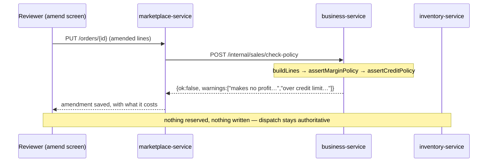

# O7 D1b — tell the reviewer at the moment they decide

**Status:** DONE + GREEN 2026-08-23 — PolicyCheckTest 7/7, order-policy-precheck.cy.js 6/6
**Closes:** departure #2 recorded in §8.1 of the O7 design
**Scope:** one new trade-contract operation. No schema change, no new money logic, no new policy.

---

## 1. What D1 deferred, and what is actually missing

§8.1 recorded two departures from the approved design. They are not equally urgent, and this slice
deliberately takes only the second.

> **§6 D-3 said an amendment must re-run the margin and credit checks.** They **are** enforced — by the sale
> path, at dispatch, exactly as for every other sale — so nothing unsafe ships. What is missing is telling the
> reviewer *at the moment they amend* rather than when the van is loading.

That is the whole of D1b as built here: **a check that writes nothing.** The rules do not change, the
enforcement does not move, and the answer at dispatch remains authoritative.

### Why not reserve-at-confirm in the same slice

Departure #1 (stock not reserved at confirm) is a **different kind of change** and is left open on purpose.
Reserving at confirm means holding inventory against an order that may never dispatch, and the last time this
platform held stock outside the sale path — the marketplace reservation saga — it produced holds with no
invoice behind them, which is why **O1 deleted it**. Re-adding a hold needs an expiry story, a release-on-reject
story, and a recovery story for holds whose order is abandoned. None of that is needed to tell a reviewer
their amendment loses money.

Bundling them would also make the two indistinguishable at review: one is a message, the other changes what
stock means between confirm and dispatch.

## 2. Verified state of the code, read 2026-08-23

The reason this is small is that everything it needs already exists, in the right order:

```java
// SagaSellService.addSell — the sale path today
List<SagaLine> lines = buildLines(dto, productNames);   // 1. resolve products, prices, costs
assertMarginPolicy(lines, dto);                         // 2. whole-invoice margin  (throws / warns)
assertCreditPolicy(dto, lines, null);                   // 3. credit limit          (throws / warns)
inventoryClient.reserve(...);                           // 4. FIRST thing that touches anything
```

| Fact | Evidence |
|---|---|
| Both checks run **before any reservation or write** | `SagaSellService.java:118,123`, and both javadocs say so explicitly |
| They are already **extracted methods** taking `(lines, dto)` | `assertMarginPolicy:250`, `assertCreditPolicy:304` |
| `assertCreditPolicy` is already `public` | `:304` — `updateSell` calls it with an `editingDue` |
| Credit logic is already shared, not copied | D2 extracted `creditAccountOf` / `groupExposure` into `CreditStandingService` precisely so the booker could not be told one thing while the sale enforced another |
| Warnings already have a channel | `CustomerHistoryDTO.warnings`, server-populated on the way out |
| business-service already reserves stock | `SagaSellService:132` calls `inventoryClient.reserve` — so departure #1 needs no new inventory machinery either, only a contract op |

**So a dry run is steps 1–3 and stop.** No new rule is written anywhere, which is the property that matters: a
second copy of a policy is a policy that will disagree with itself.

## 3. The operation

```
POST /internal/sales/check-policy   →   PolicyCheckResponse { ok, blocked, warnings[], reasons[] }
```

**It writes nothing and throws nothing.** The sale path signals refusal by exception —
`ValidationException` for margin, `CreditConfirmationRequiredException` / block for credit — because there a
refusal must stop the write. Here there is no write to stop, and an exception would force every caller to
catch two exception types to render one panel. The dry run therefore **catches what the shared methods throw
and reports it as data**.

That is the one place this slice could go wrong, and it is worth naming: *the checks must be the same methods,
not a re-implementation that returns booleans.* If someone later "tidies" this by inlining the rules, the
reviewer's panel and the dispatch gate begin to drift, and the drift is silent.



## 4. Decisions

**The check is advisory and says so.** Between the amendment and the van there is a real gap: prices move,
other orders consume credit, costs change. A check that pretended to be final would be worse than none,
because a reviewer would stop reading the dispatch failure. The response is a *forecast*, and the wording on
the screen must not promise more.

**Blocked is reported, not enforced.** If the tenant's policy is `block`, the dry run reports
`blocked: true` — but the amendment still saves. Refusing to save an amendment because it *would* fail at
dispatch takes the decision away from the person the whole review step exists to serve, and D1 already
established that both booker and admin may revise. They should be told, then choose.

**No new setting.** The policies are `pos.sale.marginPolicy` and the credit-limit policy the sale already
reads. A separate "check on amend" toggle would let a tenant configure a discrepancy between what the reviewer
is told and what dispatch enforces.

## 5. Gate

| # | Property |
|---|---|
| 1 | **THE CASE** — an amendment that loses money reports it, and the order is still amended (advisory, not enforcement) |
| 2 | an amendment within policy reports `ok` with no warnings — the **positive control**, without which every "reports a problem" assertion could pass on an endpoint that always complains |
| 3 | a customer over their credit limit is named as such, with the amount |
| 4 | the check **writes nothing**: stock, the customer's due, and the order's own totals are identical before and after |
| 5 | the same amendment refused at check time is the one refused at dispatch — the two answers agree |
| 6 | another tenant's order cannot be checked |

Property 4 is the one that distinguishes this from the sale path, and property 5 is the one that would catch a
future re-implementation of the rules.


---

## 6. Outcome, 2026-08-23

**Gated: `PolicyCheckTest` 7/7 (pure logic, every `mvn test`) + `order-policy-precheck.cy.js` 6/6.**

### The defect the unit test caught, which is the one this slice exists to prevent

My first implementation summed `net` over EVERY line and skipped only the cost of uncosted ones.
`assertMarginPolicy` does something different: it `continue`s *before* adding to either side, excluding
uncosted lines from **both**. So the pre-check would have reported a margin the rule would never produce —
the panel saying fine while dispatch refused, with nothing in either log to connect them.

That is precisely the drift §2 of this document warns about, and I introduced it in the first draft. It is now
two separately named sums (`netTotal` for the whole basket, `costedNet` for the margin) with the reasoning
recorded at the site.

### Three fixture defects, all found by the gate rather than by reading

1. `cy.seedProduct({ costPrice })` — **no such option**. `seedProduct` documents `purchaseRate` in its usage
   comment and never sends it anywhere, so the product had no cost, the margin rule reported "nothing to
   judge", and every margin assertion would have passed while testing nothing. Cost is stamped by a real
   `/addPurchase` with `stock.bpurchaseRate`.
2. `/addVender` needs a `companyId` and a `mobile`, not a `contact` — and the mobile must be 11 digits.
3. `/getProduct` does not exist; stock lives in inventory-service and is read via `/productStock?productId=`.

All three are the same lesson in different clothes: **existence is not eligibility, and a documented option is
not an implemented one.** The per-step assertions added after the first failure are what made each of the
later ones name itself instead of surfacing as a missing margin warning three steps later.
