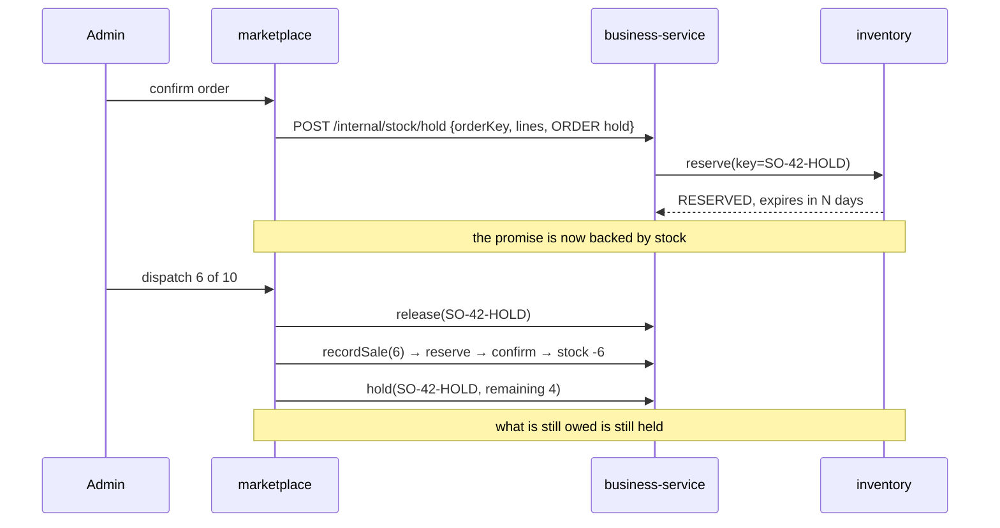

# O7 D1c — reserve stock when the order is confirmed

**Status:** DONE + GREEN 2026-08-23 — `order-stock-hold.cy.js` 6/6, `OrderHoldExpiryTest` 5 cases
**Closes:** departure #1 recorded in §8.1 of the O7 design — the last one open
**Scope:** one trade-contract operation + the order lifecycle. No new reservation machinery.

---

## 1. The gap

§8.1, stated plainly at the time:

> **Stock is NOT reserved at confirm.** §6 D-1 said *"reserve at CONFIRM, invoice at DISPATCH"*. […]
> *The consequence:* **two orders confirmed for the last carton will both confirm, and the second will fail or
> backorder at dispatch.**

A confirmed order is a promise to a shopkeeper. Today that promise is backed by nothing until the van is being
loaded, which is the worst moment to discover it cannot be kept — the rep has left, the customer has been told,
and the only remaining move is an apology.

## 2. Verified state, read 2026-08-23 — most of this is already built

D1 said doing it properly "needs a reserve operation on the trade contract, so that business-service — which
owns stock — performs the hold." Reading the code, considerably more than that already exists:

| Machinery | Where | State |
|---|---|---|
| `reserve` / `confirm` / `release`, full lifecycle | `InventoryClient:30,34,38` | ✅ on the contract already |
| Reservations have a **deadline** | `Reservation.expiresAt`, `V6` | ✅ built in O5a |
| A **sweeper** returns abandoned holds | `ExpiredReservationSweeper.sweep()`, every 5 min, per tenant, resilient to its own failures | ✅ |
| Per-tenant hold duration | `ReservationPolicy.holdMinutes(org)` ← `inventory.reservation.holdMinutes` | ✅ configurable |
| **`reserve` is idempotent on the key** | `ReservationService.reserve:51-54` — *"a retried reserve with the same key returns the existing hold, never double-holds"* | ✅ |
| business-service already reserves | `SagaSellService:132` | ✅ — the hold is taken by the stock owner, as D1 required |

So the recovery story D1 worried about — *"holds with no invoice behind them"*, the reason **O1 deleted the
marketplace reservation saga** — has since been answered by O5a. A hold now has a deadline and a sweeper. That
is what makes this slice reasonable to attempt at all, and it is the opposite of re-adding the saga O1 removed:
the hold is taken **by business-service through the trade contract**, not by marketplace against inventory
directly.

## 3. The finding that shapes the whole design

```java
/** Long enough for a slow checkout, short enough that a leak self-heals within the hour. */
public static final int DEFAULT_HOLD_MINUTES = 30;
```

**A checkout hold and an order hold are not the same kind of promise.** A distributor confirms an order this
afternoon and the van goes out tomorrow morning. Under the existing 30-minute TTL that hold is swept overnight
— *silently, by design, working exactly as intended* — and the order reaches dispatch with nothing reserved.

The feature would look implemented, pass a gate written the obvious way (confirm → assert stock held), and do
nothing on any order that waits more than half an hour. **That is the defect this design exists to avoid**, and
it is invisible to every test that does not wait.

So an order hold carries **its own duration**, and the caller says which kind of hold it is taking. The
alternative — one TTL stretched to cover both — would leave a stranded checkout holding stock for days.

## 4. Why the confirm hold is not handed to the sale

The tempting design: reserve at confirm, then let `addSell` **confirm that same hold** instead of taking a new
one. `reserve` is idempotent on its key, so with matching keys the second call would return the first hold.

It does not survive contact with **partial dispatch**, which D1 records as *"a distributor's NORMAL WEEK"*:

* the confirm hold covers the whole order — 10 cartons;
* the first parcel takes 6.

Consuming 6 of a 10-carton hold means **splitting a reservation**, an operation inventory-service does not have.
Adding one means teaching the FEFO allocator to divide picks across two reservations — a change to the
money-adjacent allocator to serve a convenience. The dispatch idempotency key also depends on *what is being
dispatched* (`"SO-{id}-S{shipped}-D{lines}"`), which is unknowable at confirm.

**So the two holds are kept separate and never coexist**, which is the invariant this slice must hold:

```
confirm    reserve(order key)                    ← the promise
dispatch   release(order key) → addSell reserves ← the promise is spent
           re-reserve the undispatched remainder ← what is still promised stays promised
cancel     release(order key)
reject     — nothing to release; see §7
```

The window between release and the sale's own reserve is real, and it is measured in milliseconds inside one
request. Today that window is the *entire life of the order*, so this is strictly better rather than perfect.



## 5. Decisions

**The hold is taken through the trade contract, never by marketplace against inventory.** business-service owns
what stock means. Marketplace holding inventory directly is precisely what O1 deleted, and the fact that a hold
now expires does not make a second stock authority a good idea.

**A failed hold does NOT refuse the confirm.** If inventory is unreachable, the order still confirms and the
response says the stock could not be held. Refusing would make an inventory outage look like a business refusal
to the admin standing at the screen, and confirming-without-a-hold is exactly today's behaviour — the floor,
not a regression. The reverse (silently confirming and claiming a hold) is what must not happen.

**Out of stock at confirm is a WARNING, not a refusal — for now.** The admin is the person who decides whether
to promise goods the shop has not got; a distributor with a delivery due tomorrow may legitimately confirm
against it. Making this a hard refusal is a tenant policy, and it belongs with the `pos.sale.marginPolicy`
family rather than being hardcoded in this slice.

**Release is best-effort and logged, never fatal.** The sweeper is the backstop — that is what it was built for.
A release that throws must not fail a rejection the admin has already made.

## 6. Gate

| # | Property |
|---|---|
| 1 | **THE CASE** — after confirming, the SELLABLE quantity drops by the ordered amount, and a second order for the last of the stock is told it cannot be held |
| 2 | **positive control** — an unconfirmed (PENDING_APPROVAL) order holds nothing, so #1 measures the confirm rather than the booking |
| 3 | ~~rejecting a confirmed order returns the stock~~ — **wrong premise, see §7**: a confirmed order cannot be rejected at all |
| 4 | cancelling a confirmed order returns the stock |
| 5 | **dispatch does not double-hold**: after a full dispatch, on-hand falls by exactly the dispatched quantity — not twice |
| 6 | after a PARTIAL dispatch the undispatched remainder is still held |
| 7 | **the order hold outlives a checkout hold** — asserted on the stored `expires_at`, because the alternative is a test that waits 30 minutes |
| 8 | inventory being unreachable does not refuse the confirm |

Property 7 is the one that would catch the silent failure in §3, and property 5 is the one that would catch the
double-hold. Neither is visible in a response body; both need the stock read back.


---

## 7. Outcome, 2026-08-23 — 6/6 + 5 unit cases

### The design was wrong about `reject`, and the gate is what said so

The plan had rejection releasing the hold. It cannot: `requirePending` allows a rejection only from
`PENDING_APPROVAL`, and stock is held at **CONFIRM** — so an order that can be rejected has never held any.
The gate answered the case with *"Only an order awaiting review can be rejected. This one is NEW."*

The release in `reject()` was therefore **unreachable code** — a remote round trip that would always find
nothing. Removed, with the reasoning recorded at the site, and the spec now asserts the refusal so nobody
re-adds it. **Cancel** is how a confirmed order is undone, and that is where the release belongs.

### Two bugs found by reading, before the gate ran

1. **Re-holding after a partial dispatch would have held nothing.** `reserve` returned an existing row
   *whatever its status*, so re-holding the remainder under the same order key handed back the row that had
   just been released — and set nothing aside. The outstanding goods would have been quietly available to
   another order, which is the exact failure this slice exists to prevent.
2. **The obvious fix would have thrown.** `uq_resv_org_idem (organization_id, idempotency_key)` permits one
   row per key, so inserting a second was never possible. The released row is now **re-armed in place**: picks
   cleared (`orphanRemoval = true`), status and deadline refreshed. One row per order, living through
   reserve → release → reserve.

### One failure that was two, and neither was a product bug

The reject case failed and never reached its own cleanup, leaving an order confirmed and holding four units.
The next case measured that leak as a double-hold and reported `12` against an expected `16`. Both numbers
were correct; the second failure was manufactured by the first.

> **Cleanup that only runs on the happy path is cleanup that vanishes precisely when it is needed.** The spec
> now tracks every order it creates and cancels them in `after()`, independent of any case's outcome.

### What is asserted where, and why

`expires_at` — three days against thirty minutes — is the single most important property here, and it is in
`OrderHoldExpiryTest` rather than Cypress. Nothing observable at confirm time distinguishes an ORDER hold from
a CHECKOUT one; a spec could only tell them apart by waiting out the clock, so an end-to-end gate written the
obvious way would pass on a build whose holds all lapse before the van leaves.
