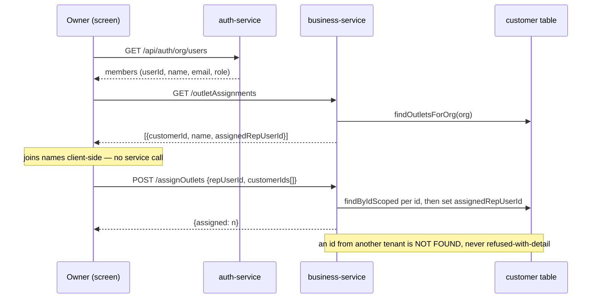

# O7 D6a — territory assignment. Give `assigned_rep_user_id` its data.

**Status:** design, 2026-08-23
**Closes:** the gap D2d left open on purpose
**Scope:** business-service + the owner's screen. No schema change — the column already exists.

---

## 1. Why this, and why it is only part of D6

D6 in the programme table is *"beat plan + visit verification + KPIs"* (B4, B5) — journey planning,
geo-stamped check-in, coverage reporting. That is three features, and **every one of them is undefined until
outlets have owners.** A beat plan is a route through *a rep's* outlets. Coverage is *visited ÷ assigned*.
Commission attribution asks *whose outlet was it*. Assignment is not the first slice of D6 by preference; it
is its precondition.

So D6a is that precondition, and nothing else.

### Verified state, read not assumed

| Fact | Evidence |
|---|---|
| `Customer.assignedRepUserId` exists | `entity/Customer.java:165-166`, `V38__customer_assigned_rep.sql` |
| It is **read** by the territory rule | `CustomerRepo.findOutletsForRep:52` |
| **Nothing writes it, anywhere** | a repo-wide search for `assignedRepUserId` / `assigned_rep_user_id` returns only the entity, the migration, the read query, and a comment in `CustomerImportSpec` |
| The doc already says so | §D2d: *"no data until D6 builds the assignment UI, and the no-data behaviour is the documented intended one"* |
| Org members are listable | `GET /api/auth/org/users`, owner/admin only, confined to the caller's active org (`OrgUserController:111`) |

The column is therefore **inert**: every rep currently falls through the "no assignments → sees everything"
branch, which is the documented day-one behaviour and also the reason no territory has ever narrowed.

## 2. The rule this makes real

Already written in `CustomerController.outlets`, already tested, currently unreachable in its middle line:

```
owner / admin            → every outlet in the org
rep WITH assignments     → their territory (+ unassigned outlets)   ← D6a is what makes this branch occur
rep with NO assignments  → every outlet in the org
```

D6a changes no rule. It supplies the data the middle line has been waiting for.

## 3. Decisions

**Who may assign: owner/admin only.** The same authority that lists members. A rep assigning outlets to
themselves would be helping themselves to the distributor's most poachable asset, and the whole point of
`ROLE_ORDER_BOOKER` is that it *withholds* — it is the plain user set with no `ADMIN_PRIVILEGE`, exactly so a
rep cannot release their own orders. Assignment belongs on the same side of that line.

**Assign to any org MEMBER, not to "bookers".** `listOrgUsers` returns the MEMBERSHIP role (OWNER/ADMIN/USER),
not the security role, so "only order bookers" is not reliably derivable from the data that exists. Filtering
on a guess would hide legitimate staff from the picker and produce a bug report no one could explain. The
owner knows who their reps are; the screen should not pretend to know better.

**The rep's NAME is not stamped.** D2 deliberately stamped `booked_by_name` because *an order outlives its
staff* — an issued document must not change after the fact. An assignment is the opposite kind of fact: it is
**current state**, and if a rep is renamed the assignment should show the new name. Same programme, opposite
answer, for a reason worth stating rather than copying the previous slice out of habit.

**The join happens in the browser.** The screen already fetches `/api/auth/org/users` to populate its
dropdown, so returning `assignedRepUserId` alone and joining client-side costs nothing — where having
business-service resolve names would add a service-to-service call to an admin read purely for display.

**Unassign is assigning to nobody.** `repUserId: null` clears it, returning the outlet to the shared pool.
Not a separate endpoint, because "who covers this outlet" has one answer and one place to change it.

**Bulk by default.** A territory is tens of outlets. An endpoint that assigns one at a time makes the screen
issue fifty requests and leaves a half-applied territory when the twentieth fails.

## 4. Anti-IDOR

Every id in the request is attacker-controlled. `CustomerRepo.findByIdScoped` exists precisely for this — it
is D2's leak fix, written after `standingFor` used a plain `findById` on an id from a query string and let any
authenticated user read any tenant's credit limit.

> **The rule from D2, restated because it applies verbatim here:** whether a read needs scoping depends on
> **where the id came from**, not which method reads it.

So the write resolves each customer through the scoped read, and an id belonging to another tenant is simply
not found. "Not yours" answers identically to "not there".

## 5. Shape



## 6. Gate

| # | Property |
|---|---|
| 1 | **THE CASE** — after assigning, a rep's `/outlets` narrows to their territory (+ unassigned). Asserted with a **positive control**: an outlet assigned to *another* rep must be present before and absent after, so "the list is shorter" cannot pass against an empty read |
| 2 | unassigning returns the outlet to everyone |
| 3 | a rep cannot assign — 403, and the assignment is unchanged afterwards |
| 4 | another tenant's customer id cannot be assigned, and nothing of theirs changes |
| 5 | the owner's read lists every outlet with its current holder |
| 6 | a rep with NO assignments still sees everything (the day-one behaviour must not regress) |

Property 6 is the one most likely to be broken silently by this change, and the one no one would notice
until a distributor who has configured nothing finds their reps looking at an empty picker.
