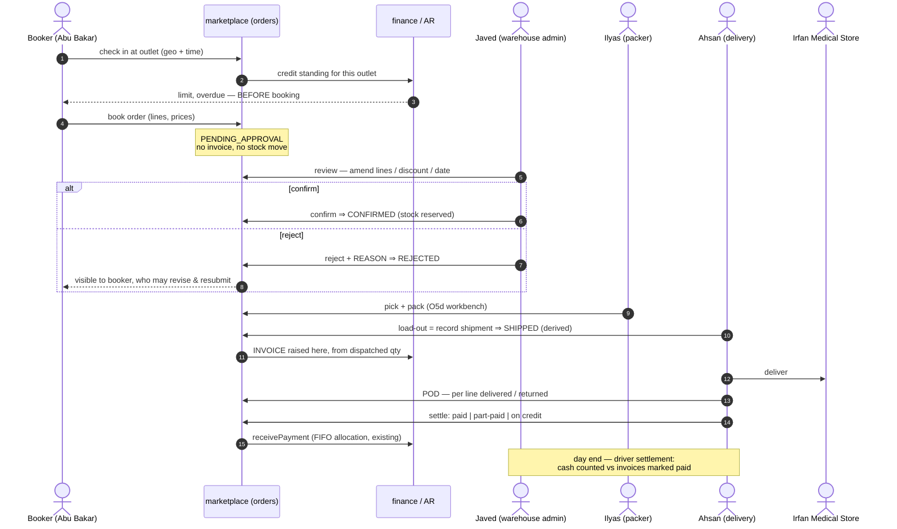
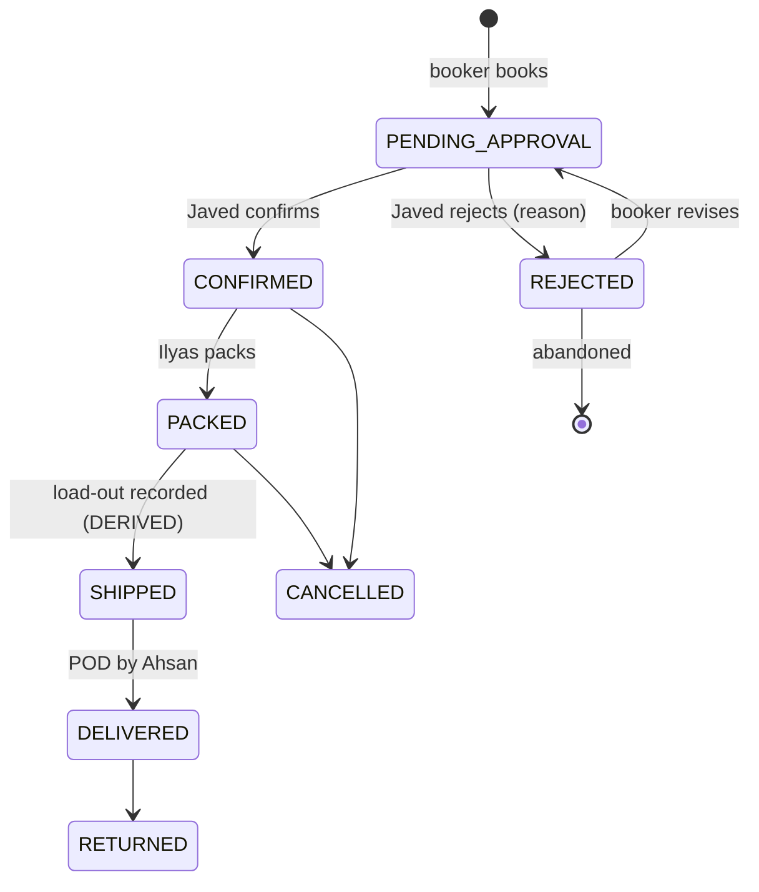

# OMS O7 — Distribution pre-sales: order booker → validation → pack → deliver → collect

*Design gate — no code until this is approved.*

Parent: [order-management-design.md](../order-management-design.md) · Programme:
[oms-program-plan.md](../oms-program-plan.md) · Predecessors: O1–O5e (all green), O5d (half built).

Realises the **"POS SO"** half of the programme's O7 row. Written 2026-08-10 from the founding requirement.

---

## 1. The requirement, restated in industry terms

> Shafique Medicine (a **distributor**) has order bookers Abu Bakar and Arshad Bhatti who book orders at Irfan
> Medical Store and other stores, and send them to Javed (warehouse admin). Javed reviews, amends (customer,
> lines, discounts, date), then **confirms or rejects**. On confirm, Ilyas packs. Ahsan then delivers, carrying
> the invoices, marking each **paid / part-paid / on credit**, and returns them to Javed to update the
> customers' records.

| Person | Industry role | Standard system term |
|---|---|---|
| Abu Bakar, Arshad Bhatti | **Pre-seller / order booker** | Field Sales Rep (SFA) |
| Javed | Distribution / warehouse manager | **Order validation & release** |
| Ilyas | Picker–packer | Pick / pack / load-out |
| Ahsan | Delivery man (van) | **POD + cash collection** |
| Irfan Medical Store | Retail outlet | Trade customer / outlet |

### 1.1 Verdict: yes, this IS the industry standard — it is textbook **pre-sales DSD**

This is **Direct Store Delivery with a pre-sales (van-less booking) model**, the dominant pattern in FMCG and
pharmaceutical distribution. The same shape is implemented by SAP DSD, Oracle Mobile Supply Chain, and every
SFA product in this market (FieldAssist, Bizom, SalesJump). The separation the requirement describes —
**the person who books is not the person who approves, not the person who packs, not the person who delivers
and collects** — is not merely conventional, it is the **segregation of duties** that makes the model
auditable. Nothing in the description needs to be argued out of.

Two things it gets *right* that are commonly got wrong:

* **Booking is a request, not a sale.** Javed can amend or reject, which means an order booker cannot commit
  the company's stock or revenue on their own. Correct.
* **The delivery man reconciles back to the admin.** The loop closes. Many implementations leave the invoice
  with the driver and lose it.

### 1.2 What the requirement does NOT say, and industry standard requires

These are gaps **in the stated process**, before any code is considered. Each is a real control, and the first
four are where distribution businesses actually lose money.

| # | Missing | Why it matters | Verdict |
|---|---|---|---|
| **B1** | **Cash custody / driver settlement.** The process ends at *"hand over the invoice marked"*. That records the fact; it does not account for the **money**. | Ahsan physically holds cash. Standard practice is a **remittance / driver settlement** at day end: cash counted, reconciled against the invoices he marked paid, deposited, and a variance raised if short. Without it, "marked paid" and "money in the safe" are two different things nobody compares. | **Must add** |
| **B2** | **Partial delivery / door rejection.** No path for the store taking 8 of 10, or refusing a short-expiry batch. | Routine in pharma distribution. Without it the driver either fails the whole delivery or lies about it. Needs per-line delivered/returned quantities on the POD, and the invoice adjusted (credit note) accordingly. | **Must add** |
| **B3** | **Credit check AT BOOKING.** Javed rejects over-limit orders — after the visit. | The booker should be told *at the counter* that the store is over its limit or has overdue bills, so the order is never taken. Rejecting later wastes the trip and the customer's expectation. The credit engine already exists (B2B-P1/B4); it is simply not exposed at booking. | **Must add** |
| **B4** | **Visit verification (geo-tag + timestamp).** | The number-one control failure in field sales is orders booked from home. Standard is a GPS + time stamp at check-in. | **Should add** |
| **B5** | **Beat / journey plan.** Which outlets each booker is meant to visit, on which day. | Without it there is no coverage measure and no way to compute the standard KPIs: total calls, **productive calls**, strike rate, lines per call, average order value. | **Should add** |
| **B6** | **Van as a stock location (load-out).** Goods leave the warehouse onto Ahsan's van. | Today they would be "gone" from the warehouse and nowhere else — so undelivered goods coming back have no home to return to. Blocked on **INV-L** (inventory has no location concept at all). | **Defer, blocked** |
| **B7** | **Market returns** (saleable / damaged / expired). | A large, routine flow in pharma distribution, distinct from a door rejection. | **Later slice** |
| **B8** | **Booker commission on COLLECTED value, not booked value.** | Paying on booked value rewards booking orders that are never paid for. | **Later slice** |

---

## 2. Verified state of the code (2026-08-10)

Read, not assumed. **The honest summary: the second half of this process is well built; the first half does not
exist.** O1–O5e hardened everything from "an order exists" onwards. Everything *before* that — booking,
validation, amendment — was never in scope of any slice so far.

| Step | Needed | Today | Gap |
|---|---|---|---|
| Booker logs in | Field-sales identity, scoped to their outlets | ❌ Roles are `ROLE_MARKETPLACE_BUYER` / `_SELLER` only. **No order-booker role exists.** | **Full** |
| Booker books an order | Order attributed to the booker | ❌ `Order` has **no `bookedBy` / sales-rep column**. Cannot attribute, report or pay commission. | **Full** |
| Order awaits review | A pending-approval state | ❌ `FulfilmentStatus` = NEW → PACKED → …; **there is no DRAFT, PENDING_APPROVAL, CONFIRMED or REJECTED**. `NEW` means "accepted and ready to pack". | **Full** |
| Javed amends the order | Edit customer / lines / discount / date | ❌ **No amendment endpoint of any kind.** The order API is create, read, `/status`, `/shipments`, `/refund`, `/return`. Nothing can change an order's contents after creation. | **Full — the single biggest gap** |
| Javed rejects | A rejection distinct from a cancellation, with a reason | 🟡 `CANCELLED` exists but conflates *"we refused this"* with *"the customer cancelled"*. No reason is captured. | **Partial** |
| Ilyas packs | Pick list + scan-verified packing | 🟡 O5d: backend half only. The workbench does not exist; both settings were **withdrawn 2026-08-10** as unusable. | **Partial** |
| Load-out / dispatch | Goods onto the van | 🟡 `Shipment`/`ShipmentLine` + `SHP-` series exist and are good (O5b). No van/location concept (**INV-L**). | **Partial** |
| Ahsan delivers | POD, per-line delivered/returned | 🟡 `DELIVERED` is a manual transition anyone with a login can set. **No POD, no delivery-person assignment, no per-line delivered quantity, no signature/photo.** | **Partial** |
| Mark paid / part / credit | Settlement against the invoice | 🟡 **`receivePayment` exists and is good** — FIFO allocation across open invoices, recomputes due, posts to the finance ledger, idempotent. It is simply **not wired to delivery**, and Ahsan has no screen. | **Partial — good foundation** |
| Reconcile back to Javed | Driver settlement | ❌ Nothing. | **Full** |
| Customer sees status | Outlet login | 🟡 `StorefrontCustomer` is an **e-commerce shopper account**, not a trade-customer portal. Different audience, different data. | **Partial** |

### 2.1 The architectural point that has to be settled first

**Today, an order creates its invoice immediately** — O1 for the storefront, O5e for POS. That is right for both
of those: money changes hands at the counter or at checkout.

**It is wrong for pre-sales.** If booking raises an invoice, then Javed amending the order means *editing an
issued invoice*, and rejecting it means *voiding* one — so a booker's typo becomes a fiscal document, and the
sales-tax register fills with invoices for orders that were never approved.

**A booked order must not invoice.** The invoice is raised when the order is **confirmed and dispatched**, from
the quantities that actually went out. The platform already has the precedent and the vocabulary: O5c's
`BACKORDER_PENDING` books nothing until goods move, and deliberately keeps that distinct from a defective
unbooked order. This is programme **Open Decision #2** (`invoiceTrigger`), and O7 is the slice that must
answer it: **`ON_DISPATCH` for the distribution channel.**

---

## 3. Review of your point 3 — mostly right; three corrections

> *"Bookers must have their own login… after booking, status in progress and visible to Javed… after
> confirm/reject the status updates and is visible to the booker and the customer… when Ahsan picks the order
> the status should be dispatched… on delivery Mr Javed can update the status to dispatched or delivered."*

**Right, and confirmed by the code:** bookers need their own login, and the platform already has the mechanism —
the multi-location model grants **role × location**, and those grants travel in the JWT and scope every service.
A booker's territory is that mechanism reused, not a new one.

**Three corrections:**

1. **"In progress" needs a precise name — and rejection needs a way back.** Call it `PENDING_APPROVAL`
   (industry: *order validation*). More importantly: a rejected order should be **revisable**, not dead. If
   reject is terminal, the booker must re-key the whole order from scratch and the original reason is lost.
   Standard is `REJECTED → (booker revises) → PENDING_APPROVAL`, with the reason recorded on each round.

2. **Do not add a manual "Dispatched" button.** This platform deliberately removed exactly that in O5b:
   shipping progress is **derived** — you record a parcel and the status follows, so a status can never claim
   something no shipment accounts for. `PUT /status` already refuses `SHIPPED`, and a test asserts no state
   offers it as a manual move. So *"when Ahsan picks the order the status should be dispatched"* is achieved by
   **recording the load-out**, and the status becomes `SHIPPED` on its own. Keep that; it is the stronger design.

3. **Delivery should be confirmed by the person who delivered it.** *"Mr Javed can update the status to
   delivered"* is the one part I would push back on: Javed retyping is how a system ends up with orders marked
   delivered that never arrived, and it destroys the segregation of duties that makes the rest of the process
   auditable. Ahsan confirms delivery, with a POD. If Ahsan has no device, Javed may key it — but the record
   must then say *keyed by Javed from a signed invoice*, not assert that Ahsan confirmed it. **A system should
   never record an observation as though it came from someone who did not make it.**

   Related: **delivery and payment are two different facts.** Goods can arrive and be unpaid (credit — which is
   most of this business). Do not collapse them into one status.

---

## 4. Design

### 4.1 The flow



### 4.2 The state machine

New states in **bold**. The existing lifecycle is not disturbed — it is *preceded* by an approval phase, so
every O1–O5e guarantee downstream of `NEW`/`CONFIRMED` continues to hold unchanged.



**`CONFIRMED` maps onto today's `NEW`.** Rather than invent a parallel lifecycle, `PENDING_APPROVAL` and
`REJECTED` are added *in front* of it, and `NEW` keeps its meaning ("accepted, ready to pack") for POS and
storefront orders, which have no approval step and go straight there. One state machine, one whitelist, one
`AllowedTransitionsTest`.

### 4.3 What must NOT change

* **`SHIPPED`/`PARTIALLY_SHIPPED`/`BACKORDERED` stay derived.** No manual dispatch button (§3.2).
* **One revenue path.** The invoice is still raised by `SagaSellService` via `TradeClient` — only the *trigger*
  moves from placement to dispatch. No second money path, no new GL logic.
* **The one-way service dependency.** marketplace → business-service. O5e's §2.5 decision stands.
* **Every new read paged and org-scoped**, with its index shipped in the same migration.

---

## 5. Proposed phasing

Each phase is independently shippable and independently gated. **Ordered so the biggest gap is closed first**,
and so nothing is built that a later phase would rework.

| # | Phase | Closes | Notes |
|---|---|---|---|
| **D1** | ✅ **DONE + GATE GREEN 2026-08-11.** See §8. | The two "Full" gaps that block everything | `PENDING_APPROVAL` / `CONFIRMED` / `REJECTED` + rejection reason; `PUT /orders/{id}` to amend lines, customer, **price** (D-3, inside the margin policy), discount and date **while pending only**; amendment audit trail + 409 on concurrent edit (D-2); re-run credit check on amend; `invoiceTrigger = ON_DISPATCH`, reserving at CONFIRM (D-1). **Start here.** |
| **D2** | ✅ **BUILT 2026-08-11 — awaiting gate.** See §9. | Booker login, attribution, credit at the counter |
| **D3** | **Packing workbench** | O5d's missing half | Finishes O5d and **restores its two withdrawn settings** — the honest way to close review finding R1. |
| **D4** | **Delivery return keying + settlement** | Ahsan's half | **No device (D-5)** — so this is a keying screen for Javed, not a driver app: per-invoice outcome (delivered / part-delivered with per-line quantities / refused), settlement into the existing `receivePayment`, credit note for door rejections. Attributed as *keyed from a signed invoice*. |
| **D5** | **Driver settlement / remittance** | B1 — the money control | Day-end reconciliation: cash counted vs invoices marked paid, deposit recorded, variance raised. |
| **D6** | **Beat plan + visit verification + KPIs** | B4, B5 | Journey plan, geo-stamped check-in, and the standard coverage KPIs. |
| **—** | Van as stock location | B6 | **Blocked on INV-L.** Not in O7. |
| **—** | Market returns, booker commission | B7, B8 | Later. |

**Trade customer portal** (the medical store's own login) is deliberately *not* in D1–D6: it is a separate
audience with its own authorization surface, and the education programme's `PortalScopeFilter` work is the
precedent to follow rather than a bolt-on here.

---

## 6. DECIDED 2026-08-11 — answers, and what each one costs

All five answered. The consequences are recorded here because three of them add work that the question itself
did not imply.

### D-1 · Invoice trigger = **`ON_DISPATCH`** ✅ confirmed

Asked whether something else would be better. It would not, and **your own process rules out the alternatives**:

| Option | Verdict |
|---|---|
| `ON_BOOKING` | ❌ §2.1 — an amendment becomes an edit to an issued invoice, a rejection becomes a void, and the tax register fills with orders nobody approved. |
| `ON_CONFIRM` | 🟡 Workable, but the invoice is then issued *before* picking. Every pack shortfall or batch substitution — routine in pharma — needs a credit note to correct a document that was already printed. |
| **`ON_DISPATCH`** | ✅ **The invoice is raised from what physically left the building**, so a pack shortfall is simply invoiced correctly the first time. Ahsan carries a document that matches the van. |
| `ON_DELIVERY` | ❌ **Ruled out by your own description** — *"during delivery Mr Ahsan keeps the invoices"*, so the invoice must exist before he leaves. It also lags revenue recognition behind dispatch. |

**The split that makes it work:** reserve stock at **CONFIRM**, raise the invoice at **DISPATCH**. Confirming
must hold the goods, or two confirmed orders can promise the same carton; but holding goods is not selling
them. Reserve early, invoice late — and the reservation machinery already exists (O5a, with expiry).

**One consequence to accept now:** a **door rejection still needs a credit note**. The invoice was raised when
the van loaded, so if the store refuses 2 of 10 at the counter, the correction is a credit note against an
issued invoice. That is unavoidable in *any* model where the invoice travels with the goods, and the CRN- series
already exists (B2B-P3c). It is the price of Ahsan carrying paper, not a flaw in `ON_DISPATCH`.

### D-2 · **Both** the booker and Javed may revise a rejected order ✅

Reasonable — but it means **two people can edit one order**, which the single-editor version did not, and that
adds two requirements:

* **Concurrent-edit protection.** `Order` already carries `@Version` (O2), and as of the 2026-08-10 review a
  lock conflict finally returns **409 with a readable message** instead of a 500. So the mechanism is in place;
  D1 must actually surface it — *"Javed changed this while you were editing"* — rather than let the last save win.
* **An amendment audit trail is now mandatory, not optional.** With one editor you could infer who changed
  what. With two you cannot, and *"who dropped the price on this order?"* becomes unanswerable. Every amendment
  records who, when, and the before/after of what changed.

### D-3 · Javed **may** change prices ✅ — inside the existing policy, not above it

Accepted, with one guard I would insist on: the override goes through the **same policy the sale screen already
enforces**, not a free-text field. Otherwise the warehouse gains a discounting power the sales floor does not
have, and the margin protection built in B2B-P1/P2 is bypassed simply by routing an order through Javed.

**Both mechanisms already exist — verified, reuse them rather than writing a second rule:**

| Mechanism | Where | What it does |
|---|---|---|
| `pos.sale.marginPolicy` | `BusinessSettingsCatalog` | `off` / `warn` (default) / `block`, checked on the **whole document after discounts** — which is the check that matters, because an order-level discount can take a document to zero margin with no single line looking wrong. Lines with no recorded cost are excluded rather than counted as pure profit. |
| `assertCreditPolicy(...)` | `SagaSellService` | The credit-limit guard, already invoked by both the new-sale and the sale-**edit** paths. |

So: Javed may change price, **subject to the same margin policy the counter obeys**, and recorded in the
amendment trail (D-2).

**And the amendment must re-run BOTH checks.** This is the part that is easy to miss: an order that passed the
credit and margin checks *at booking* is not still passing after it has been edited — raising quantities or
cutting prices can push the outlet over its limit or the document under its margin floor. The sale-edit path
already learned this exact lesson (it passes the invoice's current unpaid amount into `assertCreditPolicy` so
the existing due is not counted twice); the order-amendment path needs the same treatment, not a fresh one.

### D-4 · **One** approval step ✅

Built as one. The state machine will not *hardcode* one, though: `PENDING_APPROVAL → CONFIRMED` is modelled so
a second gate (credit-control sign-off) can be inserted later without rewriting the states around it. Per P4b's
lesson — **two approvals are not one approval twice** — that later change would be a real slice, not a config
flip, so this only keeps the door open rather than pretending it is free.

### D-5 · Ahsan has **no device** — D4 changes shape ✅

This is the answer with the largest design consequence, and it simplifies D4 considerably.

**What D4 becomes:** a **delivery-return keying screen for Javed**. Ahsan takes the printed invoices, the store
signs them, and Javed keys the outcome per invoice on Ahsan's return — delivered in full / part-delivered with
per-line quantities / refused — plus the settlement (paid, part-paid, on credit) into the existing
`receivePayment`.

**What is lost, and must not be papered over:**

* No delivery timestamp from the door — the recorded time is when Javed keyed it, which can be hours later.
  Reports must say *"recorded"*, never *"delivered at"*, or the delivery-time data is quietly fictional.
* No geo-proof of delivery, no photo, no digital signature. **The signed paper invoice is the POD**, and the
  system holds only its keyed summary. Where a dispute needs proof, the paper is the record.
* Per §3.3, the entry is attributed as **keyed by Javed from a signed invoice** — *not* as Ahsan's confirmation.
  The system must not record an observation as though it came from someone who did not make it.

**This makes B4 (geo-tagged visit verification) booker-only**, which is where it matters most anyway. And it
raises the importance of **D5 (driver settlement)**, not lowers it: with no device, the paper invoices and the
cash Ahsan hands over are the *only* controls on the money, so the day-end reconciliation is the whole control.

---

## 6b. Superseded — the questions as originally asked

1. **Invoice trigger.** I recommend **`ON_DISPATCH`** for this channel (§2.1). Confirm — it is the load-bearing
   decision and everything else follows from it.
2. **May a booker amend their own rejected order, or must Javed?** I recommend the booker revises and
   resubmits (§3.1); Javed's time is the scarce resource.
3. **Can Javed change PRICES, or only quantities and discounts?** Price override is already policy-controlled
   in the B2B pricing engine; I would keep Javed inside that policy rather than give the warehouse a free hand.
4. **One approval step or two?** Some distributors require a credit-control sign-off separately from the
   warehouse's stock sign-off. Your description has one (Javed). I will build one unless you say otherwise —
   two is materially more work and, per P4b, *two approvals ≠ one*.
5. **Does Ahsan get a device?** It changes D4 substantially: with a device, POD is captured at the door; without
   one, D4 is a keying screen for Javed and the POD is a signed paper invoice (§3.3).

---

## 8. D1 — DONE, gate green 2026-08-11

**What it delivers:** an order booker books at the outlet, the warehouse admin reviews, amends, and confirms or
rejects, and **the invoice is raised at dispatch from what actually left the building**.

**Gate: `order-approval.cy.js` GREEN — 12 cases.** The two that carry the slice: *dispatching a confirmed order
is what raises its invoice* (amends the price first, so it also proves the invoice honours the agreed price
rather than the catalog one), and *a second parcel with identical contents raises its own invoice* — which
found a live OMS-1 regression that four passes of reading had missed.

| | |
|---|---|
| **V18** | Widens the `fulfilment_status` ENUM (the `"Data truncated"` class of failure — V7/V15/V16's lesson); `orders.rejection_reason`; the `order_amendment` table; `idx_orders_org_status_created` for the pending queue, which is read oldest-first and so does not fit the back-office list's DESC index (**D3b**). |
| **Lifecycle** | `PENDING_APPROVAL` and `REJECTED` added **in front of** the existing states. Confirm moves `PENDING_APPROVAL → NEW` — there is deliberately **no separate `CONFIRMED`**, because it would mean exactly what `NEW` already means, and two states with one meaning is how a lifecycle starts disagreeing with itself. POS and storefront orders are unaffected and still start at `NEW`. |
| **`AWAITING_DISPATCH`** | A fourth `booksStatus`, distinct for O5c's reason: all of `LEGACY_UNPOSTED`, `BACKORDER_PENDING` and this mean "no invoice", but this one is **correct and expected**, and collapsing it would bury a healthy order inside a real reconciliation backlog. |
| **Amendment** | `PUT /orders/{id}` — lines, quantities, **prices** (D-3), discount, promised date, outlet details. Refused once confirmed. Lines matched **by line id, not productId**: the same product on two lines at two prices is routine in trade orders and would silently merge. A line amended to zero is removed; removing every line is refused. |
| **Audit trail** | One row per amendment **act**, not per field — an amendment is one decision taken for one reason, and splitting it would lose that. The user's name is **stamped at write**, never resolved at read, so the trail survives the person leaving. An amendment that changes nothing writes no row. |
| **`ON_DISPATCH`** | `DispatchInvoiceService`, called by `ShipmentService` **before** the parcel is written. Its own class because `OrderService` already depends on `ShipmentService`, so putting it there would make the two mutually dependent. It calls the same `TradeClient → /internal/sales` contract O1 established — no second money path, no change of dependency direction. |
| **Authority** | Confirm and reject are `ADMIN_PRIVILEGE`; booking and resubmitting are not (D-2 — requiring an admin to resubmit puts the reviewer back in the loop for the work they handed back). `PUT /status` **refuses** the approval transitions and names the proper endpoint — the same idiom O5b used for the derived states, so the generic endpoint cannot be used to bypass the confirm gate or the mandatory rejection reason. |
| **Reachability** | Six monolith proxies ship **with** the slice. The screens are D2/D4, but an endpoint with no proxy is exactly the shape review finding **R7** caught three times. |
| **Tests** | `ApprovalLifecycleTest` (pure logic, every `mvn test`) — the refusals above all; `order-approval.cy.js` — 10 cases end to end. |

### 8.1 Two deliberate departures from the approved design — please read

**1. Stock is NOT reserved at confirm.** §6 D-1 said *"reserve at CONFIRM, invoice at DISPATCH"*. Reserving
would mean marketplace holding inventory again — **the reservation saga O1 deliberately deleted**, because it
produced holds with no invoice behind them. Re-adding it to satisfy a design line would undo a correctness fix,
so D1 confirms without reserving and the stock is taken atomically at dispatch by the existing sale path.

*The consequence, stated plainly:* two orders confirmed for the last carton will both confirm, and the second
will fail or backorder at dispatch. Doing it properly needs a **reserve operation on the trade contract**, so
that business-service — which owns stock — performs the hold. That is **D1b**: a contract change, not a
marketplace one, and the right shape rather than the quick one.

**2. The margin and credit re-checks are not run at amend time.** §6 D-3 said an amendment must re-run both.
They **are** enforced — by the sale path, at dispatch, exactly as for every other sale — so nothing unsafe
ships. What is missing is telling the reviewer *at the moment they amend* rather than when the van is loading.
Doing it needs a new "check policy without writing" operation on the trade contract, which is the same contract
change as D1b and belongs with it.

### 8.1b Five defects during implementation — four found by reading, one by the gate

**None was catchable by a unit test.** Four would have reached a green gate had the spec not asked the right
question: #1, #3 and #5 are silent correctness holes, #4 a standards breach nothing tests. The one that would
have failed loudly (#2) was the least important.

**And #5 is the one that matters most**, because it is the one *reading did not find* — I read this code four
times and missed it, because the guard was correct in isolation and only wrong in combination with a line in a
different file that ran afterwards. That is the argument for the end-to-end gate in one sentence: a defect that
lives in the interaction between two correct-looking files is invisible to every check that looks at one file.

Neither was catchable by a unit test, and one was a real hole in the control.

1. **`ship()` did not refuse an unapproved order.** It blocked only `CANCELLED`/`RETURNED`, so a booked order
   could be dispatched — and, now that dispatch raises the invoice, **invoiced** — with nobody having approved
   it. The review would have been bypassed through the back door rather than the front. The lifecycle whitelist
   does not cover this, because **dispatch is not a status move**: it is a shipment, and the status follows from
   it, which is precisely why the check had to be repeated in `ShipmentService`. *Third time this programme has
   hit the same lesson: adding a capability means re-examining the existing REFUSALS, not just adding a path.*
   Now gated by its own case.

2. **The review actions returned no line items.** `toDTO` deliberately omits them (O4 kept lines out of the
   paged list to avoid an N+1 across 25 rows), so `book`/`amend`/`confirm` answered without the very lines the
   reviewer had just changed — the screen would have had to re-read the order to see what its own write did.
   Fixed with `toDTOWithLines`, which `get()` now also uses: that method had the same fifteen lines of mapping
   inline, and two copies would have drifted the first time a line gained a field.

3. **The dispatch idempotency key could not tell a second parcel from a retry — and that is OMS-1 again.**
   The key was built from the parcel contents alone (`{lineId × qty}`), so shipping 2 units today and 2 more
   tomorrow from the same line produced an **identical key**: the second dispatch replayed the first invoice,
   and those goods left the building with nothing behind them. In the one place that raises invoices, and on a
   path — **partial delivery** — that is routine in this business rather than a corner case.

   The key now includes the order's already-shipped total. That is exactly the right counter because
   `quantityShipped` advances only on a **committed** dispatch: two sequential identical parcels see different
   before-states and get two invoices, while a retry after this transaction rolled back sees the same
   before-state and correctly replays one. The second case is the one that matters, because the sale commits
   *remotely* — a local rollback would otherwise leave a committed invoice for a retry to duplicate.

   Gated by a case that asserts **the second parcel's invoice number differs from the first**. Worth noting
   why: the obvious assertion — that both parcels shipped — passes under the bug too, because the shipment
   records fine and it is the invoice that is replayed. *An assertion that passes under both branches proves
   neither.*

4. **I returned a JPA entity from a controller** — `GET /orders/{id}/amendments` answered with
   `List<OrderAmendment>`, which §1.5 explicitly forbids ("DTOs at the boundary, never entities"). Caught by
   holding this slice to the same standard the 2026-08-10 review held everything else to. Not merely ceremony:
   the entity carried `organizationId` and the raw row id to the browser. Fixed with `OrderAmendmentDTO`, whose
   field names are identical, so the gate is unaffected either way. `changes` stays a JSON **string** by
   choice — it is an audit blob, `summary` already carries the readable line, and a parse that can throw while
   rendering an audit trail is worse than text.

5. **THE ONE THE GATE CAUGHT — the second parcel of a field order raised NO invoice at all.** Found by
   `order-approval.cy.js`, not by reading.

   `invoiceForDispatch` guarded on `booksStatus == AWAITING_DISPATCH`, and `ShipmentService` sets
   `booksStatus = POSTED` after the first successful dispatch. So from parcel two onwards the guard was false,
   the method returned `null`, the order kept parcel one's invoice number, and **the goods left the building
   with nothing behind them.** OMS-1 — the defect this entire programme began with — on the partial-delivery
   path that is a distributor's normal week.

   **Defect #3 above was aimed at the wrong thing.** The idempotency key was genuinely wrong and the fix was
   right, but it sat *downstream of this guard* and was therefore unreachable: I fixed a real problem while an
   upstream check made it moot. Both fixes are needed — this one decides whether to invoice at all, the key
   decides whether this exact parcel already has been.

   **Root cause, which is the transferable part: a guard keyed on a STATE where it needed a PROPERTY.**
   "Does this order invoice at dispatch?" is fixed for the order's whole life. `booksStatus` answers "has it
   reached the books yet?" and moves as the order progresses. Now keyed on `source == "FIELD"`, stamped once at
   booking and never changed.

   **Two things the case itself taught:**
   * It caught a defect **different from the one it was written for** — written to catch a *replayed* invoice,
     it found a *missing* one.
   * My first draft of its assertion (`quantityShipped === 4`) would have passed under **both** bugs, because
     the shipment records correctly either way and it is the invoice that is wrong. *An assertion that passes
     under both branches proves neither* — the same lesson O5e's fixture taught, in a different costume.

   Rejected for now: an explicit `invoice_trigger` column (V19), which is the more extensible model and matches
   Open Decision #2's "both configurable" framing. Held until a second channel actually wants a different
   trigger; today it would only duplicate `source`.

### 8.1c Known limitations

**A part-dispatched order reads `POSTED`.** Once any parcel is invoiced, `booksStatus` flips, though the
un-shipped remainder is not invoiced yet. Imprecise but not harmful — making it exact needs a fourth books
state, which is not worth inventing mid-slice.

**A multi-parcel order carries only its LATEST invoice**

`Order.invoiceNo` is one column, but under `ON_DISPATCH` a part-delivered field order legitimately has **one
invoice per parcel**. Each dispatch overwrites the field, so the earlier invoices are not reachable from the
order at all.

**What this does not break:** cancellation. O5b already forbids `SHIPPED`/`PARTIALLY_SHIPPED → CANCELLED`
(goods on a van are not back on the shelf), so the reversal path cannot be reached once anything has shipped.

**What it does affect:** `processReturn` on a delivered order calls `returnStockQuietly`, which voids
`o.getInvoiceNo()` — i.e. **only the last parcel's invoice**. Returning a multi-parcel field order would leave
the earlier parcels' revenue booked.

The right fix is to carry the invoice on the **shipment** rather than the order, since that is the thing an
invoice now corresponds to one-for-one. That is a schema change and it belongs with **D4**, which owns returns
and door rejections and needs per-parcel invoice identity anyway. Recorded here rather than bodged now:
widening the scope mid-slice to half-fix a return path that D4 rewrites would be the worse trade.

### 8.2 Gate

```
mvn -pl common-security install -DskipTests     # CurrentUser.email() is new
mvn -pl marketplace-service -am clean package -DskipTests
mvn -pl marketplace-service test
```
Then headed: `order-approval.cy.js` — **12 cases**. **Regression:** `order-fulfilment` first (D1 injects both
the invoice step and the not-yet-approved guard into the dispatch path it owns), then `ecommerce-orders`,
`order-cancel`, `order-back-office`, `order-backorder`, `pos-order-parity`, `sell`.

⚠️ **If V18 has not applied**, the first booking fails with *"Data truncated for column 'fulfilment_status'"* —
that is the migration, not the code (V7/V15/V16's recurring lesson: a Java enum constant with no
`ALTER … MODIFY` behind it).

---

## 9. D2 — built 2026-08-11

**What it delivers:** a field rep has their own login, every order they take is attributed to them, they can see
what happened to their own orders, they are told the outlet's credit standing **at the counter**, and they
**cannot approve their own work**.

| | |
|---|---|
| **`ROLE_ORDER_BOOKER`** | The ordinary `user` privilege set — this role exists to **withhold, not to grant**. It carries no `ADMIN_PRIVILEGE`, and `/confirm` and `/reject` require one, so a rep who tries gets a 403 from the server rather than a hidden button (which proves nothing). |
| **`booker.marketplace@`** | Dev fixture, seeded as a **member of the marketplace owner's org** — booker, reviewing admin and outlets all in ONE tenant, or a refusal would prove org-scoping worked rather than that the approval gate did. Same shape `method-authz.cy.js` relies on. |
| **V19** | `orders.booked_by_user_id` + `booked_by_name`, and `idx_orders_org_booker_created` for the "my orders" read. **No backfill** — every existing order predates booking, so NULL correctly reads as "not booked by a rep" (O1's `LEGACY_UNPOSTED` call again). |
| **Two columns, not one** | The name is duplicated **on purpose**: an order outlives its staff, and when a rep leaves, every order they took would otherwise show blank or whoever inherited their id. Same rule `CustomerHistory.bookedByName` and `OrderAmendment.userName` follow. |
| **`GET /orders?mine=true`** | A **boolean**, resolved to the caller's id server-side — deliberately not `bookedBy=<id>`, or a rep could read a colleague's book by editing a number in the URL. The question a client may ask is "mine"; whose that is, is the server's to answer. |
| **`GET /creditStanding`** | Limit, owed, available, over-limit — for the outlet, or for its **group** when it is a branch of a trade account, because that is whose limit actually binds. Named apart from the existing `/customerCredit` (SF-5 store credit), which is the opposite number: money the shop holds *for* the customer. |

### 9.1 The DRY decision worth recording

`creditAccountOf` and `groupExposure` — "whose limit governs?" and "what does that group already owe?" — were
**private to `SagaSellService`**. Copying them for the booker's read would have created a second definition
that answers differently the first time either changed: **the booker told one thing at the counter and the sale
enforcing another.** That is exactly the drift O4 removed when it deleted the browser's rival copy of the
transition rules.

They are now `CreditStandingService`, and `SagaSellService` delegates. One definition; the read and the write
cannot disagree. The arithmetic itself already lived in `common-credit`'s `CreditLimitPolicy` and is untouched.

**Uncapped returns `null`, not a zero standing.** A customer with no limit is not "at 0% of 0" — showing them
as breached would train bookers to ignore the warning, which is the only failure mode that matters for a
warning.

### 9.2 What D2 does NOT do — read this before assuming a boundary

**`ROLE_ORDER_BOOKER` is not a confinement.** It grants the ordinary user surface of the tenant; it does **not**
restrict a rep to their own outlets. `?mine=true` is a **filter the rep chooses**, not a wall around them —
without location grants, a booker can still list the org's other orders. Territory scoping is the multi-location
grant model and is **not wired here**. The same warning `ROLE_GUARDIAN` carries, for the same reason: a role is
not a boundary unless something enforces it.

**No booking SCREEN yet.** The endpoints, the proxies, the role and the credit read all exist and are gated;
what a rep would actually use on a phone is the mobile UI, and it is the larger half of D2's original scope.
Split out deliberately rather than half-drawn — and the API being complete first is what lets the screen be
built against something already proven.

### 9.3 Gate

```
mvn -pl auth-service -am clean package -DskipTests        # ROLE_ORDER_BOOKER + the booker fixture
mvn -pl business-service -am clean package -DskipTests    # CreditStandingService + /creditStanding
mvn -pl marketplace-service -am clean package -DskipTests  # V19 + attribution + ?mine
```
Then headed: `order-booker.cy.js` (7 cases). **Regression:** `credit-limit` first — `SagaSellService` now
delegates the two credit helpers, so that spec is what proves the extraction changed no behaviour — then
`order-approval`, `order-back-office`, `order-fulfilment`, `sell`, `method-authz`.

---

## 7. Exit criteria (whole programme)

A booker logs in, sees their outlets, is warned of a credit problem before booking, and books an order that
raises **no invoice**. Javed sees it pending, amends it, and confirms or rejects it with a reason; the booker
sees the outcome and can revise a rejection. Ilyas packs it against a pick list. The load-out raises the
invoice from what actually went out. Ahsan delivers, records a POD with per-line quantities, and marks it paid,
part-paid or on credit — reaching the same AR ledger the counter uses. At day end his cash reconciles. Every
step is org-scoped, attributed to the person who performed it, and gated by a headed Cypress spec.
