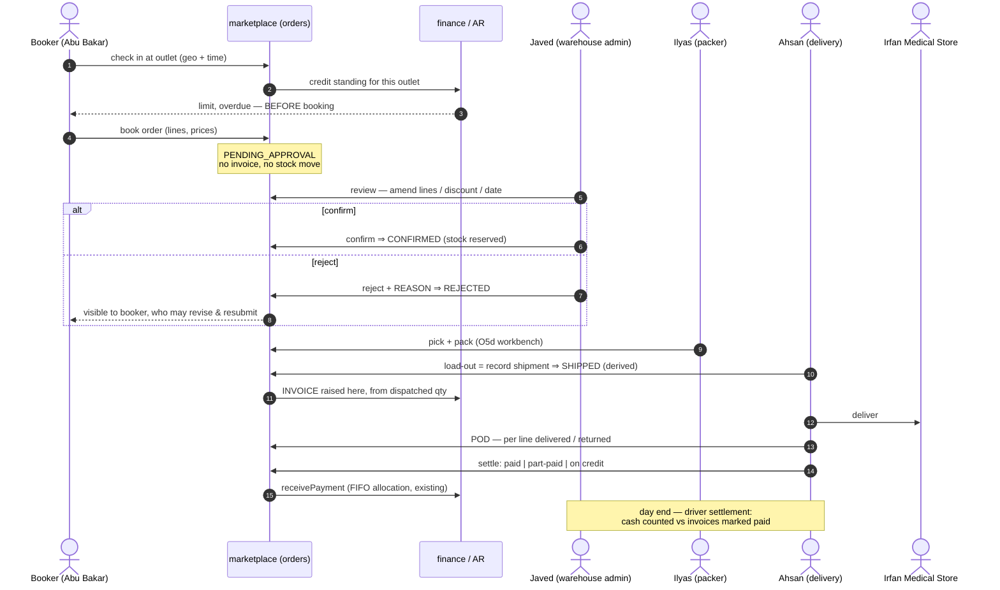
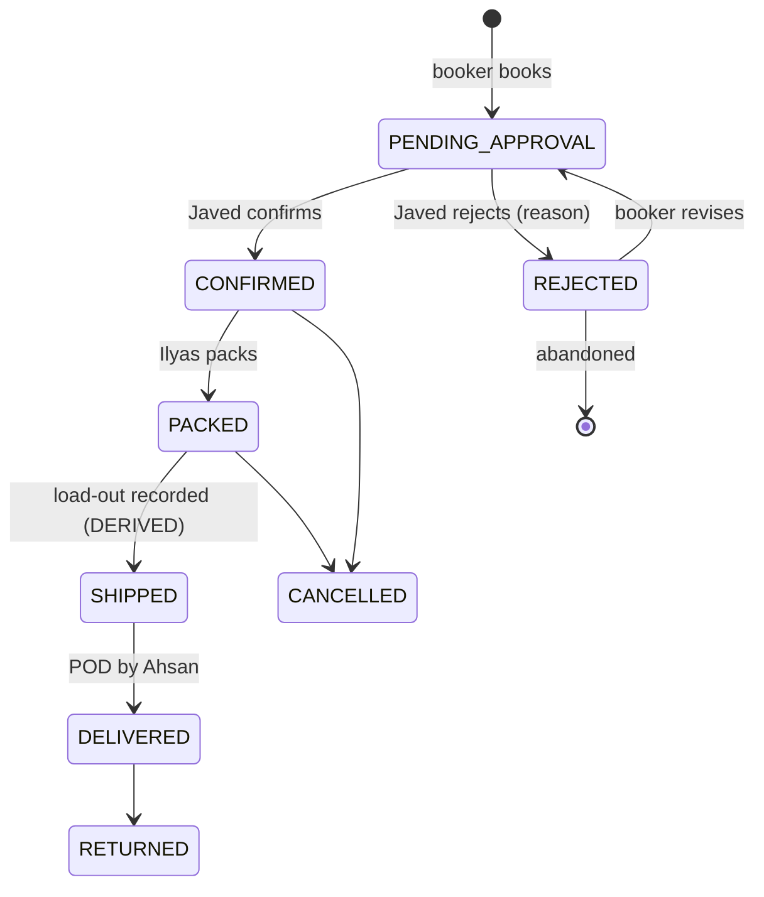

# OMS O7 — Distribution pre-sales: order booker → validation → pack → deliver → collect

*Design gate — no code until this is approved.*

Parent: [order-management-design.md](../order-management-design.md) · Programme:
[oms-program-plan.md](../oms-program-plan.md) · Predecessors: O1–O5e (all green), O5d (half built).

Realises the **"POS SO"** half of the programme's O7 row. Written 2026-08-10 from the founding requirement.

---

## 1. The requirement, restated in industry terms

> Shafique Medicine (a **distributor**) has order bookers Abu Bakar and Arshad Bhatti who book orders at Irfan
> Medical Store and other stores, and send them to Javed (warehouse admin). Javed reviews, amends (customer,
> lines, discounts, date), then **confirms or rejects**. On confirm, Ilyas packs. Ahsan then delivers, carrying
> the invoices, marking each **paid / part-paid / on credit**, and returns them to Javed to update the
> customers' records.

| Person | Industry role | Standard system term |
|---|---|---|
| Abu Bakar, Arshad Bhatti | **Pre-seller / order booker** | Field Sales Rep (SFA) |
| Javed | Distribution / warehouse manager | **Order validation & release** |
| Ilyas | Picker–packer | Pick / pack / load-out |
| Ahsan | Delivery man (van) | **POD + cash collection** |
| Irfan Medical Store | Retail outlet | Trade customer / outlet |

### 1.1 Verdict: yes, this IS the industry standard — it is textbook **pre-sales DSD**

This is **Direct Store Delivery with a pre-sales (van-less booking) model**, the dominant pattern in FMCG and
pharmaceutical distribution. The same shape is implemented by SAP DSD, Oracle Mobile Supply Chain, and every
SFA product in this market (FieldAssist, Bizom, SalesJump). The separation the requirement describes —
**the person who books is not the person who approves, not the person who packs, not the person who delivers
and collects** — is not merely conventional, it is the **segregation of duties** that makes the model
auditable. Nothing in the description needs to be argued out of.

Two things it gets *right* that are commonly got wrong:

* **Booking is a request, not a sale.** Javed can amend or reject, which means an order booker cannot commit
  the company's stock or revenue on their own. Correct.
* **The delivery man reconciles back to the admin.** The loop closes. Many implementations leave the invoice
  with the driver and lose it.

### 1.2 What the requirement does NOT say, and industry standard requires

These are gaps **in the stated process**, before any code is considered. Each is a real control, and the first
four are where distribution businesses actually lose money.

| # | Missing | Why it matters | Verdict |
|---|---|---|---|
| **B1** | **Cash custody / driver settlement.** The process ends at *"hand over the invoice marked"*. That records the fact; it does not account for the **money**. | Ahsan physically holds cash. Standard practice is a **remittance / driver settlement** at day end: cash counted, reconciled against the invoices he marked paid, deposited, and a variance raised if short. Without it, "marked paid" and "money in the safe" are two different things nobody compares. | **Must add** |
| **B2** | **Partial delivery / door rejection.** No path for the store taking 8 of 10, or refusing a short-expiry batch. | Routine in pharma distribution. Without it the driver either fails the whole delivery or lies about it. Needs per-line delivered/returned quantities on the POD, and the invoice adjusted (credit note) accordingly. | **Must add** |
| **B3** | **Credit check AT BOOKING.** Javed rejects over-limit orders — after the visit. | The booker should be told *at the counter* that the store is over its limit or has overdue bills, so the order is never taken. Rejecting later wastes the trip and the customer's expectation. The credit engine already exists (B2B-P1/B4); it is simply not exposed at booking. | **Must add** |
| **B4** | **Visit verification (geo-tag + timestamp).** | The number-one control failure in field sales is orders booked from home. Standard is a GPS + time stamp at check-in. | **Should add** |
| **B5** | **Beat / journey plan.** Which outlets each booker is meant to visit, on which day. | Without it there is no coverage measure and no way to compute the standard KPIs: total calls, **productive calls**, strike rate, lines per call, average order value. | **Should add** |
| **B6** | **Van as a stock location (load-out).** Goods leave the warehouse onto Ahsan's van. | Today they would be "gone" from the warehouse and nowhere else — so undelivered goods coming back have no home to return to. Blocked on **INV-L** (inventory has no location concept at all). | **Defer, blocked** |
| **B7** | **Market returns** (saleable / damaged / expired). | A large, routine flow in pharma distribution, distinct from a door rejection. | **Later slice** |
| **B8** | **Booker commission on COLLECTED value, not booked value.** | Paying on booked value rewards booking orders that are never paid for. | **Later slice** |

---

## 2. Verified state of the code (2026-08-10)

Read, not assumed. **The honest summary: the second half of this process is well built; the first half does not
exist.** O1–O5e hardened everything from "an order exists" onwards. Everything *before* that — booking,
validation, amendment — was never in scope of any slice so far.

| Step | Needed | Today | Gap |
|---|---|---|---|
| Booker logs in | Field-sales identity, scoped to their outlets | ❌ Roles are `ROLE_MARKETPLACE_BUYER` / `_SELLER` only. **No order-booker role exists.** | **Full** |
| Booker books an order | Order attributed to the booker | ❌ `Order` has **no `bookedBy` / sales-rep column**. Cannot attribute, report or pay commission. | **Full** |
| Order awaits review | A pending-approval state | ❌ `FulfilmentStatus` = NEW → PACKED → …; **there is no DRAFT, PENDING_APPROVAL, CONFIRMED or REJECTED**. `NEW` means "accepted and ready to pack". | **Full** |
| Javed amends the order | Edit customer / lines / discount / date | ❌ **No amendment endpoint of any kind.** The order API is create, read, `/status`, `/shipments`, `/refund`, `/return`. Nothing can change an order's contents after creation. | **Full — the single biggest gap** |
| Javed rejects | A rejection distinct from a cancellation, with a reason | 🟡 `CANCELLED` exists but conflates *"we refused this"* with *"the customer cancelled"*. No reason is captured. | **Partial** |
| Ilyas packs | Pick list + scan-verified packing | 🟡 O5d: backend half only. The workbench does not exist; both settings were **withdrawn 2026-08-10** as unusable. | **Partial** |
| Load-out / dispatch | Goods onto the van | 🟡 `Shipment`/`ShipmentLine` + `SHP-` series exist and are good (O5b). No van/location concept (**INV-L**). | **Partial** |
| Ahsan delivers | POD, per-line delivered/returned | 🟡 `DELIVERED` is a manual transition anyone with a login can set. **No POD, no delivery-person assignment, no per-line delivered quantity, no signature/photo.** | **Partial** |
| Mark paid / part / credit | Settlement against the invoice | 🟡 **`receivePayment` exists and is good** — FIFO allocation across open invoices, recomputes due, posts to the finance ledger, idempotent. It is simply **not wired to delivery**, and Ahsan has no screen. | **Partial — good foundation** |
| Reconcile back to Javed | Driver settlement | ❌ Nothing. | **Full** |
| Customer sees status | Outlet login | 🟡 `StorefrontCustomer` is an **e-commerce shopper account**, not a trade-customer portal. Different audience, different data. | **Partial** |

### 2.1 The architectural point that has to be settled first

**Today, an order creates its invoice immediately** — O1 for the storefront, O5e for POS. That is right for both
of those: money changes hands at the counter or at checkout.

**It is wrong for pre-sales.** If booking raises an invoice, then Javed amending the order means *editing an
issued invoice*, and rejecting it means *voiding* one — so a booker's typo becomes a fiscal document, and the
sales-tax register fills with invoices for orders that were never approved.

**A booked order must not invoice.** The invoice is raised when the order is **confirmed and dispatched**, from
the quantities that actually went out. The platform already has the precedent and the vocabulary: O5c's
`BACKORDER_PENDING` books nothing until goods move, and deliberately keeps that distinct from a defective
unbooked order. This is programme **Open Decision #2** (`invoiceTrigger`), and O7 is the slice that must
answer it: **`ON_DISPATCH` for the distribution channel.**

---

## 3. Review of your point 3 — mostly right; three corrections

> *"Bookers must have their own login… after booking, status in progress and visible to Javed… after
> confirm/reject the status updates and is visible to the booker and the customer… when Ahsan picks the order
> the status should be dispatched… on delivery Mr Javed can update the status to dispatched or delivered."*

**Right, and confirmed by the code:** bookers need their own login, and the platform already has the mechanism —
the multi-location model grants **role × location**, and those grants travel in the JWT and scope every service.
A booker's territory is that mechanism reused, not a new one.

**Three corrections:**

1. **"In progress" needs a precise name — and rejection needs a way back.** Call it `PENDING_APPROVAL`
   (industry: *order validation*). More importantly: a rejected order should be **revisable**, not dead. If
   reject is terminal, the booker must re-key the whole order from scratch and the original reason is lost.
   Standard is `REJECTED → (booker revises) → PENDING_APPROVAL`, with the reason recorded on each round.

2. **Do not add a manual "Dispatched" button.** This platform deliberately removed exactly that in O5b:
   shipping progress is **derived** — you record a parcel and the status follows, so a status can never claim
   something no shipment accounts for. `PUT /status` already refuses `SHIPPED`, and a test asserts no state
   offers it as a manual move. So *"when Ahsan picks the order the status should be dispatched"* is achieved by
   **recording the load-out**, and the status becomes `SHIPPED` on its own. Keep that; it is the stronger design.

3. **Delivery should be confirmed by the person who delivered it.** *"Mr Javed can update the status to
   delivered"* is the one part I would push back on: Javed retyping is how a system ends up with orders marked
   delivered that never arrived, and it destroys the segregation of duties that makes the rest of the process
   auditable. Ahsan confirms delivery, with a POD. If Ahsan has no device, Javed may key it — but the record
   must then say *keyed by Javed from a signed invoice*, not assert that Ahsan confirmed it. **A system should
   never record an observation as though it came from someone who did not make it.**

   Related: **delivery and payment are two different facts.** Goods can arrive and be unpaid (credit — which is
   most of this business). Do not collapse them into one status.

---

## 4. Design

### 4.1 The flow

### 4.2 The state machine

New states in **bold**. The existing lifecycle is not disturbed — it is *preceded* by an approval phase, so
every O1–O5e guarantee downstream of `NEW`/`CONFIRMED` continues to hold unchanged.

**`CONFIRMED` maps onto today's `NEW`.** Rather than invent a parallel lifecycle, `PENDING_APPROVAL` and
`REJECTED` are added *in front* of it, and `NEW` keeps its meaning ("accepted, ready to pack") for POS and
storefront orders, which have no approval step and go straight there. One state machine, one whitelist, one
`AllowedTransitionsTest`.

### 4.3 What must NOT change

* **`SHIPPED`/`PARTIALLY_SHIPPED`/`BACKORDERED` stay derived.** No manual dispatch button (§3.2).
* **One revenue path.** The invoice is still raised by `SagaSellService` via `TradeClient` — only the *trigger*
  moves from placement to dispatch. No second money path, no new GL logic.
* **The one-way service dependency.** marketplace → business-service. O5e's §2.5 decision stands.
* **Every new read paged and org-scoped**, with its index shipped in the same migration.

---

## 5. Proposed phasing

Each phase is independently shippable and independently gated. **Ordered so the biggest gap is closed first**,
and so nothing is built that a later phase would rework.

| # | Phase | Closes | Notes |
|---|---|---|---|
| **D1** | **Approval lifecycle + order amendment** | The two "Full" gaps that block everything | `PENDING_APPROVAL` / `CONFIRMED` / `REJECTED` + rejection reason; `PUT /orders/{id}` to amend lines, customer, discount, date **while pending only**; `invoiceTrigger = ON_DISPATCH` for this channel. **Start here.** |
| **D2** | **Booker identity + booking screen** | Booker login, attribution | `ROLE_ORDER_BOOKER` (book + read own; no confirm, no pack, no price override beyond policy); `bookedByUserId` on `Order`; territory via the existing location grants; mobile-first booking screen; credit standing shown **at booking** (B3). |
| **D3** | **Packing workbench** | O5d's missing half | Finishes O5d and **restores its two withdrawn settings** — the honest way to close review finding R1. |
| **D4** | **Delivery + POD + settlement** | Ahsan's half | Delivery assignment; POD with per-line delivered/returned (B2); paid / part-paid / on-credit wired to the existing `receivePayment`; credit note for door rejections. |
| **D5** | **Driver settlement / remittance** | B1 — the money control | Day-end reconciliation: cash counted vs invoices marked paid, deposit recorded, variance raised. |
| **D6** | **Beat plan + visit verification + KPIs** | B4, B5 | Journey plan, geo-stamped check-in, and the standard coverage KPIs. |
| **—** | Van as stock location | B6 | **Blocked on INV-L.** Not in O7. |
| **—** | Market returns, booker commission | B7, B8 | Later. |

**Trade customer portal** (the medical store's own login) is deliberately *not* in D1–D6: it is a separate
audience with its own authorization surface, and the education programme's `PortalScopeFilter` work is the
precedent to follow rather than a bolt-on here.

---

## 6. Open decisions — need your answer before D1 is written

1. **Invoice trigger.** I recommend **`ON_DISPATCH`** for this channel (§2.1). Confirm — it is the load-bearing
   decision and everything else follows from it.
2. **May a booker amend their own rejected order, or must Javed?** I recommend the booker revises and
   resubmits (§3.1); Javed's time is the scarce resource.
3. **Can Javed change PRICES, or only quantities and discounts?** Price override is already policy-controlled
   in the B2B pricing engine; I would keep Javed inside that policy rather than give the warehouse a free hand.
4. **One approval step or two?** Some distributors require a credit-control sign-off separately from the
   warehouse's stock sign-off. Your description has one (Javed). I will build one unless you say otherwise —
   two is materially more work and, per P4b, *two approvals ≠ one*.
5. **Does Ahsan get a device?** It changes D4 substantially: with a device, POD is captured at the door; without
   one, D4 is a keying screen for Javed and the POD is a signed paper invoice (§3.3).

---

## 7. Exit criteria (whole programme)

A booker logs in, sees their outlets, is warned of a credit problem before booking, and books an order that
raises **no invoice**. Javed sees it pending, amends it, and confirms or rejects it with a reason; the booker
sees the outcome and can revise a rejection. Ilyas packs it against a pick list. The load-out raises the
invoice from what actually went out. Ahsan delivers, records a POD with per-line quantities, and marks it paid,
part-paid or on credit — reaching the same AR ledger the counter uses. At day end his cash reconciles. Every
step is org-scoped, attributed to the person who performed it, and gated by a headed Cypress spec.
