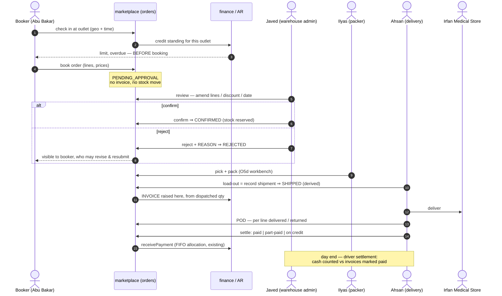
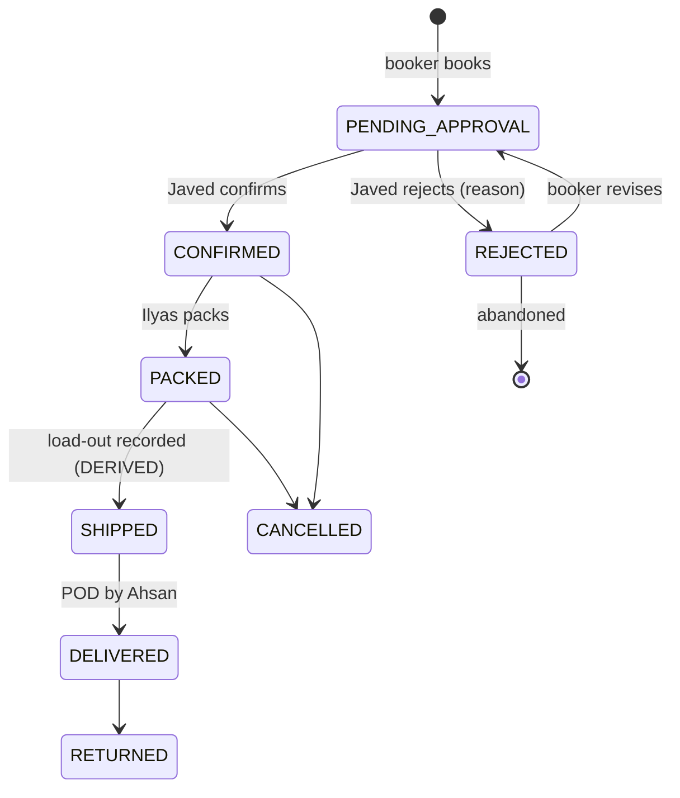
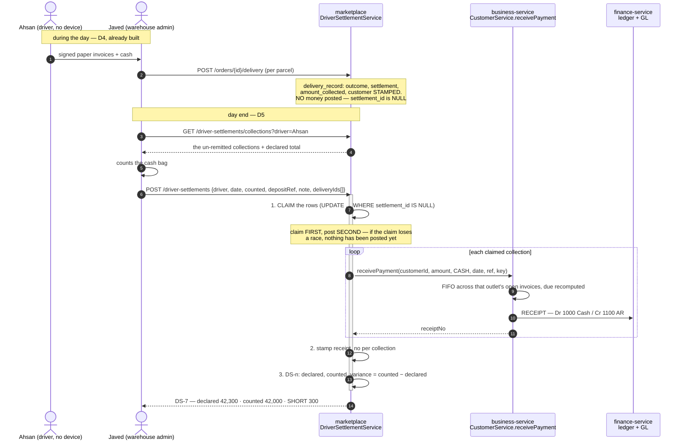
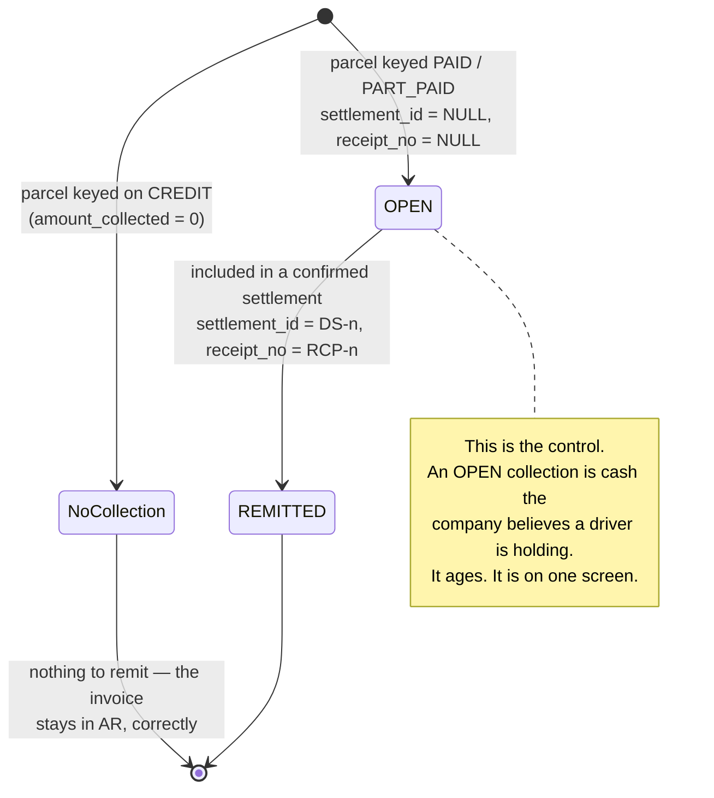

# OMS O7 — Distribution pre-sales: order booker → validation → pack → deliver → collect

*Design gate — no code until this is approved.*

Parent: [order-management-design.md](../order-management-design.md) · Programme:
[oms-program-plan.md](../oms-program-plan.md) · Predecessors: O1–O5e (all green), O5d (half built).

Realises the **"POS SO"** half of the programme's O7 row. Written 2026-08-10 from the founding requirement.

---

## 1. The requirement, restated in industry terms

> Shafique Medicine (a **distributor**) has order bookers Abu Bakar and Arshad Bhatti who book orders at Irfan
> Medical Store and other stores, and send them to Javed (warehouse admin). Javed reviews, amends (customer,
> lines, discounts, date), then **confirms or rejects**. On confirm, Ilyas packs. Ahsan then delivers, carrying
> the invoices, marking each **paid / part-paid / on credit**, and returns them to Javed to update the
> customers' records.

| Person | Industry role | Standard system term |
|---|---|---|
| Abu Bakar, Arshad Bhatti | **Pre-seller / order booker** | Field Sales Rep (SFA) |
| Javed | Distribution / warehouse manager | **Order validation & release** |
| Ilyas | Picker–packer | Pick / pack / load-out |
| Ahsan | Delivery man (van) | **POD + cash collection** |
| Irfan Medical Store | Retail outlet | Trade customer / outlet |

### 1.1 Verdict: yes, this IS the industry standard — it is textbook **pre-sales DSD**

This is **Direct Store Delivery with a pre-sales (van-less booking) model**, the dominant pattern in FMCG and
pharmaceutical distribution. The same shape is implemented by SAP DSD, Oracle Mobile Supply Chain, and every
SFA product in this market (FieldAssist, Bizom, SalesJump). The separation the requirement describes —
**the person who books is not the person who approves, not the person who packs, not the person who delivers
and collects** — is not merely conventional, it is the **segregation of duties** that makes the model
auditable. Nothing in the description needs to be argued out of.

Two things it gets *right* that are commonly got wrong:

* **Booking is a request, not a sale.** Javed can amend or reject, which means an order booker cannot commit
  the company's stock or revenue on their own. Correct.
* **The delivery man reconciles back to the admin.** The loop closes. Many implementations leave the invoice
  with the driver and lose it.

### 1.2 What the requirement does NOT say, and industry standard requires

These are gaps **in the stated process**, before any code is considered. Each is a real control, and the first
four are where distribution businesses actually lose money.

| # | Missing | Why it matters | Verdict |
|---|---|---|---|
| **B1** | **Cash custody / driver settlement.** The process ends at *"hand over the invoice marked"*. That records the fact; it does not account for the **money**. | Ahsan physically holds cash. Standard practice is a **remittance / driver settlement** at day end: cash counted, reconciled against the invoices he marked paid, deposited, and a variance raised if short. Without it, "marked paid" and "money in the safe" are two different things nobody compares. | **Must add** |
| **B2** | **Partial delivery / door rejection.** No path for the store taking 8 of 10, or refusing a short-expiry batch. | Routine in pharma distribution. Without it the driver either fails the whole delivery or lies about it. Needs per-line delivered/returned quantities on the POD, and the invoice adjusted (credit note) accordingly. | **Must add** |
| **B3** | **Credit check AT BOOKING.** Javed rejects over-limit orders — after the visit. | The booker should be told *at the counter* that the store is over its limit or has overdue bills, so the order is never taken. Rejecting later wastes the trip and the customer's expectation. The credit engine already exists (B2B-P1/B4); it is simply not exposed at booking. | **Must add** |
| **B4** | **Visit verification (geo-tag + timestamp).** | The number-one control failure in field sales is orders booked from home. Standard is a GPS + time stamp at check-in. | **Should add** |
| **B5** | **Beat / journey plan.** Which outlets each booker is meant to visit, on which day. | Without it there is no coverage measure and no way to compute the standard KPIs: total calls, **productive calls**, strike rate, lines per call, average order value. | **Should add** |
| **B6** | **Van as a stock location (load-out).** Goods leave the warehouse onto Ahsan's van. | Today they would be "gone" from the warehouse and nowhere else — so undelivered goods coming back have no home to return to. Blocked on **INV-L** (inventory has no location concept at all). | **Defer, blocked** |
| **B7** | **Market returns** (saleable / damaged / expired). | A large, routine flow in pharma distribution, distinct from a door rejection. | **Later slice** |
| **B8** | **Booker commission on COLLECTED value, not booked value.** | Paying on booked value rewards booking orders that are never paid for. | **Later slice** |

---

## 2. Verified state of the code (2026-08-10)

Read, not assumed. **The honest summary: the second half of this process is well built; the first half does not
exist.** O1–O5e hardened everything from "an order exists" onwards. Everything *before* that — booking,
validation, amendment — was never in scope of any slice so far.

| Step | Needed | Today | Gap |
|---|---|---|---|
| Booker logs in | Field-sales identity, scoped to their outlets | ❌ Roles are `ROLE_MARKETPLACE_BUYER` / `_SELLER` only. **No order-booker role exists.** | **Full** |
| Booker books an order | Order attributed to the booker | ❌ `Order` has **no `bookedBy` / sales-rep column**. Cannot attribute, report or pay commission. | **Full** |
| Order awaits review | A pending-approval state | ❌ `FulfilmentStatus` = NEW → PACKED → …; **there is no DRAFT, PENDING_APPROVAL, CONFIRMED or REJECTED**. `NEW` means "accepted and ready to pack". | **Full** |
| Javed amends the order | Edit customer / lines / discount / date | ❌ **No amendment endpoint of any kind.** The order API is create, read, `/status`, `/shipments`, `/refund`, `/return`. Nothing can change an order's contents after creation. | **Full — the single biggest gap** |
| Javed rejects | A rejection distinct from a cancellation, with a reason | 🟡 `CANCELLED` exists but conflates *"we refused this"* with *"the customer cancelled"*. No reason is captured. | **Partial** |
| Ilyas packs | Pick list + scan-verified packing | 🟡 O5d: backend half only. The workbench does not exist; both settings were **withdrawn 2026-08-10** as unusable. | **Partial** |
| Load-out / dispatch | Goods onto the van | 🟡 `Shipment`/`ShipmentLine` + `SHP-` series exist and are good (O5b). No van/location concept (**INV-L**). | **Partial** |
| Ahsan delivers | POD, per-line delivered/returned | 🟡 `DELIVERED` is a manual transition anyone with a login can set. **No POD, no delivery-person assignment, no per-line delivered quantity, no signature/photo.** | **Partial** |
| Mark paid / part / credit | Settlement against the invoice | 🟡 **`receivePayment` exists and is good** — FIFO allocation across open invoices, recomputes due, posts to the finance ledger, idempotent. It is simply **not wired to delivery**, and Ahsan has no screen. | **Partial — good foundation** |
| Reconcile back to Javed | Driver settlement | ❌ Nothing. | **Full** |
| Customer sees status | Outlet login | 🟡 `StorefrontCustomer` is an **e-commerce shopper account**, not a trade-customer portal. Different audience, different data. | **Partial** |

### 2.1 The architectural point that has to be settled first

**Today, an order creates its invoice immediately** — O1 for the storefront, O5e for POS. That is right for both
of those: money changes hands at the counter or at checkout.

**It is wrong for pre-sales.** If booking raises an invoice, then Javed amending the order means *editing an
issued invoice*, and rejecting it means *voiding* one — so a booker's typo becomes a fiscal document, and the
sales-tax register fills with invoices for orders that were never approved.

**A booked order must not invoice.** The invoice is raised when the order is **confirmed and dispatched**, from
the quantities that actually went out. The platform already has the precedent and the vocabulary: O5c's
`BACKORDER_PENDING` books nothing until goods move, and deliberately keeps that distinct from a defective
unbooked order. This is programme **Open Decision #2** (`invoiceTrigger`), and O7 is the slice that must
answer it: **`ON_DISPATCH` for the distribution channel.**

---

## 3. Review of your point 3 — mostly right; three corrections

> *"Bookers must have their own login… after booking, status in progress and visible to Javed… after
> confirm/reject the status updates and is visible to the booker and the customer… when Ahsan picks the order
> the status should be dispatched… on delivery Mr Javed can update the status to dispatched or delivered."*

**Right, and confirmed by the code:** bookers need their own login, and the platform already has the mechanism —
the multi-location model grants **role × location**, and those grants travel in the JWT and scope every service.
A booker's territory is that mechanism reused, not a new one.

**Three corrections:**

1. **"In progress" needs a precise name — and rejection needs a way back.** Call it `PENDING_APPROVAL`
   (industry: *order validation*). More importantly: a rejected order should be **revisable**, not dead. If
   reject is terminal, the booker must re-key the whole order from scratch and the original reason is lost.
   Standard is `REJECTED → (booker revises) → PENDING_APPROVAL`, with the reason recorded on each round.

2. **Do not add a manual "Dispatched" button.** This platform deliberately removed exactly that in O5b:
   shipping progress is **derived** — you record a parcel and the status follows, so a status can never claim
   something no shipment accounts for. `PUT /status` already refuses `SHIPPED`, and a test asserts no state
   offers it as a manual move. So *"when Ahsan picks the order the status should be dispatched"* is achieved by
   **recording the load-out**, and the status becomes `SHIPPED` on its own. Keep that; it is the stronger design.

3. **Delivery should be confirmed by the person who delivered it.** *"Mr Javed can update the status to
   delivered"* is the one part I would push back on: Javed retyping is how a system ends up with orders marked
   delivered that never arrived, and it destroys the segregation of duties that makes the rest of the process
   auditable. Ahsan confirms delivery, with a POD. If Ahsan has no device, Javed may key it — but the record
   must then say *keyed by Javed from a signed invoice*, not assert that Ahsan confirmed it. **A system should
   never record an observation as though it came from someone who did not make it.**

   Related: **delivery and payment are two different facts.** Goods can arrive and be unpaid (credit — which is
   most of this business). Do not collapse them into one status.

---

## 4. Design

### 4.1 The flow



### 4.2 The state machine

New states in **bold**. The existing lifecycle is not disturbed — it is *preceded* by an approval phase, so
every O1–O5e guarantee downstream of `NEW`/`CONFIRMED` continues to hold unchanged.



**`CONFIRMED` maps onto today's `NEW`.** Rather than invent a parallel lifecycle, `PENDING_APPROVAL` and
`REJECTED` are added *in front* of it, and `NEW` keeps its meaning ("accepted, ready to pack") for POS and
storefront orders, which have no approval step and go straight there. One state machine, one whitelist, one
`AllowedTransitionsTest`.

### 4.3 What must NOT change

* **`SHIPPED`/`PARTIALLY_SHIPPED`/`BACKORDERED` stay derived.** No manual dispatch button (§3.2).
* **One revenue path.** The invoice is still raised by `SagaSellService` via `TradeClient` — only the *trigger*
  moves from placement to dispatch. No second money path, no new GL logic.
* **The one-way service dependency.** marketplace → business-service. O5e's §2.5 decision stands.
* **Every new read paged and org-scoped**, with its index shipped in the same migration.

---

## 5. Proposed phasing

Each phase is independently shippable and independently gated. **Ordered so the biggest gap is closed first**,
and so nothing is built that a later phase would rework.

| # | Phase | Closes | Notes |
|---|---|---|---|
| **D1** | ✅ **DONE + GATE GREEN 2026-08-11.** See §8. | The two "Full" gaps that block everything | `PENDING_APPROVAL` / `CONFIRMED` / `REJECTED` + rejection reason; `PUT /orders/{id}` to amend lines, customer, **price** (D-3, inside the margin policy), discount and date **while pending only**; amendment audit trail + 409 on concurrent edit (D-2); re-run credit check on amend; `invoiceTrigger = ON_DISPATCH`, reserving at CONFIRM (D-1). **Start here.** |
| **D2** | ✅ **DONE + GATE GREEN 2026-08-12.** See §9. | Booker login, attribution, credit at the counter |
| **D3** | ✅ **DONE + GREEN 2026-08-13** — 9/9. See §11. | O5d's missing half | Finishes O5d and **restores its two withdrawn settings** — the honest way to close review finding R1. |
| **D4** | **Delivery return keying + settlement** | Ahsan's half | **No device (D-5)** — so this is a keying screen for Javed, not a driver app: per-invoice outcome (delivered / part-delivered with per-line quantities / refused), settlement into the existing `receivePayment`, credit note for door rejections. Attributed as *keyed from a signed invoice*. |
| **D5** | **Driver settlement / remittance** — built 2026-08-15, **GATED 9/9 2026-08-23**. See §13. | B1 — the money control | Day-end reconciliation: cash counted vs invoices marked paid, deposit recorded, variance raised. **And it is what posts the receipts** — §13.1 found that D4 stored the settlement and never sent it anywhere. |
| **D6** | **Beat plan + visit verification + KPIs** | B4, B5 | Journey plan, geo-stamped check-in, and the standard coverage KPIs. |
| **—** | Van as stock location | B6 | **Blocked on INV-L.** Not in O7. |
| **—** | Market returns, booker commission | B7, B8 | Later. |

**Trade customer portal** (the medical store's own login) is deliberately *not* in D1–D6: it is a separate
audience with its own authorization surface, and the education programme's `PortalScopeFilter` work is the
precedent to follow rather than a bolt-on here.

---

## 6. DECIDED 2026-08-11 — answers, and what each one costs

All five answered. The consequences are recorded here because three of them add work that the question itself
did not imply.

### D-1 · Invoice trigger = **`ON_DISPATCH`** ✅ confirmed

Asked whether something else would be better. It would not, and **your own process rules out the alternatives**:

| Option | Verdict |
|---|---|
| `ON_BOOKING` | ❌ §2.1 — an amendment becomes an edit to an issued invoice, a rejection becomes a void, and the tax register fills with orders nobody approved. |
| `ON_CONFIRM` | 🟡 Workable, but the invoice is then issued *before* picking. Every pack shortfall or batch substitution — routine in pharma — needs a credit note to correct a document that was already printed. |
| **`ON_DISPATCH`** | ✅ **The invoice is raised from what physically left the building**, so a pack shortfall is simply invoiced correctly the first time. Ahsan carries a document that matches the van. |
| `ON_DELIVERY` | ❌ **Ruled out by your own description** — *"during delivery Mr Ahsan keeps the invoices"*, so the invoice must exist before he leaves. It also lags revenue recognition behind dispatch. |

**The split that makes it work:** reserve stock at **CONFIRM**, raise the invoice at **DISPATCH**. Confirming
must hold the goods, or two confirmed orders can promise the same carton; but holding goods is not selling
them. Reserve early, invoice late — and the reservation machinery already exists (O5a, with expiry).

**One consequence to accept now:** a **door rejection still needs a credit note**. The invoice was raised when
the van loaded, so if the store refuses 2 of 10 at the counter, the correction is a credit note against an
issued invoice. That is unavoidable in *any* model where the invoice travels with the goods, and the CRN- series
already exists (B2B-P3c). It is the price of Ahsan carrying paper, not a flaw in `ON_DISPATCH`.

### D-2 · **Both** the booker and Javed may revise a rejected order ✅

Reasonable — but it means **two people can edit one order**, which the single-editor version did not, and that
adds two requirements:

* **Concurrent-edit protection.** `Order` already carries `@Version` (O2), and as of the 2026-08-10 review a
  lock conflict finally returns **409 with a readable message** instead of a 500. So the mechanism is in place;
  D1 must actually surface it — *"Javed changed this while you were editing"* — rather than let the last save win.
* **An amendment audit trail is now mandatory, not optional.** With one editor you could infer who changed
  what. With two you cannot, and *"who dropped the price on this order?"* becomes unanswerable. Every amendment
  records who, when, and the before/after of what changed.

### D-3 · Javed **may** change prices ✅ — inside the existing policy, not above it

Accepted, with one guard I would insist on: the override goes through the **same policy the sale screen already
enforces**, not a free-text field. Otherwise the warehouse gains a discounting power the sales floor does not
have, and the margin protection built in B2B-P1/P2 is bypassed simply by routing an order through Javed.

**Both mechanisms already exist — verified, reuse them rather than writing a second rule:**

| Mechanism | Where | What it does |
|---|---|---|
| `pos.sale.marginPolicy` | `BusinessSettingsCatalog` | `off` / `warn` (default) / `block`, checked on the **whole document after discounts** — which is the check that matters, because an order-level discount can take a document to zero margin with no single line looking wrong. Lines with no recorded cost are excluded rather than counted as pure profit. |
| `assertCreditPolicy(...)` | `SagaSellService` | The credit-limit guard, already invoked by both the new-sale and the sale-**edit** paths. |

So: Javed may change price, **subject to the same margin policy the counter obeys**, and recorded in the
amendment trail (D-2).

**And the amendment must re-run BOTH checks.** This is the part that is easy to miss: an order that passed the
credit and margin checks *at booking* is not still passing after it has been edited — raising quantities or
cutting prices can push the outlet over its limit or the document under its margin floor. The sale-edit path
already learned this exact lesson (it passes the invoice's current unpaid amount into `assertCreditPolicy` so
the existing due is not counted twice); the order-amendment path needs the same treatment, not a fresh one.

### D-4 · **One** approval step ✅

Built as one. The state machine will not *hardcode* one, though: `PENDING_APPROVAL → CONFIRMED` is modelled so
a second gate (credit-control sign-off) can be inserted later without rewriting the states around it. Per P4b's
lesson — **two approvals are not one approval twice** — that later change would be a real slice, not a config
flip, so this only keeps the door open rather than pretending it is free.

### D-5 · Ahsan has **no device** — D4 changes shape ✅

This is the answer with the largest design consequence, and it simplifies D4 considerably.

**What D4 becomes:** a **delivery-return keying screen for Javed**. Ahsan takes the printed invoices, the store
signs them, and Javed keys the outcome per invoice on Ahsan's return — delivered in full / part-delivered with
per-line quantities / refused — plus the settlement (paid, part-paid, on credit) into the existing
`receivePayment`.

**What is lost, and must not be papered over:**

* No delivery timestamp from the door — the recorded time is when Javed keyed it, which can be hours later.
  Reports must say *"recorded"*, never *"delivered at"*, or the delivery-time data is quietly fictional.
* No geo-proof of delivery, no photo, no digital signature. **The signed paper invoice is the POD**, and the
  system holds only its keyed summary. Where a dispute needs proof, the paper is the record.
* Per §3.3, the entry is attributed as **keyed by Javed from a signed invoice** — *not* as Ahsan's confirmation.
  The system must not record an observation as though it came from someone who did not make it.

**This makes B4 (geo-tagged visit verification) booker-only**, which is where it matters most anyway. And it
raises the importance of **D5 (driver settlement)**, not lowers it: with no device, the paper invoices and the
cash Ahsan hands over are the *only* controls on the money, so the day-end reconciliation is the whole control.

---

## 6b. Superseded — the questions as originally asked

1. **Invoice trigger.** I recommend **`ON_DISPATCH`** for this channel (§2.1). Confirm — it is the load-bearing
   decision and everything else follows from it.
2. **May a booker amend their own rejected order, or must Javed?** I recommend the booker revises and
   resubmits (§3.1); Javed's time is the scarce resource.
3. **Can Javed change PRICES, or only quantities and discounts?** Price override is already policy-controlled
   in the B2B pricing engine; I would keep Javed inside that policy rather than give the warehouse a free hand.
4. **One approval step or two?** Some distributors require a credit-control sign-off separately from the
   warehouse's stock sign-off. Your description has one (Javed). I will build one unless you say otherwise —
   two is materially more work and, per P4b, *two approvals ≠ one*.
5. **Does Ahsan get a device?** It changes D4 substantially: with a device, POD is captured at the door; without
   one, D4 is a keying screen for Javed and the POD is a signed paper invoice (§3.3).

---

## 8. D1 — DONE, gate green 2026-08-11

**What it delivers:** an order booker books at the outlet, the warehouse admin reviews, amends, and confirms or
rejects, and **the invoice is raised at dispatch from what actually left the building**.

**Gate: `order-approval.cy.js` GREEN — 12 cases.** The two that carry the slice: *dispatching a confirmed order
is what raises its invoice* (amends the price first, so it also proves the invoice honours the agreed price
rather than the catalog one), and *a second parcel with identical contents raises its own invoice* — which
found a live OMS-1 regression that four passes of reading had missed.

| | |
|---|---|
| **V18** | Widens the `fulfilment_status` ENUM (the `"Data truncated"` class of failure — V7/V15/V16's lesson); `orders.rejection_reason`; the `order_amendment` table; `idx_orders_org_status_created` for the pending queue, which is read oldest-first and so does not fit the back-office list's DESC index (**D3b**). |
| **Lifecycle** | `PENDING_APPROVAL` and `REJECTED` added **in front of** the existing states. Confirm moves `PENDING_APPROVAL → NEW` — there is deliberately **no separate `CONFIRMED`**, because it would mean exactly what `NEW` already means, and two states with one meaning is how a lifecycle starts disagreeing with itself. POS and storefront orders are unaffected and still start at `NEW`. |
| **`AWAITING_DISPATCH`** | A fourth `booksStatus`, distinct for O5c's reason: all of `LEGACY_UNPOSTED`, `BACKORDER_PENDING` and this mean "no invoice", but this one is **correct and expected**, and collapsing it would bury a healthy order inside a real reconciliation backlog. |
| **Amendment** | `PUT /orders/{id}` — lines, quantities, **prices** (D-3), discount, promised date, outlet details. Refused once confirmed. Lines matched **by line id, not productId**: the same product on two lines at two prices is routine in trade orders and would silently merge. A line amended to zero is removed; removing every line is refused. |
| **Audit trail** | One row per amendment **act**, not per field — an amendment is one decision taken for one reason, and splitting it would lose that. The user's name is **stamped at write**, never resolved at read, so the trail survives the person leaving. An amendment that changes nothing writes no row. |
| **`ON_DISPATCH`** | `DispatchInvoiceService`, called by `ShipmentService` **before** the parcel is written. Its own class because `OrderService` already depends on `ShipmentService`, so putting it there would make the two mutually dependent. It calls the same `TradeClient → /internal/sales` contract O1 established — no second money path, no change of dependency direction. |
| **Authority** | Confirm and reject are `ADMIN_PRIVILEGE`; booking and resubmitting are not (D-2 — requiring an admin to resubmit puts the reviewer back in the loop for the work they handed back). `PUT /status` **refuses** the approval transitions and names the proper endpoint — the same idiom O5b used for the derived states, so the generic endpoint cannot be used to bypass the confirm gate or the mandatory rejection reason. |
| **Reachability** | Six monolith proxies ship **with** the slice. The screens are D2/D4, but an endpoint with no proxy is exactly the shape review finding **R7** caught three times. |
| **Tests** | `ApprovalLifecycleTest` (pure logic, every `mvn test`) — the refusals above all; `order-approval.cy.js` — 10 cases end to end. |

### 8.1 Two deliberate departures from the approved design — please read

**1. Stock is NOT reserved at confirm.** §6 D-1 said *"reserve at CONFIRM, invoice at DISPATCH"*. Reserving
would mean marketplace holding inventory again — **the reservation saga O1 deliberately deleted**, because it
produced holds with no invoice behind them. Re-adding it to satisfy a design line would undo a correctness fix,
so D1 confirms without reserving and the stock is taken atomically at dispatch by the existing sale path.

*The consequence, stated plainly:* two orders confirmed for the last carton will both confirm, and the second
will fail or backorder at dispatch. Doing it properly needs a **reserve operation on the trade contract**, so
that business-service — which owns stock — performs the hold. That is **D1b**: a contract change, not a
marketplace one, and the right shape rather than the quick one.

**2. The margin and credit re-checks are not run at amend time.** ✅ **CLOSED by D1b, gated 7/7 + 6/6
2026-08-23** — `PUT /orders/{id}` now returns `policyWarnings` from a new `checkPolicy` trade-contract op that
runs the sale's OWN check methods and writes nothing. Departure #1 (reserve-at-confirm) remains OPEN and is
deliberately its own slice: holding stock outside the sale path is what O1 deleted, and re-adding it needs
expiry, release-on-reject and recovery stories that a forecast does not.

**2 (as written at the time).** §6 D-3 said an amendment must re-run both.
They **are** enforced — by the sale path, at dispatch, exactly as for every other sale — so nothing unsafe
ships. What is missing is telling the reviewer *at the moment they amend* rather than when the van is loading.
Doing it needs a new "check policy without writing" operation on the trade contract, which is the same contract
change as D1b and belongs with it.

### 8.1b Five defects during implementation — four found by reading, one by the gate

**None was catchable by a unit test.** Four would have reached a green gate had the spec not asked the right
question: #1, #3 and #5 are silent correctness holes, #4 a standards breach nothing tests. The one that would
have failed loudly (#2) was the least important.

**And #5 is the one that matters most**, because it is the one *reading did not find* — I read this code four
times and missed it, because the guard was correct in isolation and only wrong in combination with a line in a
different file that ran afterwards. That is the argument for the end-to-end gate in one sentence: a defect that
lives in the interaction between two correct-looking files is invisible to every check that looks at one file.

Neither was catchable by a unit test, and one was a real hole in the control.

1. **`ship()` did not refuse an unapproved order.** It blocked only `CANCELLED`/`RETURNED`, so a booked order
   could be dispatched — and, now that dispatch raises the invoice, **invoiced** — with nobody having approved
   it. The review would have been bypassed through the back door rather than the front. The lifecycle whitelist
   does not cover this, because **dispatch is not a status move**: it is a shipment, and the status follows from
   it, which is precisely why the check had to be repeated in `ShipmentService`. *Third time this programme has
   hit the same lesson: adding a capability means re-examining the existing REFUSALS, not just adding a path.*
   Now gated by its own case.

2. **The review actions returned no line items.** `toDTO` deliberately omits them (O4 kept lines out of the
   paged list to avoid an N+1 across 25 rows), so `book`/`amend`/`confirm` answered without the very lines the
   reviewer had just changed — the screen would have had to re-read the order to see what its own write did.
   Fixed with `toDTOWithLines`, which `get()` now also uses: that method had the same fifteen lines of mapping
   inline, and two copies would have drifted the first time a line gained a field.

3. **The dispatch idempotency key could not tell a second parcel from a retry — and that is OMS-1 again.**
   The key was built from the parcel contents alone (`{lineId × qty}`), so shipping 2 units today and 2 more
   tomorrow from the same line produced an **identical key**: the second dispatch replayed the first invoice,
   and those goods left the building with nothing behind them. In the one place that raises invoices, and on a
   path — **partial delivery** — that is routine in this business rather than a corner case.

   The key now includes the order's already-shipped total. That is exactly the right counter because
   `quantityShipped` advances only on a **committed** dispatch: two sequential identical parcels see different
   before-states and get two invoices, while a retry after this transaction rolled back sees the same
   before-state and correctly replays one. The second case is the one that matters, because the sale commits
   *remotely* — a local rollback would otherwise leave a committed invoice for a retry to duplicate.

   Gated by a case that asserts **the second parcel's invoice number differs from the first**. Worth noting
   why: the obvious assertion — that both parcels shipped — passes under the bug too, because the shipment
   records fine and it is the invoice that is replayed. *An assertion that passes under both branches proves
   neither.*

4. **I returned a JPA entity from a controller** — `GET /orders/{id}/amendments` answered with
   `List<OrderAmendment>`, which §1.5 explicitly forbids ("DTOs at the boundary, never entities"). Caught by
   holding this slice to the same standard the 2026-08-10 review held everything else to. Not merely ceremony:
   the entity carried `organizationId` and the raw row id to the browser. Fixed with `OrderAmendmentDTO`, whose
   field names are identical, so the gate is unaffected either way. `changes` stays a JSON **string** by
   choice — it is an audit blob, `summary` already carries the readable line, and a parse that can throw while
   rendering an audit trail is worse than text.

5. **THE ONE THE GATE CAUGHT — the second parcel of a field order raised NO invoice at all.** Found by
   `order-approval.cy.js`, not by reading.

   `invoiceForDispatch` guarded on `booksStatus == AWAITING_DISPATCH`, and `ShipmentService` sets
   `booksStatus = POSTED` after the first successful dispatch. So from parcel two onwards the guard was false,
   the method returned `null`, the order kept parcel one's invoice number, and **the goods left the building
   with nothing behind them.** OMS-1 — the defect this entire programme began with — on the partial-delivery
   path that is a distributor's normal week.

   **Defect #3 above was aimed at the wrong thing.** The idempotency key was genuinely wrong and the fix was
   right, but it sat *downstream of this guard* and was therefore unreachable: I fixed a real problem while an
   upstream check made it moot. Both fixes are needed — this one decides whether to invoice at all, the key
   decides whether this exact parcel already has been.

   **Root cause, which is the transferable part: a guard keyed on a STATE where it needed a PROPERTY.**
   "Does this order invoice at dispatch?" is fixed for the order's whole life. `booksStatus` answers "has it
   reached the books yet?" and moves as the order progresses. Now keyed on `source == "FIELD"`, stamped once at
   booking and never changed.

   **Two things the case itself taught:**
   * It caught a defect **different from the one it was written for** — written to catch a *replayed* invoice,
     it found a *missing* one.
   * My first draft of its assertion (`quantityShipped === 4`) would have passed under **both** bugs, because
     the shipment records correctly either way and it is the invoice that is wrong. *An assertion that passes
     under both branches proves neither* — the same lesson O5e's fixture taught, in a different costume.

   Rejected for now: an explicit `invoice_trigger` column (V19), which is the more extensible model and matches
   Open Decision #2's "both configurable" framing. Held until a second channel actually wants a different
   trigger; today it would only duplicate `source`.

### 8.1c Known limitations

**A part-dispatched order reads `POSTED`.** Once any parcel is invoiced, `booksStatus` flips, though the
un-shipped remainder is not invoiced yet. Imprecise but not harmful — making it exact needs a fourth books
state, which is not worth inventing mid-slice.

**A multi-parcel order carries only its LATEST invoice**

`Order.invoiceNo` is one column, but under `ON_DISPATCH` a part-delivered field order legitimately has **one
invoice per parcel**. Each dispatch overwrites the field, so the earlier invoices are not reachable from the
order at all.

**What this does not break:** cancellation. O5b already forbids `SHIPPED`/`PARTIALLY_SHIPPED → CANCELLED`
(goods on a van are not back on the shelf), so the reversal path cannot be reached once anything has shipped.

**What it does affect:** `processReturn` on a delivered order calls `returnStockQuietly`, which voids
`o.getInvoiceNo()` — i.e. **only the last parcel's invoice**. Returning a multi-parcel field order would leave
the earlier parcels' revenue booked.

The right fix is to carry the invoice on the **shipment** rather than the order, since that is the thing an
invoice now corresponds to one-for-one. That is a schema change and it belongs with **D4**, which owns returns
and door rejections and needs per-parcel invoice identity anyway. Recorded here rather than bodged now:
widening the scope mid-slice to half-fix a return path that D4 rewrites would be the worse trade.

### 8.2 Gate

```
mvn -pl common-security install -DskipTests     # CurrentUser.email() is new
mvn -pl marketplace-service -am clean package -DskipTests
mvn -pl marketplace-service test
```
Then headed: `order-approval.cy.js` — **12 cases**. **Regression:** `order-fulfilment` first (D1 injects both
the invoice step and the not-yet-approved guard into the dispatch path it owns), then `ecommerce-orders`,
`order-cancel`, `order-back-office`, `order-backorder`, `pos-order-parity`, `sell`.

⚠️ **If V18 has not applied**, the first booking fails with *"Data truncated for column 'fulfilment_status'"* —
that is the migration, not the code (V7/V15/V16's recurring lesson: a Java enum constant with no
`ALTER … MODIFY` behind it).

---

## 9. D2 — DONE, gate green 2026-08-12

**Gate: `order-booker.cy.js` GREEN — 8 cases.** The one that carries the slice: *a booker can book, but cannot
confirm or reject their own order* — a 403 from the server, not a hidden button.

**What it delivers:** a field rep has their own login, every order they take is attributed to them, they can see
what happened to their own orders, they are told the outlet's credit standing **at the counter**, and they
**cannot approve their own work**.

| | |
|---|---|
| **`ROLE_ORDER_BOOKER`** | The ordinary `user` privilege set — this role exists to **withhold, not to grant**. It carries no `ADMIN_PRIVILEGE`, and `/confirm` and `/reject` require one, so a rep who tries gets a 403 from the server rather than a hidden button (which proves nothing). |
| **`booker.marketplace@`** | Dev fixture, seeded as a **member of the marketplace owner's org** — booker, reviewing admin and outlets all in ONE tenant, or a refusal would prove org-scoping worked rather than that the approval gate did. Same shape `method-authz.cy.js` relies on. |
| **V19** | `orders.booked_by_user_id` + `booked_by_name`, and `idx_orders_org_booker_created` for the "my orders" read. **No backfill** — every existing order predates booking, so NULL correctly reads as "not booked by a rep" (O1's `LEGACY_UNPOSTED` call again). |
| **Two columns, not one** | The name is duplicated **on purpose**: an order outlives its staff, and when a rep leaves, every order they took would otherwise show blank or whoever inherited their id. Same rule `CustomerHistory.bookedByName` and `OrderAmendment.userName` follow. |
| **`GET /orders?mine=true`** | A **boolean**, resolved to the caller's id server-side — deliberately not `bookedBy=<id>`, or a rep could read a colleague's book by editing a number in the URL. The question a client may ask is "mine"; whose that is, is the server's to answer. |
| **`GET /creditStanding`** | Limit, owed, available, over-limit — for the outlet, or for its **group** when it is a branch of a trade account, because that is whose limit actually binds. Named apart from the existing `/customerCredit` (SF-5 store credit), which is the opposite number: money the shop holds *for* the customer. |

### 9.1 The DRY decision worth recording

`creditAccountOf` and `groupExposure` — "whose limit governs?" and "what does that group already owe?" — were
**private to `SagaSellService`**. Copying them for the booker's read would have created a second definition
that answers differently the first time either changed: **the booker told one thing at the counter and the sale
enforcing another.** That is exactly the drift O4 removed when it deleted the browser's rival copy of the
transition rules.

They are now `CreditStandingService`, and `SagaSellService` delegates. One definition; the read and the write
cannot disagree. The arithmetic itself already lived in `common-credit`'s `CreditLimitPolicy` and is untouched.

**Uncapped returns `null`, not a zero standing.** A customer with no limit is not "at 0% of 0" — showing them
as breached would train bookers to ignore the warning, which is the only failure mode that matters for a
warning.

### 9.1b A cross-tenant leak I introduced, found by auditing before the gate

`standingFor` used a plain `customerRepo.findById(customerId)`. The id arrives **from a query string**, so that
meant **any authenticated user on the platform could read any tenant's credit limit and outstanding balance by
guessing a number** — a straight anti-IDOR failure on financial data, in brand-new code.

The cause is worth recording because it is structural, not careless: `CustomerRepo` had **every LIST read
scoped and no scoped SINGLE read at all**. Every existing caller of `findById` receives an id that was already
proved to belong to the caller (following a customer's own stamped credit-account id, for instance), so the gap
never mattered until an endpoint took one straight from a URL. `/creditStanding` is the first that does.

Fixed with `findByIdScoped`, same NULL-fallback as `findScoped`. Another tenant's customer now reads as absent
— **identically to a genuinely missing one**, so the endpoint cannot be used to probe which ids exist. Gated by
a case that reads the marketplace outlet as a business-module tenant.

**The transferable rule: whether a read needs scoping depends on where the ID CAME FROM, not on which method
reads it.** An id followed from a row the caller could already see is safe; an id off the wire is not.

### 9.1c The gate run that mattered — and a false pass in my own spec

The first run was **1 passing, 7 failing**, and the one that passed was the problem.

* **Six failures were deployment, not code:** the monolith was never rebuilt (the `/creditStanding` proxy and
  the `?mine` relay live there and my gate instructions listed only the three microservices), and auth-service
  needed its restart before the booker fixture seeds at startup.
* **The one PASS was false.** The anti-IDOR case asserted only that another tenant got nothing back. The
  endpoint was returning **404**, so it got nothing back — *no data, because no endpoint* — and the assertion
  passed having proved nothing at all about scoping.

**The rule this establishes: an absence assertion is not evidence until the mechanism is shown to be live.**
The case now proves the OWNER can read the standing first, and only then that another tenant cannot; if the
endpoint goes missing again, the positive control fails loudly instead of the negative one passing quietly.

**Third occurrence of this exact shape in two slices** — O5e's fixture that resolved identically under both
candidate rules, D1's `quantityShipped === 4` which held under both bugs, and now this. Two were caught by
reading; this one only surfaced because an unrelated failure exposed it. Any test whose core assertion is
*"X is not there"* needs a positive control **in the same case**.

### 9.2 What D2 does NOT do — read this before assuming a boundary

**`ROLE_ORDER_BOOKER` is not a confinement.** It grants the ordinary user surface of the tenant; it does **not**
restrict a rep to their own outlets. `?mine=true` is a **filter the rep chooses**, not a wall around them —
without location grants, a booker can still list the org's other orders. Territory scoping is the multi-location
grant model and is **not wired here**. The same warning `ROLE_GUARDIAN` carries, for the same reason: a role is
not a boundary unless something enforces it.

**`bookedByName` is the rep's EMAIL, not a display name.** It is the only name a service has: the gateway
stamps `X-User-Email` and nothing else identifying, so `AuthenticatedUser` carries no first/last name. Honest
and stable, but `booker.marketplace@myplus.com` is not what a warehouse screen should show a human. Putting a
display name in the JWT is the fix, and it belongs with the screen that needs it rather than here.

**No booking SCREEN yet** — *shipped as D2b, see §10.*

<!-- superseded -->
**Historic note:** The endpoints, the proxies, the role and the credit read all exist and are gated;
what a rep would actually use on a phone is the mobile UI, and it is the larger half of D2's original scope.
Split out deliberately rather than half-drawn — and the API being complete first is what lets the screen be
built against something already proven.

### 9.3 Gate

```
mvn -pl auth-service -am clean package -DskipTests        # ROLE_ORDER_BOOKER + the booker fixture
mvn -pl business-service -am clean package -DskipTests    # CreditStandingService + /creditStanding
mvn -pl marketplace-service -am clean package -DskipTests  # V19 + attribution + ?mine
```
Then headed: `order-booker.cy.js` (8 cases). **Regression:** `credit-limit` first — `SagaSellService` now
delegates the two credit helpers, so that spec is what proves the extraction changed no behaviour — then
`order-approval`, `order-back-office`, `order-fulfilment`, `sell`, `method-authz`.

---

## 10. D2b — the booking screen. DONE, GREEN 2026-08-13

**Gate green, run by me headless (identical assertions to headed):**
`order-booking-screen` **8/8** · `order-booker` **11/11** · `order-approval` **12/12** ·
`order-backorder` **11/11** · `pos-order-parity` **9/9** · `credit-limit` **14/14** ·
`order-fulfilment` **12/12** · `ecommerce-orders` 3/3 · `order-cancel` 3/3 ·
`order-back-office` 15/15 · `sell` **31/31**.

Includes **D2c** (the order→outlet link) and **D2d** (territory), both found by auditing D2b before the gate.


D1 and D2 built a complete pre-sales API **that no field rep could reach**. This is the screen they use.

| | |
|---|---|
| **`#BookingDiv`** + `order-booking.js` | Shop picker → credit banner → line entry → book, then the rep's own recent orders **on the same screen**. |
| **Its own JS file** | `ecommerce.js` is the **warehouse's** surface (review, ship, refund); this is the **field's**. Same domain, different audiences — keeping them apart is what stops a booker's screen slowly acquiring the back office's buttons. |
| **Mobile-first, genuinely** | Single column by default, widening at the shared 992px breakpoint — **the reverse of every other layout in `responsive.css`**, which starts wide and collapses. Built the usual way round, the field case (the one that matters) would have been the fallback. `.input-lg` + full-width controls, because a rep is using a thumb. |
| **i18n ×6** | 6 new keys, all six bundles aligned at 1633. |

### 10.1 Three decisions in the screen

**It is NOT built from the sell screen.** That screen is a till — it prices, tenders, takes money, prints.
Booking commits nothing; it composes a request. Reusing the till would have meant disabling most of it and
explaining why. The parts genuinely worth sharing (product master, customer master, credit engine) are shared
**at the server**, which is where sharing belongs.

**Adding the same product twice REPLACES the quantity.** A rep correcting themselves at the counter means
"make it six", not "six more". Getting this wrong double-orders the shop, which is the most expensive mistake
this screen could make — so it is gated by its own case.

**The idempotency key is minted per composed order and survives a failed submit.** A rep on someone else's wifi
*will* press Book again when nothing appears to happen. The key is cleared only when an order is actually
accepted, so the retry replays rather than duplicates.

### 10.1b D2c — a books-corrupting defect found by auditing D2b, and fixed with it

**A booked order never recorded WHICH outlet it was for** — only a `customerName` string. Spanning D1, D2 and
D2b, and it would have gone green.

**Traced:** with no customer id, `CustomerService.saveUpdateCustomer` falls to Query-By-Example, and the probe
is built *after* `setUserId(actor)` — so it matches on name + contact **+ the acting user**. The outlet is
created by the owner; the dispatch runs as the warehouse admin. The probe cannot match, so a **second**
"Irfan Medical Store" is created, with no credit limit and its own zero balance.

**What that costs a distributor:** the invoice bills a duplicate row; the outlet's receivable is split across
two customers, so `receivePayment`, statements and aging all disagree with reality; the credit limit never
applies because it lives on the original row; and **the credit standing D2 shows the booker at the counter is
for an account the order will not bill** — which quietly makes B3, the feature that justifies the whole
check-at-booking design, advisory against the wrong customer.

**Fix:** `V20 orders.customer_id` (no FK — `customer` is another service's database, and a constraint across
that boundary is the coupling decomposition exists to prevent), carried `Order` → `OrderDTO` → `book()` →
`DispatchInvoiceService` → `SaleRecordRequest.Customer.customerId`, which puts `saveUpdateCustomer` on its
`getReferenceById` branch. The booking screen sends the id it already had — the picker's option value.

**Not a pre-existing bug inherited.** The storefront path has the same shape and is **correct** there: a web
shopper genuinely is a new person, so resolve-or-create is right for that channel. This is specific to the
field channel, where the buyer is always an existing trade account.

**Why the gate would have missed it.** `order-booking-screen` booked and asserted `PENDING_APPROVAL` without
dispatching; `order-approval` dispatches but with a free-text buyer name no customer row shares, so creating
one is the *correct* outcome there and it passes honestly. **The defect appears only when booking for an outlet
that already exists — i.e. on every real order this feature will ever take.**

The new case asserts the **duplicate count**, not that an invoice exists — "an invoice exists" passes under the
bug too. It opens with a positive control (the outlet exists exactly once before we start), per the rule the
D2 false pass established.

### 10.1c D2d — TERRITORY, because the picker was empty for the only role that uses it

Auditing D2b found the booking screen unusable by a booker: `getUserCustomer` is role-aware, and a plain user
gets `findOwnScoped` — rows **they created**. A rep creates no outlets; the company does. Empty picker.

**The root cause is worth more than the fix.** That visibility rule keys on `Customer.userId`, which the entity
itself documents as **audit** — *who created this row*. In a shop the creator and the seller are the same
person, so the coincidence holds and nobody notices. In field sales they are different people by definition.
**An audit field had been carrying an authorization meaning it was never designed for.**

**Rejected: granting `ADMIN_PRIVILEGE` to `ROLE_ORDER_BOOKER`.** It would fill the picker and simultaneously
let a rep confirm and reject their own orders — `/confirm` is gated on exactly that privilege. Destroying the
separation the whole model rests on, to fix a dropdown.

**Built instead: the industry model — territory.** Every serious SFA/DSD system (SAP DSD, Salesforce Territory
Management, the SFA products in this market) assigns outlets to reps, for three reasons that all apply here: a
customer list is a distributor's most poachable asset; coverage KPIs are undefined without an assigned
universe; and commission attribution needs to know whose outlet it was.

| | |
|---|---|
| **V38** | `customer.assigned_rep_user_id` + `idx_customer_org_rep`. A NEW column — reusing `user_id` would repeat the mistake that caused this. **No backfill:** nothing can infer who covers an outlet, and inventing one would silently hide shops from the reps who sell to them. |
| **`GET /outlets`** | owner/admin → all org outlets · rep **with** assignments → their territory **+ unassigned** · rep with **none** → all org outlets. |
| **`OutletDTO`** | **Identity only.** Not `CustomerDTO`, which carries `dueAmount`, `creditLimit`, terms and the hierarchy links — the data the master's visibility rule exists to protect. A rep gets an outlet's position from `/creditStanding`, one at a time. Least privilege: a picker is not a financial report. |
| **The screen** | Groups *My outlets* / *Other outlets* when a territory exists, and collapses to a plain list when none does. Narrowing without hiding. |

**"No assignment = unconstrained" is not a loophole** — it is this platform's own rule for an absent grant, the
one location scoping already follows (*"EMPTY means no location constraint … behave exactly as before"*). A
distributor who has configured no territories works on day one; one who assigns them narrows automatically with
no code change. **And it is not a C1 dead toggle:** the column is READ on every call from day one; it simply has
no data until D6 builds the assignment UI, and the no-data behaviour is the documented intended one.

**The trade, stated plainly:** any org member can now list the org's outlet *names*. That is a real widening
over `findOwnScoped`, accepted deliberately — a rep who cannot see the shops on their round cannot do the job —
and bounded by the identity-only projection and unchanged org scoping, both gated.

### 10.1d Two REGRESSION failures, neither caused by O7 — both were stale specs

Running the wider set surfaced two pre-existing problems worth recording, because both are the "test asserts a
rule the product no longer has" shape that O4 already retired specs for.

**`sell.cy.js` — 4 cases asserting a REMOVED requirement.** They clicked Complete Sale on an empty, fully-paid
form and expected the customer field to turn red. **D-24 (2026-08-10, `main.js:461`) deliberately narrowed
that**: the customer is required *only when the sale leaves a balance*, because *"a receivable against nobody
cannot be chased, aged or collected"* — while a fully-paid walk-in needs no name. No balance, no requirement,
no red border. The app was right and the spec was a year of habit.
Fixed by establishing the precondition (`sellPayMethod = CREDIT`, the tender D-24 records as the one case that
is **not** configurable) and asserting the same borders on the same elements. 27 → **31/31**.

**A wrong first attempt, recorded because the reasoning is the useful part.** I first assumed the red border had
moved to the bootstrap-select *wrapper* (`main.js:227` genuinely does redirect it there for `.selectpicker`
controls) and patched the assertions accordingly. It did not help — and could not have, because `#sellCN` is a
plain `<input>` and was failing identically. **One hypothesis explaining only half the failures was the signal I
should have taken before editing anything.** Reverted, then diagnosed properly.

**`order-backorder.cy.js` — 1 failure in a batch, 11/11 alone.** Cross-spec interference, not a defect: these
specs share tenant state (stock levels, `order.backorder.*` settings). Recorded rather than "fixed" — there is
nothing wrong with the code, and the honest note is that this suite is not fully isolation-safe when several
order specs run in one batch.

**Also confirmed, not a bug:** `searchable-selects.js` applies bootstrap-select to every `<select>`, hiding the
native control, so Cypress needs `{ force: true }` to drive one. The booking screen itself needs no
`selectpicker('refresh')` after its AJAX loads — `searchable-selects.js:93` registers a global `ajaxComplete`
hook that refreshes every picker. I had suspected a bug there; the platform already handles it.

### 10.2 Gate

```
mvn -pl marketplace-service -am clean package -DskipTests   # V20 + customerId on the order (D2c)
mvn -pl business-service   -am clean package -DskipTests    # V38 + /outlets territory read (D2d)
mvn clean install -DskipTests                               # monolith: booking screen + /outlets proxy
```
Then headed: `order-booking-screen.cy.js` (8 cases) **and `order-booker.cy.js`** (11 — three new territory
cases). Restart marketplace-service, business-service and the monolith: V20 and V38 apply at startup. **Regression:** `order-booker`, `order-approval`,
`ecommerce-orders`, `sell` (shares the dashboard template), plus an i18n spec if one covers key alignment.

⚠️ `loginAsOrderBooker` now carries a `cacheKeyExtra` (`o7d2-booker`). **Bump it whenever
`ROLE_ORDER_BOOKER`'s privileges change**, or `cy.session` replays a token minted under the old identity —
the failure that cost `loginAsPortalGuardian` six gate runs.

---

## 11. D3 — the PACK workbench. DONE, GREEN 2026-08-13

**Gate: `order-pickpack.cy.js` 9/9** · `PackVerificationTest` 6/6 · regression 63/63 across `order-fulfilment`,
`order-approval`, `order-booker`, `order-booking-screen`, `order-backorder`, `pos-order-parity`.

**Closes O5d, and closes review finding R1 properly** — by building the thing that makes the two withdrawn
settings honourable, not by deleting them.

| | |
|---|---|
| `#PackDiv` + `order-packing.js` | Pick list → scan → per-line packed counts → confirm. Reached from a **Pack** button drawn beside Ship. |
| **Writes nothing new** | Confirm posts the identical `ShipmentDTO.Request` the Ship form posts, so `ShipmentService` stays the only writer and every O5b guard remains the single enforcement point. |
| **No second scanner** | Reuses `/lookupProduct` and `parseScanEntry` (the till's exported pure multiplier parser), exactly as O5d's design required. The new part is the question asked AFTER resolution — *is this on THIS order, and is any still owed?* |
| `scanRequired` **restored** | Enforced again in `ShipmentService`. The guard was always right in shape; it simply had nothing to enforce against until a UI could send `verified`. |
| `autoConfirm` **restored** | Read on the path it governs: the workbench dispatches when the last outstanding unit is scanned. Gated by the packer never touching Confirm. |
| Typing stays possible | A barcode can be damaged. It is no longer the DEFAULT, and a typed line is recorded **unverified** — the system must not claim a verification it did not perform. |

### 11.1 Three defects the gate found, all mine

1. **An uncaught `TypeError` froze the whole screen.** `focusFirstField` takes a container ELEMENT; I passed a
   selector string, so it threw `container.querySelectorAll is not a function` **inside a `$.get` success
   handler** — which stopped jQuery firing `ajaxStop`, so the app's global "Please wait…" overlay never cleared.
   Every open of the workbench left a packer staring at a frozen page. **The failure SCREENSHOT solved this, not
   the source** — I had been reasoning about polling and jQuery internals; one look at the image showed the
   exception directly.
2. **Typing a quantity destroyed the field being typed into.** The input handler called the full `render()`,
   rebuilding the table mid-keystroke: "12" became "1". Split into `render()` (open + after a scan) and
   `refreshControls()` (badge, row state, buttons — never the inputs).
3. **My own spec inherited state it never set.** Six cases failed because an EARLIER failed run left
   `scanRequired` ON — these are per-tenant persistent settings, and I reset them only in `after()`, which a
   failing case never reaches. Now reset at the START of every case. *Establish the state you need; never
   inherit it.*

Also: three dispatch cases raced the app's async POST (`cy.request` fired before the browser's `$.ajax`
landed). Fixed with `cy.intercept` + `cy.wait`, asserting `success` — so a genuine server refusal now reports
as itself instead of as "nothing shipped".

**And a process note: my first fix attempt made things worse for the second time this slice** (8 failures → 9),
by adding an overlay wait for an overlay that was never going to clear. Both times the tell was the same — my
explanation did not account for *all* the evidence, and I edited anyway.

---

## 12. D4 — delivery keying + settlement. **DONE, GREEN 2026-08-14 (7/7).**

**Gate:** `order-delivery.cy.js` 7/7 · regression 47/47 (`order-fulfilment`, `order-pickpack`, `order-approval`,
`order-booker`, `sale-return-credit`, `sale-return-audit` — the last two matter most: they prove the new
contract op did not disturb the counter's own return path).

**Option A was approved and built.**

Ahsan has **no device** (§6 D-5), so this is a **keying screen for the warehouse admin**, not a driver app. He
takes the printed invoices, the shop signs them, and Javed keys the outcome per invoice on his return.

### 12.1 What is already there — and it is most of it

| Need | Exists? |
|---|---|
| Per-line return → credit note | ✅ `saleReturn` does the whole thing: `CRN-` series, stock back to inventory, `SALE_RETURN` to the GL outbox, AR recompute, audit. **B2B-P3f settled the accounting rule** — a return is a credit note, never a retro-edit of the issued invoice, because the customer holds a copy of that invoice. |
| Settlement paid / part / credit | ✅ `receivePayment` — FIFO across open invoices, recomputes due, posts to the shared ledger, idempotent. |
| Delivered state | ✅ `DELIVERED` is already a legal transition from `SHIPPED`/`PARTIALLY_SHIPPED`. |

### 12.2 The two things that do NOT exist

**1. A shipment does not know its invoice.** `Shipment` has no `invoiceNo`, and under `ON_DISPATCH` each parcel
raises its own. This is exactly the limitation D1 recorded and parked for D4 (§8.1c): `processReturn` reverses
`Order.invoiceNo`, which is only the LAST parcel's. Fixed by **V21 `shipment.invoice_no`**, stamped by
`DispatchInvoiceService` at the moment it raises one — so a delivery outcome credits the invoice that parcel
actually went out on.

**2. There is no PARTIAL return across the service boundary.** `TradeClient` has `recordSale` and
`reverseSale(invoiceNo, reason)` — a FULL void, nothing else. A door rejection of 2 of 10 has no contract.

### 12.3 The decision — how a door rejection reaches the books (**A, approved 2026-08-13**)

| | | |
|---|---|---|
| **A — new contract op** `returnLines(invoiceNo, [{productId, qty}], reason)` **(recommended)** | business-service resolves those products to their `Sell` lines on that invoice and runs the SAME `saleReturn` path — credit note, stock, GL, AR. Marketplace knows `productId`; business-service owns `sellId`; the contract translates. | One new operation, zero new money logic, and it is **the same contract change D1b needs** for reserve-at-confirm and the amend-time policy re-check. Do them together. |
| **B — void and re-invoice** | `reverseSale` the whole invoice, then raise a new one for what was delivered. | ❌ **Rejected.** It voids a document the shopkeeper is holding, and re-numbers their purchase record. B2B-P3f exists precisely to stop this. |
| **C — record on the order, credit later by hand** | Marketplace stores returned quantities; an admin raises the credit note on the existing Sale Return screen afterwards. | ❌ **Rejected.** The books are wrong until someone remembers — the exact GL-drift the POS/Retail standards audit named. |

**Recommending A.** It reuses `saleReturn` entirely, keeps the one-way marketplace → business-service dependency
O1 established, and pairs with D1b so the contract is opened once rather than twice.

### 12.4 Then D4 is

* **V21** `shipment.invoice_no`, stamped at dispatch.
* **V22** `shipment_line.delivered_quantity` — what actually reached the shop, per line.
* `POST /orders/{id}/delivery` — per-line delivered/returned, plus settlement (paid / part-paid / on credit),
  attributed as **keyed by ‹admin› from a signed invoice** and never as the driver's own confirmation (§3.3).
  Reports must say *recorded at*, never *delivered at*: the time is when it was keyed, possibly hours later.
* Shortfall → `returnLines` → credit note. Settlement → `receivePayment`.
* Screen: the admin's delivery-return keying panel on the order.
* Gate `order-delivery.cy.js`; unit `DeliveryOutcomeTest`.

---

### 12.5 What D4 shipped, and the four defects found building it

| | |
|---|---|
| `TradeClient.returnLines(SaleReturnRequest)` | ONE new contract op. business-service resolves each `productId` to its `Sell` line and runs the SAME `saleReturn` the counter runs — `CRN-`, stock back, GL, AR, audit. **No new money logic exists for this feature.** |
| **V21** | `shipment.invoice_no` (closing D1's parked limitation — an invoice now maps one-for-one to a parcel), `shipment_line.delivered_quantity`, and `delivery_record`. |
| `POST /orders/{id}/delivery` | Per-line delivered/returned → credit note for the shortfall → settlement. Admin-gated: it raises credit notes and takes money. |
| The keying panel | Quantities default to "all of it arrived", every one editable, with a live count of what came back and a warning that a credit note WILL be raised. |

**Naming shaped by D-5 (no device):** the column is `recorded_at`, never `delivered_at` — the timestamp is when
the admin typed it, possibly hours later, and a column with that name would be read as though the system had
observed the moment. `recorded_by` is whoever keyed it; the driver is `delivered_by`, **a note, not an identity
and not evidence**.

**Idempotency lives in `DeliveryService`, not the contract.** `returnLines` cannot be idempotent — a shop
genuinely can refuse the same product on two different deliveries — so the guard sits where the knowledge is:
the service knows this parcel is already keyed. Stated in the contract's javadoc rather than implying a safety
it cannot provide.

#### The four defects

1. **The contract mixed `@RequestParam` with `@RequestBody`** — every call 500'd. A Spring HTTP-interface client
   encodes params as FORM DATA on a POST, which cannot coexist with a body. **The decisive check was not more
   reasoning: mine was the ONLY method in the whole contract set that did it.** Fixed by carrying everything in
   one `SaleReturnRequest`, exactly as `SaleRecordRequest` does.
2. **`saleReturn` reads `reason` off the RAW REQUEST** (`getParameter`), so moving it into the body would have
   silently produced credit notes with no reason — the field a refusal is explained by months later. The
   receiving endpoint wraps the request to expose it, deliberately, making a hidden coupling explicit.
3. **`ShipmentDTO` never carried `invoiceNo`** — textbook **D10** (*a persisted field no read returns is
   invisible; check the READ path, not just the write*). The column was written, the entity mapped, the service
   used it, and it still reached no screen. The delivery panel would have shown "(no invoice)" on the one screen
   where that number makes a credit note explainable to the shopkeeper holding the paper.
4. **My own first case passed while asserting `undefined`.** `.to.match(/\S/)` on a missing field cannot fail.
   Strengthened to `.to.be.a('string')` + an `INV-` format check + agreement with the order's own invoice.
   **Fourth instance of this shape in the programme** — the running rule now: *if the field vanished, would this
   assertion notice?*

**Debt recorded:** `InternalSalesController` injects `SellController` to reach `saleReturn`. Controller-into-
controller is unusual and was the lesser evil — the alternatives were transcribing ~190 lines of ledger
arithmetic into a second copy, or extracting it first. **Extracting `saleReturn` into a `SaleReturnService` is
the right end state** and deserves its own gate rather than riding along with a delivery feature; the request
wrapper in #2 disappears with it.

---

## 13. D5 — driver settlement / remittance. **Design, 2026-08-15.**

Closes backlog **B1**. Per §6 D-5 this is *the only real control on the money*: Ahsan has no device, so the
signed paper invoices and the cash he hands back are the entire evidence base.

### 13.1 Verified state of the code — read, not assumed, 2026-08-15

**The headline finding, and it changes what D5 is.**

> **D4 records the settlement but never posts it. The cash Javed keys has, today, no effect on anybody's
> ledger.**

`DeliveryService`'s own javadoc says the third of its three facts is *"What was collected — settled through
`receivePayment`"*
(`microservices/marketplace-service/src/main/java/com/myplus/marketplace/service/DeliveryService.java:36-38`),
and §12.4 of this document says *"Settlement → `receivePayment`"*. Neither is true of the code. The string
`receivePayment` appears in that file **exactly once — in the comment**. The method body stores
`dto.getSettlement()` and `dto.getAmountCollected()` onto the `DeliveryRecord`
(`DeliveryService.java:140-141`) and stops there. No trade-contract call, no AR movement, no receipt.

`TradeClient` has three operations and none of them is a receipt: `recordSale`, `reverseSale`, `returnLines`
(`microservices/commerce-contracts/src/main/java/com/myplus/commerce/contracts/client/TradeClient.java:38,56,83`).
There is no contract by which marketplace could have posted a payment, so this was never a slip in one line —
**the seam does not exist.**

**Why the D4 gate went green over it.** `order-delivery.cy.js:204-205` asserts
`rows[0].settlement === 'PAID'` and `Number(rows[0].amountCollected) === 75` — i.e. that the *record* holds
what was typed into it. Both assertions pass whether or not a single rupee reaches AR. **The artefact, not the
property** — the fifth instance of that shape in this programme, and the first one where the property in
question is money. The D5 gate's central case is therefore *the customer's due actually falls*, which is an
assertion no amount of correctly-stored form data can satisfy.

Stated plainly rather than filed as a defect of D4: D4 delivered the *record* of the settlement, and D5
delivers the *posting* of it. That split is defensible — see §13.3 — but the javadoc and §12.4 currently claim
the posting already happened, and that is corrected below.

**What else is verifiably there, and is genuinely reusable:**

| Machinery | Where | State |
|---|---|---|
| `receivePayment` — FIFO across the customer's open invoices, ledger entry, idempotent on a key, period-lock checked | `business-service/.../service/CustomerService.java:288-360` | ✅ good, and reachable only from a **browser-facing** `@RequestParam` endpoint (`controller/CustomerController.java:367-382`) |
| The FIFO allocator + finance-ledger record, shared by AR and AP | `common-subledger/.../SubledgerService.java:47-91` | ✅ one definition; `receivePayment` and `payVendor` both delegate |
| Receipt → GL: `Dr cash Cr AR 1100`, cash account chosen by payment **method** | `finance-service/.../PostingService.java:241-249`, `cashAccount` at `:50-54` | ✅ — and note there is **no clearing account**: `CASH`→1000, `CARD/BANK/CHEQUE`→1010, nothing else |
| A **precedent for exactly this reconciliation** — the till's Z report: counted vs expected → variance | `business-service/.../service/ShiftService.java:78-88`, `entity/CashierShift.java:47-53` | ✅ `variance = counted − expected`, stored, **never journalled**. D5 follows this convention rather than inventing a second one |
| `delivery_record` — the collections themselves | `V21__shipment_invoice_and_delivery.sql:42-60` | ✅ has `amount_collected DECIMAL(19,2)`, `settlement`, `recorded_at`, `recorded_by_*`, `delivered_by` |
| The trade account an order bills | `Order.customerId` (`entity/Order.java:135`, V20/D2c) | ✅ present — but **not** on `DeliveryRecord`, which is the row a remittance works from |
| Anti-IDOR single reads | `OrderRepository.findByIdScoped:90`, `CustomerRepo.findByIdScoped:74` | ✅ both exist; the second is D2's leak fix and is what an internal receipt endpoint must use |
| Per-org sequence pattern | `ShipmentRepository.maxShipmentSeqForOrg:23` + `UNIQUE(organization_id, shipment_seq)` | ✅ reused verbatim for `DS-` numbering |

**Two smaller things found while reading, both fixed in this slice:**

* `GET /orders/{id}/deliveries` returns **`List<DeliveryRecord>`, a JPA entity**
  (`marketplace-service/.../controller/OrderController.java:210-213`) — the identical §1.5 breach D1 caught and
  fixed (§8.1b #4), reintroduced by D4. It ships `organization_id` and the raw row id to the browser. D5 has to
  touch this read anyway (a collection now has a remittance state), so it goes out as a DTO with the same field
  names — the D4 gate is unaffected either way.
* Nothing anywhere reads `delivery_record.settlement` or `amount_collected` — **D10**: a persisted field no
  read returns is invisible. D5 is what makes them load-bearing.

### 13.1b Gate outcome — 9/9, 2026-08-23

`cypress/e2e/business/driver-settlement.cy.js`, green on the first run against the deployed stack.

The central case is the one §13.1 said it had to be, and it is worth recording why it counts as evidence
rather than as another green tick:

* it reads `owed` from `/creditStanding` **before and after** the settlement and requires the delta to be
  **exactly** the cash handed over — `closeTo(before - 300, 0.01)`, not "less than before". A receipt that
  posted the wrong amount fails just as loudly as one that never posted;
* it carries a **positive control** — the dispatch must have put a receivable on that outlet first, so
  "the balance is not what it was" cannot pass against an endpoint quietly returning nothing. That control
  exists because D2's own anti-IDOR case once went green against a 404;
* it asserts that after keying the delivery the money has **not** yet moved, which is what pins the receipt
  to the day-end count rather than to keying time. If that assertion ever fails, D5's whole premise has
  been undone by someone moving the post earlier;
* `declaredAmount` is asserted to be **computed from the collections**, not echoed from the request — the
  distinction between a control and a form field.

Taken together these answer the question this programme keeps having to ask: *if the thing under test
vanished, would the assertion notice?* Here it would — the money property cannot be satisfied by correctly
stored form data, which is precisely what let D4 go green over a settlement that posted nothing.

### 13.2 What D5 is, in one sentence

At day end the admin picks the driver, sees every collection that driver keyed and has not yet handed over,
counts the cash, records the deposit — and **that act is what posts the receipts to AR.** Anything the count
does not cover is a variance, recorded against the settlement with a mandatory explanation.

### 13.3 The load-bearing decision: **the receipt posts at REMITTANCE, not at keying**

Two orderings were available. Both were costed.

| | Post at KEYING (D4's implied model) | **Post at REMITTANCE (chosen)** |
|---|---|---|
| Outlet's AR | Correct within minutes of the van returning | Correct within the working day; open for the hours between keying and the cash-up |
| Is the day-end count **mandatory**? | **No.** AR is already right, the books are already closed, so the count is a report nobody has to run — and B1's whole complaint is that *"marked paid" and "money in the safe" are two different things nobody compares* | **Yes.** The collections do not reach the books until someone counts the cash. The control cannot be skipped without the consequence being visible |
| A driver who keeps the cash | Invisible: AR cleared, GL says the money is in account 1000 | Visible: the collection sits in the open list, unremitted, and ages |
| Where the variance lands | Nowhere — and there is nothing left to reconcile it against | On the settlement, next to the declared total it failed to match |

**Chosen: remittance.** The deciding argument is the second row. §6 D-5 concluded that *with no device, the
day-end reconciliation is the whole control*; a design in which the reconciliation is optional is not that
control. Making the posting depend on the count is what gives the count teeth.

**The trade, stated plainly and not papered over:** between the moment Javed keys "the shop paid Ahsan 5 000"
and the moment the cash is counted, the outlet's statement still shows that invoice open. That window is hours,
it closes every working day, and it is the *reason* the count happens. It would be wrong if it were days — see
open question Q5.

**What this does NOT do, and must not be read as doing.** The receipt still posts `Dr 1000 Cash / Cr 1100 AR`,
because that is what `PostingService` does with a `CASH` receipt and D5 adds **no money logic**. So the GL still
has no representation of *"cash in a driver's pocket"*, and the variance is still not a journal — it is a
recorded, reported fact, exactly as the till's Z report variance is (`CashierShift.variance`). The correct
end-state is a **cash-with-drivers clearing account** and a cash-short/over expense, which is a real change
inside finance-service and deserves its own slice. **Q1.**

### 13.4 The flow



### 13.5 The state machine — of a COLLECTION, not of a settlement



**There is deliberately no DRAFT settlement.** A half-finished remittance would be a row that claims custody of
cash while posting none of it — strictly worse than no row at all, because the collections would leave the open
list without reaching the books. One act, one transaction, confirmed on creation. (The till's shift model *does*
have an open state, correctly: a shift accumulates events over hours. A remittance is a single handover.)

**A collection is REMITTED exactly once, structurally.** `delivery_record.settlement_id` is one column, so it
cannot belong to two settlements — the guarantee is in the schema, not in a check. The claim is a `@Modifying`
`UPDATE … WHERE id IN (…) AND settlement_id IS NULL`, and if the affected count is not the expected count the
transaction throws and rolls back: someone else remitted one of these rows between the read and the write.

**Idempotency key = the DELIVERY RECORD, not the settlement.** `o7d5-{orgId}-{deliveryRecordId}`. This is the
key that survives the case that matters: the receipts commit **remotely**, so a failure after receipt three of
five rolls the local claim back but leaves three receipts standing. On retry, a key derived from the settlement
id would be new and would mint three duplicate receipts; a key derived from the delivery record replays them.
D1 learned this exact lesson on the dispatch key (§8.1b #3) — *the counter must be something the remote side
already committed against.*

### 13.6 Pattern, and the DRY calls

**Pattern: Aggregate + Anti-Corruption Layer, with a claim-then-act batch close.**

* **Aggregate** — `DriverSettlement` is the consistency boundary over a set of `DeliveryRecord` collections. It
  owns the invariant *"a collection is remitted at most once"* and enforces it with the claim update, which is
  why the invariant cannot be violated by two admins on two browsers.
* **Anti-Corruption Layer** — marketplace never speaks AR. It says "this outlet paid this much" across
  `TradeClient`; business-service decides which invoices that covers, what the receipt is called and what the
  journal looks like. Same one-way dependency O1 established (§4.3), and the same reason `returnLines` exists.
* **Claim-then-act** — the ordering in §13.4 is the pattern's whole point: take the local lock before making the
  remote call, never after.

**DRY — three places a second definition was available and refused:**

1. **The variance formula.** `counted − declared`, sign convention negative = short — *identical* to
   `ShiftService.closeShift` (`countedCash.subtract(expectedCash)`). Not re-derived, and deliberately not
   inverted: an admin who reads both screens must not have to remember which way round each one is.
2. **The allocation.** Not a line of FIFO in marketplace. `receivePayment` → `SubledgerService.settle`, the one
   allocator AR and AP already share.
3. **The customer's identity.** Stamped onto `delivery_record` at keying (§13.7) rather than joined from
   `orders` at settlement time — the platform's standing *stamp-at-write* rule, and it also keeps the
   open-collections read a single-table scan instead of a join across a list that is read every day.

### 13.7 What ships

**Schema — `V22__driver_settlement.sql` (marketplace-service; V21 is the last applied).** Idempotent per **D7**,
indexed per **D3/D3b**.

| | |
|---|---|
| `driver_settlement` | `organization_id`, `settlement_seq` + `settlement_no` (`DS-n`, `UNIQUE(organization_id, settlement_seq)` — the `SHP-` recipe), `driver_name`, `settlement_date`, `declared_amount`, `counted_amount`, `variance_amount` (all `DECIMAL(19,2)`), `collection_count`, `deposit_reference`, `note`, `settled_by_user_id`, `settled_by_name` (**stamped**, per V19's rule — a settlement outlives the staff who made it), `settled_at` |
| `delivery_record.customer_id` / `customer_name` | Who to credit, stamped at keying. **Backfilled in the migration** from `orders` (same database, so no manual step and no cross-service join at runtime) |
| `delivery_record.settlement_id` / `receipt_no` | NULL = an open collection. The single column *is* the once-only guarantee |
| `idx_delivery_open (organization_id, settlement_id, recorded_at)` | The open-collections read is `org + settlement_id IS NULL` ordered oldest-first — **D3b**: the existing `idx_delivery_org` does not serve it, and the D1 pending-queue index exists for precisely this reason |
| `idx_driver_settlement_org_date (organization_id, settlement_date)` | The settlements list |

**Contract — one new operation, one `@RequestBody` DTO.** `TradeClient.receivePayment(PaymentReceiptRequest)` →
`POST /internal/receipts`. Result `PaymentReceiptResult { receiptNo, allocated, onAccount, newDue }`.

*No `@RequestParam` anywhere near it* — D4's defect #1 cost a whole round of 500s because a Spring
HTTP-interface client encodes params as form data on a POST. `SaleRecordRequest` and `SaleReturnRequest` both
carry everything in one body and so does this.

*Its own controller, `InternalReceiptsController` at `/internal/receipts`* — **not** bolted onto
`InternalSalesController`. A receipt is not a sale, and that class already carries the §12.5 controller-into-
controller debt; the receipt path needs none of it, because `ICustomerService.receivePayment` is a **service**
and can simply be called. Growing the debt-bearing class to save a file would be the wrong trade.

*Anti-IDOR, and this is the D2 lesson applied before the fact:* the `customerId` arrives **off the wire**, so
the endpoint resolves it with `CustomerRepo.findByIdScoped` against the authenticated org before doing anything
— another tenant's customer reads as **absent, identically to a missing one**, so the endpoint cannot be used
to probe which ids exist. `receivePayment` itself uses an unscoped `findById` (`CustomerService.java:295`), which
is safe for its existing callers because they follow an id the caller already proved, and is exactly the gap
`/creditStanding` fell into.

**marketplace-service**

* `DriverSettlement` entity + `DriverSettlementRepository`; `DeliveryRecord` gains the four columns above.
* `DriverSettlementService` — `openCollections(...)` (paged, org-scoped) and `settle(...)` (the claim-then-post
  transaction).
* `DriverSettlementController` at `/driver-settlements`, **not** on `OrderController`: a remittance spans
  orders and is not addressable under one. `@PreAuthorize` `ROLE_OWNER / ADMIN_PRIVILEGE / SUPER_PRIVILEGE` —
  it moves money, the same class of action as `/delivery` and `/refund`.
* `DeliveryService.record` stamps `customerId`/`customerName` from the order it already loaded.
* `GET /orders/{id}/deliveries` → `DeliveryRecordDTO` (§13.1).

**Refusals — because adding a capability means re-examining the existing ones, not just adding a path.** Each is
gated:

| Refusal | Why |
|---|---|
| A settlement naming **more than one driver** across its collections | A remittance is one person handing over one bag of cash. Two drivers in one row makes the driver column a lie and the variance unattributable |
| A **non-zero variance with no note** | A short bag that nobody explained is the failure B1 exists to catch. The note is the cheapest possible control and it costs an honest admin one sentence |
| A collection **already remitted** | Structural: the claim update matches only `settlement_id IS NULL`. A double-submit finds nothing open and is refused, not silently duplicated |
| A collection with **no trade account** (`customer_id` NULL) | There is nobody to credit. Refuse rather than post the money to a guess |
| An **empty** selection, or a **negative/absent** counted amount | A settlement that settles nothing is a row asserting a count that never happened |
| A **back-dated** settlement into a closed period | Not D5's own check — `receivePayment` calls `periodLockGuard.assertOpen(paidOn)` and refuses. Named here because the message must reach the admin verbatim, not as "could not settle" |

**Monolith — proxies AND the screen ship together.** *A capability that ships unreachable has happened three
times in this programme.*

* `DriverSettlementController` (monolith, `com.web.controller.ecommerce`) — `/getDriverCollections`,
  `/settleDriver`, `/getDriverSettlements`. Downstream status **relayed**, per D3d: "the bag is 300 short and
  you have not said why" is the admin's answer, not a server fault.
* `#DriverSettlementDiv` + `/js/business/driver-settlement.js`, reached from **Store → Driver settlement**.
  Driver picker → the open collections with per-row checkboxes and a running declared total → counted cash →
  **live variance, coloured, with the shortfall named in words** → deposit reference → note → Settle behind
  `uiConfirm`. `escHtml` before every injection; the date is built from **local components**, never
  `toISOString()`, which is UTC and has already broken one gate in this programme.
* i18n ×6, appended under an `# OMS O7 D5` header in all six bundles.

### 13.8 Open questions — numbered rather than guessed

1. **Q1 — cash custody has no GL home.** The receipt posts `Dr 1000 Cash`, but at the moment it posts, the cash
   *is* in the safe (that is what the count established), so the entry is defensible. What has no home is the
   *earlier* period — the hours when the shop had paid and the driver held the money — and the *variance*, which
   is recorded but never journalled (same as the till's Z report). The correct model is a **`1020 Cash with
   drivers`** clearing account plus a cash-short/over expense. That is new money logic inside finance-service.
   **Do you want it as its own slice?**
2. **Q2 — the driver is free text.** D4 decided deliberately that `delivered_by` is *"a note, not an identity
   and not evidence"*. A remittance grouped by a typed string inherits that: "Ahsan" and "ahsan" are two
   drivers. D5 groups on the exact string and refuses a mixed settlement, which contains the damage but does
   not remove it. **Should drivers become real identities (a `driver` master, or users with a role) in D6?**
3. **Q3 — every receipt posts as `CASH`.** A shop that pays the driver by cheque has nowhere to say so, and the
   GL will route it to 1000 instead of 1010 (`PostingService.cashAccount`). **Add a tender method to the D4
   keying screen?** Small, but it is a D4 change, not a D5 one.
4. **Q4 — no ageing alarm on an open collection.** The open list is the control, but nothing shouts when a
   collection has sat unremitted for four days. **Is a threshold (setting + a banner) wanted, or is the list
   enough for now?**
5. **Q5 — should an unsettled driver be BLOCKED from the next load-out?** Today the control is advisory: Ahsan
   can take another van out with yesterday's cash still in his pocket. Hard-blocking dispatch on an outstanding
   remittance is the strong version and is how the discipline actually gets enforced — but it stops the
   warehouse working when the admin is off sick. **Advisory (as designed) or hard?**

### 13.9 What actually shipped, 2026-08-15

**Flyway: `V22__driver_settlement.sql`** (marketplace-service; V21 was the last applied).

| Layer | Files |
|---|---|
| Schema | `V22__driver_settlement.sql` — `delivery_record.customer_id` / `customer_name` (**backfilled from `orders` in the migration**, same database, no manual step) / `settlement_id` / `receipt_no`; `driver_settlement`; `idx_delivery_open`; `idx_driver_settlement_org_date`; `UNIQUE(organization_id, settlement_seq)` |
| Contract | `PaymentReceiptRequest`, `PaymentReceiptResult`, `TradeClient.receivePayment` — **one op, one `@RequestBody`** |
| business-service | `InternalReceiptsController` at `/internal/receipts`; `ICustomerService.findByIdScoped` + its impl (the scoped single read the endpoint needs, exposed on the service rather than reaching into the repo from a controller) |
| marketplace-service | `DriverSettlement`, `DriverSettlementRepository`, `DriverSettlementService`, `DriverSettlementDTO`, `DeliveryRecordDTO`, `DriverSettlementController`; `DeliveryRecord` + 4 columns; `DeliveryRecordRepository` + 3 queries incl. the claim; `DeliveryService` stamps the customer and now returns DTOs; `support/AsOrg` |
| monolith | `com.web.controller.ecommerce.DriverSettlementController` — `/getDriverCollections`, `/settleDriver`, `/getDriverSettlements`, `/getDriverSettlement` |
| screen | `#DriverSettlementDiv` in `businessDashboard.html` + `/js/business/driver-settlement.js`, reached from **Store → Driver settlement** (gated to the same authorities the service requires) |
| i18n | 23 keys × 6 bundles, appended under `# OMS O7 D5` |

**Two DRY extractions made rather than a third copy written:**

* `asOrg` — the helper that decides *which identity another service sees* — existed character-for-character in
  `DispatchInvoiceService` and `DeliveryService`, and D5 wanted a third. Now `support/AsOrg`; both delegate. A
  divergence between copies would have been a divergence in who a downstream write is attributed to, visible
  only on whichever path was not edited.
* `ICustomerService.findByIdScoped` — `CreditStandingService` reached into `CustomerRepo` for it. The internal
  receipts endpoint needed the same read, and a controller reaching past its service for an anti-IDOR check is
  how that check ends up being skipped somewhere.

**One §1.5 breach fixed on the way past:** `GET /orders/{id}/deliveries` was returning `List<DeliveryRecord>` —
a JPA entity from a controller, shipping `organizationId` and the raw row id to the browser. D1 caught and fixed
exactly this (§8.1b #4) and D4 reintroduced it. Now `DeliveryRecordDTO`, same field names, plus the remittance
state D5 gives a collection.

### 13.10 Gate

`cypress/e2e/business/driver-settlement.cy.js` — 9 cases.

**The case that carries the slice: *settling a driver reduces the outlet's outstanding balance*.** Every
assertion available on the delivery record itself passes whether or not the money moved — which is precisely
how the gap in §13.1 survived D4's green run — so the central assertion reads `/creditStanding`'s `owed`, which
only moves when a receipt actually posts.

Three others are worth naming because of what they refuse to accept as evidence:

* *a SHORT bag is refused without an explanation — and recorded, in full, with one.* The second half is the one
  that matters: a driver being short does not mean the SHOP did not pay, so the case asserts the outlet is
  credited with the **declared** 500 and not the **counted** 400.
* *a collection cannot be handed over twice — and the second attempt moves NO money.* The refusal message alone
  would pass while a duplicate receipt posted.
* *a refused settlement moved no money* — asserted inside the short-bag case, because "it was refused" and "it
  changed nothing" are two different facts and only the second protects the books. This is what proves the
  claim-then-act ordering.

Every negative case carries its positive control in the same case, and the cross-tenant case uses
`owner.business` — an **owner** of another org, so it clears the same `@PreAuthorize` and therefore proves
scoping rather than authority.

```
mvn -pl commerce-contracts install -DskipTests        # TradeClient.receivePayment + 2 DTOs are new
mvn -pl business-service   -am clean package -DskipTests   # /internal/receipts + findByIdScoped
mvn -pl marketplace-service -am clean package -DskipTests  # V22 + the settlement
mvn clean install -DskipTests                         # monolith: the screen, the 4 proxies, 23 i18n keys
```

Restart marketplace-service (V22 applies at startup), business-service and the monolith. Then headed:
`driver-settlement.cy.js`. **Regression:** `order-delivery` first — D5 changes the shape of
`/orders/{id}/deliveries` and adds a stamp to the keying path it owns — then `receive-payment` and
`sale-return-credit` (the contract and `receivePayment` are both touched), then `order-approval`,
`order-booking-screen`, `order-fulfilment`, `credit-limit`, `sell`.

⚠️ **If `commerce-contracts` is only `package`d and not `install`ed**, marketplace and business build against a
stale jar and the receipt call fails with a bare `{"status":"ERROR"}` from the proxy — the recurring lesson,
not a bug in the logic.

---

## 7. Exit criteria (whole programme)

A booker logs in, sees their outlets, is warned of a credit problem before booking, and books an order that
raises **no invoice**. Javed sees it pending, amends it, and confirms or rejects it with a reason; the booker
sees the outcome and can revise a rejection. Ilyas packs it against a pick list. The load-out raises the
invoice from what actually went out. Ahsan delivers, records a POD with per-line quantities, and marks it paid,
part-paid or on credit — reaching the same AR ledger the counter uses. At day end his cash reconciles. Every
step is org-scoped, attributed to the person who performed it, and gated by a headed Cypress spec.
