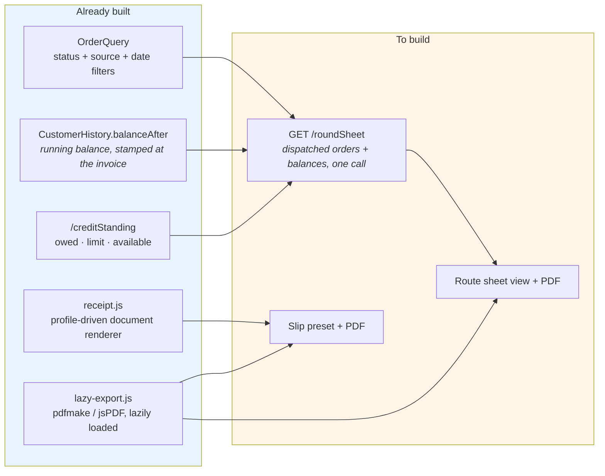

# OMS O8 — the two documents a delivery round runs on

**Status:** slices 1–5 IMPLEMENTED · 1–4 gated green · slice 5 awaiting its gate run
**Driven by:** Shafeeq Medicine (Mr. Javed), and by the marked-up *Net Sales Summary* they supplied
**Depends on:** O7 D1–D5 (book → review → dispatch → deliver → settle), all shipped

---

## 1. What the client actually gave us

Two photographs, and only one of them was an invoice.

The second was a **Net Sales Summary, 23–25 Jul, page 1 of 2** — 29 invoices in a list, columns
`Sr · Date · Ref No · Account Name · Discount · Amount`, and a right-hand margin covered in **handwriting**:
`CR` against some rows, amounts against others — `11362`, `1820`, `3145`, `CB 12630`, `R-168`.

The client explained it: the salesman writes it. `CR` means the shop took the goods on credit and paid
nothing; a number is what he received.

**That margin is the requirement.** The system prints a list; a human turns it into the day's cash record with
a pen; and the office keys it back in. The two documents below simply replace the pen with printed columns.

## 2. The two documents

| | **A · Route sheet** | **B · Per-stop slip** |
|---|---|---|
| Scope | The whole round — every dispatched order | One order |
| Who holds it | The salesman, then the cashier | Left with the shop |
| Purpose | Recovery + cash-up | Proof of delivery |
| Copies | One | One per stop |
| Is it a tax document? | No | **No** — a delivery challan |

### Why B is a challan and not a second invoice

One sale, one taxable document. A slip that looks like an invoice creates a second record of the same supply —
duplicate tax entries and an argument about which one is real. It carries the invoice number, so the shop can
match it, and says *Delivery Challan* on its face.

## 3. The column decisions

The client delegated both of these to "industry standard". Here is what I have chosen and why.

### A · Route sheet — show the delivery AND the debt

A recovery run is two jobs at once: dropping new goods *and* collecting old money. So neither figure alone is
enough — invoice value only, and the salesman cannot collect arrears; outstanding only, and he cannot check
the delivery he is handing over.

```
Sr │ Invoice No │ Account (name ~ area) │ Invoice │ Previous │ Total Due │ Received │ Balance │ Sign
                                          Amount    Balance                (blank)   (blank)  (blank)
```

The three blank columns are the handwriting, printed. The client's own invoice already carries **Previous
Balance / Current Balance**, so this is their vocabulary, not an import.

**Foot of the sheet — the control total**, which the sample does not have:

```
Stops: 29     Invoice value: 138,402.55     Total due: 214,880.10
Received: __________   Balance: __________   Salesman: __________   Cashier: __________
```

Without a control total there is nothing to reconcile the cash bag against. On a one-person back office —
where the approval gate is off and segregation of duties has gone — **this total is the only remaining
control**. It is the most important thing on either document.

### B · Per-stop slip — prices YES, and batch/expiry

- **Prices**, because the shop must be able to check what it is being charged *before* signing, and because
  the same salesman is collecting the cash and needs the figure.
- **Batch and expiry per line**, because these are pharmaceutical goods and traceability for a recall is a
  regulatory obligation, not a nicety. The client's own invoice already prints both.
- **A receiver block** — name, signature, date, and a CNIC line — which is what turns the slip from a packing
  list into proof of delivery.
- **Received / Balance boxes**, so a part payment is recorded at the door where it happened.

One nuance for the record: some distributors deliberately omit prices from the van copy to keep pricing
confidential from staff. That does not apply here, because the person carrying it is the person collecting.

## 4. What we already have, and what is missing



**Nothing downloads today.** Printing goes through a hidden iframe to `window.print()`; there is no PDF path
in the back office at all. `lazy-export.js` already loads pdfmake on demand for the grid exports, so the
capability exists — it has simply never been pointed at a document.

## 5. Slices

Each is separately gateable. 1 and 2 are the ones the client is waiting on.

| # | Slice | Touches | Gate |
|---|---|---|---|
| **1** | `GET /roundSheet` — one call returning the day's dispatched orders with each outlet's previous balance and total due | marketplace read + business `creditStanding` batch | figures match `/creditStanding` per outlet; org-scoped; anti-IDOR |
| **2** | Route sheet **view** + **PDF download**, with control totals | new screen + `lazy-export` | totals equal the sum of the rows; a nil-collection stop still appears |
| **3** | Per-stop slip as a **document profile** — reuses `receipt.js`, no second renderer | `receipt.js` preset + `DocumentProfileValidator` | batch/expiry/discount render; says *Delivery Challan*; carries the invoice number |
| **4** | Slip **PDF download** | `lazy-export` | same bytes as the printed view |
| **5** | Key the round back in **from the sheet** — one screen, all stops | delivery + settlement | ties to slice 2's control total |

### Why slice 1 is a single endpoint and not a per-row lookup

A 29-stop round needs 29 outstanding balances. Fetching them one at a time is 29 round trips to build one
sheet, on the screen a cashier uses at the end of every day. One call returns the lot — the same reason the
booking screen now pulls `/productStockLevels` once instead of per product pick.

## 6. Two things this design deliberately does not do

**It does not add an Area field yet.** The client encodes area inside the account name —
`1284 ~ LABAIK PHARMACY ~ ZAHIR PER ~ CREDIT` — and the sheet can group on the customer's address for now.
Area is a real dimension they route and assign by and it deserves a column on `Customer`, but making it one is
a data-migration question for its own slice, not something to bury in a print job.

**~~It does not fix the nil-collection settlement refusal.~~ FIXED in slice 5.** Settling a batch containing a
stop that paid nothing was refused — *"A positive amount is required"* — so the cashier had to know to exclude
exactly the rows that paid nothing. The refusal is CORRECT where it lives (a receipt for zero is not a
receipt); what was wrong was sending it one. `DriverSettlementService` now counts a nil stop in the settlement
and raises no receipt for it, and only requires a trade account when there is money to credit.

## 7. Slice 5 as built

One request per round: `POST /roundSheet/key` → `RoundKeyingService`, a **facade** over
`DeliveryService.record` and `DriverSettlementService.settle` that adds no money logic of its own. Deliveries
are recorded first and the settlement raised once at the end, because settling is all-or-nothing over the
collections it is handed.

| Decision | Why |
|---|---|
| Partial success is **reported**, not thrown | 29 stops; refusing the batch over one shop leaves the operator unable to key the other 28, and blind to which one failed |
| Re-running is **harmless** | An already-delivered stop is skipped with a reason. It is one button over 29 stops — an operator who is unsure will press it again |
| A blank line is sent as **zero**, not omitted | A blank means "CR" — the shop paid nothing. Dropping those rows would settle a different set of stops than the sheet lists |
| The counted amount is **never** derived from the declarations | The difference between them IS the variance; deriving it would guarantee zero |
| **No returns column** | The sheet has none. A stop with goods back is keyed on that order individually, and the round keying then finds it delivered and skips it. Inferring a return from a short payment would invent a credit note nobody wrote |

Two gaps closed on the way, both of which would have shipped silently:

- **`DeliveryDTO` had no `id`.** `record()` created a resource and did not say which one, so the only way to
  settle a collection you had just keyed was to re-read every delivery on the order and match.
- **`RoundSheetDTO.Stop` had no `orderId`.** The printed sheet does not need it — a shopkeeper matches on the
  invoice number — but the screen the marked-up sheet is typed into has nothing to post against without it.
