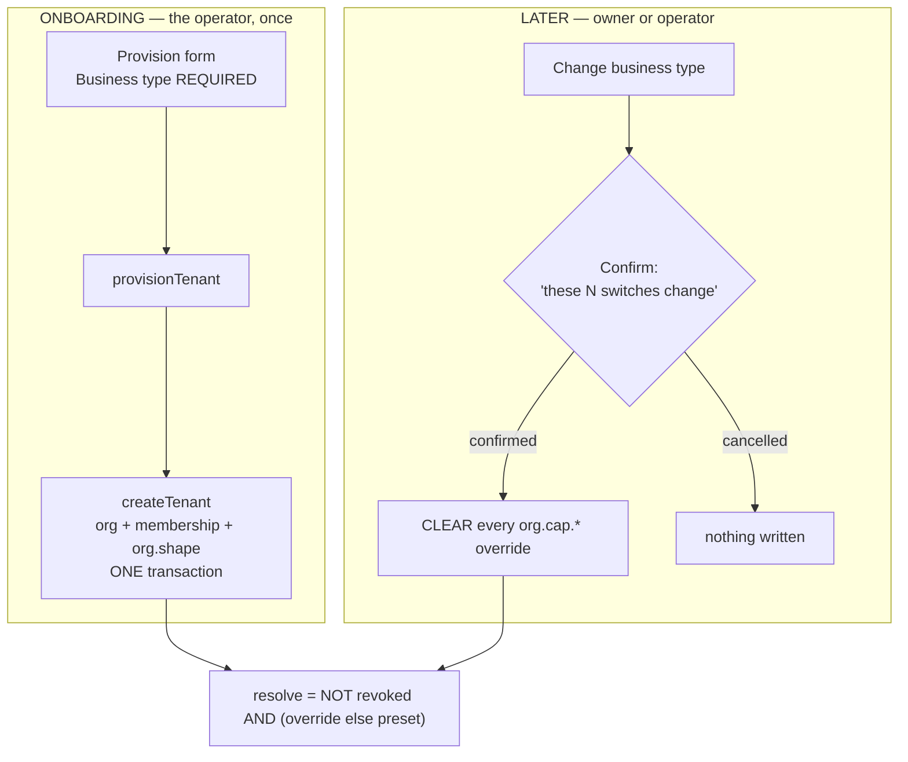

# ONB-1 — the business type at onboarding

**Status:** DESIGN. Gate written before the implementation, per `SAAS-BUILD-STANDARDS.md`.
**Raised:** 2026-09-02, from the owner logging in as `owner.pesticide@` and finding **Installment plans** and
**serial/IMEI** on a pesticide dealer's screens.
**Builds on:** [`capability-platform-design.md`](../capability-platform-design.md) (C4 shapes — shipped) ·
[`vertical-profile-any-business-design.md`](../vertical-profile-any-business-design.md) (this is the missing
half of VP-2) · [`e2-operator-portal-design.md`](e2-operator-portal-design.md) (the provisioning form).

**Rulings taken** (owner, 2026-09-02): the business type is **mandatory** at provisioning · changing it later
**re-applies the preset**, behind a **confirmation** that says what will change.

---

## 1. The defect, on evidence

`owner.pesticide@myplus.com` — organization 45, read from the Docker MySQL on 2026-09-02:

```
org.shape              = general        ← GENERAL presets EVERY capability ON
org.cap.*              = NULL × 13      ← no overrides, so the preset decides
org.cap.rxRequired     = true           ← leftover from capability-shapes.cy.js
```

So a pesticide dealer sees installments, serial/IMEI and condition grading. **Nothing is broken** — the tenant
was never told what kind of business it is.

### Why every onboarded customer has this

`AuthService.provisionTenant` → `OrganizationService.createTenant` writes the organization and the OWNER
membership, and **no `org.shape` row**. `Shape.byCode(null)` returns `GENERAL`, whose preset is every
capability. So **every customer onboarded through E2's form gets the whole product**, whatever trade they are
in.

The mechanism to prevent this shipped in C4 and is green — `Shape.PHARMACY` presets `batchTracking ·
expiryTracking · fefoAllocation · looseSelling · rxRequired` and excludes installments, serial tracking and
condition grading. **Onboarding simply never joined up to it.** Two slices built the halves and nothing
connected them, which is the same class of gap as *a slice is not done until something calls it*.

### And a second cause, which is why a manual fix does not stick

`capability-shapes.cy.js`'s `after()` resets **both** `owner.mobile@` and `owner.pesticide@` to `general`. Every
suite run puts the demo tenants back to looking like everything-on. Correcting the shape by hand is undone by
the next green run.

---

## 2. Benchmark, before the decision (standard 7a)

| System | How it onboards | Taken / different |
|---|---|---|
| **Shopify** | Asks *"what do you sell?"* during setup and tailors the admin from the answer | **Taken.** The question is asked once, at the start, by the person who knows the answer |
| **Xero / QuickBooks** | Industry chosen at company setup; drives the chart of accounts and which features appear | **Taken** — and note both make it **required**, not a skippable step |
| **Salesforce** | Ships everything; an admin hides what they do not want, afterwards | **Rejected.** That is exactly today's behaviour and exactly the complaint: the customer meets the whole product and has to subtract |
| **Stripe** | Business type at account creation; changing it later is an explicit, confirmed action | **Taken, including the confirmation** — see §3 |

**Where the benchmark changed the answer.** The first sketch made the field optional with a `general` default,
because a required field is friction on an onboarding form. Xero and QuickBooks both make it mandatory, and the
reason is the one that matters here: *"everything on" is never the right answer for a real business*, so an
optional field is a field that gets skipped and the defect returns for the next customer.

---

## 3. Re-applying the preset — a deliberate reversal of a C4 rule

C4 is explicit, in `Shape`'s own javadoc:

> *"It never has the last word — an explicit tenant override always wins. Without that rule, choosing
> 'Pharmacy' would silently destroy deliberate choices and the only safe advice would be 'never change your
> profile', which is not a setting, it is a trap."*

**That rule is now reversed on the write path, and the confirmation is why it is safe.** The whole objection was
the word *silently*. A dialog that names what will change removes it. What C4 was protecting against was a
setting that betrayed the user; what it produced instead was a shape change that appeared to do nothing —
which is its own kind of trap, and the one the owner actually hit.

### How it is implemented, and why this way

**Re-apply = CLEAR every `org.cap.*` override for that tenant.** Not "write thirteen rows from the preset".

| | Clear the overrides | Write the preset as rows |
|---|---|---|
| `CapabilityService.resolve` | **unchanged** — override else preset, exactly as documented | unchanged, but every capability is now an override forever |
| Rows left behind | none | 13 per tenant per shape change |
| The next shape change | works identically | must clear them first anyway, so this path is needed regardless |
| Entitlement ceiling (E1) | still bounds everything — `revoked` is consulted after | same |

Clearing is strictly simpler and it preserves the resolution order **as written and as documented**. It is also
already proven: `cy.clearCapabilityOverrides()` does exactly this, and the mechanism — writing the key with the
value parameter **absent** so the row stores NULL — is what makes `overrideFor` return `Optional.empty()` and
hand the decision back to the preset.

⚠ **An empty string is not the same as absent.** `value=''` stores `""`, and `resolve` reads
`"true".equalsIgnoreCase("")` as **false** — switching everything OFF while looking like a reset. The parameter
must be omitted.

### The entitlement ceiling still wins

Re-applying a preset can only restore what the tenant is **entitled** to: clearing an override writes nothing,
so `revoked` still bounds the answer. A `retail` tenant on `FREE` does not acquire installments by picking a
shape.

---

## 4. Design



### New and changed artefacts

| Where | Artefact | New/changed |
|---|---|---|
| `auth-service` | `ProvisionTenantRequest` — `shape`, `@NotBlank` | changed |
| `auth-service` | `AuthService.provisionTenant` — validate against `Shape`, pass down | changed |
| `auth-service` | `OrganizationService.createTenant` — write `org.shape` in the **same transaction** | changed |
| `auth-service` | `SetupDataLoader` — seed `owner.mobile@`=`retail`, `owner.pesticide@`=`pharmacy` | changed |
| `auth-service` | `EntitlementAdminController` — `POST /admin/organizations/{id}/shape` | changed |
| `auth-service` | `OrganizationAdminService.changeShape(...)` — clears overrides; reason required | changed |
| `auth-service` | `OrganizationAdminService.search` — return `shape` on each row | changed |
| monolith | `PlatformAdminController` — `POST /platform/shape` | changed |
| monolith | `platform.js` — business-type control on provision + detail, with the confirmation | changed |
| monolith | `business.js` — `saveBusinessConfigToggle` confirms on `org.shape` and clears | changed |
| monolith | `messages*.properties` × 6 | changed |
| cypress | `e2e/platform/onboarding-profile.cy.js` | new |
| cypress | `e2e/business/capability-shapes.cy.js` — `after()` restores the **seeded** shape | changed |

### Why the seed changes too

`owner.mobile@` and `owner.pesticide@` exist to be a mobile shop and an agri-chem counter — the capability
design says so in the comment that introduces them. Seeding them as `general` means they have never actually
looked like the businesses they represent, in a demo or in a test. Seeding the real shapes, and having
`capability-shapes.cy.js` restore *that* rather than `general`, fixes the demo state and stops the suite
undoing a manual correction.

---

## 5. Performance (standard 7c)

Nothing on a hot path. Provisioning gains one insert inside a transaction that already writes two rows. A shape
change is one delete-by-prefix plus a cache invalidation, both operator-frequency. **A tenant that never
changes its shape pays nothing.**

---

## 6. Security (standard 7d)

* **The shape is validated against the `Shape` enum at both writes.** It is a settings value, so an unknown
  string would otherwise resolve permissively to `GENERAL` — turning a typo into "show this customer
  everything", which is the defect this slice exists to close.
* **Clearing overrides cannot grant anything.** It removes rows; the entitlement ceiling and the preset then
  decide. There is no path here that switches on a capability the tenant is not entitled to.
* **The operator endpoint is `ROLE_ADMIN`**, like every other control-plane write; the tenant's own change is
  owner/admin-gated by the existing settings controller.
* **`reason` required on the operator path**, consistent with plan, status and entitlement writes, so E4 stays
  a listener.

---

## 7. UI/UX — the confirmation is the feature

A generic *"Are you sure?"* would fail the whole purpose. The dialog names the damage:

```
┌ Change business type to Pharmacy / dispensing? ───────────────┐
│                                                               │
│  This resets the switches under "What this business does"     │
│  to the defaults for a pharmacy.                              │
│                                                               │
│  Turning OFF:  Sell on installments · Track serial / IMEI     │
│  Turning ON:   Track expiry dates · Sell nearest-expiry first │
│                                                               │
│  Reason  [                                              ]     │
│                          [ Cancel ]  [ Change type ]          │
└───────────────────────────────────────────────────────────────┘
```

* The two lists are computed from the **current effective map** against the **target preset**, so they are true
  for this tenant rather than generic prose.
* When nothing would change, the dialog says so instead of listing empty columns.
* On the provisioning form the control is a plain required select with helper text — there is nothing to
  destroy yet, so no confirmation.
* Labels come from `Shape.label()`, already written for a shopkeeper, and reach the browser through `ui.js.*`.

---

## 8. The gate — `cypress/e2e/platform/onboarding-profile.cy.js`

| # | Case | The regression it guards |
|---|---|---|
| 1 | ⭐ A tenant provisioned as `pharmacy` has installments and serial tracking **OFF** on its first login | the defect, end to end — this is the case the owner reported |
| 2 | ⭐ Provisioning **without** a business type is refused | ruling 1; an optional field is a skipped field |
| 3 | An unknown business type is refused | a typo must not resolve to `GENERAL` = show everything |
| 4 | A tenant provisioned as `retail` **does** have installments | positive control — a build that switched everything off would pass case 1 |
| 5 | ⭐ Changing the shape re-applies the preset: a capability the owner had switched on, and which the new shape excludes, goes **off** | ruling 2, the reversal |
| 6 | The change is **refused without a reason** | consistent with every other control-plane write |
| 7 | ⭐ Re-applying cannot grant an **unentitled** capability | §3 — the ceiling still wins |
| 8 | The seeded `owner.pesticide@` resolves as `pharmacy`, with installments and serial **off** | the demo state, and the thing the owner will look at first |
| 9 | The business-type control renders on the provision form | a screen assertion — an API-only gate passes with no UI |

---

## 9. Out of scope

* **Re-labelling** (`org.profile.labels` — VP-3). Shapes decide *which* capabilities; wording is a separate
  slice.
* **Changing `Organization.type`.** Still free text, still only routing; the shape is the axis that matters
  here and conflating them is what `vertical-profile-any-business-design.md` §3c warns against.
* **New shapes.** Five exist. A pesticide dealer is `pharmacy`; a mobile shop is `retail` plus capabilities.
  Adding a shape named after a customer's trade is the failure the whole design prevents.
