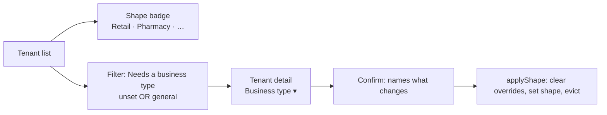

# ONB-2 — assign a business type, and stop showing the wrong trade

**Status:** ✅ **SHIPPED AND GREEN** (2026-09-03). Gate written before the implementation.
`capability-fields.cy.js`, `installments-visible.cy.js` and `assign-business-type.cy.js` all green, with the
platform suite re-run alongside. Manual cases: §2, §5 and §10 of the **MyPlus Test Book**.
**Analysis:** [`onb-2-assign-business-type-analysis.md`](onb-2-assign-business-type-analysis.md) ·
[`onb-3-mobile-shop-requirements-analysis.md`](onb-3-mobile-shop-requirements-analysis.md) — read first.
**Follows:** [`onb-1-business-type-at-onboarding.md`](onb-1-business-type-at-onboarding.md).

**Decisions taken** (owner): `general` stays selectable, renamed **"General — show every feature"**, and counts
toward "needs attention" · bulk assign is **not** in this slice · reassignment is allowed with warnings (ONB-3).

**Scope:** the three items that make the 39 existing tenants fixable, plus one shipped defect. Deliberately
**not** the Shahzad migration safety net (preview counts, cleanup list, record-previous-overrides) — that is
ONB-3, and it is the prerequisite for bulk assign.

---

## 1. What this slice fixes

| | Symptom you reported | Cause | Fix |
|---|---|---|---|
| **A** | *"POS/retail login shows pharmacy things"* | 39 of 41 orgs resolve to GENERAL = every capability | make them **visible and correctable** (§4) |
| **B** | *"purchase form shows Batch # for a mobile shop"* | **20 capability-specific FIELDS have no `data-capability`** | gate them (§3) |
| **C** | — | `installmentsDue` tile is capability-gated, so withdrawn capability hides **money already owed** | reads stop being gated (§5) |

A and B are the same complaint at two altitudes: **A** is "this tenant was never asked what it is"; **B** is
"even a tenant that *was* asked still sees the wrong fields". Fixing A alone would have left Shahzad seeing
Batch # on every purchase.

---

## 2. Benchmark, before the decision (standard 7a)

| System | What it does | Taken / different |
|---|---|---|
| **Xero** | Industry chosen at setup; the chart of accounts and the *forms* follow — you do not see fields for a trade you are not in | **Taken.** §3 is exactly this: the capability decides the FIELD, not only the menu |
| **Shopify** | Admin surfaces adjust to what the store sells; a store without variants never meets a variant field | **Taken** |
| **Salesforce** | Page layouts per profile, edited by an admin field-by-field | **Rejected.** A layout builder is a second configuration system beside capabilities. `data-capability` already expresses this in one attribute |
| **Stripe Dashboard** | Account list carries the state you act on — no drilling in to learn what a row is | **Taken** — §4's shape badge and filter |

**Where the benchmark changed the answer.** The first sketch hid whole *sections* for a wrong-trade tenant,
which is what `[data-capability]` already does at section level. Xero's behaviour made the gap obvious: the
complaint is about a **field inside a section the tenant legitimately uses**. A mobile shop absolutely has a
purchase form; it just has no batches. Section-level gating cannot express that, and 20 fields prove it was
never tried.

---

## 3. The field sweep — the finding that generalises

A scripted scan of `businessDashboard.html` for capability-specific fields **with no gate on the element or
within five lines above it** returned **20**. Triaged:

| Field(s) | Gate | Why |
|---|---|---|
| `purchaseBatchNo` (label, input, grid column) | `batchTracking` | a mobile shop has no batches — **the reported complaint** |
| `purchaseExpiry` (label, input, grid column) | `expiryTracking` | nor expiry dates |
| `sellBatchNo` ("New Batch") | `batchTracking` | |
| `bexpDate` ("Expiry") | `expiryTracking` | |
| `prodLooseWrap`, `prodLooseUnit`, `prodLooseUnitPlural` | `looseSelling` | part-pack fields on the product form |
| `prodAllowLoose` | `looseSelling` | |
| `clRx` (prescription required) | `rxRequired` | a hardware shop cannot mark a product prescription-only |

**`customerLicenseExpiry` is deliberately NOT gated** — a customer's *trade licence* expiry has nothing to do
with `expiryTracking`, which is about stock. The scan flagged it on the word "expiry" and it is a false
positive. Recorded here because the next person running this scan will hit it too.

⚠ **`prodLooseWrap` carries `style="display:none"` and is toggled by JS.** `.cap-off` uses
`display:none !important` **deliberately** so it wins over inline styles — documented in the capability design
after `module-theme.js` fought exactly this. Adding the attribute is correct and the JS toggle resumes control
when the capability is on.

**This is a section-vs-field gap, not twenty mistakes.** The 34 existing `data-capability` attributes are all on
sections and nav items. Nobody had gated a field inside a shared form. Worth stating as a rule so the next form
does not repeat it: *if a field only makes sense for one capability, it carries the attribute — being inside a
section everyone uses is not a reason to skip it.*

---

## 4. Making the 39 correctable

* **2a — the shape badge** sits beside the plan badge. `search()` already returns `shape`; the row simply never
  rendered it, so an operator could not tell org 20 from org 44 without opening both.
* **2b — the filter.** One control, three states: *All* · **Needs a business type** · *Assigned*. "Needs" counts
  `shapeSet === false` **or** `shape === 'general'` — per the ruling, `general` is a legitimate answer and an
  unanswered question, and only the operator can tell which. The count is the worklist's finish line.
* **2c — fixture shapes enforced.** `SetupDataLoader.ensureShape` currently skips when a row exists, so
  `owner.pesticide@` sits on `general` and is never corrected. A fixture's shape is part of its definition and
  the loader is self-healing by contract; it should overwrite. **Dev fixtures only** — this touches no real
  tenant, and `fixturesAllowed()` already hard-blocks it under the prod profile.
* **The rename.** `Shape.GENERAL`'s label becomes **"General — show every feature"**, in the enum, so the
  operator console and the tenant's own Configuration screen both say it. One source, both screens.

---

## 5. The defect: a capability must never hide money already owed

`BusinessDashboardController:179` gates `installmentsDue` on the capability. `InstallmentController`'s seven
endpoints do not gate at all — deliberately and correctly, because a customer's debt does not evaporate when a
shop changes trade.

So the two halves disagree: the debt stays collectable and **leaves the dashboard**. A shop that switches away
from installments stops being reminded of money it is owed.

**The rule, stated so it does not recur:** a capability governs what a tenant may **do next**, never what they
may **see about what they have already done**. Applied here: drop the gate on the stat. The tile itself keeps
its `data-capability`, so a tenant that never sold on terms sees nothing — but a tenant with open plans keeps
its number whatever its capability now says.

> This is the counterpart to C5's rule that a hidden tile must not fetch its data. Both are about the tile and
> the query agreeing; they disagree in opposite directions, and this is the direction that costs money.

---

## 6. Artefacts

| Where | Artefact | New/changed |
|---|---|---|
| `common-settings` | `Shape.GENERAL` label → "General — show every feature" | changed |
| `auth-service` | `SetupDataLoader.ensureShape` — enforce, not skip | changed |
| `business-service` | `BusinessDashboardController` — ungate the `installmentsDue` stat | changed |
| monolith | `businessDashboard.html` — `data-capability` on 9 field groups | changed |
| monolith | `platform.js` / `platform.css` — shape badge, filter control | changed |
| monolith | `messages*.properties` × 6 | changed |
| cypress | `e2e/platform/assign-business-type.cy.js` | new |
| cypress | `e2e/business/capability-fields.cy.js` | new |

---

## 7. Performance, security, UI/UX

**Performance.** The filter is a query parameter on a query that already runs; the badge renders a field already
in the payload. Ungating the installment stat *adds* one count query for tenants that previously skipped it —
`countOpenForOrg`, indexed, on a screen that already issues several. Field gating is client-side and costs
nothing.

**Security.** No new endpoint, no new authority. The field gates are **rendering only** — every write behind them
is already refused server-side by `assertEnabled`, which is the half that matters and is unchanged.

**UI/UX.** The filter is a segmented control, not a dropdown: three states, one click, current state visible
without opening anything. The badge uses the same vocabulary as the tenant's own Configuration screen, so an
operator and an owner describing the same tenant on the phone use the same word.

---

## 8. The gate

### `cypress/e2e/platform/assign-business-type.cy.js`

| # | Case | Guards |
|---|---|---|
| 1 | The shape shows **on the row** | 2a — an operator can scan the list |
| 2 | "Needs a business type" filters to unset **and** `general` | 2b + the ruling |
| 3 | The count matches the rows returned | a filter that lies is worse than none |
| 4 | Assigning from the console clears the badge and the tenant leaves the filter | the worklist empties |
| 5 | "General — show every feature" is the label on **both** screens | the rename, in one place |

### `cypress/e2e/business/capability-fields.cy.js`

| # | Case | Guards |
|---|---|---|
| 6 | ⭐ A `retail` tenant's purchase form shows **no Batch #, no Expiry** | the reported complaint |
| 7 | ⭐ A `pharmacy` tenant's purchase form **does** show both | positive control — a build hiding them from everyone would pass 6 |
| 8 | Loose-selling fields hidden for retail, shown for pharmacy | the same rule on the product form |
| 9 | The prescription checkbox is hidden without `rxRequired` | |
| 10 | `customerLicenseExpiry` stays visible for **both** | the false positive — a trade licence is not stock expiry |

### `cypress/e2e/business/installments-visible.cy.js`

| # | Case | Guards |
|---|---|---|
| 11 | ⭐ With `installments` OFF and an open plan, `installmentsDue` is **still returned** | §5 — the defect |
| 12 | A tenant with no plans still gets no number | not a blanket "always show" |

---

## 9. Delivery note — the gate caught a half-fix

Case 6 failed on the first run, and **not on a selector**: I had gated the *label* for Expire Date and not the
input's column. A retail tenant would have seen an **unlabelled date box** — worse than the complaint that
started the slice, because nothing left on screen would say what it was for. `purchaseBatchNo` had both halves;
`purchaseExpiry` had one.

The case now asserts **both halves of both fields**, so a half-gate cannot pass again.

Two smaller things fixed on the way:

* **The purchase form is a modal.** `#PurchaseModal` is `display:none` until `newPurchase()` opens it, so the
  spec's first version failed on the overlay rather than on the gate. It now navigates and opens the form the
  way an operator does — a gate proven on a screen nobody can reach proves nothing.
* **An assertion that could not fail.** Cases 8–10 target fields in *other* modals, closed at rest, so
  `not.be.visible` passed because the overlay was hidden — and would have kept passing with the gate deleted
  entirely. Split into `gatedOff` (the `.cap-off` class, valid anywhere) and `hidden` (class **and**
  invisibility, only where the container is open).

> The pattern in all three: an assertion that happens to be true is not the same as an assertion that would
> notice if the thing under test disappeared.
