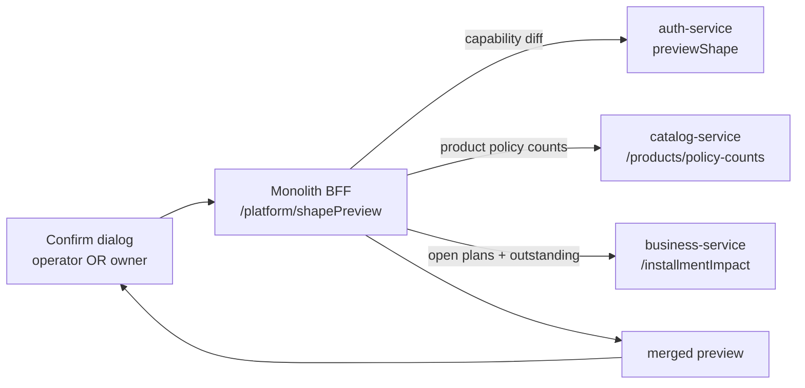

# ONB-3 — making a business-type change safe: design

**Status:** IMPLEMENTED, awaiting the headed gate. Gate written before the implementation, per
`SAAS-BUILD-STANDARDS.md`.
**Analysis:** [`onb-3-migration-safety-analysis.md`](onb-3-migration-safety-analysis.md) — read first; every
count below is a query that already works.
**Follows:** [`onb-2-assign-business-type-design.md`](onb-2-assign-business-type-design.md) ✅ green.

**Answers taken** (owner, "go with recommended"): Undo is a **record now, button later** · the cleanup list is
shown **immediately and stays reachable** · **no threshold block** — the counts are the warning · both the
operator console **and** the tenant's own Configuration screen get the preview.

---

## 1. What this slice makes true

> Nobody changes a business type without being told, in numbers, what it will stop working — and nothing is
> lost silently when they do.

Three parts: the preview **counts data**, the switch **records what it cleared**, and the aftermath has a
**cleanup list** instead of a support call.

---

## 2. The architectural decision this slice turns on

The counts live in three different services:

| Fact | Owner |
|---|---|
| capability diff (turning on / off) | **auth-service** — already implemented |
| products requiring a serial · tracking a batch | **catalog-service** |
| open installment plans · outstanding | **business-service** |

**auth-service must not learn to call catalog or business.** It is the identity service; a repo-wide grep
confirms it holds no client to either, and giving it one to answer a dialog would invert the dependency that
every other slice has been careful about — auth is depended *upon*, it does not depend outward.

**So the monolith BFF assembles the preview**, which is exactly what a Backend-for-Frontend is for and the
shape `PlatformAdminController` already has:



**Three calls on a cold path**, made when a person opens a dialog. Not one of them is on the sale path, and a
tenant that never changes its type makes none of them. Each is independently failure-tolerant: a count that
cannot be fetched is **omitted from the dialog rather than blocking it** — a preview that refuses to open would
stop a legitimate switch, which is the opposite of the point.

---

## 3. The pattern, named (standard 7b)

* **Backend for Frontend, composing.** The BFF's job here is genuinely composition, not proxying — three
  sources, one answer. **SOLID consequence:** each service keeps a count of its own data and knows nothing
  about business types.
* **Memento for the undo.** `org_shape_history` captures the state needed to restore, separate from the object
  that changed. It is not an audit log: an audit answers *what happened*, a memento answers *what to put back*.
* **Command with a compensating record.** `applyShape` writes the memento **before** clearing, in the same
  transaction — so a switch either records what it destroyed or does not destroy it.

---

## 4. Design

### 4a. The preview payload

```
GET /platform/shapePreview?organizationId=44&shape=pharmacy

{ "shape": "pharmacy",
  "turningOn":  ["Track expiry dates", "Sell nearest-expiry stock first", …],
  "turningOff": ["Sell on installments", "Track individual serial / IMEI numbers", …],
  "impact": {
    "productsRequiringSerial": 19,      // become unsellable when serialTracking goes off
    "productsTrackingBatch":    0,      // stock with nothing for FEFO to sort on
    "openInstallmentPlans":   206,
    "installmentsOutstanding": 7716000  // still collectable; leaves the dashboard tile
  } }
```

**`impact` is only populated for capabilities actually changing.** Counting serial products for a switch that
leaves `serialTracking` on would produce a scary number about nothing — the dialog must warn about
*consequences*, not inventory.

### 4b. The two new count endpoints

```
GET /api/catalog/products/policy-counts?organizationId=44     operator, or self
    → { requiresSerial: 19, tracksBatch: 0, total: 304 }

GET /api/business/installmentImpact?organizationId=44         operator, or self
    → { openPlans: 206, outstanding: 7716000 }
```

The outstanding figure needs **no new schema** — the analysis confirmed it:

```sql
SUM(i.amount - COALESCE(i.paid_amount, 0))
  WHERE p.status = 'ACTIVE' AND i.amount > COALESCE(i.paid_amount, 0)
```

### ⚠ The one rule both endpoints obey: an org parameter is honoured ONLY for a platform operator

Both take an `organizationId` and both would be a cross-tenant read without a rule about it — somebody's
catalogue, somebody's debtor book. But **neither can do without the parameter**, because the BFF calls
downstream with the *operator's own token*: an endpoint reading only the token's org would answer the
confirmation dialog with the operator's figures under the tenant's name. That is a wrong number rather than an
error, and a wrong number in a dialog whose whole purpose is to be trusted is worse than no dialog.

So the rule lives once, in `common-security`:

```java
CurrentUser.organizationIdFor(requested)   // requested only for ROLE_ADMIN, else the caller's own
CurrentUser.scopeUserIdFor(org)            // null when reading someone else's org — see below
```

* **Ignored, not rejected.** A tenant probing with `?organizationId=13` silently gets its own answer and
  learns nothing, not even whether 13 exists.
* **`ROLE_ADMIN`, never `ADMIN_PRIVILEGE`.** Every tenant owner holds the privilege inside their own org; only
  the platform operator holds the role. `AuthService` already draws the line in that exact place.
* **`scopeUserIdFor` exists because the scope clause has a second half.** Every scoped read is
  `organizationId = :orgId OR (organizationId IS NULL AND userId = :userId)` — the fallback that keeps a
  tenant's pre-tenancy rows visible. Passing the *operator's* user id to a query about tenant 44 would fold
  the operator's own orphan rows into that tenant's count. `null` never matches, which is the intent.
* **`clear-tracking-flags` is why this is not a nicety.** It is a **write**. Without the rule, one query
  parameter lets any tenant owner clear another shop's serial policy.

The BFF stays `ROLE_ADMIN`-gated as well: the service-side rule is the one that must hold if a call ever
arrives another way.

### 4c. `org_shape_history` — the memento

```sql
CREATE TABLE org_shape_history (
    id                  BIGINT NOT NULL AUTO_INCREMENT,
    organization_id     BIGINT NOT NULL,
    changed_at          DATETIME NOT NULL,
    changed_by          BIGINT NULL,
    previous_shape      VARCHAR(40) NULL,      -- NULL = never had one
    new_shape           VARCHAR(40) NOT NULL,
    previous_overrides  TEXT NULL,             -- JSON snapshot of the cleared org.cap.* rows
    reason              VARCHAR(255) NULL,
    PRIMARY KEY (id),
    KEY ix_org_shape_history_org (organization_id, changed_at)
);
```

**Why JSON here, against this codebase's habit.** The payload is *"the key/value rows that existed at an
instant"* — never queried by key, never joined, never aggregated. It is a snapshot, which is the one shape JSON
is genuinely right for. `SAAS-BUILD-STANDARDS.md` §4a rejected JSON for entitlement *status, dates and source*
— facts that must be queryable. This is not those.

**Written before the clear, in the same transaction.** A switch either records what it destroyed or does not
destroy it.

### 4d. The cleanup list

```
GET  /api/catalog/products/policy-conflicts?organizationId=44&capability=serialTracking
     → the products whose policy the tenant may no longer honour
POST /api/catalog/products/clear-tracking-flags   { organizationId, capability }
```

⚠ **Clear only.** The endpoint can remove `requires_serial` / `tracks_batch`; it can never set one. That keeps
C6's rule intact — a tenant without the capability may not *set* a product policy, only remove one — and it is
what makes the endpoint safe to expose without the capability the tenant just lost.

### 4e. Artefacts

| Where | Artefact | New/changed |
|---|---|---|
| `common-security` | `CurrentUser.isPlatformOperator` / `organizationIdFor` / `scopeUserIdFor` | new |
| `auth-service` | `V9__org_shape_history.sql`, `OrgShapeHistory` + repo | new |
| `auth-service` | `applyShape` — snapshot before clearing | changed |
| `catalog-service` | `/products/policy-counts`, `/products/policy-conflicts`, `/products/clear-tracking-flags` | new |
| `business-service` | `/installmentImpact` + the outstanding aggregate | new |
| monolith | `PlatformAdminController.previewShape` — compose three sources | changed |
| monolith | `BusinessConfigController.getBusinessShapePreview` — same composition for the tenant | changed |
| monolith | `platform.js` / `business.js` — render `impact` in the dialog | changed |
| monolith | `platform.js` — the cleanup PANEL on the tenant detail (`#platConflicts`) | changed |
| monolith | `messages*.properties` × 6 — `ui.js.impact*` plus the cleanup list's six keys | changed |
| cypress | `e2e/platform/migration-safety.cy.js` | new |

---

## 5. UI/UX — the dialog earns its confirmation

```
┌ Change business type to Pharmacy / dispensing? ─────────────────┐
│  Turning OFF   Sell on installments · Track serial / IMEI       │
│  Turning ON    Track expiry dates · Sell nearest-expiry first   │
│                                                                 │
│  ⚠ 19 products require a serial number and will stop selling.   │
│    206 open installment plans (₨ 7,716,000) stay collectable.   │
│    0 products have a batch — expiry ordering has nothing to     │
│    sort on until batches are recorded.                          │
│                                                                 │
│  Reason  [                                              ]       │
│                            [ Cancel ]  [ Change type ]          │
└─────────────────────────────────────────────────────────────────┘
```

* **Numbers, not adjectives.** "19 products" is actionable; "some products may be affected" is not.
* **The consequence, not the mechanism.** *"will stop selling"*, not *"assertEnabled will refuse"*.
* **Nothing to warn about → nothing shown.** A dialog that always warns is one nobody reads.
* After the switch, a **"19 products need attention"** panel with **Clear serial requirement on all 19** — and
  it stays reachable from the tenant detail, so walking away is not the only route to unsellable stock.

---

## 6. The gate — `cypress/e2e/platform/migration-safety.cy.js`

| # | Case | Guards |
|---|---|---|
| 1 | ⭐ Preview for a tenant with serial-tracked products counts them | the whole point |
| 2 | ⭐ A count appears for a changing capability, and **only** for one | a scary number about nothing trains people to ignore the dialog; a missing one is the warning not arriving |
| 3 | Preview reports open plans and outstanding for a tenant that has them | §2 — and catches the BFF reporting the **operator's own** book under the tenant's name |
| 4 | A tenant with no conflicts gets an **empty** impact | not "always warn" |
| 5 | ⭐ The switch **records** previous shape and cleared overrides | §4c — the only thing making it reversible |
| 6 | ⭐ The cleanup list names exactly the conflicting products | §4d |
| 7 | ⭐ A tenant's own `organizationId` parameter is **ignored** | §4b — the cross-tenant READ |
| 8 | ⭐ One tenant cannot clear **another** tenant's policy flags | §4b — the cross-tenant **WRITE**, the worse half |
| 9 | ⭐ Bulk clear removes the flags, and the list empties | the round trip, not just the warning |
| 10 | ⭐ Clear-flags **cannot set** a flag | C6's rule survives |
| 11 | A preview whose count service is unreachable still opens | §2 — a preview must never block a switch |
| 12 | The tenant's own Configuration screen shows the same counts | Q4 |
| 13 | ⭐ `installmentImpact` ignores a caller-supplied org id | §4b — cross-tenant receivables |
| 14 | ⭐ The console **shows** the cleanup panel and its button frees the products | §5 — thirteen `cy.request` cases cannot see a screen |

**Cases 7 and 8 run before 9 deliberately.** Case 9 legitimately clears the same flags case 8 must find
intact; after it there is nothing left to protect.

**Case 14 seeds its own conflict, and runs last for the same reason.** Cases 9 and 10 leave the tenant with
nothing stranded, so the screen case re-marks the seeded product and takes the capability away through a real
shape change before opening the console. Reading whatever rows an earlier case happened to leave is the
fixture trap `GATE-RUNBOOK` §7 names twice.

### ⚠ The gate destroys tenant state, and has to put it back

Case 9 clears every `requires_serial` flag `owner.mobile@` holds — the feature working, and also the 19 flags
`serial-register.cy.js` and the mobile-shop gates depend on. Two consequences the first draft of this spec got
wrong and `GATE-RUNBOOK` §5/§7 already warned about:

* **Seed the subject, do not inherit it.** Cases 1/6/9 act on a product the spec creates and marks itself. A
  spec that depended on finding the 19 would pass once and be red for ever after — blaming the feature for
  what its own previous run did.
* **Capture before clearing, restore in `after()`.** The ids are captured in case 6, and `after()` puts the
  shape back, then the capability, then every flag — in that order, because an operator shape change clears
  capability overrides and `/setProductTracking` is C6-gated.
* **Restore every override the spec wiped, by name.** Case 5 calls `clearCapabilityOverrides`, which removes
  *every* `org.cap.*` row and not only the one it goes on to set. A mobile shop is retail **plus serial plus
  condition**, and the retail preset carries neither — so `conditionGrading` has to be named in `after()` or
  the demo tenant stops being a mobile shop until somebody restarts auth-service.

## 7. Out of scope

* **The Undo button** (3d) — the record lands here; the control needs its own confirmation naming what it would
  restore.
* **Bulk assign** — still last, and now unblocked by this slice.
* **Backfilling batches/expiry** on stock that has none. The platform cannot invent an expiry date; the warning
  is the honest answer.
* **The cleanup panel on the TENANT's own screen.** Q4 put the *preview* on both screens; the panel is
  operator-side only. The owner is the one whose stock stops selling, so this is the first candidate for a
  follow-up — but it is a second screen's worth of work, not a line, and belongs in its own slice.
