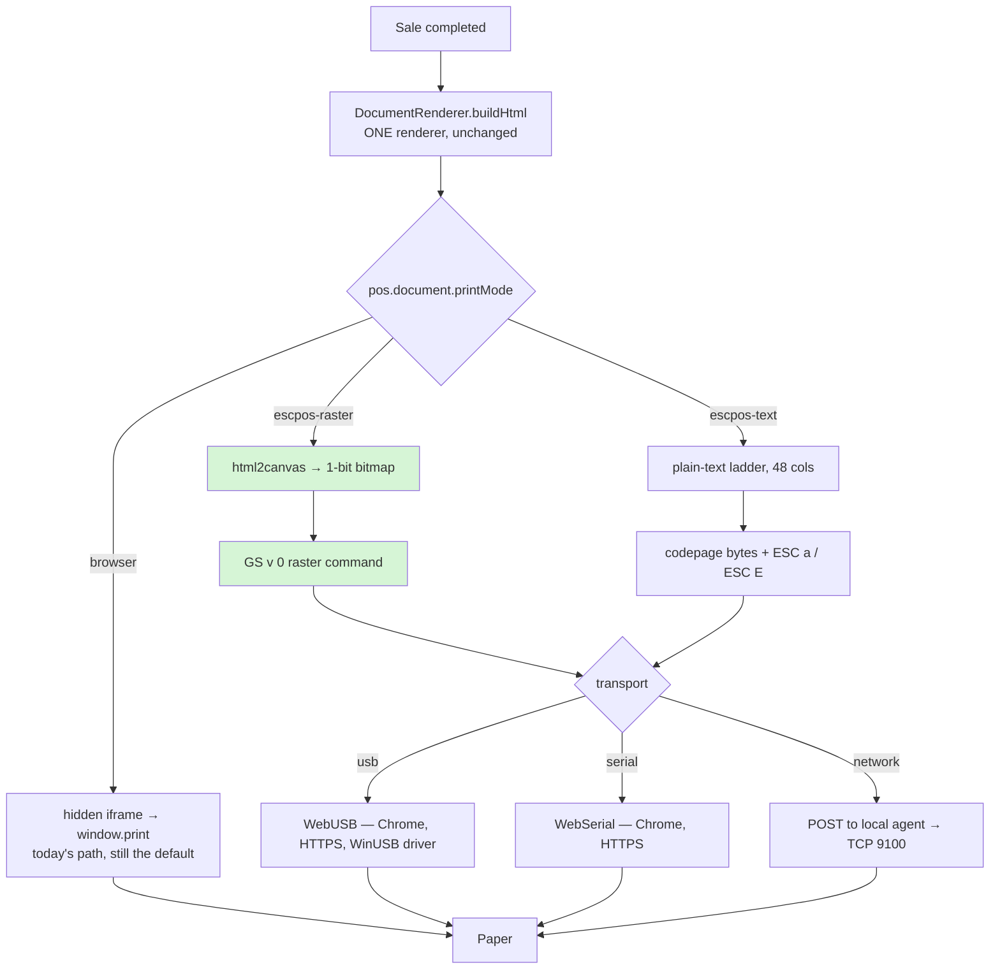

# P1 — Thermal printing: ESC/POS, end to end

**Status:** DESIGN — awaiting one ruling (§7) before implementation
**Author:** raised by the Shahzad Mobile Shop / Al Rehmat reference invoice review
**Related:** `receipt.js` (`DocumentRenderer`), `pos.document.*` settings

---

## 1. What exists today

Every printed document in the product goes one way:

```
DocumentRenderer.buildHtml(inv, profile)
  → writeToFrame(html, 'receiptFrame')      hidden <iframe>, doc.write()
  → printWhenReady(frame)                   polls readyState, ceiling 300ms
  → frame.contentWindow.print()             the OS print dialog
```

There is **no ESC/POS anywhere in the codebase** — `grep` for `escpos|WebUSB|navigator.serial|9100`
returns one hit, and it is inside `pdfmake.min.js`.

### What that costs

| | Today (HTML → OS driver) |
|---|---|
| Print dialog | Yes, on every sale unless the browser is configured to suppress it |
| Speed | Driver rasterises the page; noticeably slower than raw bytes |
| Column width | Depends on driver + paper settings; not guaranteed 48 chars |
| Cash drawer | Cannot open one |
| Auto-cut | Only if the driver decides to |
| Offline | Fine — nothing is fetched |

### What it buys, and why it must not simply be replaced

**Urdu.** ESC/POS *text* mode is codepage-based. There is no Urdu codepage, and Nastaliq needs contextual
glyph shaping plus vertical stacking that no printer firmware performs. The OS print driver does that
shaping for us today, for free.

> ⚠ **This is the constraint that shapes the whole slice.** A naive "switch to ESC/POS" would print the
> English receipt faster and turn every Urdu block into garbage — losing the feature we just built.

---

## 2. The requirement

> "fix it 100% end to end to meet any kind of requirements"

Read as: a shop must be able to print correctly **whatever their hardware and their language**, without
this codebase having to know in advance which combination they have.

That means the renderer stops assuming a transport, and the transport becomes configuration.

---

## 3. Design — one document, three ways out



**The renderer does not change.** `buildHtml` already produces the document; raster mode screenshots that
same HTML, so the paper is byte-identical to what the browser preview shows. One definition of the
document, three ways of getting it onto paper — the same reasoning that made `PRESETS` data rather than
three renderers.

### 3.1 Why raster is the DEFAULT ESC/POS mode, not text

| | escpos-text | escpos-raster |
|---|---|---|
| Urdu / Nastaliq | ✗ impossible | ✅ browser shapes it into the canvas |
| Logo | ✗ | ✅ |
| Speed | fastest | ~0.5–1.5 s for an 80mm slip |
| Font control | printer's two built-in fonts | anything installed |
| Bytes | ~1 KB | ~30–60 KB |

`escpos-text` is kept only for a shop that prints Latin-only and wants the absolute fastest till. It is
not the recommended mode and its limitations are stated in the setting's help text.

### 3.2 Transports, and their real constraints

- **WebUSB** — Chrome/Edge only, requires **HTTPS** (or `localhost`), requires a **user gesture** to grant
  device permission once per origin, and on Windows the printer must be bound to **WinUSB** rather than the
  vendor's print driver (Zadig). If a shop already prints via the Windows driver, WebUSB will not see it
  without changing that binding.
- **WebSerial** — same browser/HTTPS rules; for serial and some USB-serial printers.
- **Local agent** — a small service on the till that accepts the byte stream over `localhost` and writes to
  TCP 9100 or to a Windows printer share. **No HTTPS requirement, no driver surgery, works with any
  printer the machine can already print to.** Costs an install per till.

> ⚠ **The transport is not ours to choose.** It is decided by how the printer is attached and whether the
> POS is served over HTTPS. Building the wrong one first produces something that cannot run on the
> customer's counter. See §7.

---

## 4. Settings (all additive, all defaulting to today's behaviour)

| Key | Type | Default | Meaning |
|---|---|---|---|
| `pos.document.printMode` | select | `browser` | `browser` · `escpos-raster` · `escpos-text` |
| `pos.document.printTransport` | select | `agent` | `usb` · `serial` · `agent` |
| `pos.document.printAgentUrl` | text | `http://localhost:8083/print` | agent endpoint |
| `pos.document.paperWidthDots` | int | `576` | 576 = 80mm @203dpi; 384 = 58mm |
| `pos.document.cashDrawer` | bool | `false` | send the kick pulse after printing |
| `pos.document.autoCut` | bool | `true` | partial cut at end of receipt |

**Default `browser` is load-bearing.** Every existing tenant keeps the exact path they print on today; ESC/POS
is opt-in per shop.

---

## 5. What we do NOT hand-roll

- **QR codes.** Needed for fiscal compliance (§6 of the review). A correct encoder is Reed–Solomon plus
  mask selection — roughly 300 lines where a subtle error yields a code that scans on the developer's phone
  and fails on a tax inspector's. **Vendor a library** (`qrcode-generator`, ~10 KB, MIT), as `JsBarcode`,
  `pdfmake` and `jszip` already are. ESC/POS printers also have a native QR command (`GS ( k`), which
  `escpos-text` mode should prefer.
- **html2canvas.** Same reasoning; rasterising arbitrary CSS correctly is not a side quest.

Both need to be fetched and committed, which is a deliberate act — not something to slip into a patch.

---

## 6. Test plan

`mvn test` (pure logic, no device):
- raster encoder: known bitmap → expected `GS v 0` byte sequence, including the width/height little-endian header
- 1-bit threshold: greyscale → packed bits, row padding to a byte boundary
- text ladder: a 48-column line wraps at 48, never at 47 or 49

Cypress (no device):
- `printMode: browser` still calls `window.print` — the regression that matters most
- `escpos-raster` produces a byte array of non-zero length beginning `1D 76 30`
- a mocked agent receives a POST whose body length matches the encoder's output

Manual (device required, per §7's answer):
- an Urdu terms block prints legibly in Nastaliq
- 48-column alignment on a real 80mm roll
- drawer kick, auto-cut

---

## 7. The ruling needed before implementation

Everything above is settled except one thing, and it decides which transport gets built first:

1. **How is the printer attached** on a typical customer's counter — USB into the till, network (TCP 9100),
   or a shared Windows printer?
2. **Is the POS served over HTTPS** on that machine? WebUSB and WebSerial will not run over plain HTTP
   except on `localhost`.
3. **Is installing a small agent per till acceptable?** If yes, `agent` is by far the most compatible
   starting point and the only one that works regardless of the answers to 1 and 2.

**Recommendation:** build `escpos-raster` + `agent` first. It is the only combination that works on any
printer the machine can already print to, needs no HTTPS and no driver rebinding, and delivers Urdu
correctly. `usb`/`serial` then slot into the same transport interface for shops that want no install.
