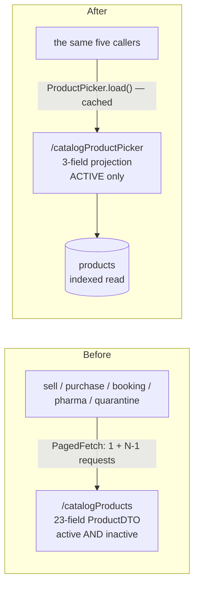

# PERF-8 — the product picker stops downloading the product master

*Design gate.* Written 2026-08-20. Predecessors: [frontend-performance-audit.md](../frontend-performance-audit.md)
(PERF-1…7) · `js/common/paged-fetch.js` (slice 98).

---

## 1. Why

Two `sell` / `purchase` Cypress cases fail with a click refused because the AJAX overlay covers the button.
Three fixes were available (I2 §10.3); the user chose **C — fix the application, not the test.** This is that
slice.

The test failure is a symptom. The defect is that **every section open downloads the tenant's entire product
master into the browser to fill one `<select>`.**

---

## 2. Measured, not assumed (2026-08-20)

| Fact | Value |
|---|---|
| Products in the demo tenant (org 6, the one the specs run as) | **1 249** |
| Pages fetched at `PAGE_SIZE = 500` | **3** — one head request, then 2 in parallel |
| Fields on `ProductDTO` | **23** |
| Fields the picker actually uses | **4** — `id`, `name`, `sellingPrice`, `isActive` |
| Bytes per product, full DTO | **538 B** |
| Bytes per product, picker projection | **92 B** |
| **Waste per product** | **83 %** |
| Inactive products downloaded, then discarded **client-side** | 28 of 1 277 |
| Estimated transfer per section open | **~670 KB uncompressed** |

All five callers were checked — `business.js` ×2, `order-booking.js`, `pharma.js`, `quarantine.js` — and
**none reads a field outside those four.**

### 2.1 The overlay race, correctly diagnosed

An earlier note (I2 §10.1) said the preload is *sequential page by page*. **That was wrong** and is corrected
here: `PagedFetch.all` fetches page 0, then **all remaining pages in parallel** (`$.when.apply`). The gap is
therefore not between every page — it is the single gap **between the head request and the parallel tail**:

```
head /catalogProducts?page=0  ──┐
                                ├─ zero requests in flight → jQuery fires ajaxStop → overlay HIDES
                                │   → waitForAppReady() passes  ← the test proceeds here
tail page=1, page=2 (parallel) ─┘   → ajaxStart → overlay RETURNS → the click is refused
```

The overlay is driven by jQuery's **global** `ajaxStart`/`ajaxStop`, which fire on the first request starting
and the *last* one finishing. Any preload that runs in **two waves** therefore produces two overlay cycles and
a window in which the app looks idle but is not.

**A single-request preload has one cycle and no gap** — which is why the correct application fix removes the
test failure as a consequence rather than as a workaround.

---

## 3. Design

### 3.1 A lean, server-side picker projection



**`GET /api/catalog/products/picker`** → `PageResponse<ProductPickerDTO>` where

```java
ProductPickerDTO { Long id; String name; BigDecimal sellingPrice; }
```

* **Active only, filtered in SQL.** Downloading 28 deactivated products in order to hide them in JavaScript is
  work done twice and transferred once too often.
* **Projected in the query**, not mapped from a loaded entity — so `description` (up to 2 000 chars),
  timestamps, tax-code names and the stamped rate fields never leave the database.
* **Still a `PageResponse`.** It is tempting to return a plain list, but that is the unbounded read OMS-7
  named, and `paged-fetch.js` exists precisely because a fixed `?size=2000` silently truncated a large
  tenant's catalogue. The envelope is kept so the existing, tested `PagedFetch` remains the transport and the
  >cap case stays *correct* rather than *silent*.
* **A larger page size for this endpoint** (`2000` lean rows ≈ 180 KB) so that every realistic tenant is served
  by **one request**. That is what closes the two-wave gap; it does not pretend to abolish paging.

### 3.2 A per-page-load cache — the bigger win

`loadUserItems()` runs on **every section open** and on **every cart-line edit**. Today each of those refetches
the whole catalogue.

`ProductPicker.load(cb)` fetches once and serves every later caller from memory, so the second and subsequent
section opens issue **zero requests** — and therefore raise no overlay at all.

**Invalidation is the part that must not be got wrong.** A stale picker on a till is worse than a slow one: an
operator who adds a product and cannot then sell it will conclude the system lost it. So the cache is dropped
explicitly whenever the catalogue changes — after product create, update, activate, deactivate and import —
via `ProductPicker.invalidate()`. It is deliberately **not** time-based: a TTL would mean the picker is
sometimes right, which is harder to reason about than always-right-after-a-write.

### 3.3 What does NOT change

* **No UI change.** The same `<select>`, the same bootstrap-select search, the same options. This slice is
  invisible to an operator except that the screen appears sooner.
* **`PagedFetch` is untouched** and keeps its callers elsewhere.
* **No type-ahead.** Server-side search is the right answer for a genuinely huge catalogue and would change how
  an operator uses the till. At ~1 250 products a browsable list is correct, and swapping it for a search box
  would be a UX decision dressed as a performance fix. Recorded as the follow-up if a tenant ever exceeds the
  page.

---

## 4. Expected effect

| | Before | After (first open) | After (subsequent) |
|---|---|---|---|
| Requests | 3 | **1** | **0** |
| Transfer | ~670 KB | **~115 KB** | **0** |
| Overlay cycles | 2 (with a gap) | **1** | **0** |

---

## 5. Test plan

**Unit** — `ProductPickerQueryTest`: the projection returns active only, is org-scoped, and carries exactly
three fields.

**Gate** — `product-picker.cy.js`:
* the picker endpoint returns **only active** products (seed a deactivated one, assert it is absent);
* it is **org-scoped** (positive control first: the owner sees theirs, another tenant does not);
* opening the sell section issues **one** `catalogProductPicker` request, and re-opening issues **none**
  (`cy.intercept` counting — the property, not the timing);
* **after adding a product, the picker contains it** — the invalidation case, and the one that matters most,
  because its failure mode is a shopkeeper unable to sell what they just created.

**Regression — the point of the slice** — `sell` and `purchase` must reach **31/31 and 22/22**, plus
`product-crud`, `pharma`, `quarantine`, `order-booking-screen`, `customer-import`, `product-import`.

---

## 6. Open question

**Q1 — should the cache also be invalidated by a CSV import?** I2 can create hundreds of products in one act.
`ProductPicker.invalidate()` on a successful import is one line and I intend to include it; flagged because it
is the one invalidation point that is not an obvious single-product write.

---

## 7. BUILT 2026-08-20 — jars packaged, images NOT yet rebuilt

| | |
|---|---|
| catalog-service | `ProductPickerDTO`, `ProductRepository.findPickerScoped` (constructor projection, `isActive = TRUE`, org-scoped, `ORDER BY name`), `ProductService.getPicker`, `GET /api/catalog/products/picker` |
| monolith | `GET /catalogProductPicker` proxy · **`js/common/product-picker.js`** (cache + invalidation + shared `optionsHtml`) · loaded from `fragments/header.html` beside `paged-fetch.js` |
| callers switched | `business.js` ×2 (`loadUserItems`, `loadCartLineIntoForm`), `order-booking.js`, `pharma.js` |
| caller deliberately NOT switched | `quarantine.js` — see §7.2 |
| tests | `product-picker.cy.js` (7 cases) |

Both jars compile and package clean. **The Docker images are not rebuilt**, so nothing is live yet.

### 7.1 Invalidation is ONE global hook, not four call sites

The obvious implementation is `ProductPicker.invalidate()` in each of the four success handlers that change
the catalogue. Rejected: it works today and rots tomorrow, because the fifth write path added later simply
forgets and **nothing fails loudly** — the symptom appears months later as an operator who cannot sell a
product they just created.

Instead a single `ajaxComplete` hook keys on the URL (`addProduct|updateProduct|activateProduct|
deactivateProduct|import/product/commit`). It cannot be forgotten, and it is the mechanism
`searchable-selects.js` already uses for the same reason.

Two details that matter:

* **Only successful writes invalidate.** The monolith answers `200` with `{success:false}` on a refusal, so
  the HTTP status alone is not proof anything changed; the envelope is read. Otherwise every validation error
  would drop the cache and re-fetch the catalogue.
* **A failed load is never cached**, so the next caller retries rather than inheriting an empty picker.

This also answers **Q1**: `/import/product/commit` is in the pattern, so an I2 import of several hundred
products refreshes the picker exactly like a single-product save.

### 7.2 `quarantine.js` was NOT switched, and that is the interesting one

It looked like a fifth picker. It is not: it builds a **name-by-id map to DISPLAY quarantined stock**, and a
product can be deactivated while its quarantined batches are still on the shelf awaiting disposal. The picker
is **active-only by design**, so switching it would have silently rendered those rows as `#123` instead of a
product name — a regression no assertion in this slice would have caught, because every test here is about
what a *picker* should contain.

Left on `PagedFetch` with the reason written at the call site. **A read that looks like a picker is not one if
its ids can point at inactive rows.**

### 7.3 The `isActive` field is gone from the projection, deliberately

Every caller previously filtered `p.isActive === false` in JavaScript, having downloaded those rows. Now the
query filters them, so the field would be a constant `true` on every row — a byte per product spent restating
what the query guarantees. The client-side filters were removed with it.

`p.isActive = TRUE` is compared explicitly rather than `!= FALSE`: the column is a nullable `Boolean`, and a
pre-migration row with `NULL` is not active and must not reach a till.

---

## 8. DEPLOYED + GATE GREEN — `product-picker.cy.js` 7/7, 2026-08-20

### 8.1 Measured against the live stack, after deploy

| | Before | After |
|---|---|---|
| Requests per section open | **3** (head + 2 parallel) | **1** |
| `totalPages` | 3 | **1** |
| Bytes transferred | **618 015** | **76 697** |
| **Reduction** | — | **88 %** |
| Bytes on a later section open (same page load) | 618 015 | **0** |

88 % rather than the predicted 83 %, because the projection also drops the 28 deactivated rows the browser
used to download in order to hide them.

### 8.2 Both gate failures on the first run were the SPEC's, not the product's

Worth recording because the first looked exactly like a real defect in the new query.

**1. "a deactivated product must never be offered at a till" — appeared to be a broken filter.** It was not:
the database reports 1 238 active rows and the endpoint returned exactly 1 238. The spec's own deactivation
step was a no-op — `/deactivateProduct` takes `checked` as a comma-separated **string**, and the draft passed
an **array**. Worse, it was sent with `failOnStatusCode: false` and the result was never asserted, so a
silently-failed write presented itself as a picker defect.

*The rule this re-teaches:* **a fixture that does not fail loudly turns its own bug into someone else's.**
Assert the write succeeded before asserting anything about its effect. Now does both.

**2. "re-opening a section issues NO further picker request" — the spec contradicted its own design.** It used
`cy.openSellSection`, which calls `cy.visit` — a full page reload, which legitimately clears a per-page-load
cache. The test was demanding that the cache survive the one event that is supposed to end it.

Rewritten to switch sections **in page**, which is what the cache actually buys: an operator moving between
screens without reloading. *Before asserting a cache holds, be sure the action under test does not destroy it
by definition.*

### 8.3 What the seven cases pin

Ordered by what would hurt most if wrong: a product added is immediately pickable (a stale picker means an
operator cannot sell what they just created); the `ajaxComplete` hook invalidates without any caller
remembering to; deactivated products are absent; org scoping, positive control first; exactly three fields;
one request not three; and the sell screen no longer touches `/catalogProducts` at all.

---

## 9. RESULT — the picker race is gone; a DIFFERENT chained request remains

| Spec | Before PERF-8 | After |
|---|---|---|
| `purchase` | 21/22 | ✅ **22/22** |
| `product-picker` | — | ✅ **7/7** |
| `product-import` | 13/13 | ✅ **15/15** (2 new cases for the sku reversal) |
| `customer-import` | 17/17 | ✅ **17/17** |
| `sell` | 30/31 | ⚠️ 29/31 — **a different pair, same cause** |

### 9.1 The victim moves between runs — which is the signature, not the defect

Three runs of `sell`, three different failing tests, every one refused because `<div class="ao-box">` covered
the element:

| Run | Failing case |
|---|---|
| Before PERF-8 | *Reset Invoice Item button…* |
| After PERF-8 | *item dropdown loads options from catalogProducts* (a genuinely stale spec, now fixed) |
| After the stale fix | *switching back to Select mode…* and *Delete Cart resets to Select mode…* |

A defect in one test does not move to another test. **A race whose victim depends on timing does.**

### 9.2 The remaining source is a legitimately chained request

`business.js:4115` calls `refreshAccountGroup()` **from inside another request's success handler**, and that
issues `GET /customerAccountGroup?customerId=…`. It cannot be issued earlier — it needs a customer id from the
first response. So it is wave two, and between the waves jQuery sees zero requests in flight, fires
`ajaxStop`, the overlay hides, `waitForAppReady()` passes, and the follow-up re-raises it under the next click.

**PERF-8 did not cause this and did not worsen it.** It removed the picker's own two-wave pattern (3 requests
→ 1) and made the remaining wave land at a different moment, which is why a different test is now the one
standing in the gap.

### 9.3 Why chasing the remaining chains is the WRONG next step

A follow-up request that depends on a previous response is not a defect — `customerAccountGroup` genuinely
cannot know its `customerId` until the customer loads. Real applications chain requests, and they always will.

What cannot tolerate chaining is the **overlay contract**: `waitForAppReady()` asks *"is the app idle?"* at one
instant, and jQuery's global `ajaxStop` answers *"yes"* in every gap between waves. **Idleness is not
observable from a single instantaneous check**, and no amount of removing chains makes it so — it only makes
the gaps rarer and the flake harder to reproduce.

So the honest completion is the one deferred at I2 §10.3 as option **A**: make `waitForAppReady` require the
overlay to be gone *and stay gone* past `SHOW_DELAY_MS`. That is not papering over a product defect — the
product defect (the 618 KB three-request preload) is fixed and measured. It is correcting a test helper whose
premise was wrong.

**Not applied**: A changes the timing of every spec on the platform, and option C was chosen over it
deliberately. That decision belongs to the user, not to me.
