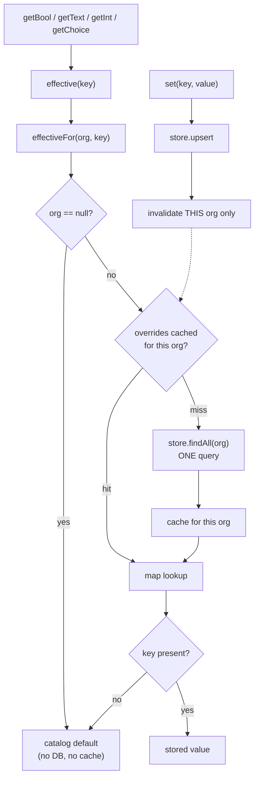

# PERF-C1 — cache tenant settings at the one place every read passes through

**Status:** design
**Scope:** `common-settings` only. No service code changes, no schema, no new infrastructure.

---

## 1. The problem, measured

`SettingsService.effectiveFor(org, key)` issues **one `SELECT` on `org_setting` per key**:

```java
public String effectiveFor(Long org, String key) {
    if (org != null) {
        String v = store.find(org, key).orElse(null);   // findByOrganizationIdAndSettingKey
        if (v != null) return v;
    }
    SettingEntry e = catalog.get(key);
    return e == null ? null : e.defaultValue();
}
```

Every typed accessor — `getBool`, `getInt`, `getDecimal`, `getChoice`, `getText`, `effective` — funnels
into it. Counting call sites:

| Path | Settings reads | Queries today |
|---|---|---|
| `SellController` | 17 | 17 |
| …of which receipt letterhead (lines 175–184) | 8 consecutive `getText` | 8 |
| `CustomerService`, `SagaSellService`, `PurchaseService`, `SalesQuoteService`, `InstallmentPlanService` | more | more |

Eight queries to print one address block, on data a shop changes perhaps monthly. There is **no caching
anywhere in the platform** — zero `@EnableCaching`, zero `@Cacheable`, no cache starter in any `pom.xml`.

## 2. Why not `@Cacheable`

**It would not work, and it would look like it did.** Spring's cache annotations are proxy-based: a call
that arrives from *inside* the same bean bypasses the proxy entirely. Every read here is exactly that —

```
getBool(key) → effective(key) → effectiveFor(org, key)
```

three internal self-calls. `@Cacheable` on `effectiveFor` would never once fire. The annotation would be
present, reviewed, and inert — the same shape of defect as `@EnableWebMvc` silently making
`spring.web.resources.cache.period` inert, and the password-strength meter that had never run.

So the cache is held **directly, in the service**, where no proxy sits between the caller and the answer.

## 3. Cache the org's map, not the key

The obvious design — key the cache on `(org, key)` — still costs one lookup per key and one query per
key on a cold cache. But `SettingsStore` already exposes `findAll(org)`, which fetches every override for
a tenant in **one** query. So the unit of caching is the tenant's whole override map:

```
Map<Long, Map<String,String>>      org → { settingKey → storedValue }
```

`effectiveFor` becomes a map lookup against that. Seventeen queries become **one on a miss and none on a
hit**, and `catalogForOrg()` — which already calls `findAll` — reads the same map instead of querying
again.



The null-org branch is left exactly as it is. A public-storefront caller has no tenant, never touches the
store, and already resolves to catalog defaults — there is nothing to cache and nothing to get wrong.

## 4. Invalidation: on write, not on a timer

Settings have exactly **one** writer:

```java
public void set(String key, String value) {
    if (!catalog.containsKey(key)) throw …;
    store.upsert(CurrentUser.organizationId(), CurrentUser.userId(), key, value);
}
```

so eviction is *exact*. A TTL alone would be a guess that is simultaneously too slow for the owner who
just changed a setting and watches the screen not change, and too fast for the 99% of reads where nothing
changed. This mirrors the standing rule already applied elsewhere: **stamp at write, don't derive on
read.**

A short TTL is kept only as a **backstop**, and it earns its place for one reason: if a service ever runs
more than one replica, an eviction on instance A does not reach instance B. Today each service runs as a
single container, so the TTL is insurance against a future deployment change rather than a fix for a
present bug. Bounded staleness of one minute on a shop's receipt footer is an acceptable trade; silent
unbounded staleness would not be.

## 5. The risk that matters: tenancy

The real hazard is not staleness, it is a cache keyed **without** the organisation. That would serve one
tenant's configuration to another — silent, invisible in logs, and catastrophic in a multi-tenant product.
No existing test would catch it, because every current test runs as a single org.

So the gate asserts the property directly: **read the same key as two different orgs and require the
answers to differ.** A test that only proves "the second read was faster" would pass on a leaking cache.

## 6. Why Caffeine rather than another hand-rolled map

Three hand-rolled TTL caches already exist — `PeriodLockGuard`, `CheckoutService.taxPolicyCache`,
`RateLimitGlobalFilter.windows` — the same `ConcurrentHashMap` + timestamp shape written three times. A
fourth copy is the wrong answer. Caffeine is version-managed by the Boot 3.5.0 parent, gives size
bounding and expiry as a declared policy rather than as hand-written bookkeeping, and gives the other
three somewhere to converge later.

## 7. Out of scope

- Redis / distributed invalidation — not needed at one replica per service, and adding cross-instance
  messaging for a config read would be cost without a problem to spend it on.
- Caching anything on the money path — stock, credit standing, balances. The books have already drifted
  once from a stale read; milliseconds are not worth correctness there.
- Converging the three existing caches. Worth doing, but it is a separate change and would make this one
  impossible to review.

## 8. Gate

| # | Property |
|---|---|
| 1 | two orgs reading the same key get **their own** values (tenancy) |
| 2 | a write is visible to the very next read (invalidation is exact, not eventual) |
| 3 | an unset key still resolves to the catalog default |
| 4 | a null-org caller still resolves to the catalog default |
| 5 | reads are served without re-querying (the query count drops, asserted on a counting store) |

Property 5 is asserted against a counting `SettingsStore` rather than a stopwatch: "fewer queries" is the
claim, and timing would measure the machine instead.
