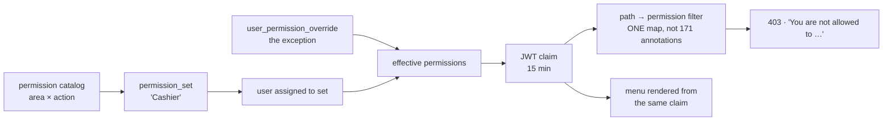

# PERM-1 — permission sets: design

**Ruling taken (owner, 2026-09-08):** permission **sets**, not per-user checkboxes. **15-minute**
revocation is acceptable. Matrix UI: rows = areas, columns = actions, row master toggle.

---

## 1. What exists today, measured

| | |
|---|---|
| Endpoints in business-service | **198** |
| …carrying `@PreAuthorize` | **27** |
| **Ungated beyond "logged in + in this org"** | **171 — 86 %** |
| Privileges in the whole system | **35** — none for sell or purchase |
| Per-user grants that exist | **one**: `user_location_access` (stores) |
| Gated nav sections | 32, all on `ROLE_OWNER` / `ADMIN_PRIVILEGE` / `SUPER_PRIVILEGE` |
| Access-token lifetime | **900 000 ms = 15 min** (refresh 7 days) |

Every `USER` therefore sees exactly what every other `USER` sees, and *Sale* and *Purchase* are reachable
by anyone signed in. **There is no seam to vary access per person.** That is what this slice builds.

---

## 2. The model

**Permissions are ACTIONS. The menu is DERIVED from them.**

This is the one decision everything else follows from, and it was settled by the owner's own example:
*"when Jawwad will try to create user … an error message that you are not authorized"*. Creating a user
is an action, not a menu — hide the Team menu and `POST /team/users` still answers.

So: a permission is `area.action` (`sale.create`, `team.create`, `report.sale.export`). If a user holds
no permission in an area, that area's menu is not rendered — computed, never configured separately, so
the screen and the enforcement cannot disagree.



---

## 3. The matrix

Rows are areas, columns are actions. **Only meaningful intersections are rendered** — see gap G-1.

| Area | View | Create | Edit | Delete | Special |
|---|:--:|:--:|:--:|:--:|---|
| Sale | ● | ● | ● | ● | **Void**, **Discount** |
| Purchase | ● | ● | ● | ● | |
| Customers | ● | ● | ● | ● | |
| Products | ● | ● | ● | ● | |
| Suppliers | ● | ● | ● | ● | |
| Stock / Store | ● | ● | ● | | |
| Till / Shift | ● | ● | | | **Close shift** |
| Reports | ● | | | | **Export** |
| Finance / GL | ● | | | | **Export** |
| Settings | ● | | ● | | |
| Team & Users | ● | ● | ● | ● | |
| Opening balances | ● | ● | | | **Reverse** |

≈ **12 areas, ~45 real permissions.** Deny by default: a permission added to the product later is held
by nobody until it is granted.

---

## 4. ⚠ The gaps — the reason this design is not just the matrix

### G-1 · The matrix is RAGGED, and a dead cell is worse than no cell
Not every area has every action. Finance has no *Create*; Settings has no *Delete*; *Void* belongs only
to Sale. A full 12 × 7 grid is 84 cells of which **~39 mean nothing**.

**Fix:** render only valid intersections; a non-existent action is **blank**, never an unticked box. An
unticked box is a promise that ticking it does something.

### G-2 · ⭐⭐ Permissions DEPEND on each other, and the failure is silent
This is the one that would ship broken. A cashier granted `sale.create` but not `product.view` gets a
sale screen whose **item picker is empty**, with no error and nothing on screen explaining why. Same for
`customer.view` — the customer picker is empty and a credit sale cannot be completed.

Real dependencies:
- `*.create`, `*.edit`, `*.delete` ⟹ `*.view` (you cannot edit what you cannot see)
- `sale.create` ⟹ `product.view` + `customer.view`
- `purchase.create` ⟹ `product.view` + `supplier.view`
- `sale.void` ⟹ `sale.view`

**Fix:** the set's **closure** is computed on save — implied permissions are granted automatically and
the UI *says so*: "Products · View was enabled because Sale · Create requires it." Computed server-side
too, so an API caller cannot store an incoherent set.

### G-3 · ⭐ Row-level SCOPE is a different question, and will be confused with this one
Today: USER sees own records, ADMIN own + managed, SUPER all org. That is **which rows**, not **which
actions**. An owner ticking `sale.view` has no way to say whether Jawwad sees *his own* sales or
*everyone's* — and both are reasonable readings of the same tick.

**Fix:** one explicit control per set, beside the matrix, not inside it:
**Sees — ( ) only their own records ( ) all records in this shop.** Two questions, two controls.

### G-4 · ⭐⭐ Privilege escalation, and the owner locking themselves out
An admin holding `team.edit` could grant themselves `finance.view`. And an owner who can edit their own
set can remove `team.edit` from themselves — after which **nobody can fix it**.

**Fix, both halves:**
- **You cannot grant what you do not hold.** Enforced server-side, consistent with the existing rule
  that an admin may only grant stores they hold.
- **The owner's access is implicit and not editable.** They are not in the matrix at all.

### G-5 · ⭐⭐ Existing staff must not change behaviour on deploy
There are live USER and ADMIN accounts. If this ships and they land on an empty set, every one of them
loses access on the morning of the deploy, silently, mid-trading.

**Fix:** two built-in sets seeded to reproduce **today's behaviour exactly** — `Standard` (what
`ROLE_BUSINESS_USER` reaches now) and `Administrator` (what `ADMIN_ROLE` reaches now) — and every
existing member is migrated onto the one matching their current role. **The deploy changes nothing that
anyone can see.** New sets are the owner's to create afterwards.

### G-6 · ⚠ The enforcement map will be incomplete, and the honest answer is not "deny"
171 endpoints are unmapped. Deny-by-default on an incomplete map means the product 403s on deploy.

**Fix:** an unmapped path is **ALLOWED and LOGGED** (`perm.unmapped path=…`), and each phase moves paths
into the map. This is a real, temporary hole and it is written down here rather than discovered later:
until a path is mapped, its area's permissions do not restrict it. Phase 1 maps sale, purchase, register
and team — team because it is the owner's own example.

### G-7 · The menu must not be a second source of truth
If the menu is configured separately from the permissions, the two drift and the screen lies.

**Fix:** the nav is rendered from the effective claim. No `sec:authorize` on an area that has a
permission — one source, mechanically.

### G-8 · DataTables rebuilds its cells on every redraw
A known trap in this codebase: anything injected into a DataTable row is wiped by the next `draw`. A
matrix of checkboxes inside a DataTable will lose its state on sort, search or page.

**Fix:** hold state in a JS model keyed by `area.action`, and re-render from the model on `draw` — the
same hook the cart hints use. Or, simpler and probably right for **12 rows**: a plain table, no paging,
no sort. A DataTable earns its keep at 200 rows; at 12 it adds a redraw bug and a page-length control
nobody wants.

---

## 5. UI/UX

```
┌─ Permission set: [ Cashier        ▾ ]  [ Duplicate ] [ Rename ]        ┐
│  Start from: ( ) Cashier  ( ) Storekeeper  ( ) Manager  (•) Custom     │
│  Sees:       (•) only their own records   ( ) all records in this shop │
├───────────────┬──────┬────────┬──────┬────────┬───────────────────────┤
│ AREA          │ View │ Create │ Edit │ Delete │ Special               │
├───────────────┼──────┼────────┼──────┼────────┼───────────────────────┤
│ ▸ Sale     [✓]│  ☑   │   ☑    │  ☐   │   ☐    │ Void ☐  Discount ☑    │
│ ▸ Purchase [✓]│  ☑   │   ☑    │  ☐   │   ☐    │                       │
│ ▸ Reports  [ ]│  ☐   │        │      │        │ Export ☐              │
│ ▸ Team     [ ]│  ☐   │   ☐    │  ☐   │   ☐    │                       │
└───────────────┴──────┴────────┴──────┴────────┴───────────────────────┘
   ⓘ Products · View was enabled because Sale · Create requires it.

┌─ What Jawwad will see ────────────────────────────────────────────────┐
│  Sale ▾   Purchase ▾   Register ▾                                     │
│  (Reports, Finance, Settings, Team are not shown)                     │
└───────────────────────────────────────────────────────────────────────┘
```

**The preview is the most valuable element on the screen.** A matrix is abstract; a sidebar is not. It
turns "did I tick the right 6 of 45 boxes" into "is that the menu I meant", which is a question an owner
can actually answer. It is also how a mis-grant gets caught before it is saved rather than after.

Three more things that make it usable rather than merely correct:
- **Row master toggle** — the owner's own request. Ticking the row grants every action in that area.
- **Starter sets**, not a separate "preset" concept: Cashier / Storekeeper / Manager are ordinary sets,
  seeded, that the owner copies and edits. One concept, not two.
- **The refusal names the thing**: *"You are not allowed to create users. Ask the shop owner."* —
  not "Access denied". `GlobalExceptionHandler` already returns 403; only the wording is missing.

---

## 6. Schema

```
permission            code PK ('sale.create'), area, action, label, implies (csv)
permission_set        id, organization_id, name, scope('OWN'|'ALL'), is_builtin
permission_set_item   set_id, permission_code
user_permission_set   user_id, set_id                     -- the assignment
user_permission_override  user_id, permission_code, granted(bool)   -- phase 3
```

Mirrors `user_location_access`, which is the one per-user grant this codebase already has — same shape,
same scoping, so nothing new to reason about.

---

## 7. Phasing

| Phase | Contents |
|---|---|
| **1** | Catalog · sets · matrix UI · preview · closure (G-2) · **enforcement filter** · migration of existing staff (G-5). Areas: Sale, Purchase, Customers, Products, Suppliers, Team. |
| **2** | Reports, Till, Finance, Settings, Opening balances. Each = paths moved into the map. |
| **3** | Per-user overrides · an audit trail of who changed whose access. |

⚠ **Phase 1 must include the enforcement filter.** Shipping the matrix alone would sell an access
control that is not one — the menu would hide and every endpoint would stay open, and the owner would
stop watching. That is worse than not shipping it.

---

## 8. Open question for the owner

**Revocation is 15 minutes** (the access token's life), which was accepted. One consequence worth
confirming: a member whose permission is removed **keeps it for up to 15 minutes**, including a member
being removed for cause. If that is not acceptable for the Team area specifically, that one area can
re-check the database per request — one extra read on a screen used a few times a day.
