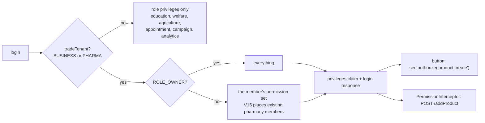

# PERM-2 — a pharmacy member holds the permissions a shop member holds

**Status: BUILT, unit-green (auth-service 54/54) — awaiting the auth-service deploy and the gate.**
Raised 2026-09-17 by the user: *"how to enable newProductForPurchase for one pharma user — it is not visible to him"*.
It is not a per-user setting: on a `PHARMA` tenant nobody can hold it, including the owner.

## 1. What the user asked, and the honest answer

"Register a new product" on the purchase screen is `#newProductFromPurchase`
(`businessDashboard.html:2025`), gated `sec:authorize="hasAuthority('product.create')"` — deliberately the same
permission `PermissionInterceptor` demands for `POST /addProduct`, so the button never appears where it would only be
refused.

**It cannot be switched on for one pharmacy user today**, because those codes are never minted for that tenant.
Measured on dev before changing anything (login through the gateway, reading the response's `privileges`):

| account | role | `product.create` | dotted codes |
|---|---|---|---|
| `owner.pharma@` | ROLE_OWNER | **no** | 1 |
| `admin.pharma@` | ADMIN_ROLE | **no** | 1 |
| `owner.business@` | ROLE_OWNER | yes | 42 |

## 2. Cause (verified in current code)

`AuthService` minted PERM-1 codes only when the active organisation's type was `BUSINESS`:

```java
boolean businessTenant = activeOrg != null && "BUSINESS".equalsIgnoreCase(String.valueOf(activeOrg.getType()));
if (businessTenant) { authorities.addAll(isOwner ? everything() : effectiveFor(user.getId())); }
```

A pharmacy's org type is `PHARMA`, yet it **reuses the commerce core**: `/businessDashboard`, the same till, the same
purchase screen, the same permission map. `AuthService.moduleFor` already says so in its own comment —
"PHARMA/MARKETPLACE deliberately map to BUSINESS: they reuse the commerce core". The mint disagreed with that.

⚠ **Why the owner is blind too.** `PermissionInterceptor.holds` lets `ROLE_OWNER` / `SUPER_PRIVILEGE` through
whatever the matrix says — but `sec:authorize` is a **literal** authority check with no such bypass. So the server
would have allowed the pharmacy owner's `POST /addProduct` while the button to do it was hidden from them.

⚠ **Why no gate caught it.** Every pharmacy spec signs in as an owner (role bypass) or a demo account (`DEMO_ROLE`
carries `SUPER_PRIVILEGE`, outside the matrix). The hole is exactly the shape of the accounts nobody tested with.

**Affected on dev:** 4 PHARMA orgs; non-owner, non-demo members = **2** (`admin.pharma@`, `user.pharma@`), both with
no set row. Production counts not taken — see §6.

## 3. Design

Two halves; **either alone changes nothing**:

1. **Mint** — `AuthService.tradeTenant(orgType)` = `BUSINESS` or `PHARMA`, used where the `BUSINESS` literal was.
2. **Migration V15** — put existing pharma members on the built-in sets, mirroring V12 exactly: `ADMIN_ROLE` /
   `ROLE_BUSINESS_ADMIN` → `Administrator`, everyone else → `Standard`, `ROLE_OWNER` → **no set** (V13: an owner's
   access is implicit and cannot be edited away). Without it they would hold a set-shaped nothing, because **V14
   deleted their rows**.



### Why not simply "every tenant"
V14 is the scar: V12 placed **every** user on a shop set, so a `ROLE_GUARDIAN` parent carried `sale.create`. This
widens the mint by exactly one vertical — the one that trades on these screens.

### ⚠ MARKETPLACE is deliberately excluded
Its members also hold no codes (5 on dev), and `storefront-gl.cy.js` shows a marketplace tenant posting
`/addProduct`. But marketplace reaches a different dashboard, so whether its staff should hold shop permissions is a
product decision, not a bug fix. Pinned by a test so nobody adds it by accident; **needs the user's ruling**.

### Rejected
- **Make the user an owner / grant SUPER** — the server would allow it, but the button is a literal authority check,
  so it stays invisible (proven: the pharmacy owner lacks it). It also hands one person everything.
- **Change the org's type to `BUSINESS`** — it would work and it would be wrong: the pharmacy shape floors
  capabilities (expiry tracking, batch tracking, FEFO — EXP-1). Revealing a button by lowering a safety floor.
- **Insert permission rows by hand** — the mint ignores them for a `PHARMA` org, so nothing changes.

## 4. Gate

**Unit (`mvn -pl auth-service -am test`): 54/54, `TradeTenantTest` 5** — pharmacy trades; education/welfare/
agriculture/appointment/campaign/analytics do not; MARKETPLACE pinned out; unknown/blank/null mints nothing; the
check is case-insensitive.

**Cypress (headed, solo) `cypress/e2e/pharmacy/pharma-permissions.cy.js`, 6 cases** — signing in as
`user.pharma@` and `admin.pharma@`, **never** an owner or a demo account, which is what every existing pharmacy spec
does and why this was missed:
1. ⭐⭐ a plain pharmacy member holds `product.create` (and `sale.create`, `purchase.create`, `product.view`).
2. ⭐ a pharmacy ADMIN holds the wider `Administrator` reach (`settings.edit`).
3. ⭐⭐ the OWNER holds it too — the template check has no owner bypass.
4. ⭐⭐ REAL UI: the member opens the purchase screen and `#newProductFromPurchase` is visible.
5. ⭐⭐ `POST /addProduct` is allowed, not merely offered (and the product is removed afterwards).
6. ⭐ the `ROLE_GUARDIAN` parent still holds no shop permissions — V14's scar, pinned.

**Expected to FAIL before the deploy** (cases 1–5) and pass after. Run it before as well as after: a case that cannot
fail against the defect proves nothing.

**Regressions:** `permission-sets.cy.js` (13, the PERM-1 matrix), `purchase-inline-product.cy.js` (10, the same
button as a business user), `pharmacy` specs.

## 5. Deploy

**auth-service only.** V15 applies at start-up. The token is minted at login, so an affected member must **sign out
and back in** (or wait out their access token, ~15 minutes) before the button appears.

## 6. Production — read this before deploying

- **Take the counts first** (read-only), because dev is not production:

```sql
-- How many pharmacy members are affected, and who would get which set.
SELECT o.type, r.name AS role, COUNT(DISTINCT u.id) AS members,
       SUM(ups.user_id IS NOT NULL) AS already_on_a_set
FROM organizations o
JOIN memberships m   ON m.organization_id = o.id
JOIN users u         ON u.id = m.user_id
LEFT JOIN users_roles ur ON ur.user_id = u.id
LEFT JOIN roles r        ON r.id = ur.role_id
LEFT JOIN user_permission_set ups ON ups.user_id = u.id
WHERE o.type = 'PHARMA'
GROUP BY o.type, r.name ORDER BY members DESC;
```

- **After the deploy**, the same query should show every non-owner pharmacy member on a set, and
  `SELECT COUNT(*) FROM user_permission_set` should have risen by exactly that number.
- **This grants every non-owner pharmacy member the reach a shop member already had** — not just the one user who
  asked. That is the point (they were refused everything), but it is a widening and should be a decision, not a
  surprise.
- V15 is idempotent (every INSERT excludes users already holding a set), so a re-run is a no-op.
