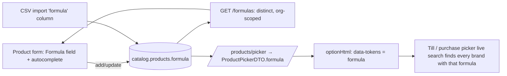

# PH-FORMULA — a medicine's formula (generic / salt composition)

Status: **IMPLEMENTED + GATED 2026-09-26.** Deployed (catalog V20 applied); `pharma-formula.cy.js` **5/5 green**
(red 5/5 before the build). DB-checked: a formula sent as "  zinc…   20mg " is stored "zinc… 20mg"; the product saved
while the row was hidden kept "Paracetamol 500mg"; preset restored to CUSTOM; no explicit switch saved. NOT committed.
- catalog: `Product.formula` + V20 (column + `idx_products_org_formula`), `ProductService.normalizeFormula` + the
  absent/blank write rule, `GET /products/formulas` (cached per tenant like manufacturers, evicted on product
  writes), picker DTO + query, product search `q`, CSV import column. `ProductFormulaTest` 5/5 (real MySQL,
  0 skipped), `ProductImportSpecTest` 18/18, `ProductPickerCacheTest` 7/7.
- business-service: `pos.product.showFormula` (default OFF). monolith: `/formulas` proxy; product form row
  (`<datalist>` suggestions); preset resolver gains **opt-in fields** (`POS_OPT_IN`: shown only by a preset or an
  explicit ON, and hidden on a settings FAILURE); picker sub-text = formula when shown.
- **Discovered while building:** bootstrap-select 1.6.2 has no `data-tokens`; its live search matches the rendered
  option text INCLUDING `data-subtext` — so the formula is searchable exactly where it is shown.
- **Deferred:** the product-grid Formula column (hard-coded column indices/toggles; display only) — its own change.
- Gate `pharma-formula.cy.js` (5 cases) — **RED on the current build (5/5)**; preset restored to its original.
Requested by a pharmacy tenant: record the formula when registering a medicine, and let each tenant show/hide it.
User decisions (2026-09-25): formula LIST with autocomplete (not free text) · searchable in the till's product
picker in v1 · NOT printed on receipts by default.

## 1. Why — how pharmacies actually use it (market check)
In Pakistan/India "formula" = the **salt composition**, e.g. *Paracetamol 500mg + Caffeine 65mg* (Marg ERP
"Salt/Composition", local PK pharmacy software "Formula/Generic", Odoo pharmacy add-ons "active ingredient"). Its
everyday use is **substitution**: the brand asked for is out of stock → find another brand with the SAME formula.
So v1 must make formulas consistent (a list, not free text) and searchable, and v2 adds "Alternatives" at the till.

## 2. What exists (traced)
- No formula / generic / salt field anywhere (catalog Product, pharma entities, templates).
- The product form's only configurable dropdown precedent is **manufacturer**: a String column on
  `catalog.Product` + `GET /manufacturers` returning its distinct values for the dropdown. PH-FORMULA reuses that
  exact pattern — no new master table, consistent with the codebase.
- Field show/hide settings exist only for the SALE line (`pos.entry.show*` in `BusinessSettingsCatalog`), grouped
  by `pos.entry.preset` (RETAIL / PHARMACY / DISTRIBUTION / RESTAURANT, preset never overrides a switch the
  owner set). The PRODUCT form has none yet.
- Till picker: `/catalogProductPicker` → catalog `GET /products/picker` → JPQL constructor query into
  `ProductPickerDTO` (`ProductRepository:91`), cached per tenant (CACHE-1, evicted after commit on product writes);
  options built once in `js/common/product-picker.js optionHtml()` (sale AND purchase screens share it).
- CSV import: `ProductImportSpec` (catalog-service).

## 3. Design

1. **Data (catalog-service):** `Product.formula VARCHAR(191) NULL` + index `(organization_id, formula)`.
   Flyway (next catalog version after the made-to-order V19). NULL = none — never `''`
   (the optional-code-fields rule). **Normalised at write**: trimmed, inner whitespace collapsed; matching is
   case-insensitive (column collation), so "paracetamol 500mg" and "Paracetamol  500mg" are one formula.
2. **List:** `GET /formulas` (org-scoped, distinct, sorted) — the manufacturer endpoint's twin — proxied by the
   monolith. The form offers it as autocomplete; a new value is simply typed (added on the spot).
3. **Show/hide:** tenant setting `pos.product.showFormula` in `BusinessSettingsCatalog`, group "Product form",
   **default OFF**; the **PHARMACY preset turns it ON** (a switch the owner set explicitly still wins). A grocery
   or mobile shop never sees it.
   - **Hidden ≠ deleted:** hiding the field never clears stored formulas; they reappear when shown. (The sale
     line clears a hidden DISCOUNT because it would keep applying money; a formula is a label, so it is kept.)
4. **Picker search:** `ProductPickerDTO` gains `formula`; `optionHtml` adds it to the option's search tokens (and
   as grey sub-text when the setting is on), so typing a formula lists every brand with it — on the sale AND
   purchase screens, from the one shared builder. Payload: the field is sent only when non-null.
5. **Product grid:** an optional "Formula" column (follows the same setting).
6. **CSV import:** optional `formula` column in `ProductImportSpec` (normalised the same way).
7. **Not printed** on receipts by default (user decision). A later receipt-designer field if a pharmacy asks.
8. **Tenancy / security:** org-scoped reads and writes (findScoped, anti-IDOR); the XSS-safe rendering rule for
   the grid and picker (`escHtml`).

## 4. v2 (separate go-ahead)
"Alternatives" at the till: when a picked product is out of stock, list in-stock products with the same formula.

## 5. Tests
- `mvn test` (catalog): normalisation (trim/collapse, NULL for blank), `/formulas` distinct + org-scoped (another
  tenant's formulas never appear), picker DTO carries formula, CSV import column.
- Cypress `pharma-formula.cy.js` — RED first:
  1. PHARMACY preset → the Formula field is on the product form; RETAIL → it is not;
  2. owner switches it off → hidden; a product's stored formula SURVIVES and returns when switched back on;
  3. register two brands with the same formula (different case/spacing) → one entry in the autocomplete;
  4. at the till, typing the formula in the picker lists BOTH brands;
  5. CSV import with a formula column stores it;
  6. anti-IDOR: another tenant's formulas never appear in the list.

## 6. Coordination and write semantics (updated 2026-09-25)
- catalog-service is clear: the made-to-order work is committed (f9f23f0e). This slice's migration is **catalog V20**,
  information_schema-guarded like its neighbours.
- **ABSENT vs BLANK — the rule that keeps "hidden ≠ deleted" true.** `ProductService.apply()` treats null as "not
  supplied" for some fields and assigns others unconditionally (see ProductPurchaseUnitTest for why). Formula takes
  both, deliberately: the form OMITS the field entirely while it is hidden → the DTO's `formula` is null → the stored
  formula is KEPT; a VISIBLE box cleared by the user sends `""` → stored as NULL (no formula). Without this, saving a
  product while the field is hidden would wipe its formula. A unit case pins both.
- Formula is descriptive text, not a policy → no capability guard (unlike madeToOrder's).
- Test note: `TestTenant.authenticate()` leaves capabilities unresolved (= allow-all); any refusal case must use
  `authenticateWithCapabilities(...)`. No formula case asserts a capability refusal.
