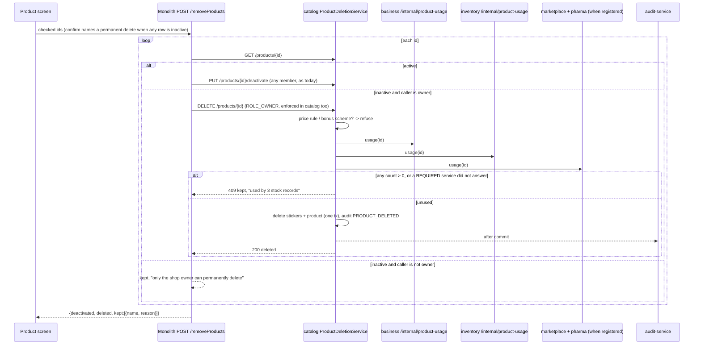

# PROD-DEL — deleting a product: deactivate first, then remove permanently

**Status 2026-09-15:** IMPLEMENTED — shipped in `cfa8a761` (09-14; this line still read "Not implemented").
First gate run (`product-permanent-delete.cy.js`, headed, solo, on the BLK-5 build) = **4/5**: case 2's repeat delete
answered `kept: "Could not be removed. Please try again."` instead of "already removed". Cause: `removeProducts`
caught Spring's `HttpClientErrorException.NotFound`, but `CatalogRestClient` → `GatewayClient` (:221-233) turns every
404 into `com.web.error.DownstreamNotFoundException`, so that branch was dead. **Fixed** (user consent): the catch
takes both; unit test `CatalogControllerRemoveProductsTest` 3/3 (`mvn -Dtest=`). **✅ GATED GREEN 5/5** (headed, solo,
2026-09-15 12:36-12:37, monolith rebuilt 12:34 — the RUNNING `/app.jar`'s CatalogController.class verified to carry
the fix). Also: `product-crud.cy.js`'s bulk-delete case still waited on `/deactivateProduct`
(red since `cfa8a761`); spec updated to `/removeProducts`, 14/14.
_Original status (2026-09-14): design, rulings taken (below)._
Related: `slices/blk-4-product-optimistic-lock.md` §6 (the gap that raised this), STANDARDS §0c question 5.

## 1. The ruling (the user, 2026-09-14)

> "active delete should be deactivated and deactivated should be deleted permanently"

| Decision | Ruling |
|---|---|
| A deactivated product that is still referenced (stock, sales, purchases, orders, dispensing…) | **Refuse**; it stays inactive, and the message says what it is used by |
| Who may permanently delete | **The shop owner only** |
| A selection mixing active and deactivated products | **Handle each, then report** ("3 deactivated, 2 deleted, 1 kept: has stock records") |
| A deactivated product with only its own setup attached | **Stickers are deleted with it; a price rule or bonus scheme blocks the delete** |

## 2. What exists today (traced 2026-09-14)

- The Product screen's Delete calls `bulkDeleteProduct` → `deactivateProducts` → monolith `POST /deactivateProduct`
  → catalog `PUT /products/{id}/deactivate`. It never deletes. Selecting an inactive row and pressing Delete
  deactivates it again, which does nothing.
- Deactivating is **unmapped** in `PermissionInterceptor`, so every member can do it (16 on Standard included).
  This slice keeps that exactly: **nobody loses anything**.
- catalog `DELETE /api/catalog/products/{id}` exists, gated `DELETE_PRIVILEGE`, does a plain row delete, and
  **has no caller** anywhere (grep of every service, the monolith and Cypress).
- **Nothing in any database stops a product row being deleted.** No live foreign key references `products`
  (`information_schema.key_column_usage`: 0). Inventory's own `products` table is an empty leftover.

### 2.1 Every place a product id is stored — 22 columns in 5 databases

| DB | Table.column | rows (dev) | `organization_id`? |
|---|---|---|---|
| business `myplusdb` | `sell.product_id` | 2,643 | yes |
| | `sell_batch.product_id` | 2,078 | yes |
| | `purchase.product_id` | 1,381 | yes |
| | `sale_return.product_id` | 256 | yes |
| | `purchase_return.product_id` | 12 | yes |
| | `sales_quote_line.product_id` | 207 | **no** |
| | `serial_unit.product_id` | 158 | yes |
| inventory | `stock_levels.product_id` | 3,742 | yes |
| | `stock_entries.product_id` | 4,708 | yes |
| | `stock_adjustments.product_id` | 32 | **no** |
| | `stock_transfers.product_id` | 0 | **no** |
| | `stock_alerts.product_id` | 0 | **no** |
| | `reservation_picks.product_id` | 3,328 | **no** |
| marketplace | `order_items.product_id` | 1,389 | **no** |
| | `cart_item.product_id` | 398 | **no** |
| pharma | `dispensing.product_id` | 55 | yes |
| | `prescription_items.product_id` | 83 | **no** |
| | `medicine_clinical.product_id` | 29 | yes |
| catalog | `product_barcode.product_id` (stickers) | 65 | yes |
| | `price_rule.product_id` | 1 | yes |
| | `bonus_scheme.trigger_product_id` / `reward_product_id` | 26 | yes |

### 2.2 The measured effect of the ruling (dev, 2026-09-14)

5,681 products, **51 deactivated**. Of those, **35 are referenced by nothing** and would be deleted; **16 have
stock records** and would be kept; **0** have sales.

## 3. Design

### 3.1 The usage contract (commerce-contracts)

`ProductUsageClient` — `@GetExchange("/internal/product-usage/{productId}") ProductUsage usage(Long productId)`.
`ProductUsage` = `Map<String, Long> counts` (a human label → rows). One interface, one proxy per service
(`http://business-service`, `http://inventory-service`, `http://marketplace-service`, `http://pharma-service`).

### 3.2 Each owning service answers for its own tables — ONE shared controller

**As built:** `common-service` `ProductUsageController` at `/internal/product-usage/{productId}`, auto-registered in
every JPA service by `CommonServiceAutoConfiguration`, exactly as `DemoPurgeController` is. It walks the JPA
metamodel and counts every entity with a `productId`, `triggerProductId` or `rewardProductId` attribute. So
there's **no per-service table list**, and a table added later that stores a product id is protected
automatically. A non-numeric attribute of those names throws: it isn't skipped, and the caller reads that as
"could not confirm". **Read-only.** Not routed by the gateway. Identity arrives forwarded, and a request naming
no tenant is refused.

- **Counted by product id ONLY, never narrowed by organization.** Catalog asks only after resolving the product
  inside the caller's tenant, and product ids are globally unique. An org filter could only LOWER a count, for
  example missing a legacy NULL-org row, and a lower count means an orphaning delete. The answer is a count,
  never a row.
- Labels are derived from the entity name ("StockLevel" → "stock level records").

### 3.3 Catalog decides

`ProductDeletionService.deletePermanently(id)`, behind `DELETE /api/catalog/products/{id}` now gated
**`hasAuthority('ROLE_OWNER')`** (it has no caller today, so tightening it breaks nothing):

1. Resolve within the tenant. **Not found → "already removed"** (idempotent: a retry after a timeout must not
   read as a failure, and the same answer for an id in another tenant reveals nothing).
2. **Active → refuse**: "Deactivate it first." The server holds the two-step rule, not only the screen.
3. Price rules or bonus schemes naming it → refuse, with counts. Stickers do not block.
4. Ask every consulted service. **business and inventory are REQUIRED**: no answer means refuse ("could not
   confirm it is unused"). **marketplace and pharma are consulted when registered in discovery**, because a
   POS-only deployment has neither service nor database. Configurable:
   `catalog.product-usage.required` / `catalog.product-usage.optional`.
5. Any count > 0 → refuse, naming the largest counts in the owner's words ("3 stock records, 1 purchase").
6. Otherwise, in one transaction: delete its stickers, delete the product, record `PRODUCT_DELETED`
   (id, SKU, name, stickers removed) through `CatalogAuditService`, delivered after commit.

### 3.4 The monolith orchestrates the selection

`POST /removeProducts {checked}` replaces `/deactivateProduct` for the Delete button, and stays unmapped in the
interceptor because deactivating is open to every member today. Per id, as in the diagram. A non-owner's
inactive rows are reported as kept, and catalog enforces owner-only again for any caller that bypasses this.
The report is the response; the screen shows it as one message.

### 3.5 The screen

- The confirm dialog (`uiConfirm`, never `window.confirm`) names a **permanent** delete whenever any selected row is inactive.
- The result message reports each outcome.
- `product-picker.js` MUTATES regex gains `removeProducts`, or a deleted product stays in the till picker until a reload.
- myplus-91's BLK-2 lines in `catalog-products.js` (716/740/969–970) are untouched.

## 4. Known limits (recorded, not solved)

- **The check-then-delete window.** Selling or buying an **inactive** product is not refused server-side
  (`ProductRef` carries no active flag), so a sale or purchase could reference the product between the usage
  check and the delete. The pickers exclude inactive products, so it needs an API client or a stale screen.
  Closing it would mean every writer refusing inactive products, which is its own slice.
- **An optional service that is down but deregistered is skipped.** Orders and dispensing almost always leave
  sales or stock rows too, which the required services catch, but not always.
- **"Delete a product" (`product.delete`) still governs nothing:** the ruling made permanent delete owner-only.
  The matrix label is misleading until that is reconciled.
- **Pharmacy staff** hold no PERM-1 codes (see BLK-4 §6). Unaffected here: deactivation stays unmapped and
  permanent delete is owner-only.

## 5. Tests

- **catalog** `ProductDeletionServiceTest` (Testcontainers, usage clients mocked): refuses active; refuses a
  price rule and a bonus scheme; refuses a count from any service; **fails closed** when a required service
  errors; skips an unregistered optional service; deletes stickers + product; "already removed" on a repeat;
  audit recorded.
- **business** `InternalProductUsageControllerTest`: counts only the caller's tenant where the table is scoped.
- **Cypress** `product-permanent-delete.cy.js`, solo as `owner.business@`:
  1. Delete on an active product deactivates it.
  2. Delete on that deactivated, unused product removes it, and it's gone from search and the picker.
  3. A deactivated product with stock is kept, and the message names the stock.
  4. A mixed selection reports each outcome.
  5. `admin.business@` / `user.business@` can deactivate but not permanently delete.
  6. A repeat delete answers "already removed".
- **Test Book:** a manual section, once the right account is signed in.

## 6. Deploy

`mvn install` commerce-contracts, then catalog, business, inventory, marketplace, pharma and the monolith. A
service left on the old contract jar makes catalog's required usage check fail. That fails **closed** (the
delete is refused, nothing is orphaned), so a half deploy is visible and harmless.
