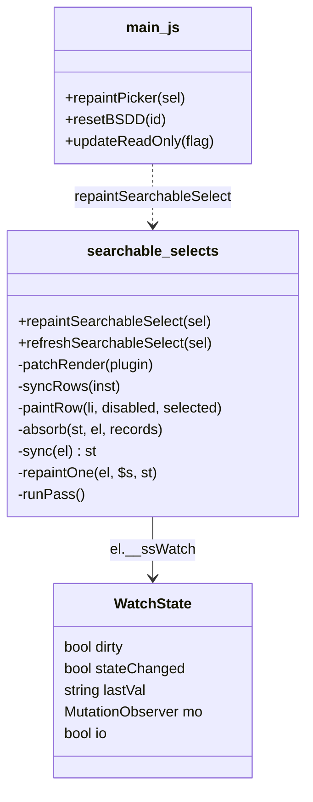
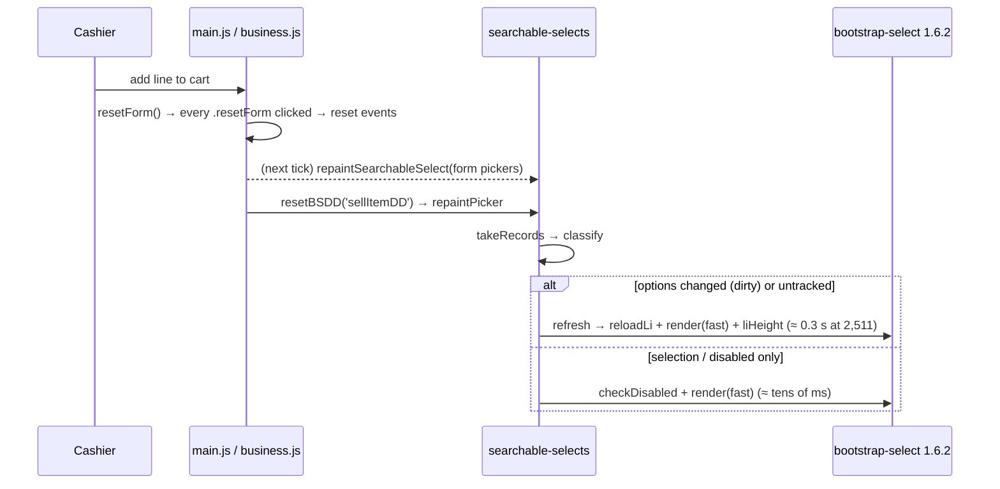

# PSEL-1 — a sale picker is redrawn in milliseconds, not seconds

**Status 2026-09-15: ✅ GATED GREEN — `sale-picker-speed.cy.js`, user-reported, on the monolith built 13:05:04
(container 13:05:48; served searchable-selects.js / main.js / business.js == src, verified).** **Regressions COMPLETE**
(18 specs, §5): 16 green; `sell` and `purchase-inline-product` failed for causes proven outside PSEL-1, each with its
own owned fix. Gate re-run GREEN 8/0 on the 14:22 builds (CACHE-1 live). Manual cases in the Test Book (§16, "New Sale
on a big shop answers at once"). **Committed 2026-09-15 17:17 by the user as `25304ae2` ("f9 done") — ONE commit
with the prefetch ruling, CACHE-1, SALE-DEF and PUR-INLINE fixes A + B (30 files).** A PSEL-1-only commit was staged
(11 files, `business.js` 2 hunks) but the user committed the whole tree instead. SALE-DEF, A and B went in before their
post-rebuild gate run (monolith 17:14) finished — that run (myplus-f9) is now the gate on committed code.
**That run is GREEN — every spec on the list, on the build carrying `25304ae2`:** sale-defaults-race 4/0, purchase-inline-product
10/0, sell 31/0, sale-customer-first 7/0, pos-shortcuts 20/0, park-hold 3/0, business-modal-keyboard 19/0, purchase-rapid-entry
28/0, keyboard-chain-order 7/0, pos-keyboard 22/0, education-modal-keyboard 30/0, pos-checkout-chain 15/0, pos-cell-layout 12/0,
pos-enter-chain 7/0, pos-quickpick 15/0, pos-sale-endtoend 6/0. Two intermittent spec races were found on the way, neither a
product defect: (1) `cy.enableScanBox` pinned the scan box before the page's settings landed and was overwritten — fixed in the
shared helper (waits for `posDefaultTender`), user-approved; (2) `pos-cell-layout` :253 syncs on a price that is now filled
synchronously from `data-price`, so it pressed Enter before `loadStock` had finished — passed on re-run; the spec now waits
for the quantity and the Sellable badge (12/0), and the scan cases assert the line quantity (pos-checkout-chain 15/0).
**Fast-Enter question — NOT REPRODUCED** (`diag/fast-enter-price.cy.js`, opt-in): the walk past the price was usable in 235
of 235 frames after a pick and in 5 of 5 no-wait attempts, and no line was committed. That also leaves the single red's cause
UNEXPLAINED — only its mechanism (`commitLine` → empty Qty, `pos-keyboard.js:564`) is proven. No product change. Consent: the user, 2026-09-15 ("go for Proposed fixes" — F1, F2, F3). Parent: the dashboard-freeze work
(`blocking-ui-and-backend-guards-design.md` §4.3.3, memory `dashboard-freeze-searchable-selects`).

---

## 1. Document

Opening **New Sale**, clearing a line (**Esc** / Cancel), and **adding a line to the cart** each froze the till for
seconds on a large catalogue. Fix v2 of the dashboard freeze had moved picker rebuilds off the dashboard; this slice
makes a rebuild cheap, and stops the ones that were never needed.

**Measured, not reasoned** — CDP CPU profile (`cypress/e2e/diag/sale-open-profile.cy.js` →
`cypress/results/sale-open-profile-*.json` + `.cpuprofile`), 2026-09-15:

| demo.business (2,511 products) | ms |
|---|---|
| one `#sellItemDD` refresh | 8,815 |
| └ `render()` → `setDisabled` 8,424 + `setSelected` 8,096 (two refreshes) | 17,004 of 17,658 |
| └ rebuilding the rows: `reloadLi` + `createLi` + `liHeight` (two refreshes) | ≈ 900 |
| self time in jQuery `attr` + native `getAttribute` | 10,746 |
| **New Sale opens** — `#sellItemDD` refreshed TWICE, one long task | **17,971** |
| **one line reset** — two more full refreshes | **16,794** |

owner.business (1,892 products, 1,615 customers): New Sale 7.3 s of refresh; one reset 8.4 s.

**Cause.** bootstrap-select **1.6.2** `render()`:

```js
render: function (b) { var c = this;
  b !== false && this.$element.find('option').each(function (b) {
    c.setDisabled(b, $(this).is(':disabled') || $(this).parent().is(':disabled'));
    c.setSelected(b, $(this).is(':selected'));
  }); …
setSelected: function (a, b) { this.findLis(); this.$lis.filter('[data-original-index="' + a + '"]').toggleClass('selected', b) }
```

Each option runs an attribute match across **every** row, twice: **O(n²)** — 2,511 options ≈ 12.6 M matches. It
explains why the per-option cost ROSE with the catalogue (1.2 → 2.9 ms/option). ⚠ The earlier guess (liHeight
cloning the menu, reloadLi) was wrong: those are 0.3 s.

**Why it ran so often** — refreshes that change neither the options nor anything a rebuild fixes:

| Site | What actually changed | Runs on |
|---|---|---|
| `main.js:314` form-reset handler | the selection | every form reset — and `resetForm()` clicks EVERY `.resetForm` on the page, so one cart add resets every form |
| `main.js:1519` `updateReadOnly` | `#sellItemDD` disabled | every `[id^=reset]` click (`main.js:1184`), every section open (`loadDataTable` end), every save |
| `main.js:1557` `resetBSDD` | the selection (`.val('default')`) | every cart add (`business.js:265`), every Esc (`pos-keyboard.js:622`) |
| `business.js:656` / `:674` edit lock / unlock | disabled | opening / leaving an invoice edit |

⚠ **And a latent bug:** the `reset` event fires BEFORE the form's fields reset (HTML form-reset algorithm: fire
`reset`, then reset each control), so the handler's synchronous refresh always drew the OLD selection.

**User value.** The till answers the keyboard as soon as New Sale opens, a cleared line is instant, and adding a
line no longer rebuilds a 2,500-product list.

## 1b. Standards

| Dimension | Rule |
|---|---|
| **Business / domain** | A POS till is operated by keyboard at speed; a freeze on the most frequent actions (open sale, add line, clear line) is a correctness problem at the counter, not a cosmetic one (the pos-enter-chain "animating" failures). |
| **SaaS multi-tenancy** | Client-only; no data path changes. Scales with the tenant's catalogue — which is why it bit the largest tenants. |
| **Live-modules rule** | No behaviour change: F1 produces byte-identical menu HTML (gated); F2/F3 repaint what changed and fall back to the old full refresh whenever the options changed or searchable-selects.js is absent. |
| **Microservice boundaries** | None touched — static JS in the monolith. |
| **Design patterns** | **Decorator / monkey-patch with feature detection** on the plugin prototype (the library is vendored, minified, and replaced wholesale later — no fork); **lookup-table (index map)** turning O(n²) into O(n); **Dirty-flag** refined into two flags (options dirty vs state changed). |
| **SOLID / DRY** | One owner for picker redraw rules: `searchable-selects.js` (`repaintSearchableSelect`); `main.js`'s `repaintPicker()` is the single call-site wrapper, used by main.js and business.js. |
| **Unit tests (`mvn test`)** | **Not applicable** — client-only: three static JS files, no Java, no schema, no endpoint. The browser gate below is the executable check; `sale-picker-speed.cy.js` case 1 is the equivalence test a unit test would otherwise be. |
| **Testing standard** | Gate `sale-picker-speed.cy.js`: an **equivalence** case (fast vs original render, same menu HTML — the regression a "faster but different" patch would break), timing cases with the measured before-values in their messages, and the "options changed ⇒ still rebuilt" case (the regression a repaint-only shortcut would break). |

## 2. Design

**F1 — `render()` in one pass** (`searchable-selects.js`, `patchRender`). At load, if the plugin's prototype has
`render`, `setDisabled`, `setSelected`, `findLis` (1.6.2's shape), `render` is replaced by:

```
render(updateLi):
  if (updateLi !== false) syncRows(this)      // index every row by data-original-index ONCE, then per option
                                              // the SAME predicates and the SAME DOM effects as setDisabled/setSelected
  return original.call(this, false)           // the library's own "rows already right" path: tab index, label, title
```

The original stays reachable as `render.__ssOriginal` so the gate compares the two outputs. Single-row calls
(`setSelected` from a click) are untouched — O(n) once, as today.

**The watcher learns two kinds of change.** A `.prop('disabled', …)` on the `<select>` changes its OWN `disabled`
attribute, which the MutationObserver reported as "options changed" — so every disabled toggle would still have
forced a rebuild. Records are now sorted: the select's own `disabled` → `stateChanged`; anything else → `dirty`.
`markClean` clears both. The pass repaints (`checkDisabled` + `render`) a picker whose selection OR state changed.

**F2/F3 — repaint, don't rebuild** (`repaintSearchableSelect(sel)`):

```
for each <select> in sel:
  no instance        → selectpicker('refresh')          (exactly what the caller used to get — it constructs)
  fold in QUEUED records first (takeRecords) — the observer reports on a microtask, and a caller that changed
  the options one line earlier must still get its rebuild
  untracked or dirty → refresh + markClean              (options changed: the old behaviour, now cheap too)
  otherwise          → checkDisabled + render           (selection / disabled only: no rows rebuilt)
```

Call sites: the reset handler (**deferred one tick**, so it draws the post-reset selection), `updateReadOnly`,
`resetBSDD`, and business.js's edit lock / unlock — all through `main.js`'s `repaintPicker()`, which falls back to
`selectpicker('refresh')` on a page without searchable-selects.js or for a select that is not yet a picker.

**Not changed:** `loadUserItems` still refreshes (its options really are rebuilt); the 26 `education.js` refresh
sites (F1 alone makes each O(n)); `pos-keyboard.js` (myplus-f9's file — its `clearLine` calls `resetBSDD` and the
reset button, both now cheap).

**Review after green (2026-09-15) — every other direct `selectpicker('refresh')` outside education and this file: 15
sites, all now O(n) through F1, none needs converting:**

| Class | Sites | Why a refresh stays right |
|---|---|---|
| options rebuilt (8) | business.js 636 (edit line), 2677 (companies), 2710 (vendors), 2752 (`loadUserItems`); main.js 1478 (row→form fill rewrites the selected option's TEXT), 1808; driver-settlement.js 104; territory.js 85 | the rows really are new |
| small selects (4) | business.js 2941, 3078, 5257 (`#sellDiscountTypeDD`, 2 options), 5279 (`#sellPayMethod`) | nothing to save |
| selection or append (3) | business.js 2810 `selectPurchaseProduct` (appends when missing); crud-modal.js 96 (entity modal after save); catalog-products.js 574 `refreshPicker` (brands) | occasional, not per keystroke; a refresh is ≈ 0.3 s at 2,511 now |

The stock-block path (`business.js:2948`, only with "Check stock when an item is selected" ON) goes through
`resetBSDD` → repaint. No spec reaches it (the setting is off by default) — it is a Test Book hand-walk.

## 3. Architecture & UML

```mermaid
flowchart LR
    subgraph "caller (unchanged intent)"
      R["form reset (main.js:314)"]
      U["updateReadOnly (main.js:1519)"]
      B["resetBSDD (main.js:1557)"]
      E["edit lock/unlock (business.js:656/674)"]
      L["loadUserItems — options rebuilt"]
    end
    R -->|setTimeout 0| RP["repaintPicker()"]
    U --> RP
    B --> RP
    E --> RP
    RP --> H["repaintSearchableSelect()"]
    H -->|dirty / untracked / no instance| RF["selectpicker('refresh')"]
    H -->|selection / disabled only| RD["checkDisabled + selectpicker('render')"]
    L --> RF
    RF --> BS["bootstrap-select 1.6.2"]
    RD --> BS
    BS -->|render()| F["patched render: syncRows O(n) → original render(false)"]
```





## 4. Implement

- [x] `searchable-selects.js`: `patchRender` / `syncRows` / `paintRow`; `absorb` + `sync`; `stateChanged` in
      watch/markClean/runPass; `repaintSearchableSelect` (+ `window.` export)
- [x] `main.js`: `repaintPicker()`; reset handler deferred + repaint; `updateReadOnly` and `resetBSDD` → repaint
- [x] `business.js`: edit lock (`:656`) and `exitSellEditMode` (`:674`) → repaint
- [x] gate `cypress/e2e/business/sale-picker-speed.cy.js` (written first)
- [x] build: monolith (jar 13:05:04); gate SOLO headed — GREEN, user-reported 2026-09-15
- [x] Test Book: manual cases (§16) + the §16 note that said New Sale was still slow corrected
- [x] diag profiler kept as an opt-in tool: `npm run test:e2e:diag:sale-open` (skipped without `--env diag=1`);
      `Error.stackTraceLimit = 60` so its `by` column names the app caller
- [ ] regressions (§5) — user, one at a time, on the same monolith build, no catalog rebuild mid-run
- [ ] commit — ask the user

## 5. Test

**Gate `sale-picker-speed.cy.js`** — owner.business@ (POS) and demo.business@ (the largest catalogue). SOLO.

| # | Case | What the defect would break |
|---|---|---|
| 0 | the served build carries PSEL-1 (the patch is installed on the plugin) | a stale monolith passing for the wrong reason |
| 1 ⭐⭐ | fast render == original render: same menu HTML, with disabled options, a disabled optgroup, a selected option, the whole select disabled, and a multiple select | a "faster but different" render |
| 2 ⭐⭐ | New Sale opens: each `#sellItemDD` refresh < 2 s (was 8.8 s), no long task ≥ 3 s (was 18 s), at most ONE refresh of it (was two) — both accounts | F1 / F3 |
| 3 ⭐⭐ | clearing a line: no `#sellItemDD` refresh (was two), no long task ≥ 1 s, and the button shows the cleared state (the post-reset selection — the latent bug) | F2 |
| 4 ⭐ | what a cart add calls (`resetForm` + `resetBSDD` + `updateReadOnly`): no `#sellItemDD` refresh, no long task ≥ 1 s | F2 / F3 |
| 5 ⭐⭐ | a picker whose OPTIONS changed one line earlier is still REBUILT by resetBSDD (the new option gets a row) | a repaint-only shortcut / the microtask trap |
| 6 ⭐ | `updateReadOnly(true/false)`: the button and the rows show disabled / enabled, with no refresh | the watcher's state/options split |

**Regressions (18, all in `cypress/e2e/business/`, existence checked):** `dashboard-no-freeze`, `sell`,
`grid-loading`, `busy-controls`, `pos-keyboard`, `pos-enter-chain` (waited on this), `pos-shortcuts`,
`pos-checkout-chain`, `pos-sale-endtoend`, `keyboard-chain-order`, `sale-customer-first`, `sale-nonblocking-load`,
`picker-prefetch`, `sell-edit` (the edit lock), `purchase`, `purchase-rapid-entry`, `purchase-inline-product`,
`sale-picker-chain`. Education (F1 reaches its 26 refresh sites) is covered by the Test Book walk, not a spec.
Measured numbers after the fix: re-run `npm run test:e2e:diag:sale-open` (the gate's `cy.log` timings are not in
`cypress run` output).

**Regression run 1 (myplus-f9, 2026-09-15 13:23–13:26, monolith 13:05, catalog 09-14): STOPPED at 2 of 18.**
`dashboard-no-freeze` 5/5 · `sell.cy.js` 29/31. Both reds have ONE pre-existing cause that PSEL-1 EXPOSED (it is not a
PSEL-1 logic defect). Traced separately by both sessions, from screenshots, code and git:
- `loadPosFeatureFlags()` (business.js:182, on load) → `applyPosFieldVisibility()` applies the tenant's defaults for
  a fresh sale WHENEVER `/getBusinessConfig` lands: `#sellPayMethod` ← `posDefaultTender` (:5277; its `posDefaulted`
  latch blocks only a SECOND application, not overwriting a cashier's choice) and `onCustomerModeChange(default)`
  (:5284, no guard; it also CLEARS `sellCN`/`sellCC`). Since 43a4ba82 (08-09) / 916d5f3a (08-10).
- Screenshot 2: payment method **Cash** after beforeEach chose CREDIT → `owesBalance` false → no red, correctly.
  Screenshot 1: mode back on **Select** after Enter Manually; the log shows `getBusinessConfig` finishing after the click.
- Why only now: New Sale used to freeze 7–18 s, and the config always landed inside that freeze, before any click.
- User impact: the TENDER label can flip CREDIT→CASH (the due is still recorded — `sellCh` = 0 − total < 0 keeps
  `owesBalance` true, main.js:476), and a typed walk-in name is erased (a fully paid sale then completes unattributed).
- Fix: a cashier's own choice latches; the default applies only to what they have not touched. Gate first
  (`sale-defaults-race.cy.js`: delay `/getBusinessConfig`, choose CREDIT + Manual before it lands, assert both survive;
  an untouched sale still gets the default). **Consented by the user in myplus-f9's session; f9 owns and implements it.**
- **Regression run 2 (f9, 13:05 build): 10 GREEN, then STOPPED.** grid-loading 12/0 · busy-controls 21/0 ·
  pos-keyboard 22/0 · **pos-enter-chain 7/0** (the last of the four reds this slice exists for) · pos-shortcuts 20/0 ·
  pos-checkout-chain 15/0 · pos-sale-endtoend 6/0 · keyboard-chain-order 7/0 · sale-customer-first 7/0 ·
  sale-nonblocking-load 5/0 · **picker-prefetch 1/3** — NOT PSEL-1, PROVEN: all 3 failure texts read
  `shouldPrefetch=false, network=slow-2g`; monolith RUM beacons for those pages (08:44:57, 08:45:19, 08:45:42Z) report
  `conn=slow-2g`, the passing case's page (08:45:44Z) `4g`; the picker files are unchanged since 09-14. Chrome's estimate
  flips on this machine and the prefetch declines by design (picker-prefetch.js:55). **The user decided (2026-09-15): a
  PRODUCT change, not 3B** — `shouldPrefetch()` honours Save-Data and a hidden tab only, no longer `effectiveType`; spec
  case 3 flips its 2g assert to "prefetches". myplus-f9 makes it, in the same monolith rebuild as SALE-DEF. The 5 not
  run (sell-edit, purchase, purchase-rapid-entry, purchase-inline-product, sale-picker-chain) are running on 13:05.
- **Regression run 3 (f9, 13:05 build):** sell-edit 5/0 · purchase 22/0 · purchase-rapid-entry 28/0 ·
  **purchase-inline-product 5/5 → STOPPED** · sale-picker-chain not run. **NOT PSEL-1 — two PUR-INLINE defects present
  since its own commit e3582e27 (git blame), and that gate was never green** (its design doc: "Awaiting a re-run"):
  1. cases 2, 3, 4, 6: `newProduct(onCreated)` sets the callback (catalog-products.js:343) and then calls
     `resetProductForm()`, which nulls it (:518). The save takes the ordinary Products path (loadDataTable → `edit`
     reset; no hand-back); `selectPurchaseProduct` never runs. Fix: reset first, then set (safe for all 6 callers).
  2. case 5: every `EnterChain.bind` is its own capture listener that evaluates `active()` when it runs; the product
     chain (keyboard-forms.js, loaded first) closes its modal synchronously, then the purchase chain on the SAME event
     sees itself top-most and closes the bill. Fix: mark a handled Escape on the event; chains skip a marked one.
  Served == src; no server errors bar case 8's deliberate 400. Fixes await consent + an owner; they would join the
  SALE-DEF + prefetch rebuild, gated by this spec's own cases 2–6.
- **Builds changed 14:22:55 (catalog) / 14:22:59 (monolith), not requested by either session.** Verified by curl vs
  cmp: searchable-selects.js, main.js, business.js == src (PSEL-1 still in, byte-identical, so the 13:05 greens stay
  valid evidence for this slice's code); picker-prefetch.js == src (Save-Data-only rule LIVE); catalog-products.js and
  enter-chain.js != src (PUR-INLINE fixes A and B NOT in); catalog carries CACHE-1 (f9: new cache metrics). f9's guard
  aborted sale-picker-chain + sale-defaults-race before any spec started. Recommended (the user's call): run nothing on
  this in-between build; one monolith rebuild with A + B + SALE-DEF; then, solo: catalog-cache-aside, sale-picker-speed
  (re-gate on the catalog now under it), sale-picker-chain, purchase-inline-product, sale-defaults-race, sell,
  picker-prefetch, sale-customer-first, pos-shortcuts, park-hold.
- **Order (the user's):** the remaining 16 regressions FIRST on the 13:05 build (f9, started) → the race fix → monolith
  rebuild → `sell.cy.js` + `sale-defaults-race.cy.js` (+ suggested: `sale-customer-first`, `pos-shortcuts`).
- Commit note: both slices change `business.js` (PSEL-1: :656-658, :676 only). Commit together after the race gate
  is green, or stage by hunk — the user's call.

## 6. Known limits

- 1.6.2 stays; upgrading bootstrap-select is the long-term cure (virtual lists, no O(n) row DOM at all).
- A refresh is still ≈ 0.3–0.45 s at 2,511 options (row rebuild + liHeight) — now paid only when options change.
  ⚠ **ESTIMATE, not an after-measurement**: derived from the BEFORE profile's non-render share (`reloadLi` + `createLi` +
  `liHeight` ≈ 900 ms across two refreshes). The same holds for "≈ 0.3 s" and "≈ tens of ms" in the sequence diagram and
  the review table above. What the fix PROVES is the gate's bounds (each rebuild < 2 s, no long task ≥ 3 s, no rebuild on a
  reset / cart add / lock). Actual after-numbers come from `npm run test:e2e:diag:sale-open` — not yet run on the fixed build.
- Timing thresholds are machine-dependent; the gate prints the measured values so a slower machine reads as data.
