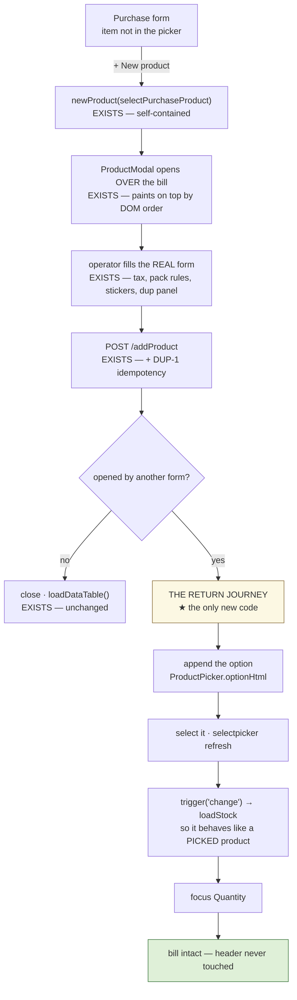

# PUR-INLINE — register a product without leaving the bill

**Status:** IMPLEMENTED. First gate run found **one real defect** (the modal opened invisible — fixed)
plus three faults in the spec/helpers (fixed). Awaiting a re-run; see §8.
**Reported:** *"during purchase if product is not already registered then customer have to leave the current
form, register the product, back to purchase and select product."*
Proposal page: https://claude.ai/code/artifact/010d40f2-d31b-43b8-9b53-26a7b8d939c7

---

## 1 · The friction

An unregistered product costs the operator **8 steps and the bill they were typing**: leave Purchase →
Products → New Product → save → close → re-open Purchase → retype vendor, invoice number and date → find the
product. Nothing preserves the bill header, so a part-typed delivery note is lost.

## 2 · ⚠ The design this replaced, and why

My first proposal was a **four-field inline panel** (Name / Unit / Sale price / Tax) drawn inside the purchase
form, on the argument that stacked modals were ruled out by the architecture. **The owner rejected it and was
right on both counts.**

- **It would have been a second product-creation UI.** Its own validation, its own duplicate check, and
  *without* tax codes, pack/loose rules, barcode stickers, categories, manufacturers or tracking flags — then
  drifting from the real form the first time either changed. That is precisely what this project's DRY rule
  forbids, and the reason `optionsHtml` exists in one place is the same reason a product form should.
- **"Ruled out by the architecture" was overstated.** Re-checked: `ProductModal` (`businessDashboard.html:3549`)
  is *later in document order* than `PurchaseModal` (`:1936`), and with one shared `z-index:1050` the later
  element paints on top. It stacks correctly today.
- **The Enter conflict I predicted does not exist.** With focus in `#prodName`, the purchase chain resolves the
  id, finds it absent from `fieldsIn('#Purchase')`, falls through the bootstrap-select lookup to `null`, and
  returns. The two chains never contend for Enter.

So: **open the real `ProductModal`, through the same `newProduct()`.** Recorded here because the rejected
design reads plausibly, and the next person to meet this problem will reach for it again.

## 3 · What already existed, and the one thing that did not

| Already there | Where |
|---|---|
| `newProduct()` needs no Products screen — reset, categories, tax codes, manufacturers, index, open | `catalog-products.js:211` |
| The product form, its validation, duplicate panel and every optional field | `ProductModal` |
| `/addProduct` → catalog, **plus** DUP-1's idempotency guard | `CatalogController:100` |
| The picker cache is dropped on any product write | `product-picker.js` `MUTATES` |
| Session authorities carry dotted permission codes, so `product.create` can gate the button | `AuthServerAuthenticationProvider:101` |
| A refill for the purchase picker | `loadUserItems('purchase')`, `business.js:2730` |

**The gap:** nothing hands the new product back. `ProductPicker.invalidate()` only nulls the cache, and
`selectpicker('refresh')` re-renders *existing* options — so the operator would close the modal and still not
find the product. The complaint moved, not fixed.

## 4 · The four traps this wiring had to avoid

1. ⭐ **`loadDataTable()` sets `edit = false`** (`business.js:1901`) — the **shared** edit-mode flag — and
   clears the sale-report table. It runs on every product save. Called while a purchase line was open behind
   the modal, it silently takes that line out of edit mode, so saving would **add** a line instead of updating
   one, with nothing on screen to say so. **Skipped on the return path**, deliberately, and the grid behind is
   not stale anyway.
2. ⭐ **jQuery fires a request's own `success` before its global `ajaxComplete`.** So inside the save's success
   handler the PERF-8 cache is *still stale*, and `loadUserItems('purchase')` would repaint the picker from a
   list that does not contain the new product. Hence **append the one option** instead — which is also instant,
   with no second round trip between the operator and the quantity box.
3. ⭐ **One Escape closed both forms.** Both Enter-chains were active; `onEscape` calls `preventDefault` but not
   `stopPropagation`, and every `bind()` adds its own document listener. Fixed with `isTopModal(id)` in
   `crud-modal.js`, asked by both `keyboard-forms.js` and the purchase chain — one answer to "which form owns
   the keyboard", trivially true when a single modal is open, so **nothing changes for the other 16 forms**.
4. `submit-once.js` took `.crud-overlay.open` **`.first()`** — `PurchaseModal` — so saving the *product* greyed
   out the *purchase's* Save button. Now `.last()`, which is the one on screen.

A fifth, smaller: the option is built by **`ProductPicker.optionHtml`**, extracted from `optionsHtml` so a
hand-rolled option cannot drift from the five pickers that share the real one (`data-product` is what
`main.js:699` reads to submit productId-native).

## 5 · Decisions

- **A callback, not a context string.** `newProduct(onCreated)` — `catalog-products.js` must not learn the
  purchase form's field ids, and the same hook serves the sale screen later with nothing changed there.
  Consumed exactly once, cleared on every open, on cancel, and on edit, so a form closed with Esc cannot leave
  an errand behind for an unrelated product.
- **Gated on `product.create`, not on a role** — the interceptor maps `POST /addProduct` to it, so an
  affordance without it would be a button that always refuses. The owner holds `everything()` and the built-in
  `Standard` set includes `product.create` (`V12:131`), so **no existing member loses the button**.
- **Refused while the item picker is disabled**, which is how EDIT mode renders it (`main.js:1483`): on an edit
  the line's product is fixed, so registering one to select into it would either do nothing or silently
  re-point the line. It says so instead.
- **`trigger('change')`** after selecting, so a registered product behaves exactly like a picked one —
  `.onChangeSelect` is what fills "Stock In Hand". Without it the line looks chosen while the stock figure
  beside it stays blank.
- **Focus asks `FocusFlow.mayAutoFocus()`** before landing on Quantity, so no soft keyboard opens over a bill
  on a tablet.

## 6 · Deliberately not in this slice

- **The sale screen.** You don't sell what you never bought; the purchase is where a product enters the shop.
  The callback hook means the sale side is a one-line addition when it is wanted.
- **A real z-index ladder for stacked overlays.** DOM order carries this pair correctly, and `isTopModal()` is
  the single place a future ladder would change.
- **The untaxed-product finding** (below) — it is wider than this slice.

> ⚠ **Found while reviewing, still open.** `TaxCode.isDefault` is declared, kept mutually exclusive on upsert,
> and has a finder — `findDefaultScoped`, with **zero callers**. `loadTaxCodes(null)` leaves the form on
> "Custom rate…" with an empty box. So **any** product saved without someone choosing a rate carries null tax
> and sells untaxed, through the Products screen just as much as through this path. Not introduced here and not
> fixed here; awaiting the owner's ruling.

## 7 · Gate

`cypress/e2e/business/purchase-inline-product.cy.js`:

1. `+ New product` opens the **real** `ProductModal` over the purchase form, and the bill header survives
2. registering returns to the bill with the product **selected**, and `#purchaseQuantity` focused
3. the appended option carries `data-product` — the id `main.js` submits
4. "Stock In Hand" is populated, proving `change` fired (a selected product with a blank stock box is the
   half-filled form this avoids)
5. **Esc on the product form closes ONLY it** — the bill stays open (trap 3)
6. saving a product from the purchase form does **not** clear `edit` (trap 1)
7. the whole journey ends in **one** product, not two (DUP-1 still holds through this path)
8. without `product.create` the button is absent
9. on an EDIT line the button refuses and says why
10. opened from the Products screen, the product form behaves **exactly** as before — closes, reloads the grid,
    no jump to the purchase picker (the regression this slice could cause elsewhere)

---

## 8 · What the first gate run found

**One real defect, caught exactly where it should have been.**

### ⭐ The modal opened invisible (cases 2 and 7)

`#ProductModal` was nested INSIDE `#ProductDiv`. Every section is a `.formDiv` and switching section runs
`$('.formDiv').hide()`, so opening the product form from the purchase screen added `.open` to an element whose
**parent** was `display:none`: created, populated, focused, invisible. Cypress named it precisely — *"not
visible because its parent `#ProductDiv` has CSS property: display: none"*.

All 7 business modals are nested that way; this slice is simply the first to open one from another screen.
`#ProductModal` now sits **outside** `#ProductDiv`. Traced before moving it, and verified after:

| | |
|---|---|
| CSS scoped to `#ProductDiv` | **0** rules |
| JS referencing it | **1** site (`$('#ProductDiv').show()`) |
| `
` balance after the move | 765 / 765, unchanged |
| ids lost | **none** (only `newProductFromPurchase` gained) |
| still after `#PurchaseModal` in document order | yes — so it still paints on top, and `isTopModal()` still agrees |

A fixed-position overlay must not be a descendant of a section that toggles. The other six stay nested until
something needs them cross-screen.

### The five "never went quiet" failures were MY SPEC, not the app

Cases 1/3/5/9 blew a 30 s deadline inside `openPurchase()` — before the new button is involved. Ruled out by
measurement: every endpoint 20-156 ms; Eureka clean (one UP instance per service, so not the after-a-restart
trap); and no `.crud-overlay` lacks an id, which killed the theory that my `ajaxSend` handler was throwing and
leaking jQuery's request counter. (A guard went in regardless — a throw there raises `jQuery.active` and never
lowers it, which would make every later idle check wait forever.)

The isolating run settled it: `purchase-rapid-entry.cy.js` opens the same form on the same tenant with three
lines and no waits, and walks the entire Enter chain afterwards. **My helper had appended
`waitForAppReady()` + `settled()`, borrowed from the PRODUCT form's documented sequence.** A settle sequence is
a property of the screen it was measured on: the product modal earns one (its pickers rebuild and the dialog
slides), the purchase form does not.

### Case 8 asserted a fixture, not a rule

It claimed "a member holding `product.create` sees the button", reasoning from V12 that every member is on
built-in `Standard`. True of the migration, false of this database: `user.business@` sits on permission set 16
while every other plain member is on set 1 — left there by an earlier `permission-sets.cy.js` run whose restore
did not complete. Measured directly: `POST /addProduct` as that member returns **403**, so the gate was right
and the fixture was wrong.

Rewritten to assert the invariant instead — **the button is shown exactly when the server would allow the
POST** — probing with an empty body so a refusal is 403 while a permitted caller falls through to validation,
creating nothing either way.

> ⚠ **Leftover state worth clearing:** `user.business@` on set 16 will quietly distort any spec using
> `loginAsTier('user','business')`.

### A pre-existing spec/product disagreement, found by the isolating run

`purchase-rapid-entry` failed one case: Enter from `#purchaseSerials` did not advance. `#purchaseSerials` is a
**`<textarea>`**, and `enter-chain.js` deliberately leaves a textarea its plain Enter — *"Enter inserts a
NEWLINE there; that is what the control is for"* — with the field's own placeholder telling the operator to
separate IMEIs with a new line. **The product is right**; `cy.assertEnterFollowsScreen` (written earlier this
session) demanded advancement from every field and did not know the carve-out.

It now asserts the carve-out rather than skipping the field, so the case still earns its place: it fails if
anyone ever steals Enter back from a textarea, which would silently make multi-serial receiving impossible.
`#purchaseSerials` is the only textarea any spec walks.
