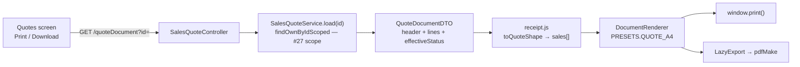

# The quote DOCUMENT — print/download at any stage (task #28)

**Status:** ✅ SHIPPED + GREEN — `cypress/e2e/business/quote-document.cy.js` and
`QuoteEffectiveStatusTest` (JUnit) both pass.

Raised by the user: *"I tried it myself and it is not working like this to generate quotes and
print/download and send it to customer for review before purchase"*, then, after review of the lifecycle:
**"agreed with current 'The five states' and user should be able to print or download at any stage with
status and details"**.

---

## 1. What exists, and what does not

Verified in code, not assumed:

| Piece | State |
|---|---|
| `DRAFT → PENDING_APPROVAL → SENT → ACCEPTED → CONVERTED` (+ `REJECTED`, `EXPIRED`) | **built and correct** |
| Discount-threshold approval gate on the way out of DRAFT | **built** |
| `convert()` → `sagaSellService.addSell()` — real invoice, stock, tax, COGS, GL, audit | **built** |
| Row-level visibility (#27) — a booker sees only their own | **built** |
| **A printable/downloadable quote** | **does not exist** — `grep printQuote\|downloadQuote\|QUOTE_A4` returns nothing |
| Transmission on `sendQuote` | **does not exist** — `SalesQuoteService` has **zero** references to notification/email/sms |

So the lifecycle is an internal record of a conversation that has to happen somewhere else, and today there
is no artefact to have it with. `sendQuote` calls `transition(id, SENT, …)`: it sets a status and saves.

**This slice builds the artefact.** Transmission (email/WhatsApp, and a customer-facing accept link) is
deliberately a separate slice — see §7.

## 2. The ruling

**The five states stay exactly as they are.** They were reviewed and agreed; this slice adds no state, no
transition, and changes no guard.

**Print and download are available at EVERY stage**, and the document carries **the status and the details**.

Availability at every stage is not a relaxation — it is what the states are for. A rep prints a DRAFT to check
it, sends the SENT one, files the ACCEPTED one against the customer's PO, and produces the CONVERTED one when
the invoice is queried months later. Restricting print to one state would mean the document only exists at the
moment nobody needs to look at it.

## 3. ⚠ What "with status" has to mean

**A printed DRAFT that does not say DRAFT is a firm offer.** That is the whole risk in this slice: paper
outlives the screen it came from, and a quote is a priced commitment. So the status is not a caption — it is
the safety property, and it must be legible on the page without being read for:

- a **status band** in the header block, beside the quote number
- a **watermark** across the body for any state that is not a live offer — `DRAFT`, `PENDING_APPROVAL`,
  `REJECTED`, `EXPIRED` — so a stale sheet cannot be mistaken for a current one at arm's length
- `validUntil` printed **always**, as *"Valid until DD-MM-YYYY"*, because a quote without an expiry reads as
  an open-ended promise
- for `CONVERTED`, the **invoice number** (`convertedInvoiceNo`) — the sheet then explains itself: this was
  quoted, and it became that

### ⚠ The status printed must be `getEffectiveStatus()`, never `status`

`EXPIRED` is **derived, not stored** (`SalesQuote:134`). A quote past `validUntil` still has
`status = SENT` in the row. Printing the raw field would produce a sheet that says SENT and is honoured by
nobody — the server already refuses every action on it. The entity's own comment records this trap being hit
once before, when the getter was named `effectiveStatus()` and Jackson never serialised it.

**The document reads the same derived status the convert guard reads.** One answer to "what is this quote",
everywhere.

## 4. Design

Three pieces, all following the credit-note slice (#15) that is already proven in production.



| Piece | Where | Note |
|---|---|---|
| `GET /quoteDocument?id=` | `SalesQuoteController` | assembles header + lines; **no status guard** — every stage prints |
| `QUOTE_A4` preset | `receipt.js` `PRESETS` | mirrors `CREDIT_NOTE_A4`; adds the status band + watermark |
| `printQuote(id)` / `downloadQuote(id)` | `business.js` + two buttons on `#QuoteDiv` | |
| **`buildQuoteDocumentHtml(doc)`** | `receipt.js`, exposed | the ONE shaping, shared by print and download |

### ⚠ Why `buildQuoteDocumentHtml` is exposed, and not just called internally

`return-documents.cy.js` case 6 renders the credit note by re-doing the `doc → sales[]` mapping **inside the
test**. That cannot catch the defect it was written for: if production's mapping is wrong, the test's own
correct mapping still renders a perfect page. It was green on the day CRN-000054 printed blank.

So print and download both go through **one** exposed shaping function, and the gate renders through *that*.
A mapping mistake now fails the gate instead of reaching a customer. It is also plain DRY — paper and PDF
cannot drift when they share the shaping.

### The assemble endpoint

Header: `quoteNo`, `dated`, `validUntil`, `effectiveStatus`, `customerName`, `customerPoNumber`,
`convertedInvoiceNo`, `notes`.
Lines: `productName`, `quantity`, `unitPrice`, `discount`, `lineTotal`.
Totals: `subTotal`, `tradeDiscount`, `taxTotal`, `grandTotal`.

Every one of those already exists on `SalesQuote` / `SalesQuoteLine`. **No schema change, no migration.**

### ⚠ Two traps this slice inherits, both already paid for once

**1. `toQuoteShape` must emit `sales`, not `lines`.** `DocumentRenderer.buildContext` reads `inv.sales`. In
#15 `toInvoiceShape` returned `lines:` and produced a **blank credit note** that shipped — the user found it on
CRN-000054, because the gate only asserted `typeof printReturnDocument === 'function'`. The gate here asserts
**rendered rows**.

**2. `load(id)` is already scoped — the new endpoint must go through it.** Quote ids are sequential. An
assemble endpoint that reads by id directly would reopen the exact IDOR that #27 closed, in a route nobody
would think to re-check.

## 5. Cypress cases (written BEFORE implementing)

Spec: `cypress/e2e/business/quote-document.cy.js`

1. **⭐ A DRAFT quote prints, and the sheet says DRAFT.** The safety property.
2. **⭐ The document renders LINE ROWS** — the `sales`-vs-`lines` trap, asserted on rendered output, not on a
   function existing.
3. **⭐ The derived-status trap**, split across three layers because an expired quote **cannot be seeded
   through the API** — see §8 for why, and why that guard was left alone.
   - **3a** the endpoint publishes `effectiveStatus`, not `status`, and agrees with `/getQuote`
   - **3b** an EXPIRED document prints EXPIRED **and is watermarked**
   - **3c** a LIVE quote is **not** watermarked — without this, watermarking *everything* would pass 3b, and
     a watermark on a live offer teaches people to ignore watermarks
   - the derivation itself: `QuoteEffectiveStatusTest` (JUnit, every `mvn test`)
4. A quote prints at **every** stage: DRAFT, PENDING_APPROVAL, SENT, ACCEPTED, CONVERTED.
5. A CONVERTED quote shows its **invoice number**.
6. Totals on the sheet **equal** the quote's stored totals — asserted as a relationship, never as a predicted
   figure (FEFO defeated predicted money three times in #15).
7. **⭐ A booker cannot print ANOTHER user's quote** — #27's scope, on the new route. Envelope, not HTTP status.
8. Download produces a PDF. **⚠ depends on #25** — `downloadInvoicePdf` is currently broken; see §6.
9. The buttons are **visible on the screen** — the `.pos-more` CSS rule has swallowed a shipped control twice
   (`#sellSerial`, `#sellBonus`), and nine "shipped but unreachable" defects are now tallied in
   `SAAS-BUILD-STANDARDS.md`. Asserted as `be.visible`, from the screen, not by calling the function.

## 6. ⚠ Known dependency

**Task #25 — Download PDF is not working** (`LazyExport.ensurePdfMake()` diagnostic still outstanding).
Case 8 will fail until #25 is fixed. That is correct and deliberate: the case states the requirement, and a
failing case is the honest record of a dependency. **Print does not depend on #25** and is the path that
unblocks the user's actual need — a shop that can print can send by whatever channel it already uses.

Suggested order: **build print first, land it green, then #25, then case 8 goes green with no new work.**

## 7. Explicitly NOT in this slice

- **Email / WhatsApp transmission.** WhatsApp needs a provider; SMS was already blocked once (INST-4).
- **A customer-facing accept link.** This is a real security surface: a guessable link would let anyone accept
  another customer's quote. It needs a tokenised, expiring, single-purpose URL and its own review — *"if
  anything is against security then don't implement it"*.
- **Any change to the five states or their guards.** `approveQuote` stays owner/admin.

## 8. ⚠ What the gate found: two quote settings were never registered

Case 3 tried to seed an expired quote by setting `sales.quote.validityDays` and was refused:

```
{"success":false,"message":"Unknown setting: sales.quote.validityDays","statusCode":400}
```

`SalesQuoteService` named both quote settings and read them through `SettingsService`, but **neither was in
`BusinessSettingsCatalog`** — and `SettingsService.set()` rejects any key not in the catalog. So no tenant
could ever write either one, and both sat on their hardcoded fallback permanently.

| Setting | Consequence |
|---|---|
| `sales.quote.validityDays` | every quote in every tenant fixed at 30 days |
| `sales.quote.discountApprovalThreshold` | `discountThreshold()` always `null` ⇒ **`PENDING_APPROVAL` could never fire for any tenant** |

The second is the serious one. `needsApproval()` returns false when the threshold is null or ≤ 0, so **the
internal approval step was unreachable** — the step whose existence is why `approveQuote` is owner/admin-gated.
The gate was guarding a door that never opened.

**Fixed by registering both**, with defaults identical to the fallbacks the code already used (30, and 0 which
`needsApproval` reads as "no gate"). No existing tenant's behaviour changes; the settings simply become
writable for the first time.

### ⚠ Correction: the validity guard already exists, and the seeding route never worked

Registering the setting made the write succeed, and case 3 then failed differently — the quote still read
SENT. The reason:

```java
private int validityDays() {
    int days = settingsService.getInt(SETTING_VALIDITY_DAYS, DEFAULT_VALIDITY_DAYS);
    return days > 0 ? days : DEFAULT_VALIDITY_DAYS;      // -1 → 30
}
```

`SettingsService.set()` applies no range validation, but **the consumer does**: a non-positive validity is
clamped back to 30, because a zero-day validity would expire every quote instantly. That guard is correct and
was **not** weakened to make the test pass — breaking the product to satisfy a gate is the wrong trade every
time.

So **an expired quote cannot be seeded through the API at all**, by design: `create()` always server-sets
`validUntil`, and the one setting that could move it is clamped. The trap is therefore covered in the three
places it actually lives:

| Layer | Where it is asserted |
|---|---|
| the **derivation** (`getEffectiveStatus`) | `QuoteEffectiveStatusTest` — JUnit, runs on every `mvn test` |
| the **endpoint** publishing `effectiveStatus` rather than `status` | Cypress case 3a |
| the **renderer** printing the status it is handed, watermarked | Cypress case 3b (+ 3c: a live quote is NOT watermarked) |

The JUnit test also pins the boundary (`validUntil == today` is still live — `isBefore` is exclusive, and an
off-by-one there would expire every quote a day early, noticed only by a customer being told no) and that
expiry never reopens a CONVERTED or REJECTED quote.

⚠ **Also follow-up:** now that the approval threshold can actually be set, `PENDING_APPROVAL` needs its own
gate. It has never once fired in production, so it is untested behaviour, not merely unconfigured behaviour.

## 9. Manual test cases

To be written after the gate is green, and folded into the single application-wide manual page.
