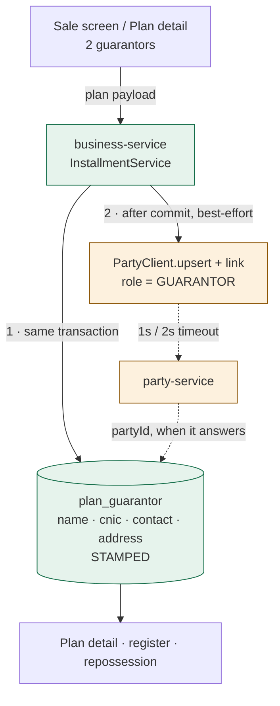

# R4 — guarantors on an installment plan: design

**Status:** DESIGN. Gate written before the implementation, per `SAAS-BUILD-STANDARDS.md`.
**Analysis:** [`r4-installment-guarantors-analysis.md`](r4-installment-guarantors-analysis.md) — read first;
every count below is a query that already works.
**Answers taken** (recommended set): several rows with a **role** · identity **stamped on the row**, `party`
left alone · a party-service outage **never loses the guarantor** · an existing plan **can gain one**.

**Requirement clarified by the owner (2026-09-04):** *"when shop want to sale mobile or motorcyle or anything
on installment need 2 guarantor with their detail so that they can assign to customer who purchased the
product on installment."* Two consequences, both folded in below: **two guarantors, not a guarantor and a
witness** — both carry recourse — and this is **not handset-specific**, so nothing in it may key on serials,
IMEIs or a shape.

---

## 1. What this slice makes true

> A shop that financed anything — a handset, a motorcycle, a fridge — can say **who else stands behind the
> debt**, and can still say it two years later, after somebody edited that person's contact record.

211 live plans, **0 guarantors**, because there has been nowhere to put one. The shop's own rule is two per
sale; today it is written on paper or not at all.

---

## 2. The decision this slice turns on

The analysis found the guarantor already ruled on: *"A guarantor is a Party with a role, not a new entity."*
That stays true. But it left one thing unresolved, and the resolution is the whole design:

**Stamping the identity on the plan's own row turns the party bridge from a risk into an index.**

The analysis worried that a guarantor "exists only as a party", so a slow party-service would commit a plan
with no guarantor, silently. That is only true if `party` is the *source of truth*. It is not, once the row
carries the name, CNIC, contact and address **as they stood on the day it was signed**:

| | Source of truth | If party-service is down |
|---|---|---|
| Naïve: `guarantor_party_id` only | party-service | plan saves with **no guarantor**, silently |
| **This design:** stamped row + optional link | **business-service** | guarantor **fully recorded**; only the cross-module link lags |

So best-effort becomes correct rather than dangerous — the same bridge the customer already uses, now safe for
the same reason the customer is: the record is local, the party row is an index that can catch up.

It also delivers what a guarantor record is *for*. The shop's evidence must be what the person signed, not
what their party row says after two years of edits. That is
[`feedback_stamp_at_write_not_derive_on_read`] applied to a legal document.



The solid path is the guarantee; the dotted path is the convenience. **Nothing the shop relies on crosses a
service boundary.**

---

## 3. The patterns, named (standard 7b)

* **Snapshot / stamped copy.** `plan_guarantor` holds the identity as recorded, not a join to live data. The
  same reason an audit trail writes `bookedByName` instead of resolving a user id at read time.
* **Best-effort bridge with a local authority.** The party link is an index, written after commit and retried
  on the next write — the pattern `CustomerAccountService` already uses, now applied where it is safe because
  §2 made the local row authoritative.
* **Role-qualified association**, not numbered columns. `guarantor1_*` / `guarantor2_*` would be wrong the
  first day a shop wants three, and every read would carry the `COALESCE` to prove it. N rows with a role
  makes "two" a **policy** rather than a shape — which §4f is entirely about.

---

## 4. Design

### 4a. `plan_guarantor` — the record (business-service, **V56**)

```sql
CREATE TABLE IF NOT EXISTS plan_guarantor (
    id               BIGINT       NOT NULL AUTO_INCREMENT,
    organization_id  BIGINT       NOT NULL,
    plan_id          BIGINT       NOT NULL,
    -- Every row the requirement asks for is a GUARANTOR: two people who both carry recourse. WITNESS is
    -- kept in the enum because these contracts do sometimes carry one and it costs nothing now, whereas
    -- adding it later needs an ALTER ... MODIFY on a live table. It is NOT offered on the form yet, and
    -- guarantorsRequired counts GUARANTOR rows only.
    role             ENUM('GUARANTOR','WITNESS') NOT NULL DEFAULT 'GUARANTOR',
    -- STAMPED at write. Never derived from party or customer on read: the shop's evidence is what was
    -- recorded on the day, and a later edit to that person's contact record must not rewrite it.
    name             VARCHAR(255) NOT NULL,
    cnic             VARCHAR(20)  NULL,
    contact          VARCHAR(64)  NULL,
    address          VARCHAR(255) NULL,
    -- The links. Both NULLABLE and both only ever an INDEX — see §2.
    customer_id      BIGINT       NULL,      -- when picked from the dropdown
    party_id         BIGINT       NULL,      -- filled by the bridge, possibly later
    created_at       DATETIME     NOT NULL,
    created_by       BIGINT       NULL,
    PRIMARY KEY (id),
    KEY ix_plan_guarantor_plan (plan_id),
    KEY ix_plan_guarantor_org (organization_id, plan_id)
) ENGINE=InnoDB DEFAULT CHARSET=utf8mb4 COLLATE=utf8mb4_0900_ai_ci;
```

**No unique constraint on `cnic`.** One person may guarantee several plans — that is normal, and in a shop
that finances handsets it is common. Uniqueness here would refuse a legitimate second sale.

**`role` as a MySQL enum**, matching this codebase's `@Enumerated(STRING)` convention — and noting
[`project_enum_string_mysql_enum_migration`]: a third role later needs an `ALTER … MODIFY`.

### 4b. ⚠ `installment_plan.guarantor_party_id` stays. It is not dropped.

The column exists, is wired to nothing, and holds **0 rows in dev**. That is not permission to drop it —
`SAAS-BUILD-STANDARDS` **D5** is explicit: *"'Unmapped' and 'empty on dev' are not the same claim, and neither
survives contact with production."* It has been counted in exactly one environment.

So it is left in place and its javadoc updated to say it is superseded by `plan_guarantor`. **It is not
written either** — populating both would create two answers to one question, which is worse than one unused
column. A later slice may drop it once production has been counted, which is D5's actual bar.

### 4f. ⚠ "Two" is a POLICY, not a constant

The owner's rule is two guarantors. **That number must not be compiled in.** A motorcycle dealer financing
Rs 300,000 may want two; a phone shop selling a Rs 20,000 handset on three instalments may want one; a
furniture shop with a long-standing customer may want none. Hardcoding `2` is
[`Shape.java`'s own warning](../../common-settings/src/main/java/com/myplus/common/settings/Shape.java) in a
different costume: *"What must never appear here: a client's name."* `if (guarantors.size() < 2)` is
`if (organizationId == 24)` with the number moved.

So it is a tenant setting, in the catalog business-service already owns:

```java
SettingEntry.intOf("installments.guarantorsRequired",
    "Guarantors required on an installment sale",
    "How many guarantors a sale on terms must name before it can be completed. 0 asks for none.",
    0)      // ⚠ ZERO. See below — 2 would break 40 of 43 tenants on the day it deployed.
```

#### ⚠⚠ The default is 0, and this is the single most important number in the slice

Measured on 2026-09-04: **43 organisations, 6 of which have chosen a shape.** The other 37 resolve to
`GENERAL`, whose preset is *every* capability — installments included — and 3 more are on `retail`, which
carries `INSTALLMENTS` explicitly.

**A default of 2 would stop 40 of 43 tenants completing an installment sale, the day it deployed**, for a
rule not one of them asked for. A pharmacy on `general` selling a wheelchair on terms would be refused at the
counter and told to name two guarantors it has never heard of.

That is precisely the failure `Shape.GENERAL` exists to prevent, and its javadoc already states the principle:

> *"`GENERAL` is the migration, and it is why this deploy changes nothing … A tenant only ever narrows by
> explicitly picking a shape, which is a deliberate act on their own Configuration screen."*

So **0 is the shipped default and the panel does not render at all**. The shop that wants the rule turns it on
— which for Shahzad is one field, once. A feature that arrives switched on for everyone is the same defect as
a capability that arrives switched on for everyone, and this codebase has already paid for that one.

**Enforced on the server**, not only in the form — a rule that lives in JavaScript is a rule until somebody
posts the endpoint directly.

Three consequences worth stating, because each is a way this goes wrong:

* **The minimum applies when a plan is CREATED, never to one that already exists.** 211 live plans have zero
  guarantors. A rule that applied retrospectively would make every one of them unopenable and unpayable — the
  feature would take the shop's collections screen away.
* **0 means the question is not asked at all**, and the panel does not render. A shop that does not use
  guarantors must not be shown an empty two-block form for ever.
* **Lowering the setting never invalidates a plan.** Recorded guarantors stay recorded.

### 4g. What every other kind of business sees: nothing

The constraint the owner set — *"it should not be a surprise for other type of business users"* — is met by
four properties, not by hoping:

| Tenant | What changes for them |
|---|---|
| Pharmacy, distribution, storefront, education, welfare, agriculture | **Nothing.** No new menu, no new field, no new refusal |
| A retail or `general` tenant that never opens Configuration | **Nothing** — the requirement is 0, so the panel does not render |
| A tenant that sells on terms and wants the rule | One number in Configuration, described in plain words |
| Shahzad | Sets it to 2 once |

* **No new navigation.** Nothing is added to any menu; the panel lives inside the installment block that
  already only appears when *Sell on installments* is ticked.
* **Capability-gated first, setting-gated second.** A tenant without `installments` cannot reach it at all;
  a tenant with `installments` and a requirement of 0 never sees it either.
* ⚠ **The CNIC format check is advisory, never a refusal.** `CNIC` is a Pakistani identifier and this platform
  ships in six languages. Formatting help (5-7-1) and the *recall* lookup both require the full shape — but a
  guarantor whose identifier does not look Pakistani still **saves**. The label is a message key like every
  other, so it can read differently per locale. Only `name` is ever mandatory.
* **No change to any existing screen, report or document** for a tenant at 0. The plan list, the schedule and
  the receipt path are untouched.

### 4c. The endpoints

```
GET  /api/business/planGuarantors?planId=…        the plan's guarantors, in entry order
POST /api/business/savePlanGuarantor              { planId, role, name, cnic, contact, address, customerId? }
POST /api/business/deletePlanGuarantor            { id }        ADMIN_PRIVILEGE
```

Scoped by `organizationId` from the token on every one, and the `planId` is checked to belong to the caller's
org before anything is read or written — an id off the wire is not an id followed from a row the caller could
already see.

**Delete is `ADMIN_PRIVILEGE`**, consistent with `project_method_authz`'s rule for destructive operations: a
guarantor record is the shop's recourse, and removing one is not a cashier's decision.

### 4d. The plan payload

`installmentPlanForSale()` gains one array, alongside the fields it already sends:

```js
guarantors: [ { role:'GUARANTOR', name:'…', cnic:'…', contact:'…', address:'…', customerId: 123 } ]
```

⚠ **The monolith's purchase proxy collapses repeated parameters** (`params.put(k, v[0])`) — the defect SER-2
worked around by sending serials as one text block. The sale path is JSON, not form-encoded, so an array is
safe here; but the plan block travels through `addSell`, so the **monolith `SellDTO` needs the field too** or
it vanishes between the browser and business-service. That is
[`project_addsell_submission_path`]'s standing warning, and it is the most likely way this slice ships broken.

### 4e. Artefacts

| Where | Artefact | New/changed |
|---|---|---|
| business-service | `V56__plan_guarantor.sql`, `PlanGuarantor` + repo | new |
| business-service | `InstallmentService.saveGuarantors` — stamped write, in the plan's transaction | changed |
| business-service | `PartyBridge` — upsert + `link(GUARANTOR)` after commit, best-effort | changed |
| business-service | `InstallmentController` — the three endpoints above | changed |
| monolith | `SellDTO` + `InstallmentPlanDTO.guarantors` — or the array is dropped in transit | changed |
| monolith | `InstallmentController` proxy for the three routes | changed |
| monolith | `installment.js` — the panel, the customer dropdown, the plan-detail list | changed |
| monolith | `messages*.properties` × 6 | changed |
| cypress | `e2e/business/installment-guarantors.cy.js` | new |

---

## 5. UI/UX

```
┌ Sell on installments ────────────────────────────────────────────┐
│  Down payment [ 15,000 ]   Instalments [ 6 ]   Monthly ▾         │
│  IMEI / serial [ 35…  ]                                          │
│                                                                  │
│  Guarantors — 2 required                           [ + Add ]     │
│  ┌ Guarantor 1 ────────────────────────────────────────────┐    │
│  │ Name [ Imran Al|                    ]                   │    │
│  │      ┌────────────────────────────────────┐             │    │
│  │      │ Imran Ali        0300-1234567      │ ← on file   │    │
│  │      │ Imran Shafiq     0321-9988776      │             │    │
│  │      └────────────────────────────────────┘             │    │
│  │ CNIC [ 35201-1234567-8 ]  Mobile [ 0300-1234567 ]       │    │
│  │ Address [ 12 Mall Road, Lahore                  ]       │    │
│  └─────────────────────────────────────────────────────────┘    │
│  ┌ Guarantor 2 ────────────────────────────────────────────┐    │
│  │ …                                                        │    │
│  └─────────────────────────────────────────────────────────┘    │
└──────────────────────────────────────────────────────────────────┘
```

* **As many blocks as the setting asks for, rendered open.** Two, for this shop. A "+ Add" that a shopkeeper
  must find and press twice on every sale is a rule the screen knows and refuses to state.

### ⚠ There is NO second customer dropdown. The name field does the lookup.

An earlier draft of this design put a *"From an existing customer"* select at the top of each guarantor block.
That was wrong, and the owner caught it: **`#sellCustomerDD` — "Select Customer" — is already at the top of
this same form.** Two dropdowns on one screen, both saying *customer*, meaning two different people: the one
buying and the one standing behind the debt. A cashier who picks the wrong one has recorded a plan guaranteed
by its own debtor.

So the second control is deleted. **Typing into `Name` searches the contacts already on file**; picking a
suggestion fills CNIC, mobile and address, and typing a name that matches nothing simply proceeds — which is
the *common* case, because a guarantor is usually a relative or a neighbour who has never bought anything.

* **One field, one meaning.** "Customer" appears once on the screen and always means the buyer.
* **The suggestion list is a convenience, never a requirement.** No lookup, no blocked sale.
* **Nothing is auto-selected.** A suggestion list that pre-fills on a near-match would silently attach the
  wrong person's CNIC to a debt.

* **The dropdown fills the fields; the fields stay editable.** 89% of customers already have a party, so the
  common case is two clicks — but a guarantor's address is often not the address on file, and a form that
  will not let a shopkeeper correct it gets worked around.
* ⚠ **Search by name and phone, never by CNIC.** A picker that matches on a national identifier lets staff
  enumerate them by typing digits. Named here because it is invisible in review — the field is *on* the form.
* **The refusal names the number and what is missing** — *"This sale needs 2 guarantors; 1 has been
  entered"* — never a red field with no sentence. The shop asked for the rule; the screen owes it the reason.

⚠ **A refused plan does not refuse the SALE, and this slice does not change that.** `createInstallmentPlan`
has returned a message and left the sale standing since INST-1 — for unsound terms, an uncollected deposit and
an unnamed customer alike, *"so the shop has a paid invoice to reconcile rather than a silent mismatch nobody
can see."* A guarantor shortfall follows the same contract rather than inventing a second one: **the screen is
what stops the cashier; the server rule is the backstop behind it, and it refuses the PLAN.** Introducing a
sale-level refusal here would either make guarantors uniquely able to fail a sale, or silently change
behaviour for the three refusals that already exist.
* **A shop that sets 0 is not nagged.** The panel does not render at all. Refusing every sale for a
  record-keeping field is how a feature gets switched off entirely, so the shop decides, not us.
* ⚠ **A guarantor may not be the buyer.** Refused server-side by comparing the resolved contact to the plan's
  own `customerId`, and refused on the screen the moment it is picked. A plan guaranteed by its own debtor is
  worth precisely nothing, and it is the easiest mistake this form can make.
* **Retrospective:** the same panel appears on plan detail, so the 211 existing plans can gain one.
* Capability-gated on `installments`, so a shop that does not sell on terms never sees it.

---

## 6. The gate — `cypress/e2e/business/installment-guarantors.cy.js`

| # | Case | Guards |
|---|---|---|
| 1 | ⭐ A plan saved with **two** guarantors keeps both, with name, CNIC, contact and address | the whole point |
| 2 | ⭐ Editing the customer's own record afterwards **does not change the stamped guarantor** | §2 — the reason the row is stamped |
| 3 | ⭐ A sale with **one** guarantor is refused when the setting says 2, and the message names the number | §4f — the rule the owner asked for |
| 4 | ⭐ The array survives the monolith hop — both guarantors reach business-service | §4d, the most likely silent failure |
| 5 | ⭐ Set the tenant's requirement to **1** — a one-guarantor sale now completes | §4f: it is a policy, not a constant |
| 6 | ⭐ Set it to **0** — the panel does not render and a sale with none completes | §4f: a shop that does not use guarantors is not nagged |
| 6b | ⭐⭐ A tenant that has **never touched the setting** sells on installments exactly as before | §4f — the 40-of-43 default; the case that proves the deploy surprises nobody |
| 6c | ⭐ A **pharmacy** tenant on the sale screen sees no guarantor panel at all | §4g — no surprise for another trade |
| 6d | A guarantor whose identifier is not in CNIC shape still **saves** | §4g — advisory format, six languages |
| 7 | ⭐ The refusal is **server-side** — posting the plan endpoint directly with one guarantor is refused | a rule in JavaScript is not a rule |
| 8 | ⭐ The 211 existing zero-guarantor plans still **open, list and take a receipt** | §4f — a retrospective rule would take collections away |
| 9 | Typing a name suggests contacts on file; picking one fills CNIC, mobile, address — and an edited field is what gets saved | §5 — a guarantor's address is often not the one on file |
| 9b | ⭐ A name matching nothing on file saves normally | §5 — the common case; a guarantor is usually not a customer |
| 9c | ⭐ The **buyer cannot be their own guarantor** — refused on screen and on the server | §5 — the easiest mistake this form can make |
| 10 | An existing plan can gain a guarantor afterwards | Q4 |
| 11 | ⭐ `planGuarantors` refuses a plan id from another tenant | anti-IDOR |
| 12 | ⭐ Delete requires `ADMIN_PRIVILEGE`; a USER is refused | §4c |
| 13 | The panel is absent for a tenant without `installments` | capability gating |
| 14 | ⭐ The guarantors are saved **even when party-service cannot be reached** | §2 — the property this design exists to give |
| 15 | Typing a CNIC into the name field suggests nothing | §5 — enumeration |
| 16 | Only ONE control on the sale screen says "customer", and it is the buyer's | §5 — the collision the owner caught |

**Cases 5, 6, 6b and 8 are the ones that matter most**, and none of them tests the feature the owner asked for.
They test that *his* rule is a **setting** rather than the platform's opinion: 5 proves another shop can want
one, 6 proves a shop can want none, and 8 proves turning the rule on does not break the 211 plans that predate
it. A gate that only asserted "two are required" would pass a build with `2` compiled into it.

⚠ **Leave no server state behind.** Cases 5 and 6 change `installments.guarantorsRequired` for a real tenant.
`after()` must put it back to 2, or the next spec inherits a rule it never set — the failure GATE-RUNBOOK §5
exists to prevent.

## 7. Out of scope

* **A guarantor portal or guarantor-facing reminders.** INST-4's SMS transport is still blocked on the
  customer's provider decision, and a guarantor who receives messages is a different consent question.
* **`party.cnic`.** Not added — see the analysis §3b. Revisit if a second module ever needs the identifier.
* **Any liability calculation.** The ask is a record. What a guarantor owes is a legal question, not a column.
* **Backfilling the 211 plans.** The platform cannot invent who guaranteed a sale that already happened; 4d's
  retrospective panel is the honest answer.
