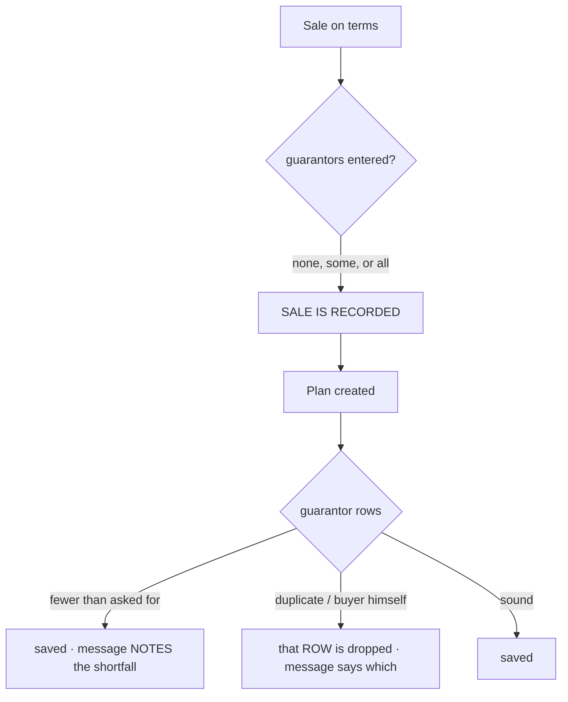

# R4b — a guarantor is asked for, never demanded

**Status:** ✅ **GREEN** (2026-09-08). Gate: `cypress/e2e/business/installment-guarantors.cy.js`.
**Ask:** *"guarantors should be optional not mandatory on sale no matter how many Guarantors required on an
installment sale"*.

---

## 1. What happens today

`installments.guarantorsRequired` (default 0) is a hard gate. A shop that sets it to 2 cannot complete a
financed sale until two guarantors are typed.

### RULE 0 — every point that enforces the count

**4 enforcement points. 1 refuses the SALE, 1 refuses the PLAN, 2 are the checks behind them.**

| # | Where | Today | Effect |
|---|---|---|---|
| 1 | `main.js:553` | `showFormError(...); return false;` | **the whole SALE is blocked** — nothing is recorded |
| 2 | `installment.js:393` `guarantorProblem()` | shortfall + duplicate + self-guarantee | supplies #1's message |
| 3 | `PlanGuarantorService.validate()` | same three checks | supplies #4's message |
| 4 | `SellController:2054` | `return "Installment plan NOT created: …"` | the sale stands, **the plan does not** |

Point 1 is the one that hurts. Every other plan refusal in that method — unsound terms, an uncollected
deposit — lets the sale complete and reports a message; the guarantor rule is the only one that stops the
cashier before anything is recorded. A shop mid-sale, with a customer at the counter and no guarantor
present, cannot sell.

**Uses of the count that are NOT enforcement** (all kept): rendering that many input blocks, the
"1 of 2 recorded" counter, the recent-guarantor shortcuts, `GET /guarantorsRequired`.

---

## 2. Design

**The rule: no guarantor problem can refuse a sale or a plan.** That is what makes "optional" true. A count
requirement that still blocks on a duplicate is not optional, it is optional with exceptions — so the
integrity checks change from *refusing the plan* to *dropping the offending row*.

Dropping is not silence: the message names the row and why. A shop that believes it holds two guarantors and
holds one is the thing those checks exist to prevent, and a note that says so on the receipt-side message
prevents it just as well as a refusal, without a customer standing at a counter that will not sell.

### What each check becomes

| Check | Today | After |
|---|---|---|
| Fewer than required | refuses sale **and** plan | plan created; **note** on the message |
| The same person twice | refuses the plan | second row dropped; named in the message |
| Buyer guarantees himself | refuses the plan | that row dropped; named in the message |

### The setting keeps its key, and changes its meaning

`installments.guarantorsRequired` stays — it drives how many blocks the screen renders, which is genuinely
useful: a shop that wants two is prompted for two. Renaming the key would strand the stored value of every
tenant that set it. Its **label and description change**, because "before a plan can be created" would now be
a lie, and a settings screen that misdescribes its own effect is worse than one that omits it.

> Guarantors to ask for on an installment sale — *how many guarantor blocks the sale screen shows. The sale
> and the plan are never blocked by this: what is entered is recorded, what is missing is noted.*

---

## 3. Changes

| File | Change |
|---|---|
| `service/PlanGuarantorService.java` | `validate()` → `review()`, returning accepted rows + notes; nothing refuses |
| `controller/SellController.java` | no guarantor refusal; notes appended to the plan message |
| `config/BusinessSettingsCatalog.java` | label + description say what the number now does |
| `js/main.js` | the sale-blocking guard removed |
| `js/business/installment.js` | `guarantorProblem` → `guarantorNote`, advisory only |
| `messages*.properties` × 6 | wording follows |

**No schema change, no migration.** Existing `plan_guarantor` rows are untouched, and the 211 plans carrying
no guarantors are unaffected — they already were.

## 4. What this deliberately does NOT change

* **The stamped identity.** A guarantor row is still the evidence as signed, never derived on read.
* **Retrospective effect.** The count has never applied to existing plans and still does not.
* **Adding a guarantor to an existing plan** (`installment-guarantors.cy.js` case 12) — untouched.
* **Tenant scoping** — case 13, a plan id belonging to another tenant, is still refused. That is an
  authorisation control, not a guarantor rule, and nothing here relaxes it.
