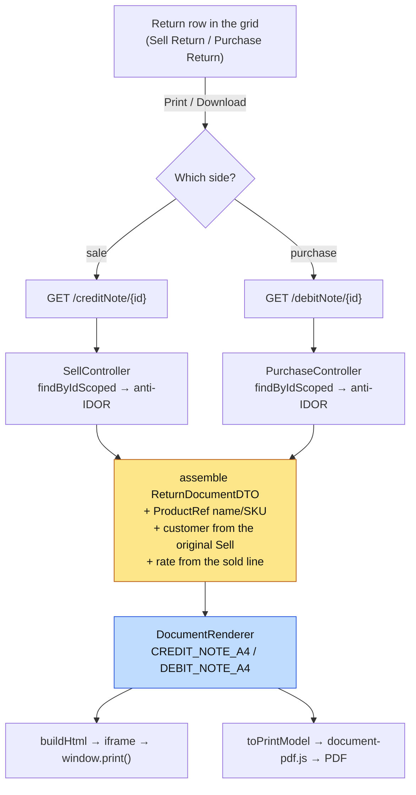

# Return documents — credit notes and debit notes (task #15)

**Status:** ✅ **SHIPPED + GREEN** — `cypress/e2e/business/return-documents.cy.js` 5/5, 2026-08-30.
**Branch:** `feature/UI-UX`. **Unblocks:** task #16 (vendor-filtered debit notes), task #19 (bulk invoices).

The ask was *"the option to print invoices of purchase and sale return"*. The review below changed two things
about what that means, so read §1 before §3.

---

## 1. What the review found

### 1.1 These are not "return invoices". They are credit notes and debit notes — and the schema already says so.

| Flow | Entity | Document number | Correct trade name |
|---|---|---|---|
| Sale return | `SaleReturn` | `creditNoteNo` / `creditNoteSeq` | **Credit note** |
| Purchase return | `PurchaseReturn` | `debitNoteNo` / `debitNoteSeq` | **Debit note** |

Both numbers are already allocated, already serialised per org through `DocumentNumberService.next(...)`
(`CREDIT_NOTE` / `DEBIT_NOTE`), already formatted by `InvoiceNumbers.creditNote/debitNote`, and already
uniqueness-guarded — `UNIQUE(organization_id, debit_note_seq)` on the purchase side.

So the numbered document exists. **Only the rendering is missing.** The UI and the presets are named credit
note / debit note accordingly; calling a credit note an "invoice" is wrong accounting terminology, and the
codebase already knows better (`"Sale returned. Credit note " + creditNoteNo`).

### 1.2 ⚠ Correction to an earlier finding: there is nothing to GROUP.

An earlier note in task #15 said the gap was a missing `findByCreditNoteNo` / `findByDebitNoteNo`, on the
assumption that one note spans several returned lines. **That is not how the code behaves.**

- `saleReturn` takes a single `sellId` (one sold LINE) and allocates a fresh credit note per call.
- `purchaseReturn` takes a single `purchaseId` (and `Purchase` is itself per-line) and allocates a fresh
  debit note per call, writing exactly one `PurchaseReturn` row.

**One note = exactly one row.** No grouping query is needed, and writing one would have been solving a problem
that does not exist.

### 1.3 The real gap is ASSEMBLY, not grouping — a return row cannot draw itself.

`SaleReturn` stores `productId`, not a product name. It stores no rate, and no customer.

| The document needs | `SaleReturn` has it? | Where it comes from |
|---|---|---|
| Note no, date, reason, qty, amount | ✅ | the row |
| Original invoice ref | ✅ `invoiceNo` | the row |
| Product **name** / SKU | ❌ only `productId` | catalog `ProductRef` — same resolve `getUserSell` already does |
| **Customer** | ❌ | the original `Sell` → `CustomerHistory` |
| Unit rate | ❌ only a total amount | the original `Sell` line |
| Tenant header | ❌ | the document profile, as every other document |

`PurchaseReturn` is the same shape: it has `venderId` but no vendor name, `productId` but no product name.

So the build is **one scoped read per side that assembles a renderable model**, not a repo grouping method.

### 1.4 ⚠ A product observation, flagged not decided

Because a note is allocated per line, a customer returning three items receives **three credit notes**. That
is what the data model produces today. Changing it is a business decision with ledger consequences (each note
already posts its own `SALE_RETURN` GL event and its own AR movement), so this slice does **not** change it.

**It is designed around, though** — see §2.1. The document renders a LIST of lines and today is always handed
a list of one. If returns are ever grouped, the document does not change.

---

## 2. Design

### 2.1 The one decision that matters: the model carries `lines[]`, not a line

The renderer takes `{ header, party, lines[], totals }` with `lines.length === 1` today.

The alternative — a single-line model matching the row exactly — is simpler *right now* and would have to be
thrown away the first time returns are grouped, taking the preset, the PDF layout and the designer bindings
with it. A list of one costs nothing and makes §1.4 a data change rather than a rewrite.

### 2.2 It is a PRESET, not a print path

`receipt.js` already owns document layout through `DocumentRenderer`:

```
DocumentRenderer = { buildHtml, toPrintModel, withInvoice, resolveProfile, PRESETS, FIELD_WHITELIST, … }
PRESETS = { TRADE_INVOICE_A4, RETAIL_RECEIPT_80MM, DELIVERY_CHALLAN_A4, DISPENSE_RECEIPT_80MM }
```

`document-pdf.js` draws a resolved model through `toPrintModel`; `document-designer.js` previews through the
**same** `buildHtml`. The file states its own rule:

> *"if you find yourself deciding here whether a row should appear, or what a column is called, the logic
> belongs in receipt.js instead."*

**So this slice adds two presets — `CREDIT_NOTE_A4` and `DEBIT_NOTE_A4` — and no new emitter.** Print, PDF
download, lazy pdfmake loading (~900KB, `LazyExport.ensurePdfMake`) and the designer all come for free. Adding
layout logic to `document-pdf.js` is the documented wrong move.

### 2.3 Flow



The amber box is the only genuinely new server work. The blue box is configuration of something that exists.

### 2.4 Tenancy — non-negotiable

Both reads take the note by **id, scoped**, never by note number alone. A document endpoint keyed on a
guessable string is an IDOR waiting to happen, and `saleReturn` itself already demonstrates the required
pattern (`inMyTenant(...)` plus `myStore(...)` — *"a return can only be taken at the store that sold it"*).
The read follows the same rule: same tenant, same store visibility, `findScoped` NULL-org fallback on the sale
side.

**Purchase side note:** `PurchaseReturnRepo.findScoped(orgId)` has no `userId` fallback, unlike the sale side.
**This was checked and is correct** — V33 created `purchase_return` (*"the supplier side has no record
whatsoever"*), so no legacy null-org rows exist. Not a defect; recorded so it is not "fixed" later by someone
pattern-matching against the sale side.

---

## 3. Work

### ⚠ Two corrections made during implementation

**(a) The DTO is business-service-internal, not a shared contract.** The monolith proxies these as raw
`Map<String,Object>` and never deserializes them, so `ReturnDocumentDTO` lives in
`business_service/dto/`. Putting a single-service view type in `commerce-contracts` would pollute a module
that exists for genuinely shared cross-service contracts.

**(b) The documents are keyed on the NOTE NUMBER, not the row id.** §2.4 originally called a by-number lookup
an IDOR. That reasoning was wrong: a row id is exactly as guessable as `CRN-000007`, and the protection in
both cases is the **scope predicate inside the query**, not the unguessability of the key. Keying on the note
number is also what makes the feature reachable — see §3.1.

| # | Change | Where |
|---|---|---|
| 1 | `ReturnDocumentDTO` — header/party/lines/totals, `lines[]` per §2.1 | `business-service/dto` |
| 2 | `GET /creditNote?no=` + `findByCreditNoteNoScoped` | `SellController`, `SaleReturnRepo` |
| 3 | `GET /debitNote?no=` + `findByDebitNoteNoScoped` | `PurchaseController`, `PurchaseReturnRepo` |
| 4 | Monolith proxies for both | `SellController` / `PurchaseController` (monolith) |
| 5 | `CREDIT_NOTE_A4` + `DEBIT_NOTE_A4` presets | `receipt.js` |
| 6 | Print + Download buttons on both return grids | `business.js` |
| 7 | i18n keys, six locales | `messages*.properties` |
| 8 | Gate | `cypress/e2e/business/return-documents.cy.js` |

### What the gate must assert

- A credit note renders with its **number**, the **original invoice reference**, the product **name** (not an
  id — that is the enrichment in §1.3 actually working), qty and amount.
- Same for a debit note, with the **vendor** name.
- **Anti-IDOR: another tenant's note id returns not-found.** Asserted on the ENVELOPE — refusals arrive as
  HTTP 200 with `status:"ERROR"` / `success:false`, so an HTTP-status assertion would pass against a leak.
- The PDF download path produces a file (the lazy pdfmake load actually resolves).
- Per the domain-gate standard: run as the feature's own tenant **and** owner / admin / user.

### 3.1 ⚠ The reachability problem, found during implementation

**There is no returns list screen.** `getSaleReturns` exists in business-service and in the monolith proxy,
but nothing in `business.js` calls it, and there is no purchase-returns list either. Returns are taken through
per-row dialogs and then disappear from the UI.

So an id-keyed endpoint would have had **no entry point at all** — the operator never sees a row id, only the
message *"Sale returned. Credit note CRN-000007"*. Shipping that would have repeated the exact failure this
codebase has hit four times (C1's inert service, C3's unregistered catalog, C6's invisible policy, PERF-4's
never-run gate): working code nobody can reach, with every API test green.

Two consequences, both deliberate:

- The endpoints key on the **note number**, which is what the operator is actually given.
- The print is **offered at the moment the return is taken** (`offerReturnDocument`, shared by both flows),
  through the standard `uiConfirm` — that is when the customer is still at the counter and the paper is
  wanted. Offered, not auto-printed: a shop that does not hand out credit notes should not get a print dialog
  on every return.

**Follow-up, not done here:** a returns LIST screen, so a note can be reprinted later. It is also what
task #16 (vendor-filtered debit notes) and task #19 (bulk invoices) will need, and `getSaleReturns` +
`findDebitNotesForVender` already exist to feed it. Recorded rather than quietly bundled — printing at the
counter is the whole of what was asked for, and reprint-later is a screen.

---

# Part 2 — the returns LIST screen (task #21)

**Status:** DESIGN → implementation follows. Unblocks tasks #16 and #19.

Part 1 shipped the documents but left them reachable only at the counter: once the print prompt is dismissed,
a credit note cannot be found again. This part is the screen that makes them permanent.

## R1. What exists, and the asymmetry

| | List endpoint | Proxy | UI |
|---|---|---|---|
| Sale returns | ✅ `getSaleReturns` (findScoped, org + user NULL-fallback) | ✅ | ❌ nothing calls it |
| Purchase returns | ❌ **does not exist** | ❌ | ❌ |

So the sale side needs only a screen; the purchase side needs an endpoint first. `PurchaseReturnRepo.findScoped(orgId)`
already exists to back it — no new query, and no `userId` fallback for the reason recorded in §2.4.

## R2. ONE screen, two modes — not two screens

The two lists differ in exactly three things: the endpoint, the party column (customer vs supplier), and the
document label. Everything else — the table, the empty state, the reprint action, the scoping — is identical.

Two screens would mean two copies of "render a list of returns", and the second would drift from the first the
moment either changed. So: `showReturns(mode)` where mode is `'credit'` or `'debit'`, one `#ReturnsDiv`, one
render function parameterised by mode.

Two nav entries, though, because a return belongs with its own flow:

- **Sale returns** → `snavSell`, beside Parked Sales and Quotes
- **Purchase returns** → `snavPurchase`, beside New Purchase

## R3. Reprint reuses part 1 exactly

The per-row action calls `printReturnDocument(kind, noteNo)` — the same function the counter prompt calls. No
second print path, and no new endpoint: `/creditNote?no=` and `/debitNote?no=` already take the note number,
which is precisely why part 1 keyed on it.

A row whose note number is null predates the note series and has no printable document. Those rows still LIST
(they are real returns and hiding them would misstate history) but show no reprint action — the same rule the
counter prompt applies, and better than a button that always fails.

## R4. Visibility

`getSaleReturns` uses `findScoped(orgId, userId)`, so the USER/ADMIN/SUPER hierarchy already applies: a plain
user sees their own returns, an admin/owner the org's. The new `getPurchaseReturns` matches it. No new
privilege — a cashier who took a return is exactly the person who needs to reprint it, and the note is not
more sensitive than the invoice it reverses.

## R5. Work

| # | Change | Where |
|---|---|---|
| 1 | `GET /getPurchaseReturns` — scoped list | `PurchaseController` (business-service) |
| 2 | Monolith proxy | `PurchaseController` (monolith) |
| 3 | `#ReturnsDiv` + two nav entries | `businessDashboard.html` |
| 4 | `showReturns(mode)` + `renderReturns(mode, rows)` | `business.js` |
| 5 | i18n, six locales | `messages*.properties` |
| 6 | Gate | `cypress/e2e/business/returns-list.cy.js` |

### What the gate must assert

- Both modes list rows, and the party column shows a NAME (the same enrichment point as part 1 — a list of
  ids would pass a status check and be useless).
- **Reprint from the list reaches the document** — the whole purpose; assert `printReturnDocument` is invoked
  or the fetch fires, not merely that a button is drawn.
- A row without a note number shows no reprint action.
- Scoping: a plain user does not see another user's returns.
