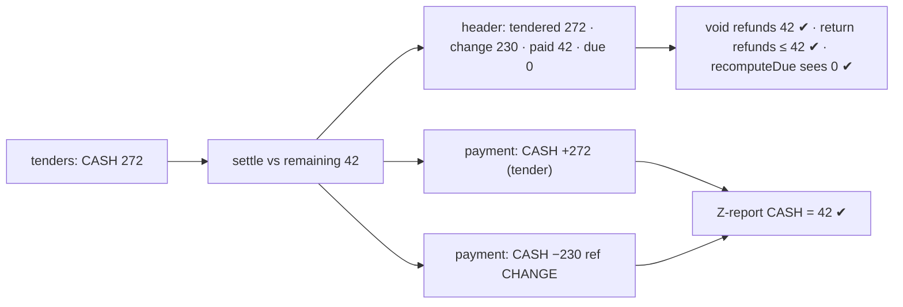
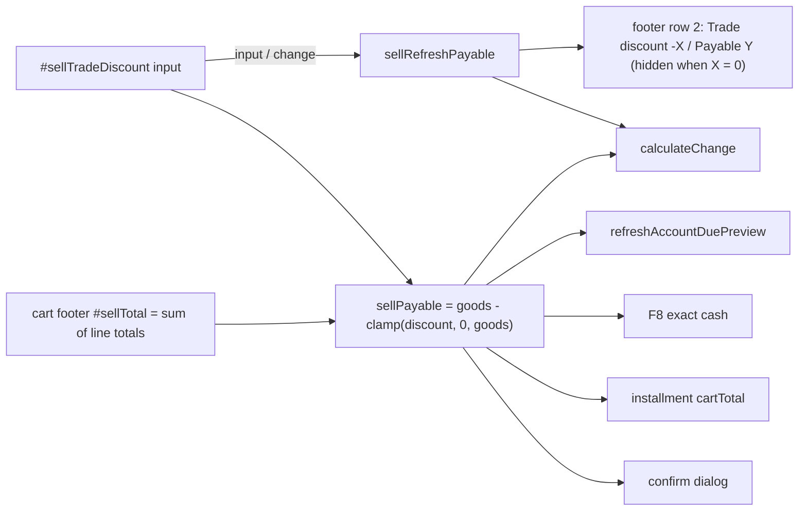
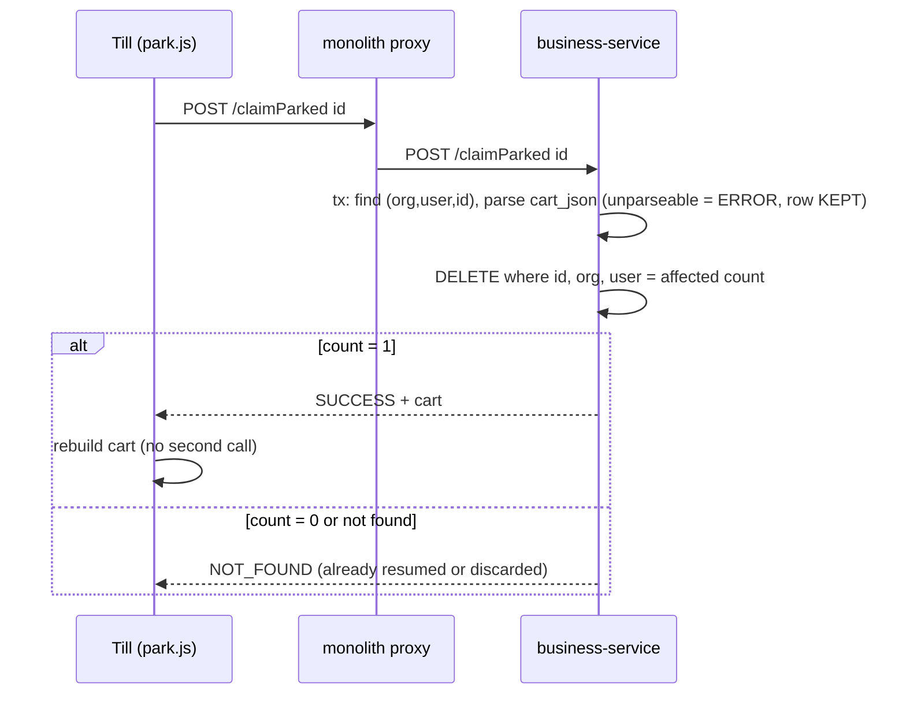

# SALE-DUP-2 + TRADE-DISC-1 — review (2026-09-24)

Status: **REVIEW only. Nothing implemented. Waiting on consent.**

Reported by the user:
1. **Major:** sales still duplicate on production.
2. **Improvement:** `#sellTradeDiscount` is not reset after a sale completes or on `parkCurrentSale()`.
3. **Review:** line discount + trade discount end to end, including the receipt. The discount *"shows as
   change instead of discount"*.

---

## Part A — duplicate sales

### A.0 What is already sound (verified, not assumed)

| Layer | Evidence |
|---|---|
| Server dedup on `(org, key)` | `SagaSellService.addSell:197-204` pre-check + `uq_ch_org_idempotency` UNIQUE; race path `:319-325` returns the winner's invoice |
| Index present | local Docker `myplusdb.customer_history`: `uq_ch_org_idempotency(organization_id, idempotency_key)` ✅ |
| No same-key duplicates | local: **0** `(org, key)` groups with count > 1 |
| Key survives the proxy | monolith `CustomerHistoryDTO.idempotencyKey` (line 48) |
| Retries reuse the key | gateway timeout / non-SUCCESS / CONFIRM (`resubmitAcknowledged`) / 401 refresh-retry in `GatewayClient:205`: all resend the SAME body |
| SF-3b ordering | `jsonPost` retires the key and clears the cart together, before anything that can throw (`main.js:1350-1353`) |

**So a duplicate needs two DIFFERENT keys for one basket.** The key is only minted by
`getSaleIdempotencyKey()` when `window.saleIdempotencyKey` is empty. I traced every path that can put
the same goods back on the wire under a new key:

### A.1 ⚠ D1 — a resumed parked sale is never deleted for a cashier (CONFIRMED in code)

```
resumeParked(id)            GET /resumeParked   → reads cart_json, deletes NOTHING (ParkedSaleService.resume:55)
  └ discardParked(id, true) POST /deleteParked  → @PreAuthorize("hasAuthority('DELETE_PRIVILEGE')")
                                                  ParkedSaleController:68
```

- `ROLE_<M>_USER` has **no `DELETE_PRIVILEGE`** (auth `SetupDataLoader:620`). A cashier's delete is refused.
- `discardParked(id, silent=true)` swallows the refusal (`park.js:83-87`: `if (!silent) …` on both
  failure branches).
- The parked sale stays in the list. The cashier (or the same one later) resumes it again, the cart is
  rebuilt, and Complete Sale mints a **fresh key** → a genuine second invoice for the same goods.
- Same outcome for ANY role if the delete call fails on the network.
- The resume is also not a claim: two tabs of the same user can resume the same parked sale.

**Signature on prod:** two invoices, same user + customer + total, **minutes apart** (not 1-2 s),
different keys, and/or `parked_sale` rows still present whose total matches a completed invoice.

### A.2 D2 — ambiguous outcome, then the till is reloaded or re-rung (BY DESIGN today)

The key and the cart live only in `window`. If the request is slow and the cashier presses F5, closes
the tab, or re-rings on another device, the first request can still commit and the re-ring gets a new
key. SESS-1 accepted "lost basket" as a known limit; it did not add anything that tells the cashier the
first attempt landed.

**Signature:** two invoices seconds-to-a-minute apart, different keys, same user + total.

### A.3 D3 — prod may be serving an old `main.js` (UNVERIFIED)

`project_static_assets_stale`: the monolith serves JS from the jar. If prod's jar predates SF-3b
(2026-09-06), the "retired key, full cart" defect is still live there.
**Signature:** two invoices **1-3 s apart**, different keys.
**Check:** load `/js/main.js` on prod and search for `THE CHECKOUT ENDS IN ONE STEP`.

### A.4 Not a vector (checked)

- `updateSell` edits in place; `window.editingInvoice` is only cleared by `cancelSellEdit` / `resetCart`,
  both of which empty the cart first (`business.js:758-782, 1843-1853`).
- Double Enter / double click / held key: same key (SF-3, DUP-1 L1/L2).
- Confirm dialog opened twice: both resolve with the same `customerHistory` object → same key.

### A.5 Evidence needed from production (read-only SQL)

```sql
-- Near-identical invoices by the same user for the same customer and amount within 30 minutes.
SELECT a.organization_id, a.user_id, a.customer_id,
       a.invoice_no AS first_inv, b.invoice_no AS second_inv, a.grand_total,
       TIMESTAMPDIFF(SECOND, a.dated, b.dated)            AS gap_s,
       (a.idempotency_key <=> b.idempotency_key)            AS same_key,
       a.idempotency_key IS NULL OR b.idempotency_key IS NULL AS key_missing
FROM customer_history a
JOIN customer_history b
  ON  b.organization_id = a.organization_id
  AND b.user_id         = a.user_id
  AND b.customer_id    <=> a.customer_id
  AND b.grand_total     = a.grand_total
  AND b.customer_history_id > a.customer_history_id
  AND b.dated BETWEEN a.dated AND a.dated + INTERVAL 30 MINUTE
WHERE a.dated >= NOW() - INTERVAL 30 DAY
  AND (a.status IS NULL OR a.status <> 'VOID')
ORDER BY a.dated DESC
LIMIT 100;

-- Parked sales that outlived a sale of the same total by the same user (D1's footprint).
SELECT p.id, p.user_id, p.label, p.total, p.parked_at, ch.invoice_no, ch.dated
FROM parked_sale p
JOIN customer_history ch
  ON ch.organization_id = p.organization_id AND ch.user_id = p.user_id
 AND ch.grand_total = p.total AND ch.dated > p.parked_at
ORDER BY p.parked_at DESC LIMIT 100;
```

⚠ `dated` is written as a date or a datetime depending on the path — check the prod column type first;
if it is a DATE only, `gap_s` is meaningless and the pairs must be ordered by `customer_history_id`.
`grand_total` equality ignores a trade discount that differs between the two attempts.

Reading the result:

| gap | keys | most likely |
|---|---|---|
| 1-3 s | different | D3 (stale JS) |
| seconds-1 min | different | D2 (reload / re-ring) |
| minutes | different, parked row matches | **D1** |
| any | same | impossible while the UNIQUE index exists — check the index on prod |
| any | NULL | not the till (storefront, quote conversion, API) — trace that caller |

### A.6 Recommended fix (for consent)

1. **D1 — make resume a CLAIM.** `POST /resumeParked` deletes the parked row in the same transaction
   and returns its cart (read-and-delete, row lock). Resume then needs the same privilege as parking,
   not `DELETE_PRIVILEGE`, and a second resume of the same id gets NOT_FOUND. `discardParked` stays for
   the explicit Discard button. Carry the trade discount (and the other checkout fields) in the parked
   payload — see B.2.
2. **Defence for every client cause (D2, D3, anything not yet found): a server-side near-duplicate
   CONFIRM**, the pattern DOC-INT already uses for duplicate bills. Same org + user + customer + line
   fingerprint (productId × qty × rate) + grand total within N seconds (tenant setting, default 120) →
   `status: CONFIRM` naming the earlier invoice; the till re-submits with `duplicateAcknowledged=true`.
   It never blocks a genuine repeat sale, only asks. Must be on BOTH `CustomerHistoryDTO`s.
3. D3: redeploy the monolith jar if the check in A.3 fails.

---

## Part B — trade discount (`#sellTradeDiscount`)

### B.1 ⚠ MONEY — the till never subtracts the trade discount (CONFIRMED, and this IS the "shows as change" report)

- `#sellTotal` is the cart grid's TOTAL-column footer (`business.js:151-156`) — the sum of line
  receivables. Nothing reads `#sellTradeDiscount` except the submit (`main.js:569`) and the settings
  toggle (`business.js:5671`). **No listener recalculates on it.**
- So `calculateChange()` (`business.js:3666`) shows Change/Due against the GROSS bill.
- The server nets it: `SagaSaleWriter:118-130` → `grandTotal = goods − discount + shipping`.
- `PaymentService.settle:38-54`: `paid = Σ tenders` (**not capped**), `change = paid − grand`.

Worked case — bill 1,000, trade discount 100, cashier types Received 1,000 (the screen says Change 0):

| | Till screen | Stored / printed |
|---|---|---|
| Total | 1,000 | grand_total 900 |
| Change | 0 | change_amount **100** |
| paid_amount | — | **1,000** |
| due_amount | 0 | **+100** |

**Measured on local Docker `myplusdb`:** 21 invoices carry a trade discount; **4 of them have
`change_amount` exactly equal to `trade_discount`** (e.g. INV-000011: tendered 700, discount 20,
change 20). That is the symptom the user reported, reproduced from stored data.

Consequences, each traced:
- The customer is charged the gross; the receipt says the discount came back as change.
- The cashier kept the cash (screen said 0 change) → drawer is over the books by the discount.
- The GL is right (`finance PostingService:282` caps paid at grand).
- **`due_amount = +100` offsets the customer's OTHER dues** — see B.5.
- On a credit / part-paid sale the screen's Due is overstated by the discount; the server's is right.
- The Complete-Sale confirm dialog shows the gross total (`main.js:651`).
- UNVERIFIED: `installment.js:108` reads `#sellTotal`, so a financed plan would be built on the gross.

### B.2 Not reset / not carried (the user's improvement, plus three siblings)

| Where | Resets `#sellTradeDiscount`? |
|---|---|
| `resetCart()` (after sale, after updateSell, after park) — `business.js:1843` | ❌ |
| `cancelSellEdit()` — `business.js:775` | ❌ |
| `buildCartPayload()` parks it — `park.js:10` | ❌ not in the payload, so a resumed sale loses it |
| `rebuildCartFromResumed()` restores it — `park.js:90` | ❌ |
| `loadSellForEdit()` loads the invoice's discount — `business.js:608` | ❌ |

Consequences:
- ⚠ MONEY: the **next customer inherits the previous customer's discount** silently (the field is
  still filled, and main.js sends it).
- ⚠ MONEY: editing an invoice sends whatever is in the box — a stale discount from the last sale
  OVERWRITES the invoice's own (`SagaSaleWriter:118`: DTO wins over stored).
- Removing a discount on edit is impossible: blank and 0 are both "not sent" (`main.js:570`), and the
  server then keeps the stored one.

`resetCart()` also leaves `#sellStoreCredit`, `#sellInsured`, `#sellPayMethod`, `#dueDate/#dueDateTemp`
untouched — **not yet traced whether other code resets them**; to verify in design.

### B.3 Receipt — B2C presets have no discount rows

| Preset | per-line Disc | Total discount | Trade discount |
|---|---|---|---|
| `RETAIL_RECEIPT_80MM` (`receipt.js:590`) | ✅ | ❌ | ❌ |
| `DISPENSE_RECEIPT_80MM` (`:668`) | ❌ | ❌ | ❌ |
| `TRADE_INVOICE_A4` (`:468`) | ✅ | — | ✅ |
| `DELIVERY_CHALLAN_A4` (`:655`) | ✅ | ✅ | ✅ |

- `subTotal` printed is already NET of the trade discount (`SagaSaleWriter:124`), so on the retail slip
  Σ line totals ≠ Subtotal with nothing explaining the gap — and, per B.1, the gap reappears as Change.
- Dispense slip: a discounted line prints qty × rate ≠ line total with no Disc column.

### B.4 Line discount — client and server disagree on the cap

- Client `sellLineMath` (`business.js:3548`) clamps the discount to the line total — **for display
  only**; the raw `stock.bsellDiscount` is what is submitted.
- Server `resolveDiscount` (`SagaSellService:1100`) does **not** clamp; `base` is clamped at 0
  (`:913`) but the stored `discount` stays raw.
- Result for a 150 % or oversized amount discount: `Sell.discount` > value → receipt `lineMath`
  (`receipt.js:179`) prints a **negative line total** and an inflated discount sum; the margin report
  subtracts the full raw discount.
- Scanned lines never carry a line discount (`business.js:547`: `bsellDiscount: ''`) — by design today,
  noted only.

### B.5 ⚠ MONEY — change on ANY sale lowers a customer's other dues (found while tracing B.1)

- `SagaSaleWriter:189`: `due_amount = paid − grand`, with `paid` = tendered (uncapped) → **+change**.
- `CustomerService.recomputeDue:341` = `−Σ due_amount`, floored at 0 **after** summing.
- So a customer who owes 500 on an old invoice, buys for 900 and hands over 1,000 (100 change handed
  back) ends at **400 owed** — the 100 they received in cash is also credited to their account.
- Payments table records the tender (1,000), not the amount kept (900) — `PaymentService.record:69`.
- **Measured locally:** all **68** invoices with change have `due_amount > 0` and `paid > grand`;
  1 customer has change rows beside owing rows (Σ change 1,989,579 — dev/test data, likely the shared
  walk-in record). Prod magnitude unknown.

This is outside the trade-discount report but on the same path and it is money; it needs its own
consent and its own gate (it touches `recomputeDue`, the aging, the statement, and every reader of
`paid_amount`).

---

## Part C — recommended order (each item consent-gated)

| # | Item | Risk | Size |
|---|---|---|---|
| 1 | **B.1 + B.2** — the till total subtracts the trade discount (one `billTotal()` read by change/due/confirm/installment); reset it in `resetCart`/`cancelSellEdit`; load it on edit; send 0 to clear on edit; carry it in park/resume | MONEY | S-M, client + 1 DTO rule |
| 2 | **A.1 D1** — resume = atomic claim; no `DELETE_PRIVILEGE` needed | duplicate sales | S |
| 3 | **B.3** — add `discountTotal` + `tradeDiscount` rows to the two 80mm presets (rows render blank when zero) | display | S |
| 4 | **A.6-2** — server near-duplicate CONFIRM | duplicate sales, all causes | M |
| 5 | **B.4** — server clamps the line discount to the line value | data | S |
| 6 | **B.5** — cap `paid` at the bill; change is not a credit to the account; backfill question for existing rows | MONEY, historical data | M-L, needs its own design |

Gate (per slice): Cypress on the real till — trade discount changes the displayed Total/Change/Due,
receipt shows the discount and no phantom change, field is empty after sale/park/cancel, park→resume
keeps it; a USER-role cashier resumes a parked sale and it is gone from the list; `mvn test` for the
server clamps.

---

# Part E — INV-000050 traced through every surface (user report 2026-09-24, `salereprttest.pdf`)

Org 15 (MyPlus Pharmacy), `customer_history_id` 10830, customer 8358. One line: Brufin 500mg, 6 tablets
loose (0.3 pack × 240.00 = 72.00), trade discount 2.00, CASH.

| # | Surface | Shows | Correct? |
|---|---|---|---|
| 1 | Till screen at checkout | Total 72.00; Received 72 → Change **0** (discount not subtracted, B.1) | ❌ |
| 2 | `customer_history` | sub 70.00 · trade_discount 2.00 · grand 70.00 · tendered 72.00 · **change 2.00** · **paid 72.00** · **due +2.00** | ❌ paid and due |
| 3 | `sell` line | total 72.00 · discount 0 · net 72.00 · sold 6 × 12.00 | ✅ |
| 4 | Sale grid "Invoice Disc." | 2.00 | ✅ |
| 5 | Dispense receipt (PDF) | line 72.00 · **Subtotal 70.00** · TOTAL 70.00 · Tendered 72.00 · **Change 2.00** · no discount row | ❌ the 2.00 discount reads as change; lines ≠ subtotal |
| 6 | business `payment` | CASH **72.00** | ❌ counts the change as money kept |
| 7 | **Z-report expected cash** (`ShiftService:115-126` ← `PaymentRepo.sumByMethodForShift`) | + **72.00** | ❌ — see E.1 |
| 8 | GL (finance, entry 10583) | Dr Cash 70.00 · Dr 4200 Sales Discount 2.00 · Cr 4000 Sales 72.00 | ✅ |
| 9 | Customer 8358 balance | Σ due over 3 invoices = **+2.00**, floored → 0.00 | ⚠ the +2.00 would cancel 2.00 of any future due (B.5) |
| 10 | Receipt time | prints **10:28**; DB stores **15:28** (the `+05:00` standard); containers run **UTC** | ⚠ probably 5 h early — see E.2 |

**Two cash figures disagree for one sale:** the GL says 70.00 came in, and the Z-report expects 72.00 in
the drawer. What was actually in the drawer depends on whether the cashier followed the till (change 0 →
kept 72) or the receipt (change 2 → kept 70). The system should never leave that to chance.

### E.1 ⚠ MONEY — the Z-report counts change as cash taken, on EVERY cash sale with change

`sumByMethodForShift` = Σ `payment.amount`, and `payment.amount` is the TENDER (`PaymentService.record:73`).
A customer hands 1,000 for a 900 bill and gets 100 back: the drawer holds 900 more, and the Z-report expects
1,000 more. **Every shift with change reports the cashier short by the total change given.** This is B.5's
root (`paid = tendered`, uncapped), reaching a third surface. Found while tracing this invoice; not limited
to trade discounts.

### E.2 Receipt time (UNVERIFIED which clock is right)

`dated` is stored 2026-09-23 15:28:12. The containers' JVMs run UTC (`docker exec myplus-business date` →
UTC; the host is PKT, +5 h), the JDBC session is `+05:00`, and the receipt prints the server's string as-is
(`receipt.js:117`). A 15:28 PKT sale printed as 10:28 is consistent with the JVM converting PKT → UTC on
read. **To confirm:** was INV-000050 rung up around 15:28 or 10:28 Pakistan time?

### E.3 What the receipt must show (revises item 3)

Lines 72.00 → **Subtotal 72.00** (gross) → **Trade discount −2.00** → **TOTAL 70.00** → Tendered 70.00 →
Change 0.00. So on the two 80mm presets:
- add `tradeDiscount` (and `discountTotal` where the preset shows line discounts);
- print the subtotal GROSS of the trade discount on every preset that shows the trade-discount row
  (`inv.subTotal + inv.tradeDiscount`). The stored header stays as it is, because the GL and the returns
  code read it as net.
- the dispense preset has no line-discount column, so a line discount there is invisible. Add `discount`.

---

# Part J — PAID-1: change handed back is NOT money kept — DESIGN (user go-ahead for design, 2026-09-24)

Status: **IMPLEMENTED 2026-09-25 (user go-ahead), browser gate pending the business-service rebuild.**
- `PaymentService.settle`: paid = min(non-credit tenders, amount due); change reported separately.
  `PaymentService.record(…, change)` adds `CASH −change reference 'CHANGE'`. `SagaSaleWriter` passes it.
- Unit: `PaymentServiceTest` 13/13 (the old case asserting paid = 150 on a 100 bill WAS the defect — corrected),
  `PaymentRecordChangeTest` 3/3.
- `V67__paid1_change_is_not_paid.sql` + `docs/deploy/preflight-paid1.sql`. Preflight on dev: 72 invoices in orgs
  6/20/15/13; balances that RISE: org 13 cust 10823 0 → 10.00, **org 20 cust 4663 0 → 6000.00**; no voids/returns
  with change. **V67 tested twice on a COPY of dev data** (scratch schema, dropped after): 72 → 0 inflated, 72
  before-images, 72 change rows, INV-000054 org 15 paid 42 / due 0 / cash net 42, balances = preflight; run 2 changed
  nothing (idempotent — needed because customer_history/customer are MyISAM).
- **RULING (user, 2026-09-25): REPAIR IN PLACE — V67 runs on deploy.** Put to the user explicitly because the
  platform set the opposite precedent once (COGS cost fix c7c85040 did NOT restate past journals). Facts behind the
  choice, verified: (1) closed shifts are NOT restated — expectedCash/variance are stamped on cashier_shift at close
  (ShiftService:86-88) and V67 does not touch that table; (2) fix-forward would leave the 72 invoices ARMED — a void
  or return on any of them refunds the change a second time; (3) recomputeDue re-runs on the customer's next sale
  anyway, so the hidden debt would surface later at an unpredictable moment. Customer balances that rise are listed
  by `preflight-paid1.sql` for the owner BEFORE the prod deploy.
- business-service unit suite **330/0/0/0** (322 + 8 new).
- **DEPLOYED to Docker 2026-09-25 and VERIFIED:** Flyway V67 success=1; 81 before-images (72 predicted + 9 created
  by this session's own red PAID-1 runs after the preflight, all dated ≥ 02:41); 0 still inflated; 81 CHANGE rows;
  INV-000054 org 15 → paid 42 / due 0 / CASH +272, −230 CHANGE; customers 4663 → 6000.00 and 10823 → 10.00 exactly
  as the preflight said; preflight now returns nothing.
- **Regression 2026-09-25 (30 specs, 3 memory-safe batches after the first run was reaped for low RAM):**
  first 9 specs 80/80; batch 1 (shift/void/returns/audit) 12/12; batch 2 (receipts) 42/42; batch 3 39 + re-runs
  pos-enter-chain 7/7 and returns-parity 10/10 on a stable stack. Not code results, re-run or pending:
  pos-enter-chain's first run hit the peer's auth restart at 10:25 (login?error=true in before-each);
  **returns-parity case 6 failed once at ~10:23 (13 rows where a filter by an impossible customer should show 0),
  passed on re-run — recorded FLAKY [bonus-schemes-p3 later run with marketplace started: 14/14 → **30/30 specs**]. It COINCIDED with a concurrent auth-service Maven build (common-settings jar
  10:22, 92 MB auth fat jar 10:23, per peer myplus-f9) on a machine with ~2 GB free — a plausible load cause
  against the case's 20 s wait, NOT reproduced (test: run the spec during a `mvn package`). Not a code defect in
  this slice (the returns register was not changed)**; **bonus-schemes-p3 NOT RUN** — it logs in as the
  marketplace owner and marketplace-service was stopped (with 6 others) to free memory.
- **Gate GREEN 35/35** (paid-change 3, cart-grid-sync 7, receipt-one-discount-row 10, qty-default-race 4,
  stock-guard-race 2, trade-discount 6, park-claim 3), each PAID-1 case checked in the DB: 150-for-100 → paid 100
  due 0; its VOID → REFUND −100 (not 150); debtor's 100 intact after a 50-for-30 sale. No shift left open.
  Note INV-000088: paid 100 on a 90 bill (10 change), discount then removed on edit → total 100, paid 90, **due −10**
  — correct (the customer does now owe 10); the old code showed it settled.
- Gate `paid-change.cy.js` — **RED on the old build on exactly the money**: paid 150 (want 100), shift cash 150
  (want 100), a debtor's 100 became 80 after a later sale with 20 change. A red run once left a shift OPEN; the spec
  now closes it in `after()`.
(Receipt items #2 "Amount received / Change returned" and #3 "account lines only when there is a balance" were
implemented alongside — see end.)

## J.1 The defect, on a real invoice
INV-000054, org 15, 22:27: goods 50 − line disc 5 − trade disc 3 = **42.00**; customer handed **272.00**, got
**230.00** back. Stored: `paid_amount` **272.00**, `due_amount` **+230.00**, payment row CASH **272.00**.
Root: `PaymentService.settle()` returns `paid` = Σ non-credit tenders, UNCAPPED; `SagaSaleWriter:188` stores it;
`PaymentService.record()` stores each tender's full amount.

## J.2 Trace (Rule 0) — every reader of the inflated figures, classified

**`paid_amount` readers (business-service, excl. DTO copies): 12**
| Reader | Effect of paid 272 / due +230 | Class |
|---|---|---|
| `SaleVoidService:170` refund = paid | **voiding refunds 272 — the 230 change handed back TWICE** | ⚠ MONEY |
| `SellController:1927` return refund = paid − new grand | **any return refunds the change again** | ⚠ MONEY |
| `CustomerService.recomputeDue` −Σ due, floored after summing | **+230 hides 230 of the customer's other debt** | ⚠ MONEY |
| `ShiftService` ← `PaymentRepo.sumByMethodForShift` (payment rows) | **Z-report expects 230 more cash than kept** | ⚠ MONEY |
| `BusinessDashboardController:299` paid + due | "sales by customer" = 502 for a 42 sale | report |
| `SellController:2403` installment `collected` = paid | change counted as deposit received | rule |
| `FinanceReportService:108` aging uses −due | a +230 invoice enters aging as −230 | report |
| `InternalRoundFiguresController:97` outstanding = −due | negative outstanding on route sheets | report |
| `CustomerService:407-414` receivePayment FIFO over due | skips positive-due rows correctly | unaffected |
| `SagaSellService:424` / `SellController:1596` GL `paidAmount` | finance caps paid at grand (`PostingService:282`) | unaffected ✅ |
| `SellController:679/758` DTO out (edit load, receipt) | receipt prints tendered/change from the header | unaffected |
| `OpeningBalanceService:256`, `RepossessionService:223` | opening/repossession rows never have change | unaffected |

**`payment` row readers: 4** — receipt store-credit sum, edit guard, void `scPaid` (all filter
`STORE_CREDIT` → unaffected) and the shift sum (⚠ above). No native SQL reads `payment`.

**Dev data (Docker `myplusdb`): 78 invoices with change, 4 tenants; 72 with paid > total and due > 0; 72 cash rows
over the bill; 0 returns/voids hit yet; 2 customers whose real debt is hidden by change credit.**

## J.3 Design



1. **Write rule (one place, `SagaSaleWriter`):** `paid = existingPaid + min(Σ non-credit tenders, remaining)`;
   `change = max(0, Σ non-credit tenders − remaining)`; `due = paid − grand`. `tendered_amount` and
   `change_amount` keep recording what happened at the counter (the receipt prints them).
2. **Payment rows — the Odoo POS model, no schema change:** keep each tender row as handed over (audit: cash IN),
   and when there is change add ONE row `method=CASH, amount=−change, reference='CHANGE'` (cash OUT). The shift sum
   groups by method, so CASH nets to what was kept; the three STORE_CREDIT readers are unaffected by construction.
   Change comes out of the drawer as cash even on a split tender (card is charged exactly).
3. **Readers fixed by the write rule, no reader change needed:** void, return, recomputeDue, dashboard,
   installment, aging, round figures all read `paid`/`due`, which are now true.
4. **Existing rows — Flyway migration (deploy-reproducible, no manual step), guarded + audited:**
   - snapshot the rows it will change into `paid1_backup` (invoice id, old paid/due, old payment amounts) —
     irreversible data changes keep their before-image;
   - for invoices with `change_amount > 0` and `paid_amount > grand_total` and NOT VOID: `paid = paid − change`
     (floored at grand), `due = paid − grand`; insert the missing `CASH −change 'CHANGE'` row;
   - then `recomputeDue` for every touched customer (done by a one-off startup task keyed on a marker row, since
     it is Java logic, or by the equivalent SQL — decided at implementation).
   - ⚠ **Customer balances will RISE** where change was hiding real debt (dev: 2 customers). That is correct, but
     it changes statements a shop has already seen — run `preflight-paid1.sql` on prod first and show the owner
     the list (see `project_prod_migration_data_loss`).
   - Voids/returns that ALREADY refunded inflated change cannot be undone by SQL (cash left the drawer): the
     preflight lists them for the owner. Dev count: 0.
5. **Gate:** `mvn test` — `PaymentService.settle`/writer unit cases (exact cash, change, split cash+card with change,
   credit + part cash, edit with prior paid); Cypress — sale with change → paid = grand, due 0, payment rows +272/−230,
   shift expected cash +42, void refunds 42, a partial return refunds only the goods, a customer with prior debt keeps
   it after a change sale; migration test on a copy of dev data (72 rows → paid = grand, customers recomputed).

# Part I — CART-2 (total discount) and STOCK-RACE-1 (false "Quantity exceeds") — 2026-09-24

**CART-2.** User: *"addInviceItem or DII still not updating the discount … there should be a total discount of
column Disc."* The line under the cart showed only the TRADE discount (add/delete never change it), and the Disc
column's footer summed cell LABELS ("10 (Amt)", "10%") → NaN. Now one money rule, `sellLineDiscount(line)` (the
server's resolveDiscount), feeds the row Total, the Disc footer (money) and the line under the cart:
**Discount −(line discounts + trade) · Payable**. Payable arithmetic unchanged (line discounts are inside each
row's Total; the trade discount comes off once). Gate: `cart-grid-sync.cy.js` case 7 (red on the CART-1 build).

**STOCK-RACE-1 — VERIFIED on org 15, product 6126 "BLK5 Rx 55482396316".** The user saw a refusal with stock on
screen. DB: stock_levels 3.00, one batch of 3, no expiry, nothing held; /productStock stock=3; /productSellable
sellable=3. Probe: at +0.8 s the till showed stock 3, qty 1 AND "Quantity exceeds available stock". Cause:
`loose-sell.js settle()` re-runs `calculateNetSell()` when /looseInfo answers — synchronously from its cache for a
product seen before — usually BEFORE /productStock, so the guard compared qty (empty = 1) with batchStock 0 (first
product) or the PREVIOUS product's stock; the real stock then passed silently and nothing cleared the message.
Fix: `_sellStockPending` (set in loadStock, cleared when /productStock or /getStockByBatch answers) — the guard
does not judge stock it has not loaded (the server's FEFO reservation is the real gate either way); a passing
check clears ITS OWN message. Gate `sale-stock-guard-race.cy.js`: holds /productStock until /looseInfo has
answered — **both cases RED on the old build** for exactly the reported reasons; pins and restores the tenant's
`pos.stock.validateOnSelect` (verified restored = true).
(The "4" the user read did not come from any endpoint or table — both said 3 — so it is recorded as unverified.)

**Failure path — reviewed with peer myplus-f9, design KEPT.** A failed or empty /productStock leaves
`_sellStockPending` true, so the guard does not judge. Deliberate: after a failure `batchStock` holds the
PREVIOUS product's stock (or 0), and clearing the flag would recreate the false refusal from a failure instead of
a race (§0b: never guess). Re-picking the product retries and a success clears it. **Open gap (proposed, awaiting
the user):** the failure is SILENT — empty stock box, no message, guard quietly off. Proposal: a failure handler
on the /productStock call showing "Stock could not be loaded — it will be checked at checkout" (6 locales),
cleared by a later successful fetch for the same product, the same way the "Quantity exceeds" message now clears
itself.

# Part H — CART-1: the cart grid is drawn from data[]; Received follows the bill (2026-09-24, user request)

User: *"update sellRec on change sellTradeDiscount and also update sellPayableRow on new line item add or delete.
review e2e and fix 100%."*

**Trace — every writer of the cart grid (9) and every writer of `#sellRec` (8).** The grid had FOUR independent
row formats (manual add, scan, park resume, requote/counter patching) and NO single owner; data[] (submitted) and
the grid (shown, and summed into `#sellTotal`) drifted apart in these ways — each checked against the OLD code
with `cart-grid-sync.cy.js` (red baseline) or a probe:

| # | Defect | Old code |
|---|---|---|
| H1 | Del on an already-SELECTED row spliced data[] but left the grid row (removal hung off a row-click handler + global `removed` flag) → footer / payable / Change / Due counted an unsold line | **RED** case 1 |
| H2 | Two lines of one product: Del removed the FIRST from data[] but the CLICKED row from the grid | case 2 rewritten to click row 2 (⚠ my first claim "removed BOTH" was WRONG — forEach+splice skips; the baseline disproved it) |
| H3 | ⚠ **MONEY: saving an UNCHANGED edit raised the invoice.** The edit screen dropped the line discount (`stock` null on the line; the server re-prices from `stock.bsellDiscount`). Probe on INV-000058: 2×100 −10 = **190 → 200 after "Update" with no change**, line discount 10 → 0 | **VERIFIED** (probe) |
| H4 | Edit drew NO rows → the edit screen's footer, payable, Change, Due described an empty cart; "Update Item" then APPENDED a row for a replaced line | **RED** case 5 |
| H5 | Edit dropped loose/bonus fields (soldUnit/soldQuantity/soldRate/packSizeSnapshot/bonusQuantity) → an untouched loose line saved back as a bare pack fraction | read in code (org 13 has loose selling off — not browser-provable here) |
| H6 | Park resume printed the raw quantity ("0.25" not "10 tablets" — U13) and had its own copy of the discount rule | read in code |
| H7 | Scan-path rows: name NOT escaped (XSS), and no counter +/- buttons (tile-counter lines could not be stepped) | read in code |
| H8 | counter.js "−" to zero called UIT with no click → row never removed, leaked flag deleted the next clicked row | read in code |
| H9 | Received stayed at the old bill when a trade discount followed it → the discount came back as Change (INV-000050 on screen) | **RED** case 4 (new behaviour) |
| — | "payable line on ADD" — already worked (items 1/2's footer hook) | green case 3 = regression guard |

**Fix — one row builder, one renderer.** `sellCartRow(line, idx)` + `renderCart()` in business.js: the grid is
cleared and redrawn from data[] after every change (add, replace-on-edit, delete, scan, requote, counter step,
edit load, park resume), then CIT + the payable + Change/Due. `UIT(pid, idx)` removes exactly the clicked line.
The row-click handler only selects. The edit load carries the discount as a flat amount (the stored discount is
the RESOLVED amount, so it reproduces exactly) and the loose/bonus fields.

**Received rule (standard: the system never overwrites what the operator counted).** Received moves with the
bill on a trade-discount change ONLY when it held exactly the amount due (typed or F8); cash in hand stays as
typed and the change grows; an empty Received stays empty; CREDIT is never touched.

Gate: `cart-grid-sync.cy.js` (6 cases). Browser run pending the monolith rebuild.

# Part G — findings and decisions from the 2026-09-24 "go-ahead, follow the standards" round

**G.1 QTY-RACE-1 — IMPLEMENTED.** `loadStock()`'s async answer filled the default quantity into an EMPTY box;
clear-then-type across that answer gave "1"+"5" = 15. Now a default only fills a box the operator has not
touched since picking the product (`sellQtyDefaultAllowed()`, both fill sites, flag reset per product).
Gate `sale-qty-default-race.cy.js`: case 1 holds `/productStock` until the box is cleared, so the race is
deterministic — **proven RED on the old code** (the default was written into the cleared box); cases 2-3 prove
an untouched box still gets the default. Same class, NOT changed (needs its own consent): the same late answer
also writes `#sellSellRate` and `#sellDiscount` over a typed price/discount.

**G.2 ⚠ RECEIPT TIME IS UTC — VERIFIED, NOT FIXED (platform decision).** INV-000054 was rung at ~16:53 PKT
(this session's run). DB `dated` = 16:53:10 (correct under the `+05:00` standard); `/getReceipt` returns
`2026-09-24T11:53:10`. The containers' JVMs run UTC, so a stored PKT wall-clock value is converted to UTC on
read. INV-000050's printed "10:28" was really 15:28. Every timestamp business-service serialises is probably
shifted the same way (grids, reports) — blast radius NOT yet measured. Options for its own slice: (a) set the
JVM zone in every container (`TZ` / `-Duser.timezone=Asia/Karachi`) — smallest, matches the existing standard,
single-region; (b) the SaaS-grade answer — store UTC, stamp a per-tenant zone, render in the tenant's zone.
Recommendation: (a) now to stop wrong printed times, (b) as the multi-region design.

**G.3 Org 13 shape `retail` — LEFT.** Tenant state set by another session. Standard applied: a spec sets and
restores its own preconditions; the 7 capability-blocked specs should pin their shape/capability in `before()`
and restore it in `after()` (their own fix, not this slice's).

**G.4 Conflict resolved by the user's newer rule.** `receipt-qty-rate-salesman.cy.js:147` required a per-line
Disc column on the retail slip (an earlier live-shop request). The one-Discount-row rule cannot coexist with
it (the foot row would take line discounts off twice), so the slip now prints Qty × Rate = Amount and the
per-line detail stays on the A4 trade invoice. The spec was updated with that reasoning.

# Part F — DESIGN for item 3: ONE discount row on the receipt (user rule, 2026-09-24)

User's rule: **one Discount row = line discounts + trade discount; print no row when the discount is zero.**
Status: **IMPLEMENTED 2026-09-24** (receipt.js resolvers `lineAmount`, `subTotalGross`, `totalDiscount`, tax
"incl." label; both 80mm presets; validator whitelist + `DocumentFieldWhitelistTest` 7/7). Tax-inclusive is
derived from THE INVOICE'S OWN stored totals, not the tenant's current setting, so a reprint shows what was
charged then. Browser gate pending the monolith + business-service rebuild.

For the foot of the slip to add up, the subtotal above that row must be GROSS of both discounts:

```
  Brufin 500mg      6 x 12.00        72.00      <- line amount = qty x rate (before its discount)
  Subtotal                           72.00      <- sum of line amounts
  Discount                           -2.00      <- sum of line discounts + trade discount   (row absent when 0)
  Tax                                 x.xx      <- existing row, absent when 0
  Delivery                            x.xx      <- existing row, absent when 0
  TOTAL                              70.00      <- inv.grandTotal (server), unchanged
```

1. **80mm presets** (`RETAIL_RECEIPT_80MM`, `DISPENSE_RECEIPT_80MM`): the line amount column prints the
   line VALUE (qty × rate), the per-line Disc column is removed (its money moves into the one row), and the
   totals become `subTotalGross, discount, taxTotal, shippingFee, grandTotal, …`.
2. New total-row resolvers in `receipt.js`: `subTotalGross` = Σ line value; `discount` = Σ line discount +
   `inv.tradeDiscount`, rendering EMPTY when 0. The renderer already drops empty rows (the `taxTotal` pattern).
3. **A4 trade invoice and challan are NOT changed.** They carry the per-line Value / D% / Discount / Net
   columns a distributor reconciles against, plus their own trade-discount row. The rule applies to the slips.
4. **Self-check before print:** if Subtotal − Discount + Tax + Delivery ≠ grandTotal (±0.01), the slip is
   still printed with the server's TOTAL, and the mismatch goes to the console with the invoice number.
   A slip never invents a total.
5. ⚠ **Tax-inclusive tenants — pre-existing receipt defect found while designing this.** `lineMath`
   (`receipt.js:179`) prints `value − discount + tax` for every line, but under `TaxMode.INCLUSIVE`
   (`TaxService:41`) the tax is already INSIDE the value, so every line on an inclusive tenant's receipt
   is over-stated by its tax. The receipt payload does not carry the tax mode. Item 3 therefore also sends
   `taxMode` on `/getReceipt`, and in INCLUSIVE mode prints the tax row as "incl." without adding it.
   Existing stored data is unaffected; only the printout changes.

Gate: INV-000050 re-printed shows Subtotal 72.00 · Discount −2.00 · TOTAL 70.00; a no-discount sale prints
no Discount row; a line-discount-only sale and a trade-discount-only sale each print one row; the A4 invoice
is byte-identical before and after.

---

# Part D — DESIGN for items 1 and 2 (2026-09-24)

Status: **IMPLEMENTED + GATED 2026-09-24.** `sale-trade-discount.cy.js` 18/18 over 3 consecutive runs
(every run's invoices checked in the DB: control 100.00 no discount; discounted 90.00 / 10.00 / change 0.00),
`park-claim.cy.js` 3/3 on the rebuilt stack, `ParkedSaleClaimTest` 4/4.
Case 0's instability was the SPEC: its helper typed the quantity while loadStock's async default was landing
("1"+"1" = 11 → a 1,100 bill → the till refused it before any dialog), and it pressed Complete before the
confirm setting had loaded. Fixed with two waits, and cases 0/2 now require the invoice row to exist and to
carry the product (a status of SUCCESS alone had once passed with no row).
⚠ **Product finding, NOT changed (needs consent):** the same loadStock race can hit a cashier: pick a product,
clear the quantity and start typing before the stock answer arrives, and the default "1" is prefixed to what
they type. Same class as SALE-DEF (a late default overwriting the operator).

History of the gate before it closed:
- `ParkedSaleClaimTest` 4/4 · `park-claim.cy.js` 3/3 headed · the old `/deleteParked` refusal for
  `user.business` confirmed live (the duplicate path).
- `sale-trade-discount.cy.js`: cases 1-5 green in 3 runs. **Case 0 is UNSTABLE** — three runs, three outcomes:
  product 8900 "passed" with NO invoice written; 8906 failed waiting for the dialog but INV-000015 WAS written
  (the sale posted without a confirm); 8972 failed with no dialog and no invoice. Only the FIRST test in the
  file does this. Cause NOT established; a probe spec (`cypress/e2e/diag/tmp-td0-probe.cy.js`, temporary)
  is written to record the confirm flag / fields / posts at click time. ⚠ A pass that wrote no invoice
  means the case's assertions can pass without a sale — the case must also assert the invoice row.
- Regressions 83/90. The 7 reds (`sell-loose-receipt` 4, `installment-serial` 2, `installment-guarantors`
  6c) are all the server's capability refusal "This is not switched on for your business." Org 13's
  `org.shape` = `retail` since 2026-09-23 14:23 (auth `org_setting`), and `Shape.RETAIL` enables only
  INSTALLMENTS + DEALER_PRICING. That is tenant state set by another session, not this change. Left as is
  (server-wide).

Found while implementing, and fixed in the same function: `rebuildCartFromResumed` put each line's GROSS
`totalAmount` in the cart's Total column, while a manual add puts the line value after its discount. So a
resumed line lost its line discount from the footer, the payable and the change. `park.js lineReceivable()`
now applies the server's `resolveDiscount` rule.
Found, NOT fixed (outside this slice): `loadSellForEdit` never draws the cart grid (the `tablesi.row.add`
is commented out), so during an edit `#sellTotal` is whatever the last draw left. That means Change and Due
on the edit screen are computed against a stale total.

## D1 — TRADE-DISC-1: the till charges what the invoice charges

### Trace (what the change touches)

**Readers of the till total `#sellTotal` — 6, all switch to the net payable:**

| # | Reader | Today | After |
|---|---|---|---|
| 1 | `calculateChange` `business.js:3671` | gross | `sellPayable()` |
| 2 | `refreshAccountDuePreview` `business.js:3756` | gross | `sellPayable()` |
| 3 | F8 exact cash `pos-keyboard.js:659` | gross → **tenders the discount as change** | `sellPayable()` |
| 4 | installment `cartTotal` `installment.js:107` | gross → plan built on the gross | `sellPayable()` |
| 5 | confirm dialog text `main.js:651` | gross | payable |
| 6 | installment `keyup` on `#sellTotal` `installment.js:960` | **dead** — `#sellTotal` is a `<th>` and never fires keyup | unchanged; the new input handler re-previews instead |

Writer of `#sellTotal`: only the cart grid `footerCallback` (`business.js:151-156`). **It keeps meaning
"sum of the Total column"**, because a column footer that isn't its column's sum would itself be wrong.
The discount and the payable go in their own footer row.

**Writers/readers of `#sellTradeDiscount` — 6 existing:**
submit `main.js:569` · settings toggle `business.js:5671` · keyboard chain `pos-keyboard.js:179/437/910`
(focus order only, unchanged). **4 missing today:** `resetCart`, `cancelSellEdit`, park/resume, edit-load.

**Server:** `SagaSaleWriter:118` already nets and clamps (`min(discount, subTotal)`); a DTO value wins
over the stored one; `null` keeps the stored one. `getSellInvoice` (`SellController:653-720`) **does not
return `tradeDiscount`**, so today an edit cannot show it. Both `CustomerHistoryDTO`s already carry the field.

### Design



1. **One function, `sellPayable()`**, in `business.js` (the module file, per the DRY rule): goods from
   `#sellTotal`, minus the trade discount clamped to `[0, goods]`, rounded to 2 dp. The 5 live readers call
   it. pos-keyboard and installment go through `global.sellPayable`, with the footer as fallback, so a page
   without business.js behaves exactly as today.
2. **Visible:** a second `<tfoot>` row under the cart showing `Trade discount  −100.00 · Payable  900.00`.
   It is hidden when the discount is 0, so every sale without a discount looks exactly as it does today.
   Reuses `ui.js.docTradeDiscount`; one new key for "Payable" in all 6 locales.
3. **Live:** `input change` on `#sellTradeDiscount` → `sellRefreshPayable()` → `calculateChange()` and,
   when present, `previewInstallmentSchedule()`.
4. **Reset:** `resetCart()` and `cancelSellEdit()` clear the field and refresh the row. `resetCart()` runs
   after every sale, after `updateSell` and after a park, which are the three places the user named.
5. **Park/resume:** `buildCartPayload()` stores `tradeDiscount`; `rebuildCartFromResumed()` restores it.
   `cart_json` is stored verbatim (`ParkSaleDTO.cart` is a `JsonNode`), so there is no server or schema
   change. Old parked rows have no field → restored as empty, which is today's behaviour.
6. **Edit:** `getSellInvoice` returns `tradeDiscount`; `loadSellForEdit` puts it in the box.
7. **Clearing on edit:** when editing AND the field is enabled for the tenant (its
   `[data-pos-field=tradeDiscount]` wrapper lacks `.pos-hidden`), send the box's value, with blank sent as
   **0** (server: 0 → stored `null`, discount removed). When the tenant has switched the field off, send
   nothing, so an edit on a till that cannot see the discount never wipes one. A NEW sale keeps
   "send only when > 0", so the payload for every sale without a trade discount is byte-identical.

### Out of scope (named, not fixed here)
- **Tax:** the till shows no tax at all, so on a tax-EXCLUSIVE tenant the screen total is below
  `grand_total` by the tax. Same class of defect; not traced further; its own item.
- `resetCart` leaves `#sellStoreCredit`, `#sellInsured`, `#sellPayMethod` and the due date as they are. Not traced.
- B.3 receipt rows, B.4 line-discount clamp, B.5 change-as-credit: items 3, 5, 6.

## D2 — PARK-CLAIM-1: resuming a parked sale takes it off the shelf, once

### Trace
- Callers of `/resumeParked`: `park.js:73` (the only app caller) and `park-hold.cy.js` (API test).
- Callers of `/deleteParked`: `park.js:84` (the Discard button, and the silent clean-up after a resume) and `park-hold.cy.js`.
- `/deleteParked` needs `DELETE_PRIVILEGE`; `ROLE_<M>_USER` lacks it (auth `SetupDataLoader:620`).
- `parked_sale` is **InnoDB** (verified on Docker), with 34 rows locally, scoped to `(org, user)`.
- Monolith `ParkedSaleController` proxies; no `PermissionInterceptor` rule covers any parked endpoint.
- Gateway: the `/api/business/**` catch-all is method-agnostic, so a new path needs no route.

### Design



1. **New `POST /claimParked`** (business-service + monolith proxy, form param `id`). Read-and-delete in
   one transaction; the **DELETE's affected-row count** decides, so two tabs claiming the same id get one
   SUCCESS and one NOT_FOUND. It needs no privilege beyond login, the same rule as `/parkSale` and
   `/resumeParked`: a cashier may take back what that cashier parked, and scoping already limits the
   query to their own rows.
2. The cart is parsed BEFORE the delete, so an unreadable row is never destroyed.
3. `park.js resumeParked` calls `/claimParked` and no longer calls `discardParked(id, true)`.
   The Discard button keeps `/deleteParked` and its privilege, so throwing a basket away is still an admin act.
4. `GET /resumeParked` stays read-only and unchanged, because the API spec uses it. No app caller
   remains; removing it is a later cleanup.

**⚠ Decision for the user: the one trade-off.** The server deletes the parked row before the browser has
rebuilt the cart. If the response is lost on the network after that, the basket is gone and has to be
re-rung. The alternative (keep the row until the sale completes) is exactly what lets it be sold twice.
This follows the SESS-1 ruling: **a lost basket is better than a duplicate sale.**

## Tests (the gate)

**`mvn test` (business-service):** `ParkedSaleServiceTest` (new). Cases:
- claim returns the cart and deletes the row;
- a second claim is NOT_FOUND;
- another user's id is NOT_FOUND and the row is not deleted;
- an unparseable cart is ERROR and the row is not deleted.

**Cypress, headed.** Both specs are written to go RED on today's code first.
- `sale-trade-discount.cy.js` (new):
  1. discount entered → the payable row shows `goods − discount`; Due and Change use it; F8 tenders the payable.
  2. complete with the exact payable → `/getReceipt` has `changeAmount` 0 and `grandTotal` = payable; the field is empty afterwards.
  3. discount entered → Park → field empty → Resume → field restored and the payable row back.
  4. edit an invoice with a discount → the box shows it; clear it and save → `tradeDiscount` is null on the invoice.
  5. Cancel edit → field empty.
- `park-claim.cy.js` (new), **as a USER-role cashier** (`loginAsTier('user','business')`):
  - park → resume → the parked list no longer has it (RED today);
  - a second `/claimParked` of the same id is NOT_FOUND.
- Regressions: `park-hold`, `pos-shortcuts`, `pos-sale-endtoend`, `pos-checkout-chain`,
  `sale-duplicate-guard`, `installment*`.

## Files

| File | Change |
|---|---|
| `static/js/business/business.js` | `sellPayable`, `sellRefreshPayable`, input handler, readers 1-2, `resetCart`, `cancelSellEdit`, `loadSellForEdit` |
| `static/js/business/pos-keyboard.js` | F8 reads `sellPayable` |
| `static/js/business/installment.js` | `cartTotal` reads `sellPayable` |
| `static/js/main.js` | confirm text; edit sends 0 to clear |
| `static/js/business/park.js` | store + restore `tradeDiscount`; resume → `/claimParked` |
| `templates/businessDashboard.html` | second tfoot row |
| `messages*.properties` ×6 | "Payable" |
| business-service `ParkedSaleService` / `Controller` / `Repo` | `claim` |
| business-service `SellController.getSellInvoice` | `setTradeDiscount` |
| monolith `ParkedSaleController` | `/claimParked` proxy |

⚠ The monolith serves JS from the jar (`project_static_assets_stale`), so the gate needs a monolith
rebuild, and prod needs a redeploy of monolith + business-service.
