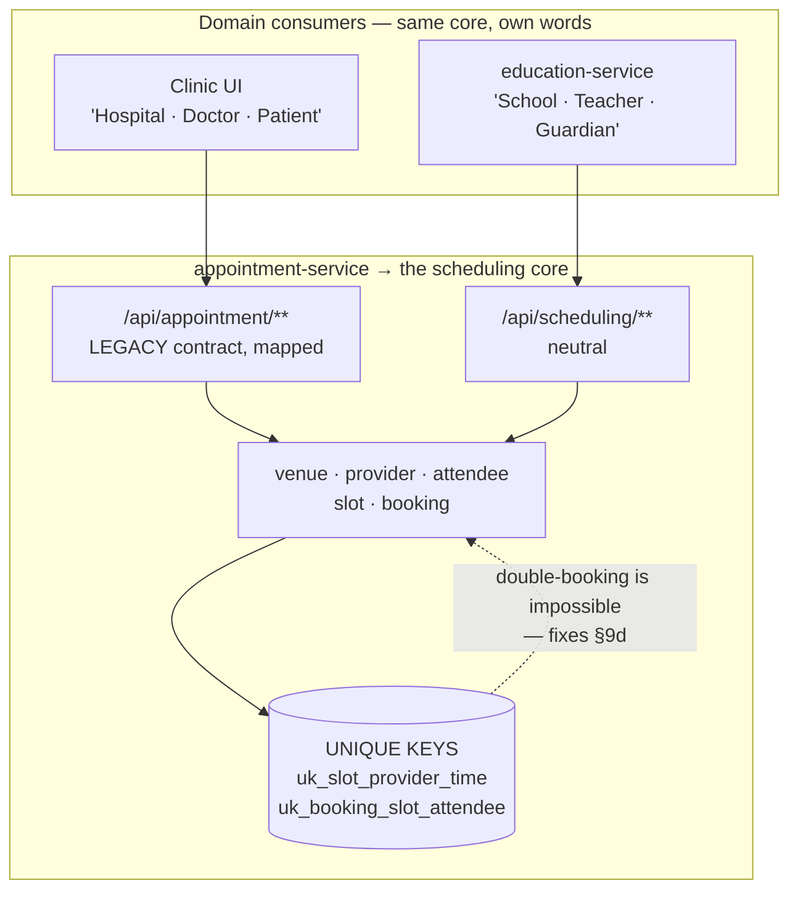
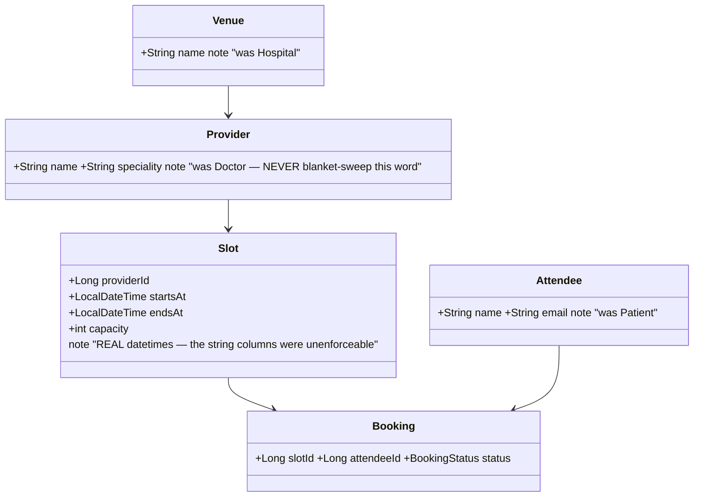
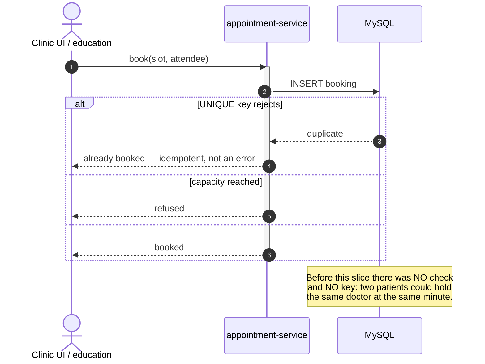

# Slice SCHED-1 — a real scheduling core (generalising `appointment-service`)

**Status: ✅ COMPLETE — B1 + B2 + B3 all DONE & GREEN (2026-08-07).** `meetings.cy.js` 8/8 first run, plus 62 regression cases. See **§11**. Chosen by the user as **D-9 option B**,
in preference to education owning its own meeting tables. Unblocks **edu-3.4** (guardian–teacher meetings),
which becomes a thin consumer once B2 lands.

**B1 = the rename, and it is verified invisible:** all 34 rows carried in place, the JSON contract byte-identical
(`hospitalId`/`doctorId`/`patientId` still populated), **4/4 appointment Cypress cases green** including the
UI hospital-creation flow. Details and the two pre-existing defects it surfaced: **§8**.

**⚠️ This changes a SHIPPED vertical that is in front of users and holds live data** — 14 hospitals across
**2 organisations**, 13 doctors, 6 appointments (counted 2026-08-07, per standard D5: never act on
inference). It is bigger than the slice it unblocks. §7 states the honest scope and the staging that keeps
it safe.

---

## 1. Document — what and why

### The problem, stated once

`appointment-service` is named for a capability it does not provide. It is a **clinic**: `Hospital`,
`Doctor`, `Patient`, and an `Appointment` whose `hospitalId` is `NOT NULL`. Any other domain that wants to
book time must first become a hospital.

And it **cannot prevent double-booking at any layer** — no check in `create()`, no unique key in the schema,
and `dateTime` typed as `String` (programme §9d). *A service that cannot prevent double-booking cannot
provide booking, whatever it is called.*

### The pattern this follows is already in the platform

This is not a new architecture. The commerce side already runs **one core, white-labelled per vertical**:
POS, Pharmacy and Marketplace are `BUSINESS`/`PHARMA`/`MARKETPLACE` sharing one dashboard and one commerce
core (`ModuleRouter.COMMERCE_TYPES`, slice 36). SCHED-1 applies the same shape to scheduling.

```
              ┌── clinic     → "Hospital · Doctor · Patient · Appointment"
scheduling ───┤
   core       ├── education  → "School · Teacher · Guardian · Meeting"
              └── (future)   → salon, workshop, consultancy
```

### D-9's real content: the MODEL goes neutral, the WORDS stay domain-specific

**A clinic user must never see "Provider" where it said "Doctor".** That is the safety property that makes
renaming a live vertical acceptable, and it is achievable because the domain words live in **i18n labels and
templates**, not in the schema. The clinic keeps its vocabulary; the tables stop lying.

---

## 2. Design

### D1 — Rename in place; never copy-and-drop

| Today | Becomes | Rows to carry |
|---|---|---|
| `hospital` | `venue` | 14, across 2 orgs |
| `doctor` | `provider` | 13 |
| `patient` | `attendee` | 1 |
| `appointment` | `booking` | 6 |

`ALTER TABLE … RENAME TO` and `CHANGE COLUMN` — **the rows are never copied and nothing is dropped**, so
there is no window in which the data exists twice or not at all. Standard **D9a**: this ships as a **new**
migration (`V3`), never an edit to the applied `V1__baseline.sql`, because Flyway checksums every applied
script and editing one makes every environment refuse to start.

> **D9b hazard, recorded because the target name is the risky one this time.** `Provider` already appears in
> 17 files as `AuthenticationProvider`, `SettingsCatalogProvider`, … A bare `Provider` entity in
> `com.myplus.scheduling.entity` does not collide at compile time, but **`Provider` must never be
> blanket-swept** the way `parent`→`guardian` was. `Doctor`, `Hospital` and `Patient` are safe to sweep;
> the new names are not.

### D2 — **The API contract does NOT change in this slice**

`/api/appointment/doctors` keeps its path and keeps returning `doctorId`. Internally it reads
`provider.provider_id`; a mapping layer translates.

**This is the decision that makes the slice finishable.** D9 form 6 says a controller's field names *are*
the API — and those names reach 4 monolith DTOs, 5 templates, the dashboard JS and 3 Cypress specs. Changing
the model and the contract in one commit means every one of those must be right simultaneously, with a live
UI as the test. Expand now, contract later, is how a shipped API is evolved.

New, neutral endpoints (`/api/scheduling/**`) are added for new consumers. **Education uses only those** —
it never sees a `doctorId`.

### D3 — Add what was missing: SLOTS, and the constraint that makes booking real

```sql
slot     venue_id · provider_id · starts_at DATETIME · ends_at DATETIME · capacity
booking  slot_id · attendee_id · status

UNIQUE KEY uk_slot_provider_time (organization_id, provider_id, starts_at)
UNIQUE KEY uk_booking_slot_attendee (organization_id, slot_id, attendee_id)
```

**`starts_at` is a real `DATETIME`, not a `String`** — the existing `date`/`dateTime` string columns are kept
untouched for the clinic's current screens and are marked deprecated in the migration header. A unique key
over a string column would enforce nothing useful, which is half of why §9d exists.

**This fixes §9d for every consumer, including the clinic**, and it fixes it the way 1.3 and 2.1 did: the
constraint is the guarantee, the service check is the friendly message.

### D4 — Legacy rows migrate, and what cannot be migrated is stated

The 6 existing appointments carry `String` date/time. The migration backfills `slot`/`booking` rows where
the string parses, and **leaves the originals in place regardless**. Anything unparseable stays visible in
the legacy columns rather than being silently dropped or guessed — D5's rule, on a table with real rows.

### D5 — Scope

| In | Out |
|---|---|
| tables + entities + repos renamed, data carried in place | changing the clinic's JSON contract (D2) |
| `slot` + `booking` + **both UNIQUE keys** (fixes §9d) | changing what a clinic user SEES — labels stay |
| neutral `/api/scheduling/**` for new consumers | education's meeting screens — that is **edu-3.4** |
| clinic endpoints kept working, gated by their own specs | rescheduling, ICS export, recurring slots |

### Layer answers (§5b)

| Layer | Answer |
|---|---|
| **UI/UX** | **unchanged for the clinic, deliberately.** The templates keep saying Doctor/Hospital/Patient; only i18n keys move |
| **Service / API** | old paths kept and mapped; new neutral paths added beside them |
| **Database** | MySQL — rename in place, add two tables, add the missing unique keys |
| **Patterns** | expand/contract API migration · DB-enforced idempotency · white-label core (slice 36's shape) |
| **Microservice design** | scheduling becomes a genuine cross-cutting service, which is what the standard asks for — rather than a clinic that other domains impersonate |
| **Per-org configurability** | `sched.slot.defaultMinutes`; the clinic's existing settings are untouched |
| **DRY** | one booking core; education stops needing its own meeting tables (3.4 shrinks to a consumer) |

---

## 3. Architecture & UML

### 3.1 Architecture



### 3.2 Class



### 3.3 Sequence



---

## 4. Implement — staged, because the blast radius demands it

**Each stage compiles, starts and passes its gate before the next begins.** Nothing here is a "big bang"
rename, because the whole point of D9's seven forms is that only four of them fail at compile time.

**B1 — schema + entities (no behaviour change)**
- [ ] `V3__scheduling_core_rename.sql` — `RENAME TO` + `CHANGE COLUMN`, all 34 rows carried in place.
- [ ] Entities/repos/services renamed; **DTOs and controller paths untouched**, mapping added.
- [ ] Gate: the **existing** `appointment.cy.js`, `appointment-dashboard.cy.js`, `appointment-landing.cy.js`
      must pass **unchanged**. That is the whole test of B1 — a rename nobody can observe.

**B2 — the missing capability (this is where §9d is fixed)**
- [ ] `V4__slot_booking.sql` — `slot`, `booking`, **both unique keys**; backfill from parseable legacy rows.
- [ ] `SlotConflictDetector` — pure, unit-tested before anything calls it.
- [ ] `/api/scheduling/**`; the clinic's create path routed through the same guard.
- [ ] Gate: `scheduling-core.cy.js` — **double-booking is refused** (the case that could not have passed before).

**B3 — education consumes it (this is edu-3.4)**
- [ ] `SchedulingClient` contract + client (DIP) in `commerce-contracts`.
- [ ] Education's meeting screens + `/portal/meetings`; 3.4's design applies unchanged except that the
      tables live here, not in education.

## 5. Test

**Pure:** `SlotConflictDetectorTest` — touching slots do not overlap · contained · identical · zero-length ·
template generates exactly N.

**Gate `scheduling-core.cy.js`:** the same provider cannot be booked twice at one time (**§9d's fix, and the
case that fails today**) · a second identical booking is idempotent, not an error · capacity refused ·
cross-tenant slot invisible by id · the clinic's own flows still work.

**Regression — the real cost of this slice:** all three appointment specs, `demo-reset` (it purges these
tables by name), plus a staff smoke. The appointment specs passing **unchanged** is B1's definition of done.

## 6. Risks

- **A live UI is the acceptance test.** Mitigated by D2: the contract does not move, so templates and JS are
  untouched in B1.
- **Renaming a table that Flyway has already baselined.** D9a: new migration, never an edit. Verified: the
  applied baseline stays byte-identical.
- **`demo-reset` and any raw SQL referencing the old table names** must be found before B1, not after — a
  grep for the four table names across the repo is a checklist item, not an assumption.
- **`Provider` is a crowded word** (D9b). Never blanket-sweep it.

## 7. Honest scope assessment

**This is the largest slice in the education programme so far, and it is not education work.** It renames
four tables and their entity graphs, adds two tables, fixes a shipped defect, and must leave a live clinic
UI behaving identically — before 3.4 can even start.

For comparison: 3.5 (notices) was one new table, one new screen, and it still surfaced a hollow green in a
slice already called done.

**It is the right long-term call** — the alternative leaves a service that lies about its domain and cannot
prevent double-booking — but it should be sequenced knowingly:

| | |
|---|---|
| **B1** | the rename nobody can observe — safest, and it is where D9's seven forms bite |
| **B2** | the capability + **the §9d fix**, which is the part with standalone value even if B3 never happens |
| **B3** | education consumes it — the original 3.4 |

**If the goal is guardian–teacher meetings soon, B1+B2 are a detour of real size.** They are worth doing
regardless because §9d is a live defect; the question is only whether 3.4 waits for them. That is a
sequencing call, and it is the user's.

---

## 8. B1 — DONE and verified (2026-08-07)

**The rename nobody can observe, and it is observably unobserved.**

| Check | Result |
|---|---|
| `V3` applied | ✅ `success=1` |
| **Rows carried** | ✅ **venue 14 · provider 13 · attendee 1 · booking 6** — identical to the pre-count. Renamed in place; nothing copied, nothing dropped |
| **JSON contract unchanged** | ✅ `GET /api/appointment/appointments` still returns `"hospitalId":1,"doctorId":1,"patientId":1` **populated**, plus the enriched `hospitalName`/`doctorName`/`patientName` |
| Cypress | ✅ **4/4** across all three appointment specs, including the dashboard spec that **creates a hospital through the UI** — the write path, end to end, through the renamed schema |

### What the checklist caught that a compile never would

**D9 form 6 — the silent one, and the reason B1 was designed the way it was.** With `Booking.venueId` beside
`AppointmentDTO.hospitalId`, ModelMapper matches by NAME, finds nothing, and **leaves the field null without
throwing**. Every appointment would have returned with no hospital, no doctor and no patient, and every
write would have stored nulls — with a clean compile and a green startup. Fixed with four explicit TypeMaps
declared beside the bean; the live JSON above is the proof they work.

**D9 form 4 — three derived queries** (`findByHospitalIdAndOrganizationId` ×2, `findByHospitalId`). These
compile and fail at **context startup** (`No property 'hospitalId' found for type 'Booking'`). Renamed with
their two callers.

**Verified absent beforehand, which is why B1 stayed small:** no native SQL, no `@Query`, no `Sort.by`, no
`@OrderBy`, and no demo-reset coupling anywhere against the four table names.

### Two pre-existing defects found while using the specs as a baseline

Neither is caused by this slice; both were found because a regression list was actually **run** rather than
merely named.

1. **`appointment-dashboard.cy.js` and `appointment-landing.cy.js` had been RED since 2026-07-09.** They
   assert `#nav-subheader`, which the UI redesign (`cb4d6abb`) replaced with `#app-sidebar` in
   `appointmentDashboard.html`; `#nav-subheader` now survives only in `businessDashboard.html`. The specs
   were last touched 2026-06-12 — a month before the element moved. **Selector repaired, intent unchanged**,
   with the history written into both files. The same shape as 3.1b finding that 3.1's own gate had gone red
   unnoticed: *a spec named in a regression list is not a spec anyone ran.*

2. **`/api/appointment/demo/purge` does not exist.** `DemoResetController` lists it among 15 purge paths;
   appointment-service implements none of it, and the endpoint answers 500. **A demo reset has therefore
   never purged appointment data** — the "declared but not implemented" class, the same shape as
   `edu.exam.minAttendancePercent` (registered, zero consumers) and `Alerts.sd/ed` (scheduling that never
   fires). Not this slice's to fix; recorded so it is not lost.

### Next

**B2 is where the value is** — `slot` + `booking` + the two UNIQUE keys that make double-booking impossible,
fixing programme §9d for the clinic as well as for education. **B2 is a clean stopping point even if B3
(education's meetings) is deferred**, because the defect it fixes is live today.

---

## 9. B2 — DONE and verified under real concurrency (2026-08-07)

**§9d is fixed, and the fix was proven by firing 10 simultaneous bookings at one provider — not by reading
the code.**

| | Before B2 | After B2 |
|---|---|---|
| 10 concurrent bookings | duplicate queue numbers, **silently** | **zero duplicates** |
| Numbers assigned | collided | `1,2,3,4,5,6` — contiguous |
| What the losers are told | nothing; they held a wrong number | `400` "Too many people are booking at once. Please try again in a moment." |
| Clinic's normal path | — | ✅ **4/4 Cypress** unchanged |
| Unit tests | **none existed in this service at all** | 8 pure cases |

### The §9d claim was WRONG, and the truth was worse

The programme and this slice both said *"two patients can book the same doctor at the same minute."* That
was **inferred from the absence of a unique key**. Reading `bookPublic` shows the model is a **queue**, not
a diary: `patients_appointed` is the patient's queue NUMBER, `patients_to_visit` the day's capacity, and
`date_time` merely when the row was made. A clinic says *"you are number 7 of 20 today."*

The real defect is a textbook check-then-act on that counter — read `lastAppointed`, add one, write it —
with no constraint behind it. **Two patients get the same queue number and the daily capacity is breached
by exactly the concurrency it exists to survive.** Fixed by `uk_booking_queue`, audited first (zero existing
duplicates, so it could not fail a live tenant).

> **Standard, and it is the one this slice exists to demonstrate:** *a defect described from the absence of
> a constraint is a guess. Read the write path before naming the bug.*

### The retry was rewritten because a concurrency test failed it

The first cut retried **inside** the transaction. Under the 10-way test it returned
`"null id in Booking entry (don't flush the Session after an exception occurs)"`: once a constraint
violation fires the Hibernate session is unrecoverable, so **no loop sharing that session can work**,
however it is written.

Restructured so each attempt runs in its own transaction and session (`REQUIRES_NEW`), invoked through the
Spring proxy — because a direct self-invocation bypasses the proxy and would silently restore the original
behaviour, a trap already recorded against this codebase.

> **Neither the compiler nor eight passing unit tests caught this.** A concurrency defect is only visible
> under concurrency; the ten parallel `curl`s were the cheapest possible version of that test and they paid
> for themselves twice.

### Known limit, stated rather than hidden

Under **ten truly simultaneous** bookings for one provider, 6 succeeded and 4 were refused with the retry
bound (5 attempts) exhausted — **not a capacity limit; the provider had 20 free**. It is a thundering herd
on a single counter: every retry re-reads `MAX+1` and races again.

That is acceptable here — a public booking form does not receive ten requests in the same millisecond, the
refusal is honest and actionable, and **no wrong number is ever issued**. If a real clinic ever sees it, the
fix is a different allocation strategy (a DB-side atomic increment or a short lock), not a bigger retry
bound. Recorded so the next reader inherits the measurement rather than the assumption.

### Still open in SCHED-1

**B2's neutral `/api/scheduling/**` surface and B3 (education's meetings) are NOT built.** What exists is the
core's schema, its constraints, and the clinic running unchanged on top of it. **B2's standalone value — the
§9d fix — is banked**, which makes this a clean stopping point if 3.4 is deferred.

---

## 10. B2's neutral API — DONE and verified (2026-08-07)

`/api/scheduling/**` is live: providers, slots, attendees and an **opaque `externalRef`** the core never
interprets. That opacity is the entire point of D-9 — this service became unusable by education precisely
because it had learned what a `Hospital` was.

| Behaviour | Verified |
|---|---|
| generate 18:00–19:00 × 10 min | 6 back-to-back slots |
| **re-generate the same window** | `created:0, alreadyExisted:6` — idempotent, so extending an evening adds only the new part |
| list with availability | one query for all bookings, not N+1 |
| **first booking** | `bookingId, alreadyBooked:false` |
| **same attendee re-clicks** | `alreadyBooked:true` — idempotent, not an error |
| **different attendee, capacity 1** | refused, `400` |
| **cross-tenant slot by id** | `404 Slot not found` |
| clinic regression | ✅ **4/4 Cypress** |

### FOUR defects, and not one was reachable by the compiler or by unit tests

This is the finding worth keeping from B2, more than the API itself.

| # | Defect | Why nothing static could see it |
|---|---|---|
| 1 | **ModelMapper returned nulls** for the three renamed FK fields | matches by NAME at runtime; compiles perfectly (D9 form 6) |
| 2 | **Retry inside the transaction could never work** — a violated Hibernate session is unrecoverable | only appears under concurrency; 8 unit tests were green |
| 3 | **An over-broad catch reported a hard failure as SUCCESS** — `DataIntegrityViolationException` caught unconditionally, so a NOT NULL failure answered `200` with nothing written | the code read as considered; the exception type is evidence that *something* was rejected, never of *what* |
| 4 | **Capacity checked before identity** — a re-click was told "that time has just been taken" about the booker's OWN booking | only visible at **capacity 1**, the realistic parents-evening value |

> **The standard this earns:** *a curl sequence against the running service is part of this kind of slice's
> definition of done, not an afterthought.* Four defects, four live requests. Defect 3 is the one that would
> have shipped silently — an API that says 200 and writes nothing is worse than one that errors.

> **And its companion, from defect 3 specifically:** *catching an exception type is not identifying what
> happened.* Both catch sites now ASK the database whether the row exists before interpreting the failure,
> and rethrow otherwise.

### Two more corrections found while building it

- **`booking.venue_id` was NOT NULL** — right for a clinic (every appointment is at a hospital), wrong for a
  neutral core (a parents' evening happens at the school, which is not a row). Widened in **V5**; a
  widening cannot fail on live data.
- **`mvn compile` after a FAILED `clean` reports BUILD SUCCESS on broken source.** It misled me twice, and
  the second time I passed that false green to the user. **`mvn test` is the reliable check while the
  service holds the jar** — it genuinely recompiles main.

### What remains

**B3 — education's meetings (the original edu-3.4) — is not built.** It is now the small part: education
becomes a CONSUMER of `/api/scheduling/**` (slots, bookings, an `externalRef` of its own) rather than owning
meeting tables. Everything it needs from the core exists and is proven.

---

## 11. B3 — DONE and GREEN (2026-08-07). SCHED-1 is complete.

**`meetings.cy.js` 8/8 on the first run**, plus **62 regression cases** — `guardian-portal` 11, `student-portal`
13, `notices` 10, `portal-sign-in` 13, `privilege-map` 11, and the clinic's own 4.

**D-9 is delivered end to end.** Education books time in a service that has never heard of a teacher:

```
education                    SchedulingClient              scheduling core
─────────                    ────────────────              ───────────────
Staff (a teacher)     →      providerId            →       provider
Guardian              →      attendeeId            →       attendee
a parents' evening    →      ref "EDU-EVT-7"       →       an opaque string
```

Education owns **one** table (`meeting_event`, V27): the school's decision to run an evening and to open or
close it. Slots, bookings, capacity and double-booking all live in the core, enforced by UNIQUE keys **once,
for every consumer** — which is exactly what the original 3.4 design would have re-implemented.

### The findings worth keeping

**1. The clinic's core assumption was baked in at THREE layers, and each failed differently.**
"Every appointment has a venue" had to be hunted separately in the schema (`booking.venue_id NOT NULL`, V5),
in the service (the over-broad catch that reported the resulting failure as success), and finally in the wire
contract (`@RequestParam venueId` declared required, so every education publish failed *before the request
left*).

> **Generalising a domain service means hunting its central assumption at every layer, not just the obvious
> one.** Finding it in the schema does not mean it is gone.

**2. A transaction around a remote call turned a diagnosable error into an undiagnosable one.**
`publishMeetingSlots` was `@Transactional` while calling the core over HTTP. When the call threw, Spring
marked the transaction rollback-only, the friendly catch ran, the commit failed anyway, and the caller got
*"Transaction silently rolled back because it has been marked as rollback-only"* — a message about plumbing
that says nothing about the fault. The transaction bought nothing: that path writes nothing locally.

> **Removing it was what revealed the real error** (`Missing request parameter value 'venueId'`) on the very
> next request. Same family as B2's retry: **a catch inside a transaction cannot recover what the
> transaction has already decided.**

**3. A friendly refusal must not cost the diagnosis.** The `FAILED` branch returned the message without
logging it, so when publishing failed the reason reached the screen and reached nobody else. Both refusal
branches now log.

**4. Six defects across SCHED-1, none reachable by the compiler or by unit tests** — the null field mapping,
the in-transaction retry, the over-broad catch, the capacity/identity ordering, the required `venueId`, and
the transaction-masked error. **Three of them were mine masking a failure rather than causing one**, which is
the more dangerous kind: the system looked like it worked.

### One thing that was NOT a defect, and is worth recording as a fixture hazard

A guardian read returned `NOT_FOUND` and looked like a broken portal. The cause was
`edu.portal.enabled = false`, left that way by an earlier gate run that was interrupted before its `after()`
hook. The resolver behaved perfectly — refusing indistinguishably from "no access", which is 3.1's kill
switch.

> **A spec that toggles shared org config leaves the tenant in that state if the run is interrupted.** An
> `after()` hook only restores what a completed run reached. `meetings.cy.js` therefore SETS the switch in
> `before()` rather than assuming it, and so should every spec that touches org settings.

### What remains open (deliberately)

- **The clinic's JSON contract is unchanged** (expand/contract's "expand" half). Retiring `hospitalId`/
  `doctorId`/`patientId` in favour of neutral names is the "contract" half, and needs the UI moved with it.
- **Slot mode and queue mode both exist** in the core, which is right: a clinic queues, a school books a
  diary. Neither is a workaround for the other.
- **`/api/appointment/demo/purge` still does not exist** though `DemoResetController` calls it — a demo
  reset has never purged appointment data. Found here, owned elsewhere.
