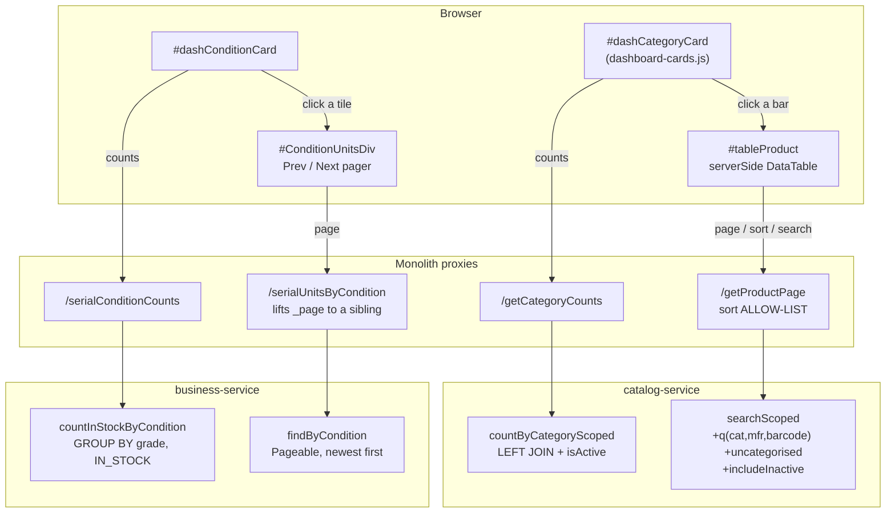
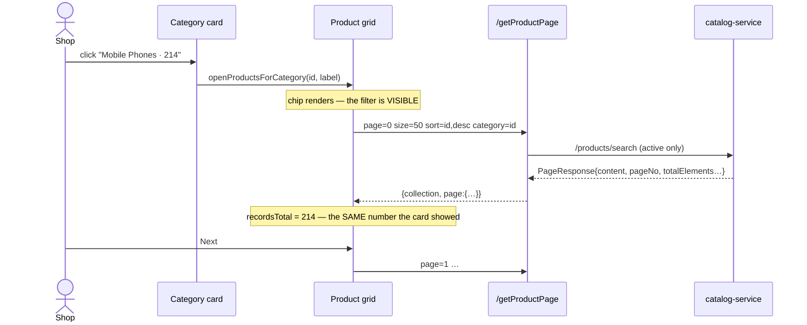

# SER-5 — Dashboard breakdown cards + server-paged product grid

**Status:** ✅ DONE + GREEN — gate run 2 = **15/15**
**Spec:** `cypress/e2e/business/dashboard-breakdown-cards.cy.js` (15 cases)
**Branch:** `feature/pack-loose-selling`

---

## 1. What was asked

> *"on businessdashbaord dashDateLabel we want to add card to show to the user products by categories where
> user will click and directly navigate to the filtered products also a mobile shop user want to see
> purchaseCondition (new, used or Refurbished) with single click instead of moving to the products and
> searching for it."*

then, after review:

> *"Condition card will display all the used in the stock with detail / The 1000 cap itself — fetching 1000
> may cause slowness or performance problem. implement pagination default 50 and click next to fetch next 50
> and so on…"*

Three deliverables: two breakdown cards with working drill-throughs, and the end of the 1,000-row product
fetch.

---

## 2. The Rule 0 trace, before any code

### 2a. `getUserProduct` — every CALLER

The obvious move was to page `/getUserProduct`. Listing its consumers is what stopped that:

| # | Consumer | Needs |
|---|---|---|
| 1 | Product grid (`loadDataTable`) | **a page** |
| 2 | `catalog-products.js` duplicate-SKU index | the WHOLE catalogue |
| 3 | `catalog-products.js` "already registered" panel | the WHOLE catalogue |
| 4 | `labels.js` | the WHOLE catalogue |
| 5 | `stock-count.js` | the WHOLE catalogue |
| 6 | `report-filters.js` | the WHOLE catalogue |
| 7 | two picker fills (`business.js:1203`, `business.js:1408`) | the WHOLE catalogue |

**COUNT: 7 consumers — 1 wants a page, 6 need everything.** Paging `getUserProduct` would not have made
those six slow, it would have made them **wrong**: a duplicate-SKU check that only sees page 1 reports *no
duplicate*, and registers the same product twice. → **a NEW endpoint, `/getProductPage`.**

Also found in the same pass: `?q=-1`, passed by three callers, is **read zero times** server-side.

### 2b. `loadDataTable()` — every CALL SITE

**COUNT: 34**, across `business.js`, `education.js`, `crud-modal.js`, `data-import.js`, `main.js`. Five are
the Product screen's own refreshes; the rest are generic — `crud-modal.js` and `data-import.js` refresh after
a save or an import **without knowing which entity is on screen**.

→ The fork is **one guard inside `loadDataTable()`**, not a change at the call sites. Forking at the call
sites would have meant finding those two blind refreshes too, and a missed one silently rebuilds the grid
through the unpaged path — 1,000 rows again, no error.

### 2c. `/products/search` — every CALLER

**COUNT: 0.** No monolith proxy, no JS, no other service. Widening it broke nothing — but as it stood it
could not have backed the grid, in three ways, each of which fails **silently**:

| Gap | What would have happened |
|---|---|
| `q` matched only name + SKU | The grid's client-side box searched its rendered columns, which include **Category** and **Manufacturer**. Typing "Samsung" would return nothing. |
| No `isActive` filter | Card counts active; drill would show active + inactive. Card says 120, click shows 166. |
| Uncategorised unreachable | `:categoryId IS NULL` already means "any category". The bucket's card row was clickable and would have returned the **entire catalogue**. |

### 2d. The envelope field names

`common.web.PageResponse` exposes **`pageNo` / `pageSize` / `last`** — *not* Spring Data's `page` / `size` /
`first`. The proxy originally read the latter and got null from every one. Null is not an error: the grid
still draws and the pager just stops knowing where it is. Caught before shipping; the proxy now maps the
names explicitly and documents that they differ.

### 2e. Counts must match their own drill

Both cards count exactly what clicking them shows:

- category card → `countByCategoryScoped` filters `isActive`; the drill uses the same filter
- condition card → `countInStockByCondition` filters `status = 'IN_STOCK'`; the drill defaults to the same

`countScoped` (the existing Products KPI) has **no** `isActive` filter — 46 inactive rows on org 6. That
inconsistency is **pre-existing and left alone**; it is reported here, not fixed under this slice.

---

## 3. Design



### Sequence — a category click



---

## 4. Industry patterns applied, and why each one

Reviewed against how Amazon, LinkedIn, Facebook, Gmail and eBay solve the same problems.

| Pattern | Where it came from | Applied as |
|---|---|---|
| **Facet counts from the same query as the results** | Amazon / eBay faceted search | Both cards count exactly what their drill shows (§2e). The discipline exists because a count that disagrees with its own list destroys trust in every other number on the page. |
| **Explicit pagination for task content; infinite scroll only for feeds** | Amazon order history and Gmail page; Facebook's feed scrolls | Prev/Next everywhere here. A register is *worked through*, not browsed — losing your place in one costs the shop a handset. |
| **Debounced server-side search with the paging** | LinkedIn search-as-you-type | `searchDelay: 400`. Search moved to the server **in the same slice** as paging: at 50/page a client-side box searches 50 rows out of 1,042 and reports "No matching records" for a product the tenant owns. |
| **Skeleton screens, not spinners** | Facebook, LinkedIn | `.breakdown-skeleton` holds the card's height so nothing below jumps when rows arrive. |
| **Active-filter chips that are themselves the way to clear** | Amazon's filter pills | `#productFilterBar`. A grid silently holding a filter is a support call. |
| **Top-N + an explicit "all"** | Amazon's "See more" in facet lists | 8 categories, then `+N more` and **All categories**. 39 bars is a second navigation menu, not a summary. |
| **Bars over pie slices** | Every analytics product that outgrew pie charts | A length is read accurately at a glance and a 3% slice cannot be clicked with confidence. The bar **is** the button, so the target grows with the count. |
| **Semantic state colour, separate from the brand accent** | Standard dashboard practice | Grades are green/amber/purple, not shades of the app blue — condition is a *state*, and reading it must not depend on reading the number beside it. |

**Considered and rejected:** keyset (cursor) pagination. It is strictly better at depth, but DataTables'
pager is offset-shaped and the catalogue is thousands, not millions. OFFSET at page 20 of 50 is a non-issue;
converting the grid's pager to cursors to solve a problem this tenant will not have would be the cost without
the benefit. Revisit if a tenant passes ~100k products.

---

## 5. What shipped

### catalog-service
- `ProductRepository.countByCategoryScoped` — LEFT JOIN (uncategorised is a **bucket**, not an omission),
  active-only, biggest first.
- `ProductRepository.searchScoped` — widened: `q` also matches barcode, manufacturer and category name;
  `uncategorised` and `includeInactive` flags.
- `ProductService.categoryCounts()`, `ProductService.search(...)` — blank `q` normalised to null.
- `GET /products/category-counts`, widened `GET /products/search`.

### business-service
- `SerialUnitRepo.countInStockByCondition` — one grouped query, `IN_STOCK` only.
- `SerialUnitRepo.findByCondition` — paged, newest first, status parameterised.
- `GET /serialConditionCounts` — every grade, including zeros.
- `GET /serialUnitsByCondition` — paged; product names and bill numbers each resolved in **one batch** for
  the page, never per row.
- ⚠ Fixed on the way: a local `Long org` shadows the `org.*` package, so fully-qualified
  `org.springframework…` references inside those methods do not compile. Imported instead.

### Monolith
- `productRow(...)` **extracted** from `loadDataTable`'s inline loop — the allow-list now exists once, so a
  future field cannot reach one screen and vanish from the other.
- `GET /getProductPage` — bounded size (1–1000), sort **allow-list** (an arbitrary property path would be a
  500 on a header click, or an ordering probe), page meta as a sibling.
- `GET /getCategoryCounts`, `GET /serialConditionCounts`, `GET /serialUnitsByCondition`.
- The serial proxy **lifts** business-service's `_page`-on-every-row workaround into a proper sibling and
  drops the empty-page placeholder, so one envelope shape reaches the browser.

### Front end
- `dashboard-cards.js` (new) — both cards, the condition drill, `showDashboardHome()`.
- `catalog-products.js` — `loadProductTable()` (serverSide, 50/page), `exportAll()` wrapper, filter chip.
- `business.js` — one guard in `loadDataTable()`; the Product row branch and the on-hand fill **moved**, not
  copied.
- `capabilities.js` — `capabilities:ready` now fires on the **failure** path too, so it means *settled*, not
  *arrived*. Without it a screen that defers work to the event waits for ever when the fetch fails.
- `theme.css` / `rtl.css` — cards, tiles, chip, pager; the absolutely-positioned bar fill mirrored for RTL.
- 15 i18n keys × 6 bundles.

---

## 6. Defects found and fixed inside this slice

| # | Defect | How it presented |
|---|---|---|
| 1 | `u.serial` — the field is `serialNo` | Every row of the drill renders a **blank** serial. The screen exists for that column. |
| 2 | `ui.js.noDataFound` is in no bundle | `t()` prints the key itself on screen. |
| 3 | "All categories" passed `undefined` → `== null` → **uncategorised** | A link that does the opposite of its label. |
| 4 | `.cap-off` checked at DOM-ready | capabilities.js resolves **asynchronously**; the class is never there yet, so the condition card loaded for every tenant, including gated ones, then hid. No error anywhere. |
| 5 | `pg.get("page"/"size"/"first")` | `PageResponse` names them `pageNo`/`pageSize`/`last`. All null; grid still draws. |
| 6 | `ui.dashboard` used for a button label | Key exists in **no** bundle. Reused `ui.businessOverview`. |
| 7 | `Long org` shadows the `org.*` package | Compile error, caught by the build. |

Also **prevented, not fixed**: exports under `serverSide` would have silently produced a 50-row file for a
1,042-product catalogue. `exportAll()` loads everything first — and deliberately does **not** restore the
page length afterwards, because the export libraries are lazy-loaded and read the table *later*; restoring on
return would reintroduce the bug on exactly the slow connections where it is hardest to spot.

---

## 7. Reported, NOT changed

- **`countScoped` has no `isActive` filter** (the Products KPI tile). 46 inactive rows on org 6, so the tile
  over-reports against both new cards. Out of scope: it is a pre-existing tile with its own consumers.
- **`ui.js.loading` is defined twice** in every bundle (lines ~2299 and ~2395). Harmless — last wins — but it
  is a duplicate key.

---

## 8. Gate

```bash
npx cypress run --headed --spec "cypress/e2e/business/dashboard-breakdown-cards.cy.js"
```

15 cases: C1–C3 (category card + count parity + the uncategorised bucket), P1–P7 (page envelope, distinct
pages, projection completeness, server search coverage, inactive handling, sort fallback, the chip in the
UI), D1–D5 (all grades, receive +1, sale −1, paged envelope, one-click drill).

Manual cases are in the **Test Book** artifact.

---

## 9. Gate run 1 — 11/15, and what the four failures actually were

**Three of the four were the SPEC calling an endpoint with the wrong wire contract**, and each was accepted
with an HTTP 200. None of them was a product defect; all three are the same mistake — *posting a DOM element
id as if it were the field name*.

| Case | The spec sent | The contract is | Why it passed silently |
|---|---|---|---|
| **P5** | `form { id }` to `/deactivateProduct` | JSON `{ checked: "1,2,3" }` — the screen deactivates a bulk selection | Proxy finds `checked` null, answers `{success:false}` in a 200, deactivates nothing. The product legitimately stays in the grid, and the assertion blames the grid. |
| **D2** | `purchaseCondition: 'USED'` | `conditionGrade` — `purchaseCondition` is the `<select>`'s **id**; the browser reads that element and posts `conditionGrade` (main.js ~737) | The bill saves and the unit registers, on the **default** grade. The USED count simply never moves. |
| **D3** | flat form + `sellSerials` to `/addSell` | JSON with a `customer` object and a nested `sales[]`, serial on the LINE as `serials` | The request returns 200 and does not sell the handset. |

Both fixes now go through shared `receiveUnit()` / `sellUnit()` helpers that **assert the envelope**, so a
future miscall fails at the call rather than three assertions later on a count that did not move.

### P7 was real, and small

`.chart-panel:hover { transform: translateY(-3px) }` — written when every panel held one static chart with
nothing inside to aim at. The breakdown cards are the **first panels to contain individually clickable
rows**, and the lift then moves the target under the cursor as the user reaches for it: a click begun on
"Accessories" can land on the row above. Cypress refused to click for exactly this reason — its actionability
check samples the target twice and will not click while it is still moving. The test was reporting a real
property of the UI, not being fussy.

Fixed with `.chart-panel.is-interactive:hover { transform: none; }` on the two card shells. The shadow still
deepens, so the panel keeps its response; only the movement goes. Charts keep the lift.

⚠ Written as a **class**, not `:has(.breakdown-body)`. An unsupported `:has()` is dropped silently by the
parser, which would leave the lift in place on exactly the older engines nobody tests on — and a click
landing one row off is hard enough to attribute without a stylesheet that quietly does nothing.

### Gate run 2 — 15/15 green

All four fixes held. The three spec defects were one mistake wearing three hats: **posting a DOM element id
where the wire expects a field name** (`purchaseCondition`→`conditionGrade`, `sellSerials`→`serials`,
`id`→`checked`). Every one was accepted with an HTTP 200 and did nothing — which is why the helpers now
assert the response envelope at the call site rather than letting a later count assertion carry the blame.
