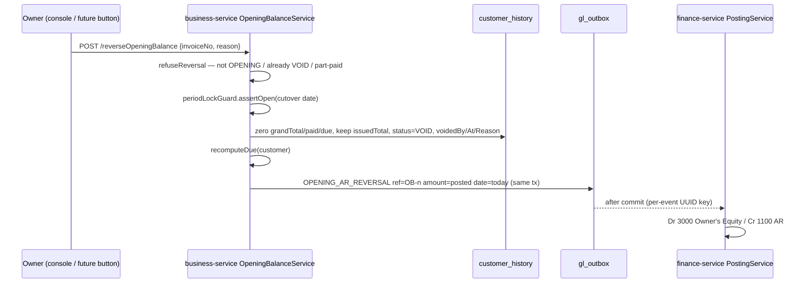

# SET-GUIDE L14–L18 — the five defects found while certifying the Settings guide

Status (2026-10-01): **coded, unit-tested in part, NOT deployed, NOT gated by Cypress.**
Branch `feature/pack-loose-selling`, uncommitted.

| # | Defect | Root cause | Fix |
|---|---|---|---|
| L14 | Bonus offer: no Edit/Delete; grid showed `#id` and raw codes | `editBonusScheme`/`deleteBonusScheme` existed but nothing called them; the monolith never mapped `DELETE /bonusScheme/{id}` | Row Edit + Delete buttons; `CatalogController.deleteBonusScheme` + `CatalogRestClient.deleteForMap`; names via the pickers, labels via `bonusOptionLabel` |
| L15 | Store: no deactivate; inactive store still in switcher | no UI control; `getMyStores` had no status filter | Stores grid Deactivate/Reactivate; `getMyStores` drops INACTIVE (switcher + team picker); `updateStore` accepts only ACTIVE/INACTIVE and refuses deactivating the caller's own active store |
| L16 | Bonus preview 403 | `global:false` skips header.html's ajaxSend CSRF hook | `window.xsrfHeaders()`; preview passes `headers: xsrfHeaders()` (stays `global:false`) |
| L17 | "Applies to" showed every picker | toggling a bootstrap-select's hidden `<select>` leaves its button visible | each picker in a `#<id>Slot` div, the slot is toggled. **Same defect on Price Rules** (4 pickers) — fixed together. Exactly 7 selects in the app were toggled directly. |
| L18 | **MONEY** — OB reversal left its journal in the GL | `reverseCustomerOpening` deleted the `customer_history` row and enqueued nothing | keep the document VOID-style + post `OPENING_AR_REVERSAL` (Dr 3000 / Cr 1100) |

## L18 design (consented 2026-10-01: "Keep doc + reversing journal")



**Why VOID-style, not a new status:** a voided sale already has this exact shape (header zeroed, `issuedTotal`
kept, `status=VOID`), so every reader that is right for a voided sale is right for a reversed opening balance.

**Reader trace — `CustomerHistoryRepo`, 12 queries:**
- 5 unaffected: `findByUserIdAndDateRange` (excludes OPENING), `maxInvoiceSeqForOrg` (OB seq is NULL),
  `shiftSalesSummary` (no shift), `findPendingSagaSales` (no saga), `findByOrganizationIdAndInvoiceNoIn`.
- 5 want the zeroed row: `sumOpeningForOrg`, `sumDueByCustomer`, `findOpenInvoicesByCustomer`,
  `findOpenInvoicesScoped` (due 0 → excluded from aging/FIFO), `findByCustomerOrdered` (statement → pair).
- 1 refuses a repeat: `findByOrganizationIdAndInvoiceNo` → "already been reversed".
- 1 idempotent replay: `findFirstByOrganizationIdAndIdempotencyKey` now returns the reversed doc for a replayed
  key instead of re-creating the balance. Correct: same key = same request.

**Journal date = today**, as a voided sale's SALE_RETURN. The period check is on the cutover date because the
document is edited in place — a closed cutover period refuses the reversal (`PeriodClosedException` → FAILED).

**Statement:** debit line type `OPENING` (was `BILL`), reversal line `OPENING_REVERSED` (credit = issued).
Labels `ui.js.stmtTypeOpening` / `ui.js.stmtTypeOpeningReversed` in 6 languages. CSV writes the raw type, as it
does for every other type.

**Supplier side:** there is no supplier opening-balance reversal endpoint, so nothing to fix there.

### Known limits
- A reversal whose original OPENING_AR never reached finance (dead-lettered) posts a credit with no matching
  debit. Same exposure every void has; the outbox delivers in order.
- Deploy **finance-service before business-service**: an older finance throws "Unknown event type" and the
  outbox dead-letters the reversal.

### ⚠ Already in the ledger — needs a one-off correction (not automated)
Verified on the Docker DB 2026-10-01: org 46 has 135 `OPENING_AR` journals, **15 with no document**
= **675,000.00** of phantom 1100 AR. The new code cannot reach them (the documents are gone). Check any other
environment before deploy:

```sql
SELECT je.organization_id, COUNT(*) orphan_journals, SUM(l.debit) ar_overstated
FROM myplusdb_finance.journal_entries je
JOIN myplusdb_finance.journal_lines l ON l.entry_id = je.id AND l.debit > 0
LEFT JOIN myplusdb.customer_history ch
       ON ch.invoice_no = je.source_ref COLLATE utf8mb4_unicode_ci AND ch.organization_id = je.organization_id
WHERE je.source = 'OPENING_AR' AND ch.invoice_no IS NULL
GROUP BY je.organization_id;
```

Correction options (decision pending): a manual journal per org (Dr 3000 / Cr 1100, memo citing L18 and the
refs), or leave the dev test tenant as is and document it. Not done.

## Gates
- Unit: `StoreStatusRuleTest` (business, 6 — **ran green**), `OpeningBalanceReversalTest` (business, 6 — not
  run), `OpeningBalanceReversalPostingTest` (finance, 2 — not run).
- Cypress: `opening-balances.cy.js` (new case 9b — trial balance mirror, 2nd reversal refused, statement pair),
  `settings-guide-screens.cy.js` F4 (L14/L16/L17), F6 (L15), F7 (L18), `price-rules-screen.cy.js` (L17 regression).
