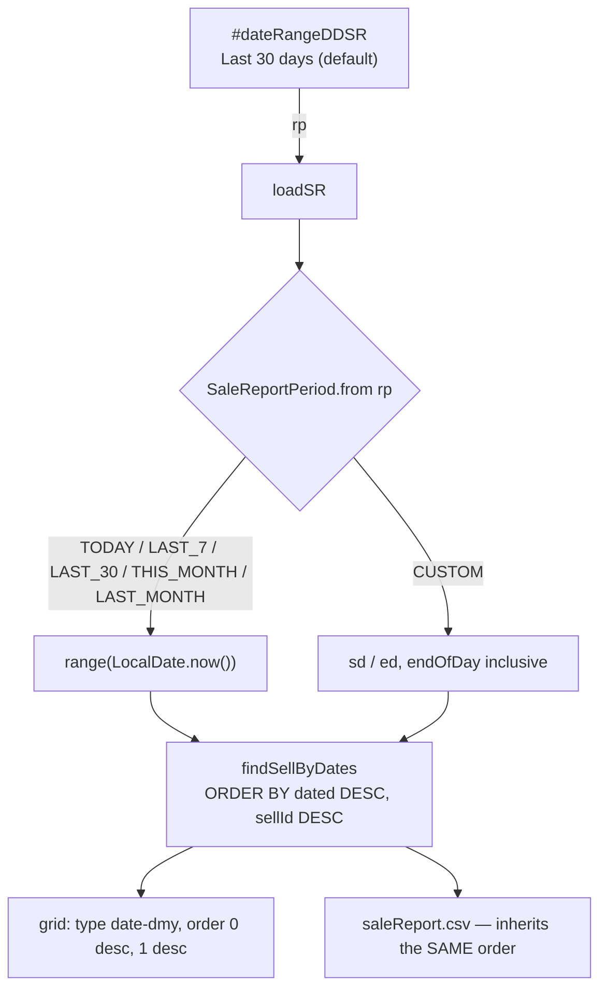

# SR-1 — the Sale Detail Report opens on the last 30 days, newest first

**Status:** ✅ **GREEN** (2026-09-07). Gates: `sale-report-order.cy.js` + `sale-report-period.cy.js`.
**Ask:** *"fix loadSR report by default load last 30 days sales so that user can see the latest sale on the top"*.

Every figure below was measured against the running system on 2026-09-06 as `owner.business@myplus.com`
(541 sale lines, 12 distinct sale dates), not reasoned about.

---

## 1. What is actually wrong — three defects, one root

The report renders its date as **`dd-MM-yyyy`** (`SellController:803` → `AppUtil.dateformatter`). Confirmed on
**541 of 541 rows**; no row carries a time component. Three separate pieces of code assume it is something else.

### D-1 🔴 The newest sale is not on top, and never was

`business.js` asks DataTables for `order: [[0, 'desc']]` on that column. DataTables types it as a **string**,
so it sorts by day-of-month first:

```
TRUE newest 3     06-09-2026 · 01-09-2026 · 30-08-2026
GRID shows        30-08-2026 · 29-08-2026 · 28-08-2026     ← today
```

Today's sale sorts *below* a sale from last month. Inside a single month every row shares the month and year,
so the order looks right — which is why this survived: **the default period is one month, and the defect is
invisible inside one month.** The two defects hid each other.

### D-2 🔴 The default period shows a fraction of the shop

`loadSR` defaults to the current month. Probed on the 6th: **6 rows of 541.** On the 1st of a month a shop
that has been trading for years opens its sale report on an empty screen.

### D-3 🟠 "Group by month" groups by day

`SaleReportGrouping.MONTH` calls `firstSeven(dated)` — commented *"yyyy-MM from a rendered date"*. Against the
real `dd-MM-yyyy` that returns **`01-09-2`**: day, month, and the first digit of the year. Every day becomes its
own "month". `DAY` uses `firstTen`, which takes the whole 10-character string and is correct **by luck**.

### D-4 🟠 The server returns rows in no order at all

`findSellByDates` has no `ORDER BY`. The grid re-sorts client-side, so the screen hides this — but
`saleReport.csv` streams the list straight to the file, so **the CSV export is unordered**. Verified: rows
arrive `16-08-2026` first and last.

---

## 2. RULE 0 — every reader of `dated` in this report

**4 readers. 1 correct, 2 wrong, 1 order-dependent.**

| # | Reader | Verdict |
|---|---|---|
| 1 | `business.js:3543` — grid column 0 | display ✅ · **sort ❌ (D-1)** |
| 2 | `SaleReportGrouping.DAY` → `firstTen` | ✅ correct, by luck |
| 3 | `SaleReportGrouping.MONTH` → `firstSeven` | **❌ (D-3)** |
| 4 | `saleReportCsv` — "Date" column | display ✅ · **order ❌ (D-4)** |

**Callers of the queries:** `findSellByDates`, `findSellByStartDate`, `findSellByEndDate` are called from
**`loadSR` only** (3 call sites, all in `SellController`). Adding `ORDER BY` cannot affect anything else.

**Callers of `rp`:** `getRp()` is read in **one place** — `loadSR`. The template offers it in **one** control.
So the period vocabulary is local to this report and safe to extend.

---

## 3. Design



**The period becomes a named vocabulary, not a pair of magic numbers.** A new `SaleReportPeriod` enum mirrors
the `SaleReportGrouping` already in this package: each constant owns its own date range, pure `java.time`, no
Spring and no database, so the rules are unit-testable directly. Codes `0` (this month) and `4` (custom) keep
their existing meanings — a bookmarked link keeps working — and `1/2/3/5` were unused.

| `rp` | Period | |
|---|---|---|
| 1 | Today | |
| 2 | Last 7 days | |
| **3** | **Last 30 days** | **the new default** |
| 0 | This month | unchanged meaning |
| 5 | Last month | |
| 4 | Custom range | unchanged meaning |

The dropdown had exactly two entries, so a "last 30 days" default *had* to gain an option or the screen would
name a period it was not showing. The rest is the conventional POS period list, added because a two-entry
period picker is the UX defect underneath D-2.

**Sorting is fixed at the library's own hook, not per table.** `datatable-defaults.js` already exists to set
DataTables defaults once, loads from `fragments/header.html` before any module builds a grid, and documents
that load order. It gains a `date-dmy` sort type registered through
`$.fn.dataTable.ext.type.order['date-dmy-pre']` — the framework's supported extension point. The column then
declares `type: 'date-dmy'` and nothing about the cell's markup changes.

**Opt-in, not auto-detect.** Registering the type does not change any other grid. Other `dd-MM-yyyy` columns in
the product almost certainly have the same defect, but each needs its own trace before it is switched — this
slice changes only the column it measured.

**Ties break on the invoice number.** `dated` carries no time, so several sales share a date. Invoice numbers
are zero-padded and sequential (`INV-000536`), so a secondary `[1, 'desc']` puts the latest invoice of the day
on top. Column 1 is declared `type: 'html'` so DataTables strips its `<span>` before comparing.

---

## 4. Changes

| File | Change |
|---|---|
| `dto/SaleReportPeriod.java` | **new** — the period vocabulary + range maths |
| `controller/SellController.java` | `loadSR` resolves through the enum; default = last 30 days |
| `repository/SellRepo.java` | `ORDER BY s.dated DESC, s.sellId DESC` on the 3 range queries |
| `dto/SaleReportGrouping.java` | DAY/MONTH keys parse the real `dd-MM-yyyy` (D-3) |
| `js/common/datatable-defaults.js` | register the `date-dmy` sort type |
| `js/business/business.js` | column types + `order`; default `rp` = `3` |
| `templates/businessDashboard.html` | the period dropdown |
| `messages*.properties` × 6 | 4 new period labels |

**No schema change, no migration, no new dependency.**

## 5. Not done here

* **Other `dd-MM-yyyy` grids.** The sort type is now available to them; each needs its own trace first.
* **`"message":"User Not Found"` on a `SUCCESS` envelope** — `loadSR` returns the `message.userNotFound` bundle
  key on the happy path. Cosmetic, wrong, and untouched: it is not this defect.


---

## 6. What the gates found on the way to green

Recorded because each cost a run, and each is a repeatable mistake rather than a one-off.

### ⚠ The select reset — a defect my change only EXPOSED

`#dateRangeDDSR` came back as `'1'` when the markup said `selected="selected"` on `'3'`. The served HTML was
correct; `main.js` reset **every select on the page** to `selectedIndex = 0` on each screen switch. That was
invisible while the report's default happened to be its first option.

Counted across the templates: **10 selects in 3 modules** lose their declared default this way —
`#studentGender`, `#studentFeeMode`, `#staffMartialStatus`, `#discountTypeDD`, `#fvYearDD`, `#gradeRoom`,
`#bkDiscountTypeDD`, `#clSeverity`, `#provPlan`, and this one. Each renders correctly on first load and then
moves. Fixed at the cause: the reset now goes to the option whose markup declares `selected`
(`option.defaultSelected`), which is what the platform's own `form.reset()` does. A select declaring no
default still lands on index 0, so behaviour there is unchanged **by construction**.

### ⚠ A gate that read the rendered page could not see the defect

The ordering case asserted over `#tableSellReport tbody tr` — the rendered page, 50 rows. Sorted newest-first
those all fall inside the newest month, and **inside one month a string sort and a date sort agree**. The
assertion could only ever observe agreement; it would have passed on the broken build. It now reads through
the DataTables API with `{ page: 'all', order: 'applied' }`, which is where the month boundary is.

*The same trap as the defect itself: the one-month default hid the sort, and a one-page assertion hid it again.*
