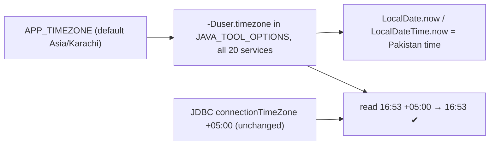

# TZ-1 — store UTC, render in each tenant's zone

Status: **DESIGN (2026-09-25). USER RULING: Option B — "Store UTC + per-tenant zone"** (Option A, a fixed
Asia/Karachi JVM zone, was offered and declined). Each phase needs its own go-ahead.

## P1 progress (paused 2026-09-26)
Written, NOT enabled: `common-security` `RenderZone`, `RenderZoneFilter`, `RenderZoneWebConfig` (web-layer-only
converter), `UtcDefaultTimeZone`; `RenderZone.toDisplay/fromDisplay` in business `AppUtil` (7 sites) and the
education/welfare formatters. Tests: `RenderZoneTest` 7/7, `UtcDefaultTimeZoneTest` 2/2, common-security 33/33.
**⚠ All of it is behind switches that default OFF** — `app.tz.pin-utc` (JVM pin, read after config data loads) and
`app.tz.render-zone.enabled` (filter + converter). A peer session caught that the pin was first written UNGUARDED in
spring.factories: it would have changed the JVM zone of every service (and every `mvn test` on the PKT host) at
the next rebuild while this work was described as "paused and inert". Remaining for P1: the 17 `.toString()`
sites, the auth `tz` claim, the monolith `X-Render-Tz` header, the viewer-zone helper, the receipt-time gate —
then switch both properties on together, deliberately.

## 0. The fact that shapes the plan
**Inside the JVM the app already holds TRUE UTC.** A value stored as 16:53 at +05:00 is read by Hibernate as 11:53
in the UTC JVM — which IS the UTC time of that sale. So the visible defect is purely at the RENDERING edge, and the
storage change is a separate, internal step. That lets the fix ship in the safe order:

| Phase | What | Data change | Risk |
|---|---|---|---|
| **P1 Tenant zone + display** | `org.timezone` per tenant (IANA id, default `Asia/Karachi`), carried in the JWT → `AuthenticatedUser.zoneId`, published to the page as `window.TENANT_TZ`; ONE shared browser formatter (`main.js`: `fmtDateTime` / `fmtDate`, `Intl.DateTimeFormat` with `timeZone`) treating zone-less server strings as UTC; the **23 hand-slicing sites in 11 files** switched to it; server-built text (notifications/SMS with a time) formatted in the tenant zone | none | low — **fixes the receipt** |
| **P2 Business dates** | an injectable `TenantClock` (the java.time `Clock` pattern) — `today()` / `now()` in the request's tenant zone; the **133 `LocalDate.now()`** classified one by one (business date → tenant today; technical stamp → UTC); report `from/to` dates → a UTC range `[from 00:00, to+1 00:00)` in the tenant zone; GL posting date and period lock from tenant today | none | medium — fixes the **00:00-05:00 GL date** and date filters |
| **P3 Store UTC** | JDBC `connectionTimeZone=UTC` in every service URL (config-server, application.yml, ECS); per-service Flyway migration shifting every **DATETIME** column −5 h (**293 columns, 16 databases**; 0 TIMESTAMP columns; the **83 DATE columns are NOT shifted** — a due date is a calendar day, not an instant), idempotent via a per-schema marker; native SQL using `NOW()` / `CURDATE()` / `DATE(col)` reviewed (the session zone becomes UTC) | **yes, all timestamps** | **high** — needs a maintenance window: services stopped, migrate, switch URLs, start; a half-switched fleet would write both zones |
| P4 Onboarding other zones | zone picker in Configuration, validation, "9 am tenant time" for reminders | none | low |

### User rule (2026-09-25): WHOSE zone
Business documents and business days follow the **shop's (location's) zone**, whoever views them — receipts,
invoices, credit notes, challans, reports, day/shift close, ledger, due dates, "today". Activity-style times (audit
log, last login, sessions, notifications) follow the **viewer's zone** (browser, overridable per user). Where the two
differ, show both: `16:53 PKT · 7:53 AM your time`. Zone resolution: **location (store) → organisation → Asia/Karachi**.
(Market check: Shopify/Square/Xero = store zone for business data; Odoo = user zone for display, plain dates for
accounting; Gmail/Slack = viewer zone for personal activity.)

### P1 approach — REVISED after measuring (needs the user's OK)
The browser reads timestamp fields in **442 places across 47 files** (the first count of 23 caught only code that
slices strings; most grids print the field raw, e.g. `obj.updated`). Editing 442 call sites — and every future
screen — is how a fix silently misses places. The browser talks ONLY to the monolith, which already proxies every
call, so the conversion belongs there — the **edge-translation (BFF) pattern**:
- **Out:** in the monolith's proxy response path, every value matching a strict ISO LocalDateTime
  (`yyyy-MM-ddTHH:mm[:ss[.f]]`, no offset) is converted **UTC → business zone**. `LocalDate` values (10 chars — due
  dates, birthdays) are never touched. Screens keep their string handling; they simply receive local time.
- **In:** request bodies/params carrying a LocalDateTime (appointment start, a typed datetime) are converted
  **business zone → UTC** before forwarding, so a round trip is exact.
- **Zone at the edge:** a `tz` claim in the JWT (organisation zone from a new `org.timeZone` setting, default
  `Asia/Karachi`, owned by auth like `org.shape`) → every service and the monolith know it with **no extra call**.
  The location (store) override (P1b) is resolved in business-service for documents of a given store (receipt
  payload carries `timeZone`).
- **Pinned server clock:** every JVM set to UTC programmatically at startup (one shared initializer), so services
  run the same on the Windows host (today: PKT) and in Docker (UTC). Without this the edge cannot know what zone
  an unmarked value is in.
- **Viewer zone:** a small client helper converts business → viewer for the few activity screens and shows both.

P1 and P2 are correct whatever the storage zone is, because the driver converts consistently; P3 changes only what
the database holds. A tenant in another zone is correct after P1 + P2 for everything it SEES and DATES.

---

## (Superseded) original review and Option A
Reported: the receipt prints **11:53** for a sale rung at **16:53** Pakistan time (INV-000054, org 13).

## 1. What is actually happening (verified, not inferred)

| Layer | Setting | Effect |
|---|---|---|
| MySQL (Docker `myplus-mysql`) | `@@time_zone = SYSTEM` = UTC | server clock UTC |
| JDBC, every service | `connectionTimeZone=%2B05:00&forceConnectionTimeZoneToSession=true` (the DB timezone standard) | the session is +05:00; **stored values are Pakistan wall-clock** — INV-000054 `dated` = 16:53:10 ✅ |
| JVM, every container | **no zone set** — `eclipse-temurin:21-jre-alpine`, no `TZ`, no `-Duser.timezone` | **JVM default = UTC** |
| Hibernate 6 | binds `LocalDateTime` through `java.sql.Timestamp` in the JVM zone | read: 16:53 +05:00 → instant → **11:53 UTC** local time |

So every timestamp any service RETURNS is 5 h early (receipts, grids, reports, audit views), and every
`LocalDate.now()` / `LocalDateTime.now()` in the code is UTC. Locally-run services (Windows host, PKT) never showed
it — **only the containers** (dev Docker AND the production VPS, which runs the same compose) are wrong.

## 2. Blast radius (Rule 0 — counted)
- **481 clock reads** in `*/src/main`: 133 `LocalDate.now()`, 348 `LocalDateTime.now()` — all UTC in Docker today.
- **12 GL postings** date the journal with `LocalDate.now()`: a sale between 00:00 and 05:00 PKT is posted to the
  ledger on the **previous day**; period-lock checks use the same wrong date.
- **Scheduled jobs: 0 with a cron time** (all fixed-delay) → no job changes its run time.
- **Stored data: unaffected.** Every value written through JDBC was converted to +05:00 on the way in, so the
  database already holds Pakistan time. Fixing the JVM zone changes what the APP sees, not what is stored.
- **AWS (Terraform `ecs.tf`)**: `SPRING_DATASOURCE_URL` carries NO timezone parameter, so the driver would use the
  JVM zone (UTC) and store UTC — the opposite of the VPS. Setting the JVM zone makes both consistent.

## 3. Design — Option A (recommended): one business zone for every JVM

1. `microservices/docker-compose.yml`: one anchor `x-jvm-opts` = the existing
   `-XX:MaxRAMPercentage=60.0 -Xss512k` **+ `-Duser.timezone=${APP_TIMEZONE:-Asia/Karachi}`**, referenced by all 20
   `JAVA_TOOL_OPTIONS` lines (they are identical today — DRY). `.env.example` documents `APP_TIMEZONE`.
2. `infrastructure/terraform/ecs.tf`: the same `JAVA_TOOL_OPTIONS` in the shared task-definition environment.
3. **Invariant, written into the DB timezone standard:** the JVM zone and `connectionTimeZone` must name the
   SAME offset. Pakistan has no DST, so `Asia/Karachi` ≡ `+05:00` all year.
4. **No data migration.** Stored rows are already Pakistan time.
5. **Not repaired (reported):** GL entries already dated with the UTC date for sales between 00:00-05:00 PKT —
   the posting date is a day early. A read-only count is in §5; restating journals is a separate owner decision
   (the COGS precedent was not to restate).

**Option B (the SaaS end-state, not now):** store UTC, stamp a zone per tenant, render in the tenant's zone. Needed
the day a tenant outside Pakistan signs up; a multi-service rewrite plus a data migration. A is the correct fix for
the platform as it is, and does not make B harder.

## 4. Deploy
Every Java container must be recreated to pick up the new `JAVA_TOOL_OPTIONS` (`docker compose up -d` recreates
only services whose config changed — here, all 20). The user controls restarts.

## 5. Tests (the gate)
- `mvn test`: none of the logic changes; existing suites must stay green (they run on the PKT host already).
- Cypress `receipt-time.cy.js` (new): make a sale, then `/getReceipt` `dated` must be within 2 min of the browser's
  own clock (the host runs PKT) — **RED today** by exactly 5 h; plus INV-000054 (org 15) reads **22:27**, its stored
  value, not 17:27.
- Container check after deploy: `docker exec <svc> java -XshowSettings:properties -version | grep user.timezone`
  = `Asia/Karachi` on all 20.
- Read-only: count GL entries whose `entry_date` is one day before their sale's PKT date (the §3.5 residue).
