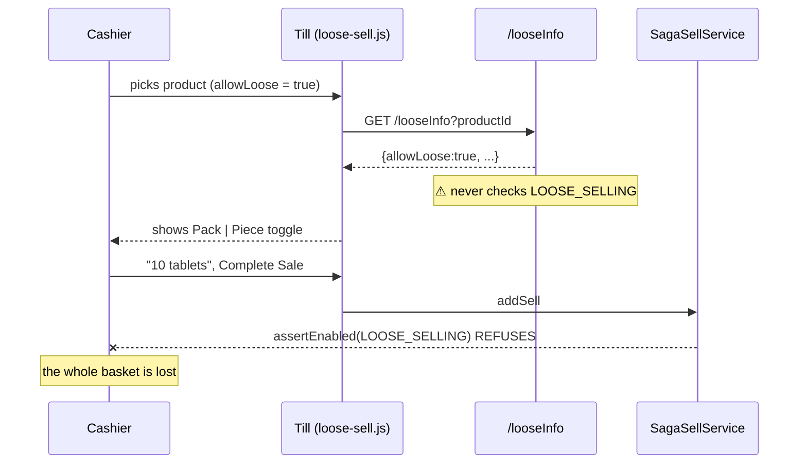
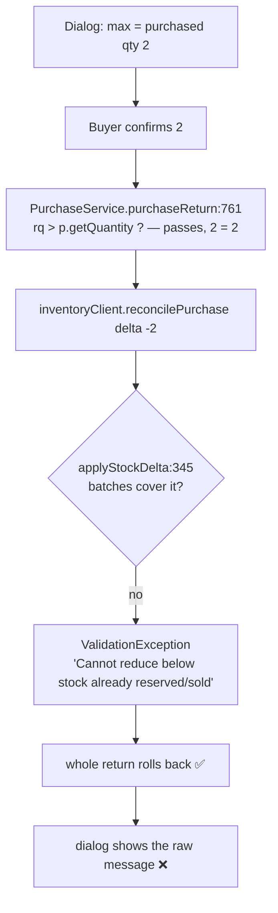

# U15 — pack/loose selling that anyone can use

**Status: Slice A ✅ DONE + COMMITTED (abdca9e9) — 295/0, gate RED 6/7 → GREEN 7/7.
Slice B ✅ DONE, UNCOMMITTED — 299/0, gate RED 0/6 → GREEN 6/6, plus pos-cell-layout 12/12.**
Slice C vocabulary RULED (§5.4), not built. D awaits its ruling.

### The red run — `pack-loose-ux-till.cy.js`, 2026-09-21, against the deployed (pre-fix) build

Taken deliberately BEFORE the rebuild, because the monolith serves its JS from the built jar and that window
closes for good on the next deploy. U13 and U14 both shipped without one.

| Case | Expected | **Actual, on the old till** |
|---|---|---|
| 1 · `/looseInfo` answers `defaultSellUnit` | `LOOSE` | **undefined** — the field was returned to nobody |
| 2 · "Sales start as pieces" opens in pieces | toggle active | **not active** — every line opened in PACK |
| 4 · cart Price column | `12` | **`120`** — the pack price beside "5 tablets" |
| 5 · ⚠ MONEY: a `5L*` scan | `60` | **`600`** — pieces × the pack price, and change came off this |
| 6 · a second loose scan | `10` tablets | **`5`** — the extra five were never billed |
| 7 · pieces onto a PACK line | refused | **"Added … ×6"** — silently merged, six PACKS sold |
| 3 · a PACK product still opens whole | pack active | **passed** — the control, green before AND after |

### The green run — same spec, after the rebuild (2026-09-21)

**6 of 7 green.** Cases 1, 2, 3, 4, 5 and 6 all pass on the rebuilt stack: `defaultSellUnit` reaches the
till, the line opens in pieces with no keystroke, the cart Price column reads 12.00, and the `5L*` scan bills
60.00 with 40.00 change from a 100 note.

**Case 7 stayed red, and it found a defect IN THE FIX.** The refusal worked — the cart was untouched at
×1 — but `sellScanAdd` then overwrote the refusal with `Added … ×1`, because it announces success
unconditionally after calling `scanAddToCart`. So a cashier scanning pieces onto a pack line was told a line
had been added that had not been. **That is worse than the merge it replaced**: a silent no-op wearing a
success message, the exact shape BLK-2 removed from the return dialogs (STANDARDS §0b).

Fixed by making `scanAddToCart` answer `false` on refusal and both call sites respect it. A second flaw was
found while doing so: the bump branch mutated `soldQuantity` *before* the quote could fail, which would have
left the line holding more tablets than its own quantity and totals described — in the payload `data[]`
submits. It now prices first and commits after.

After that fix and a monolith redeploy: **7/7 GREEN** (2026-09-21 14:0x). The pair is complete — 6 red → 7
green, with every red failure carrying the defect's own figure.

⚠ **The first attempt at the red run was invalid and was thrown away.** Cases 5-7 failed with
`No product for "5L*U15…"`, which reads like a missing fixture: the `5L*` grammar is parsed only when
`pos.keyboard.shortcuts.enabled` is on (`business.js:376`), and the spec had not set it. A spec that fails
for its own reason proves nothing about the defect. The flag is now snapshotted, set, asserted live in
`scanBox()`, and restored in `after()`.
Raised 2026-09-21: *"pack-loose-selling UI/UX is confusing for customers. do e2e analysis and share the gaps
for review and fix so that anyone can use the product registration, purchase and sale easily?"*, extended the
same day to *"include purchase return and sale return of pack-loose-selling in your analysis also"*.

Predecessors: U1 (pack rules on the product) · U3 (loose at the till) · U4 (loose on paper) · U5 (buying in
boxes) · U6 (counting and giving back) · U13 (loose sale return) · U14 (loose units in quotes).

---

## 1 · What this slice is not

**The engine is sound, and nothing here changes a stored figure.** The trace below found no defect in what the
books record:

| Concern | Verdict |
|---|---|
| Pricing rule | ONE implementation — `SagaSellService.looseLine`. The till fetches it (`/looseInfo`), never recomputes it |
| Stored line | `soldUnit` / `soldQuantity` / `soldRate` / `packSizeSnapshot` — the customer's version and the shelf's version both survive |
| Display | ONE formatter, `js/common/loose-format.js`, with six callers |
| Purchase return over-return | **Refused** by `StockService.applyStockDelta` — see §6 |

Every gap below is in what a screen **says**. That is the whole point: a correct ledger a shopkeeper cannot
read is a feature they switch off.

---

## 2 · The trace

Nine screens, end to end, on the deployed build (2026-09-17):

1. Product registration — `businessDashboard.html:3690-3783`, `catalog-products.js`
2. Product list — `catalog-products.js:1399` (uses `shelfText` ✅)
3. Purchase entry — `businessDashboard.html:2123-2184`, `business.js:3159`
4. Purchase return — `business.js:4512-4567`, `PurchaseService.purchaseReturn:752`
5. Till / sale line — `businessDashboard.html:2546-2582`, `loose-sell.js`
6. Cart grid — `business.js:227-236`, header `businessDashboard.html:2736-2745`
7. Sale return — `business.js:4216-4256` (U13 ✅)
8. Sales quote — `businessDashboard.html:869`, `SalesQuoteService` (U14 ✅)
9. Receipt / report / stock count — `receipt.js`, `stock-count.js` (✅)

---

## 3 · The three traps — Slice A

### A1 · The till offers loose selling the server will refuse



`SellController.looseInfo:449-470` decides the toggle from the product's `allowLoose` alone.
`SagaSellService:891` asserts the `LOOSE_SELLING` capability at submit. A tenant whose products carry
`allowLoose` without the capability — a CSV import (U9), or a plan downgrade — is offered a control that
cannot succeed. **The same capability also hides `#prodLooseWrap` on the product form with no explanation**,
so the owner sets a pack size, nothing appears, and no screen says why.

**Fix.** `/looseInfo` returns `allowLoose = allowLoose AND capability`. The toggle then never appears where the
sale would be refused. On the product form, when the capability is off and the pack size is > 1, say so in one
line where the loose row would have been — not silence.

### A2 · The cart shows arithmetic that does not work

`business.js:232` fills the Price column with `obj.stock.bsellRate` — the **pack** price — while U4 correctly
made the QTY column read `looseQtyText(obj)`:

| QTY | Price | Total |
|---|---|---|
| 10 tablets | **311.60** | 77.90 |

A customer watching the screen reads 10 × 311.60 = 77.90. The right number is already on the line:
`soldRate` (7.79), set by `LooseSell.decorate`. `looseDisplay(line).rate` returns it for every caller.

**Fix.** The Price column uses `looseDisplay(obj).rate`. **Three paths write that column** — the manual add
(`business.js:232`), the scan add (`:582`) and the re-quote after a customer is chosen (`:2493`) — and fixing
one would have left the row reading "10 tablets · 311.60" again as soon as a contract price landed. All three
now go through one exported rule, `LooseSell.quoteFor`.

### A4 · ⚠ MONEY — a loose SCAN priced pieces at the PACK rate, and the change came off that figure

Found while implementing A2, and **it is not a display defect.** `scanAddToCart` computed
`lineMath(n) = sellLineMath(packPrice, n)` with `n` in PIECES on a `5L*CODE` scan: five tablets of a 120.00
pack of 40 produced **600.00** for a line that bills 15.00. That figure went into the cart's Total column,
and:

```
calculateChange()            business.js:3437
  sellTotal = #sellTotal     ← the footer SUM of that column
  change    = received + insured + priorPaid + storeCredit − sellTotal
  #sellCh   = change         ← "addSell submits this as customer.dueAmount" (its own comment)
```

So the cashier was shown change against 600.00 and **that figure was submitted as the customer's due**. The
invoice lines were still derived server-side from `soldQuantity`, so the INVOICE was right — but the cash
handed back and the customer's balance were not. Per STANDARDS §0b this is a money defect and is recorded as
one. Two further scan defects in the same path:

| Scan | Was | Now |
|---|---|---|
| pieces onto an existing loose line | `0.125 packs + 5 = 5.125`, `soldQuantity` never moved → the extra tablets were never billed | added as PIECES and re-priced |
| a plain barcode (PACK) onto a loose line | quantity grew, `soldUnit` stayed LOOSE, `soldQuantity` stayed → the sealed pack was never billed | converted to `packSize` pieces |
| `5L*CODE` onto an ordinary PACK line | stayed PACK and sold five PACKS — 600.00 charged for 15.00 of tablets | **refused** (`ui.js.mixedUnitLine`), never guessed at |

### A3 · "Sales start as pieces" does nothing

`defaultSellUnit` is a complete dead path from the form to the till:

| Step | State |
|---|---|
| Product form select `#prodDefaultSellUnit` | ✅ saved (`catalog-products.js:981`) |
| `Product.defaultSellUnit` | ✅ stored, default `PACK` |
| `ProductRef.defaultSellUnit` | ✅ carried |
| `/looseInfo` response | ❌ **not returned** (`SellController:465-469`) |
| `loose-sell.js` | ❌ **never read** — `onProductPicked:57` forces `unit = 'PACK'` |

A pharmacy that sets "Sales start as pieces" still presses the toggle on every line, all day. The design
promised this as *"the keystroke that disappears"* (`pack-and-loose-selling-design.md` §3.3(4)).

**Fix.** `/looseInfo` returns `defaultSellUnit`; `onProductPicked` starts the line in it when the product
allows loose. The toggle still overrides, and a product that may not be split still starts in PACK.

---

## 4 · Say the unit everywhere — Slice B

| # | Gap | Where | Fix |
|---|---|---|---|
| B1 | Product form never shows the per-piece price; "Sell Price" is the PACK price with nothing saying so | `businessDashboard.html:3679` | Live hint under the price: "311.60 per box · **7.79 per tablet**", using the markup the shop has set. Catches an owner who typed the tablet price into a pack field |
| B2 | Till stock reads in packs ("0.25") while the cashier types tablets | `business.js:2962, 2992` | `shelfText` — already written for U6 and used on two other screens — renders "2 packs + 5 tablets" |
| B3 | Purchase return says "purchased qty 10" with **no unit at all** | `business.js:4525` | Name the unit; show what is still returnable (§6) |
| B4 | Both return dialogs are hardcoded English in a 6-locale product | `business.js:4200-4211, 4523-4532` | `t()` for every label, as the error lines already do |

B4 is the cheapest real win in this document: two dialogs, no logic, six locales.

### ✅ DONE — unit 299/0, gate RED 0/6 → GREEN 6/6 (2026-09-22)

⚠ **Slice B broke one existing gate, and the fix ships in this slice.** `pos-cell-layout.cy.js:285` asserted
the literal `'Sellable'`; the badge now reads "In stock: 2 + 5 tablets". The line's own purpose — per its
comment — is to block until `/productSellable` has painted, so it now asserts a DIGIT: the wait is exactly as
strong (the badge is emptied when `loadStock` starts, so only the count can refill it) and it survives both
the rewording and the other five locales. `grep -rn "Sellable" cypress/e2e` confirmed this was the ONLY
assertion on that literal — every other hit is the `/productSellable` endpoint or a comment.
Re-run after the fix: **pos-cell-layout 12/12**.

⚠ This is a NEW break, fully explained and caused by a label change made in this slice. It must NOT be used
to close the older UNEXPLAINED pos-cell-layout red recorded in the PSEL-1 notes; that one is unrelated and
still open.

`/looseRatePreview?packRate=&packSize=` is the only server addition: the product form must price a pack rate
the owner is **still typing**, before a new product has an id. It prices a hypothetical and reads nothing.

⚠ **It had to be server-side.** `ceil(packRate × (1 + markup/100) / packSize)` is `SagaSellService.looseRateOf`
and that is deliberately its only implementation — a copy in `catalog-products.js` would drift the day either
the rounding or the markup changed, and the visible symptom is a shop quoting one price on the product screen
and charging another at the till. The gate's case 3 asserts the form's figure **equals** `/looseInfo`'s, which
is the point of the slice; that a hint merely appears would pass on a drifting copy.

`#sellStock` deliberately keeps a bare number — it is read back as `val()*ONE` when an invoice is edited, so
shelf text there becomes NaN. The words go in the badge, which nothing parses.

**The red run — `pack-loose-ux-labels.cy.js`, 0 of 6 passing:**

| Case | Expected | Actual, before the fix |
|---|---|---|
| 1 · form names the per-piece price | "311.60 per box · 7.79 per tablet" | `#prodPricePerPiece` does not exist |
| 2 · a pack of one says nothing | hidden | element does not exist |
| 3 · form figure = till figure | 200 | **404** — `/looseRatePreview` does not exist |
| 4 · the shelf, counted | `2 + 5 tablets` | **`Sellable: 2.12`** |
| 5 · return asks in tablets | "How many tablets…" | `#srQtyLabel` does not exist |
| 6 · purchase return names the unit | `4 packs` | **`4`** |

⚠ **Two invalid red runs preceded this one, both my own doing** — the same disease as Slice A's, and worth
recording because it is now three for three:
1. The spec typed into `#prodLooseUnit` before setting the pack size, but U1 keeps that row `display:none`
   until the unit holds more than one. It failed "this element is not visible", which reads as a broken form.
2. It posted a bare `{sales:[…]}` to `/addSell`, which answers "An unexpected error occurred" without a
   customer, tenders and an idempotency key — a refusal that reads as a stock or pricing failure.
3. It asserted the sellable badge `be.visible`, but `.pos-fullrow.pos-notice-empty{display:none}` hides its
   wrapper in pos-rowentry layout — so the case tested which POS layout the tenant was in.
   `pos-cell-layout.cy.js:285` already knew: assert `contain.text`.

---

## 5 · One word, three meanings — Slice C

### 5.1 The collision

A pharmacy registering *"test — a box of 40 tablets"* then meets:

| Screen | "Pack" means | "Box" means |
|---|---|---|
| Product registration | the sellable unit (the box of 40) | — (the unit is *named* "box") |
| Purchase entry (U5) | the sellable unit (the box of 40) | a CARTON of N packs, `packsPerBox` typed every time |
| Till | the sellable unit | — |

So on the purchase screen, **"Pack" is the thing the owner calls a box**, and "Box" is a thing the product
record has never heard of. The toggle is always visible (`businessDashboard.html:2163` — no `display:none`,
unlike the till's), so every shop sees it whether or not it ever buys cartons.

### 5.2 ⚠ The rejected fix, and why

The first proposal was to rename our word: *Box* → *Carton*, three message keys, done. **The user refused it
with the right question** (2026-09-21): *"user will again get confused with 3 levels — before it was box vs
pack, right?"* Renaming picks a better word for a problem better systems do not have at all.

### 5.3 What the market does — researched, not assumed

| System | Levels | Who supplies the NOUN |
|---|---|---|
| SAP | base unit + alternates tagged by ROLE (order unit, sales unit, unit of issue) | the customer |
| Odoo | stock/sales UoM + **Purchase UoM** ("Box of 6"), auto-converted on receipt | the customer |
| Tally | primary unit + **alternate unit** + conversion factor ("1 Box = 10 Pieces") | the customer |
| Marg ERP (Indian pharmacy) | **Unit-1 / Unit-2** — numbered, e.g. tablet and strip — + loose flag + conversion | the customer |
| POS Nation (US grocery) | three, hardcoded: **case / pack / single** ("case break") | the vendor — but ONE fixed vertical |
| GS1 (global standard) | four: each → inner pack → case → pallet, each with its own GTIN | the standard |

**The mature systems own the ROLES and let the shop own the WORDS.** Only a single-vertical product can
afford to hardcode nouns, because every one of its customers is a liquor store.

And on the "three levels at once" worry: they do not show three either. Each screen shows the base unit plus
the one alternate that screen's role calls for — which is already true here (§2: no screen shows more than
two).

### 5.4 THE RULING (2026-09-21): the shop names every level

U1 already asked the shop to name the piece — *"One piece is a `[tablet]` `[tablets]`"* — precisely so the
system never has to say "piece" to a pharmacist. **The carton is the one level where we hardcoded our own
noun instead. That inconsistency is the defect; the word choice was never the defect.**

| Level | Today | After |
|---|---|---|
| 1 · the piece | shop-named ("tablet") ✅ | unchanged |
| 2 · the shelf unit | `unit`, shop-named ("box") ✅ | unchanged |
| 3 · the supplier's multiple | **hardcoded "Box"** ❌ | **shop-named** ("peti", "carton", "case", "dozen") |

The purchase toggle then reads `[Box] [Peti]` — both words from the same person, so a collision is
impossible and there is nothing new to learn.

### 5.5 Design

Product form gains ONE optional row, shown only when the shop says it buys in multiples:

> Bought from supplier as `[peti]` holding `[12]` boxes

- `Product.purchaseUnitName` — the shop's word. **Blank = this shop never buys in multiples**, and the
  purchase toggle does not render at all. That is the majority of shops, and they end up with a SIMPLER
  purchase screen than today's (the toggle is currently always visible).
- The purchase screen labels its toggle `[<unit>] [<purchaseUnitName>]` and its factor field
  "`<unit>` per `<purchaseUnitName>`" — e.g. "Boxes per peti".

**⚠ The factor is still typed per purchase — U5's ruling stands.** U5 deliberately never defaults
`packsPerBox`: *"box sizes vary by shipment, and a stale default would be silently wrong for this delivery
with the confidence of a pre-filled field behind it"* (`businessDashboard.html:2159-2161`). So the product's
figure is shown as a **hint** ("usually 12"), never pre-filled into the input. A per-product default that
auto-fills would re-open exactly the tenfold cost error U5 exists to prevent.

**The wire does not change.** `purchaseUnit='BOX'`, `packsPerBox`, `PurchaseService.convertBoxesToPacks` all
keep their names and values — stored identifiers carry no meaning for a shopkeeper, and renaming them buys
nothing. Only the words on screen change, plus one new nullable column.

### 5.6 Migration

Nothing moves. The hard part — the conversion factor — already exists. One nullable column
(`purchase_unit_name`), Flyway, idempotent; blank on every existing row, which renders as today minus the
toggle. No data rewrite, no restatement.

---

## 6 · Returns

### Sale return — correct since U13
Asks in what the customer bought ("10 tablets"), shows the shelf figure beside it, converts on the server.
Remaining gap is B4 (English-only labels). The credit note and the CSV are myplus-54's CN-1.

### Purchase return — the guard holds, the screen does not help

**Traced, because it was the open question.** A shop buys 2 boxes, sells 10 tablets, then returns 2 boxes:



**The money is safe.** `StockService.applyStockDelta:345-347` refuses, and the transaction rolls back.

**The screen is not.** `PurchaseService:761` caps only against the bill's *remaining* quantity
(`p.getQuantity()`, itself decremented by earlier partial returns) — it knows nothing about what has been
sold. So the dialog offers the full quantity, the buyer confirms, and the answer is a sentence written for a
developer that never says what they *can* return.

**Fix.** The dialog asks the server what is returnable and caps the input there, naming the unit (B3). The
inventory guard stays exactly as it is — it is the control; this only stops an operator walking into it.

⚠ **Observed, not raised as a gap:** on a decrease, `applyStockDelta` draws down the named lot and then
**newest-first across the product's other lots** (`:335`). Returning one batch to a vendor can therefore
reduce a different batch's quantity when the named lot is short. Deliberate and pre-existing (it keeps batch
totals in step with on-hand); noted here because pack/loose products are the ones most likely to hit it.

---

## 7 · Polish — Slice D

| # | Gap | Where |
|---|---|---|
| D1 | The quote asks for the unit with a `<select>` while the till uses a Pack\|Piece toggle — two controls for one decision. Worth aligning before U14's pattern sets | `businessDashboard.html:869` |
| D2 | The loose markup is declared `SettingEntry.money` though it is a **percentage**, and lives in POS settings with no path from the product form where the owner is deciding | `BusinessSettingsCatalog.java:634` |

---

## 8 · Order, and why

1. **Slice A** — the only gaps that cost a sale or read as wrong to a customer. One service change
   (`/looseInfo`), two JS files, one product-form line.
2. **Slice B** — the vocabulary, including B4's two untranslated dialogs.
3. **Slice C** — needs a ruling on wording before code.
4. **Slice D** — cosmetic; D1 is cheapest before U14's pattern spreads.

## 9 · Gates

Per slice, headed, and each asserting what the gap would break — not merely that a screen renders:

| Slice | Spec | Must fail before the fix |
|---|---|---|
| A | `pack-loose-ux-till.cy.js` (7 cases, WRITTEN) + `LooseInfoOfferTest` (7, GREEN) | cart Price = 12.00 not 120.00; `defaultSellUnit=LOOSE` opens the line in pieces with no keystroke; a `5L*` scan bills 60.00 and `#sellCh` shows 40.00 change from a 100 note, not −500.00; a second loose scan adds TABLETS; pieces onto a pack line are refused. ⚠ A1's capability half is unit-gated only — flipping a tenant capability is server-wide state |
| B | `pack-loose-ux-labels.cy.js` | product form shows the per-piece figure; till stock reads "2 packs + 5 tablets"; return dialogs render in a non-English locale |
| C | extend `purchase-box.cy.js` | a product with no `purchaseUnitName` shows NO toggle; one named "peti" shows `[Box] [Peti]` and "Boxes per peti"; the factor input is EMPTY (hint only), never pre-filled |
| D | extend `quote-loose-units.cy.js` | the quote's unit control matches the till's |

Unit tests ship with any server change (`/looseInfo` shape, returnable-quantity endpoint) per the standing
rule that every slice ships `mvn test` tests.

---

## 10 · Constraints at the time of writing

- Cypress is held by myplus-54's chunked survey; no spec may run until it reports.
- U13, U14, PERM-2, the tax-restore set and the permission-sets fixes are **deployed but uncommitted**.
- The user runs all builds and restarts.
