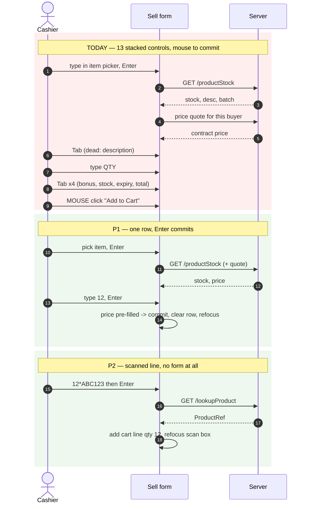
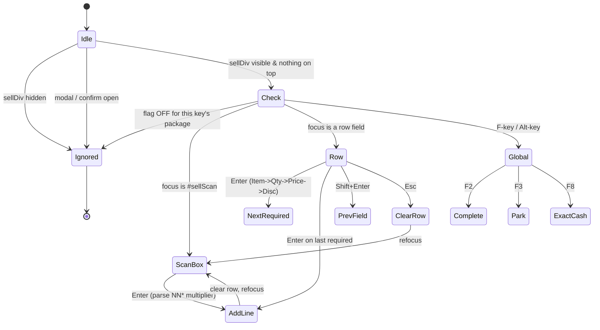
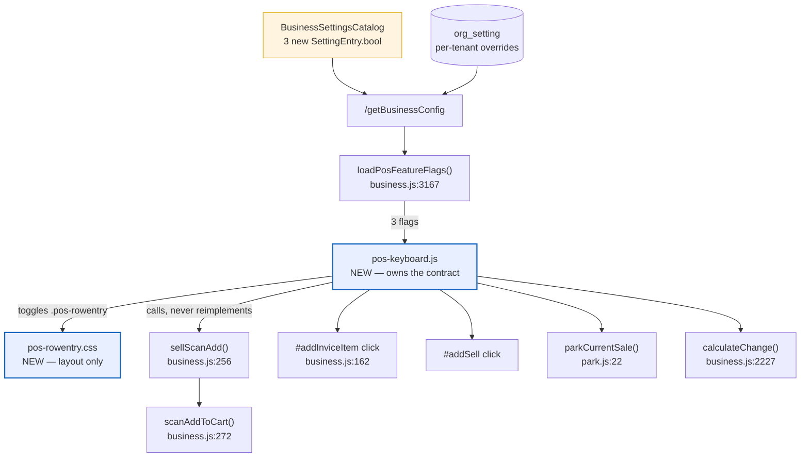

# UI/UX P1–P3 — keyboard-first POS sale entry

**Branch:** `feature/UI-UX`
**Review that produced this:** [`../sell-screen-uiux-review.md`](../sell-screen-uiux-review.md)
**Status:** design — not yet implemented
**Rev 2:** P1 reshaped from "patch the tall form" to a **single-row line-entry strip** (user
direction, 2026-08-09). Rationale in D-9.

---

## 1. Goal

Let a cashier complete a sale **without touching the mouse**, and clear a queue faster, **without
changing the screen for any org that hasn't asked for it**.

Success criterion: a 3-line cash sale becomes
`scan → scan → scan → [exact cash] → [complete]` — zero mouse, zero wasted Tab.
For non-scanned goods: `item → qty → Enter` per line, everything on one row.

## 2. Governing decisions

| # | Decision | Why |
|---|----------|-----|
| **D-1** | All three packages default **OFF**. An org that changes nothing sees today's screen, keystroke for keystroke. | The user's explicit requirement, and the only way a POS change is safe to ship to live tills. |
| **D-2** | One setting per package, not one per behaviour. | Three toggles an owner can reason about beats a dozen micro-flags nobody will tune. |
| **D-3** | New code lives in **one new module**, `js/business/pos-keyboard.js`. | DRY: the sell screen's logic is already split across `business.js` + `main.js`; a fourth scattering would be worse. |
| **D-4** | The module **calls existing functions** (`sellScanAdd`, `parkCurrentSale`, `calculateChange`, the `#addSell` click) rather than reimplementing them. | Reuse-first. A second "complete the sale" path is a correctness risk, not a UX feature. |
| **D-5** | Keyboard handling attaches at `document` level with a **screen guard**: it acts only when `#sellDiv` is visible and no `.crud-overlay.open` / confirm dialog is up. | C5. A global F-key firing behind a modal would submit a sale the cashier can't see. |
| **D-6** | `#ConfigDiv` widens from `ROLE_OWNER` to `hasAnyAuthority('ROLE_OWNER','ADMIN_PRIVILEGE')`. | C2 — `SettingsController:39` **already** permits owner *or* admin to write. Closes a UI/server mismatch; grants nothing the server was refusing. |
| **D-7** | Shortcut keys are **F-keys with an `Alt+letter` alias**, suppressed inside text inputs except where the binding is the point (Enter, Esc). | F-keys are what till operators expect; the alias covers kiosks/browsers that swallow them. |
| **D-8** | The qty multiplier is parsed **in the scan box** (`12*ABC123`), not as a separate control. | Standard POS idiom, no new control, degrades to today's behaviour when `*` is absent. |
| **D-9** | **P1 is a single-row line-entry strip**, not a patched vertical form. | ⭐ The tall form's dead tab stops (review F3) are a *symptom*; the disease is that one cart line is composed across 13 stacked controls and ~600px of screen. A horizontal strip removes the dead stops **structurally** — they simply aren't on the row — and is the pattern every serious billing system uses (Tally, QuickBooks, SAP B1, Odoo). Easiest *and* most advanced: fewer moving parts than the patch, and a better end state. |
| **D-10** | The strip is achieved by **re-flowing the existing inputs with CSS — every id stays in the DOM, in one copy.** No field is deleted, no field is duplicated, no handler is rebound. | ⭐ This is what makes D-9 cheap and safe. `formToJSON("Sell")`, `#addInviceItem`, `calculateNetSell()` and `loadStock()` all keep reading and writing the same ids. Two layouts with two copies of `#sellItems` would be duplicate ids and a submission bug waiting to happen. The OFF case is byte-identical to today because nothing about the markup's *content* changed. |

## 3. Settings

Added to `BusinessSettingsCatalog` (business-service), group **"Point of Sale"**. The Configuration
screen self-renders from the catalog, so no UI work is needed to expose them.

| Key | Default | Governs |
|-----|---------|---------|
| `pos.keyboard.enabled` | `false` | **P1** — row-entry strip, Enter flow, Esc, scan-box auto-focus |
| `pos.keyboard.shortcuts.enabled` | `false` | **P2** — F-key/Alt shortcuts, qty multiplier, exact cash |
| `pos.quickpick.enabled` | `false` | **P3** — hot-key product grid |

Read client-side by extending `loadPosFeatureFlags()` (`business.js:3167`), which already fetches
`/getBusinessConfig` once on load and applies `pos.barcode.enabled` the same way.

> **Fail-closed, deliberately.** The existing flags fail *open* (absent key ⇒ ON) because they hide
> UI shops expect. These fail **closed**: a config hiccup must not silently rebind a live till's
> keyboard or re-lay-out its sale screen. Absent key ⇒ OFF.

## 4. P1 — the line-entry row

### 4.1 What the row shows

```
┌───────────────────────────────────────────────────────────────────────────────────────┐
│ [Scan or type barcode / SKU ...............................] [ ↵ ]                    │
├──────────────┬───────┬──────────┬────────┬───────────┬───────────────┬────────────────┤
│ Item      ▼  │  Qty  │  Price   │  Disc  │   Total   │  Stock: 42    │  [+ Add]       │
│ Panadol 500  │   12  │   25.00  │        │   300.00  │  exp 2027-03  │  [× Clear]     │
└──────────────┴───────┴──────────┴────────┴───────────┴───────────────┴────────────────┘
                                    ↓ Enter on the last required field commits the line
┌───────────────────────────────────────────────────────────────────────────────────────┐
│  CURRENT SALE (existing #tablesi cart grid — each row already has its own remove)      │
└───────────────────────────────────────────────────────────────────────────────────────┘
```

**On the row (typed):** Item, Qty, Price, Disc — the four the cashier actually fills.
**On the row (read-only, as compact badges, not tab stops):** Total, Stock, Expiry.
**Moved to a collapsible "More" popover:** Description, Bonus, discount-type select, Receiveable,
P/U price, Profit. *Still in the DOM, still written by `calculateNetSell()` — just not in the way.*

Add/Remove at the end of the row, exactly as asked: **`+ Add`** commits the line and starts a fresh
one; **`× Clear`** empties the row without committing. Removing a *committed* line stays where it
already is — the per-row `Del` button in the cart grid.

### 4.2 Enter walks the *required* fields only

The user's requirement: *Enter moves to the next **required** field.* So Enter skips anything
optional or already satisfied:

| From | Enter goes to | Skipped when |
|------|---------------|--------------|
| Item | Qty | — |
| Qty | Price | Price already pre-filled from the catalog ⇒ **straight to commit** |
| Price | Disc | Disc is optional ⇒ **straight to commit** unless the cashier tabs into it |
| Disc | commit | — |

"Commit" = the same code path `#addInviceItem` runs today (D-4), then clear the row and focus the
scan box (or Item, when barcode is off).

`Esc` clears the row without committing. `Shift+Enter` steps *backwards* through the same chain.

### 4.3 Why this removes the dead tab stops structurally

Review F3 counted 7–11 readonly fields in the tab order. On the strip, they are badges and popover
content — **not focusable controls** — so there is nothing to skip past and no `tabindex` patchwork
to maintain. The `tabindex="-1"` pass is still applied for the checkout-row readonlys (`#sellCh`,
`#sellDueThis`, `#sellPrevDue`, `#sellNewTotalDue`, `#sellCreditLimit`, `#sellCreditAvailable`),
which stay where they are.

### 4.4 How the layout switches without duplicating markup (D-10)

`#sellDiv` gains a class when the flag is on:

```js
$('#sellDiv').toggleClass('pos-rowentry', window.posKeyboardEnabled === true);
```

`pos-rowentry.css` then re-flows the existing Bootstrap `.form-group` blocks into one grid row using
`display: contents` on the wrappers (so the inputs become direct grid children without moving in the
DOM), `order:` to sequence them, and `display:none` on the fields that belong in the popover.

Constraints this respects:
- **no duplicate ids** — one copy of every input;
- **no rebinding** — `onChangeSelect`, `calculateNetSell`, `formToJSON("Sell")` untouched;
- **flag OFF ⇒ no class ⇒ no CSS applies ⇒ today's screen exactly**;
- below 992px the grid falls back to the current stacked layout (a strip on a phone is unusable), per
  the responsive contract's existing 991 breakpoint.

## 5. P2 / P3 contracts

### P2 — throughput (`pos.keyboard.shortcuts.enabled`)

| Key | Alias | Action |
|-----|-------|--------|
| `F2` | `Alt+S` | Complete Sale (`#addSell`) |
| `F3` | `Alt+P` | Park the current sale |
| `F4` | `Alt+R` | Resume parked (opens `#ParkedDiv`) |
| `F8` | `Alt+E` | Exact cash — fill `#sellRec` from the cart total |
| `F9` | `Alt+C` | Clear cart (via the existing confirm dialog) |

Qty multiplier: `12*ABC123` (or `12*` then scan) into `#sellScan` adds **12**. Absent `*` ⇒ today's
behaviour exactly.

### P3 — quick pick (`pos.quickpick.enabled`)

A grid of the org's top-N products above the cart; `Alt+1`…`Alt+9` add the corresponding tile. For
loose goods with no barcode (produce, bakery) this is the only route to scan-path speed.

## 6. Flow

### 6.1 Today vs. P1+P2 — one line



### 6.2 Where a keystroke goes (the screen guard, D-5)



### 6.3 Module boundaries



## 7. Files

| File | Change |
|------|--------|
| `js/business/pos-keyboard.js` | **new** — keyboard contract + row commit, guarded by the three flags |
| `css/pos-rowentry.css` | **new** — the strip layout, scoped entirely to `.pos-rowentry` |
| `js/business/business.js` | extend `loadPosFeatureFlags()`; qty-multiplier arg on the scan path; fix F10 dead statements |
| `templates/businessDashboard.html` | wrap the line controls so the grid can address them; badge/popover markup; `tabindex="-1"` on checkout readonlys; script + css tags; widen `#ConfigDiv` (D-6); fix F11 |
| `BusinessSettingsCatalog.java` | 3 × `SettingEntry.bool`, default `false` |
| `messages*.properties` × 6 | new UI strings, keys aligned across all six bundles |
| `cypress/e2e/business/pos-keyboard.cy.js` | **new** — gate spec |

## 8. Test plan

**The regression that matters most is the OFF case.** Each package is proven twice:

- **OFF (default):** no `.pos-rowentry` class, the tall form renders exactly as today, Enter still
  inert, no F-key does anything, scan adds qty 1. This is what protects every existing tenant.
- **ON:** the contract in §4/§5 holds end to end, through a completed sale whose totals match the
  same sale entered the old way.

Plus: always-run unit tests (`mvn test`) for the multiplier parser (`12*ABC` → 12, `ABC` → 1,
`0*ABC` / `-3*ABC` / `abc*def` → rejected, not silently 0) and for the required-field Enter chain;
i18n keys verified 6/6 bundles.

Per the standing rule, **Cypress is run headed by the user**, and their "passed" is the gate.

## 9. As-built — P1 step 1 (layout only)

Shipped: `css/pos-rowentry.css` (new), `pos-more`/`pos-fullrow` class hooks in the template,
`pos.keyboard.enabled` in `BusinessSettingsCatalog`, and `applyPosRowEntry()` in
`loadPosFeatureFlags()`. **No behaviour** — Enter is still inert, no key is bound.

### The field-integrity audit (why nothing is lost)

`formToJSON("Sell")` builds the payload with `new FormData(form)`. **FormData omits `disabled`
controls but includes ones hidden with `display:none`** — which is precisely what makes a CSS
re-flow safe where a markup rebuild would not be. Every control in `#Sell`, checked:

| Field | `name` | In FormData? | Also read by | Effect of `.pos-more` |
|-------|--------|--------------|--------------|------------------------|
| `#sellItemDesc` | `description` | yes | `loadStock()` writes it | none — still submitted |
| `#sellDiscountTypeDD` | `stock.bsellDiscountType` | yes | `calculateNetSell()` | none — still submitted |
| `#sellBonus` | *(none)* | no | `$("#sellBonus").val()` at `business.js:193` | none — `.val()` unaffected |
| `#sellrm` | *(none)* | no | `calculateNetSell()` writes it | none — display only |

Fields left on the row (`#sellItemDD`, `#sellItems`, `#sellSellRate`, `#sellDiscount`) and the
badges (`#sellStock`, `#bexpDate`, `#sellTotalAmount`) are untouched in every respect.

**Also verified:** none of the four hidden fields carries `required`, so hiding them cannot make
`validateForm()`'s `form.checkValidity()` fail on a control the operator cannot see. `#sellPurchaseRate`
*is* `required`, but it sits in `#pDiv` which is already `display:none` today and is `readonly`
(barred from constraint validation) — unchanged by this work either way.

> **The rule for anyone editing this later:** do not add `disabled`, do not remove the elements, and
> do not move them outside `<form id="Sell">`. Each of those silently drops a field from the invoice.
> Hidden-but-present is the mechanism, not an accident.

### Resulting field order

`Item · Qty · Stock · Expiry · Price · Total · Disc` — the DOM order, deliberately unreordered.
No CSS `order` juggling to maintain, and on-hand ends up beside the quantity being typed, which is
when a cashier actually needs it.

## 9b. Configurable sale screen (added 2026-08-09 on user direction)

> *"We sell this POS to any kind of business — wholesale, retail, pharmacy — so any business user must
> be able to change it from configuration. Add maximum possible options."*

**D-11 — which fields appear on a sale is the TENANT's answer, not ours.** My first cut hard-coded a
judgement (Description/Bonus/Receiveable/discount-type belong off the row). That is right for a retail
till and wrong for a wholesale distributor, who bills bonus goods on every invoice. So the choice moves
into the settings catalog.

### The mechanism

Every optional control carries `data-pos-field="<name>"` **on both its label and its column** — so
hiding one never strands a caption. `applyPosFieldVisibility()` adds `.pos-hidden` to the ones the org
switched off.

Two orthogonal mechanisms, deliberately not sharing a channel:

| | Decides | Driven by |
|---|---|---|
| `data-pos-field` + `.pos-hidden` | **IF** a field exists on the sale | tenant settings |
| `.pos-more` / `.pos-fullrow` | **WHERE** it sits when the compact row is on | `pos.keyboard.enabled` |

> ⚠ **Why a class and not `.hide()`/`.toggle()`.** jQuery's `.toggle(true)` → `.show()` writes an
> **inline** `display:block` whenever the element is hidden by a stylesheet. That inline style beats
> `.pos-more{display:none}` and would drag fields back onto the compact row the instant settings were
> applied. Caught and fixed before it shipped; the class approach means neither mechanism writes inline
> styles the other has to fight.

### New settings

| Key | Type | Default | Notes |
|-----|------|---------|-------|
| `pos.entry.showDescription` | bool | on | |
| `pos.entry.showBonus` | bool | on | wholesale "20 billed, 2 free" |
| `pos.entry.showStock` | bool | on | off = staff don't see stock levels |
| `pos.entry.showExpiry` | bool | on | pharmacy/food vs hardware |
| `pos.entry.priceEditable` | bool | on | off = catalog price fixed at the till |
| `pos.entry.lineDiscountEnabled` | bool | on | |
| `pos.entry.showDiscountType` | bool | on | off = discounts are always an amount |
| `pos.entry.showReceivable` | bool | on | |
| `pos.entry.defaultQty` | int | 1 | carton size for a wholesaler |
| `pos.customer.required` | bool | **on** | see D-12 |
| `pos.customer.walkInName` | text | "Walk-in Customer" | |
| `pos.customer.showBalance` | bool | on | |
| `pos.customer.defaultMode` | select | select | choose-existing vs type-a-name |
| `pos.tender.default` | select | CASH | CREDIT for a distributor |
| `pos.invoice.tradeDiscountEnabled` | bool | on | |
| `pos.park.enabled` | bool | on | |

**Every default reproduces today's screen exactly.** These fail **open** (absent key ⇒ shown): a config
hiccup must never make a field a shop relies on vanish mid-sale. That is the opposite of
`pos.keyboard.enabled`, which fails *closed* — the asymmetry is intentional and each is commented at
its read site.

### D-12 — a correction found while wiring this

`pos.customer.required` was drafted defaulting **false** ("a walk-in needs no customer"). Reading
`main.js:416` showed the opposite is true today: *"Customer is mandatory regardless of payment mode"* —
the sale handler refuses to submit without one. So the default is **true** (today's behaviour), and
switching it **off** is the new capability: a retail counter can ring an anonymous cash sale instead of
typing a name for every customer — the single biggest queue cost at a shop that runs no accounts.

**One carve-out is not configurable.** A sale that leaves a balance — `CREDIT`, or any partial payment —
still demands a named customer whatever the setting says. Money owed has to be owed *by someone*; a
receivable against nobody is unrecoverable. An anonymous sale is stamped with `pos.customer.walkInName`
so the invoice still has a payee.

### Fields NOT made configurable, and why

Item, Qty and Price stay mandatory — a line without them is not a sale. The FEFO batch notice stays
because it reports what stock is actually being dispensed. The store-credit and insurance tenders are
already conditional on the customer/vertical, so a toggle would be a second switch on the same thing.

## 9c. As-built — P1 step 2 (the Enter chain)

Shipped: `js/business/pos-keyboard.js` (new), its `<script>` tag, `applyPosKeyboard()` called from
`loadPosFeatureFlags()`, and `cypress/e2e/business/pos-keyboard.cy.js`.

### The contract as built

| Key | Where | Behaviour |
|-----|-------|-----------|
| `Enter` | Item / Qty / Price / Disc | advance to the next field that still needs input; past the end ⇒ **commit the line** |
| `Shift+Enter` | same | walk back — and unlike forward, it does **not** skip satisfied fields, because going back is a deliberate act to change one |
| `Esc` | anywhere in the line form | clear the in-progress line; the cart is untouched |
| *(after commit)* | — | focus returns to the scan box (or the item picker when barcodes are off) |

### D-13 — the chain reads the DOM, so tenant config drives it for free

`usable(id)` tests present + `:visible` + not disabled/readonly. Because
`applyPosFieldVisibility()` hides a switched-off field, the chain skips it with **no coupling to the
settings at all** — a shop that turns off the line discount gets `Price → commit`, and a shop that
makes the price non-editable gets `Qty → commit`. One rule, not a per-setting branch.

`satisfied(id)` is separate and applies only to Qty and Price: a price the catalog already supplied
is the normal case, and it is what makes the common line `item → 12 → Enter`.

### D-14 — reuse, not reimplementation

`commitLine()` is `$('#addInviceItem').trigger('click')` and `clearLine()` is
`$('#resetInviceItem').trigger('click')`. Same validation, same cart write, same reset as the mouse
path. The module decides *when* and *where focus goes*, never *what a line means*.

Entry-point focus needed no new code either: `revealSection()` → `focusFirstField()` already skips
readonly fields and lands on `#sellScan` when the section is shown.

### Two DOM facts that shaped the code

- **bootstrap-select swallows the keystroke.** The picker replaces `<select>` with a button + menu,
  so a `keydown` on `#sellItemDD` never fires. A second handler is bound to
  `.bootstrap-select > button` — and it defers to the picker when the menu is **open**, since Enter
  there means "choose this option", not "advance".
- **The scan box is left alone.** `#sellScan` already owns its Enter (inline `onkeydown` →
  `sellScanAdd`). Two handlers on one key is how a scanned item gets added twice.

### Guards

Every keystroke is ignored unless `pos.keyboard.enabled` is on **(re-read live, so toggling the
setting needs no reload)**, `#sellDiv` is visible, and no `.crud-overlay.open` / `.uiC-backdrop` is
layered over it.

### Gate

`cypress/e2e/business/pos-keyboard.cy.js` — 16 cases. The **OFF** block is the one that matters:
no layout class, no `tabindex` on the display fields, Enter inert, cart empty. Then ON: the chain,
the satisfied-price skip, refocus after commit, Shift+Enter, Esc, empty-row no-op, a
config-hidden field being skipped, and suppression behind a modal.

### First headed run — 8 failures, 3 distinct causes

**Cause 1 (7 of 8): none of step 2 was deployed.** The app serves from `target/classes`, built at
15:32; step 2's files were written at 16:10. `pos-keyboard.js` 404'd, the template's `<script>` tag
was absent from the served page, and the deployed `business.js` had no `applyPosKeyboard` call.
My instruction — *"no rebuild needed, hard refresh picks it up"* — **was wrong**: that holds for
editing a file already on the classpath, never for a NEW file or a template change. Resolved by a
monolith rebuild, no code change.

**Cause 2: the helper hid it.** `openSell()` guarded with `if (typeof w.applyPosKeyboard === 'function')`,
so a missing script silently did nothing and surfaced as seven unrelated-looking assertion errors.
Now it *asserts* the module is loaded — one honest failure instead of seven misleading ones.
(Standing rule: test helpers must fail loudly.)

**Cause 3: a real spec bug.** The modal-guard test called `.clear()` on an element its own fake
overlay was covering. `{ force: true }` is correct there and only there — being covered is the
condition under test.

### D-15 — a defect the green tests would never have caught (found by review, not by running)

`satisfied()` counted **Qty** as answered whenever it held a positive number. But `loadStock()`
pre-fills Qty with `pos.entry.defaultQty` (1) the moment an item is picked — so Qty was *always*
satisfied, the chain skipped straight past it, and Enter from the item landed in the optional
**discount**. The cashier could never type a quantity: the single most-typed field on the screen.

**A default is not a decision.** `satisfied()` now applies to the price alone — a price the catalog
supplied is a real answer; a quantity of 1 nobody chose is not. Optional fields moved to their own
`OPTIONAL` set and are skipped going forward (reachable by Tab or Shift+Enter), which is what the
§4.2 table always said.

Two regression tests pin it, including one driving the real bootstrap-select button rather than the
hidden `<select>`.

### D-16 — the post-pick focus no longer steals the cursor

Focusing Qty 250ms after an item is picked helps a *mouse* user and ambushes a fast typist: a cashier
who picks an item and goes straight to Price had the cursor yanked back mid-keystroke. It now moves
focus only if focus is still on the picker (or nowhere). A delayed focus steal is worse than no focus
help.

### Second headed run — 17/18, the last failure was the test's own event

`TypeError: Cannot read properties of undefined (reading 'toString')` thrown **inside
bootstrap-select**, from the one test that fires a synthetic `keydown` at the picker button.

bootstrap-select v1.6.2 binds its own `keydown` to that button and evaluates
`b.keyCode.toString(10)`. Cypress's `.trigger('keydown', { key: 'Enter' })` sets `key` but **not**
`keyCode`, so the library got `undefined` and threw. Our handler reads `e.key` and was never
involved. Fixed by sending `keyCode: 13, which: 13` as a real browser does — an event missing them
is not the event under test.

**The real-browser path was checked in the library source rather than assumed:** with `keyCode` 13
and the menu closed, bootstrap-select matches none of its branches — `"13"` fails `/(^9$|27)/` and
`String.fromCharCode(13)` (`\r`) fails `/([0-9]|[A-z])/` — so it leaves Enter alone and
`pos-keyboard.js` is what moves focus. The remaining tests use `.type()`, which sends complete
events, so this was the only affected case.

### ✅ P1 COMPLETE — 18/18 headed, user-confirmed 2026-08-09

Both halves green: the **OFF** block (no layout class, no `tabindex`, Enter inert, cart untouched —
the regression that protects every existing tenant) and the **ON** block (chain, satisfied-price skip,
Qty stop, optional-discount skip, refocus after commit, Shift+Enter, Esc, empty-row no-op,
config-hidden field skipped, modal suppression).

**Shipped in P1:** `css/pos-rowentry.css`, `js/business/pos-keyboard.js`, 16 settings in
`BusinessSettingsCatalog`, `data-pos-field` hooks + `applyPosFieldVisibility()`, and the gate spec.

**Next: P2** — §5's qty multiplier, action keys and exact cash. Nothing in P1 blocks it.

## 9d. As-built — P2 (queue throughput)

Shipped: the `12*CODE` multiplier in `sellScanAdd`, the action keys in `pos-keyboard.js`,
`pos.keyboard.shortcuts.enabled` (default **false**, fails **closed**), 6 new i18n keys × 6 bundles,
and `cypress/e2e/business/pos-shortcuts.cy.js`.

### D-17 — the multiplier REFUSES rather than guesses

`parseScanEntry(raw)` is a pure function (exported as `window.parseScanEntry`), so its edge cases are
tested directly instead of through a network round-trip:

| Typed | Result |
|-------|--------|
| `12*ABC123` | qty 12 |
| `ABC123` | qty 1 — **today's behaviour, byte for byte** |
| `0*ABC` / `-3*ABC` / `1.5*ABC` | refused (`badQty`) |
| `12abc*XYZ` | refused — `parseInt` would have returned 12 and sold twelve of the wrong thing |
| `*ABC` / `12*` | refused (`noQty` / `noCode`) |

Every refusal could have been "helpfully" read as qty 1, and every one would then put a line the
cashier never intended on a real invoice. The entry is **left in the box** so the fix is one
keystroke rather than a re-scan.

With the setting OFF a `*` is just a character in the code — a shop whose barcodes contain one is
unaffected.

### D-18 — F9 confirms even though the Clear Cart BUTTON does not

Writing the code I claimed F9 was "routed through the button so the shared confirm dialog still
appears". **That was false** — `resetCart()` wipes silently. As written, F9 would have been a
one-key silent destruction of a part-rung sale, which is exactly what I had said was unforgivable.

F9 now raises `uiConfirm` itself. The asymmetry is deliberate: someone who aims at a red button has
expressed intent; F9 sits next to F8 and a mis-hit must not cost a sale. **The button was left
alone** — changing an existing control's behaviour is the user's call, not a side effect of adding a
shortcut. *Open question for the user: should the button confirm too?*

### Other decisions

- **F8** reads the total from the cart footer (`#sellTotal`) rather than re-deriving it — a tender
  disagreeing with the printed total by a rounding step would be unexplainable at the counter. While
  editing an invoice it tenders the REMAINING due, not the whole bill (SF-1/SF-2 double-count).
- **Not bound:** F1, F5, F11, F12 — keys the browser or OS owns.
- `preventDefault()` fires only once a key is known to be handled, so unbound F-keys keep working.
- A tenant who switched parking off has **no park key either** (`actionAllowed`) — otherwise a shop
  that disabled a feature still has a shortcut to it.
- `scanAddToCart(ref, qty)` guards the default itself as well as in the parser: it is also called by
  the pharmacy dispense path, and a missing argument must never become `NaN` on an invoice line.

### Gate

`cypress/e2e/business/pos-shortcuts.cy.js` — 20 cases: parser edges, the OFF block (a `*` stays
literal, no key does anything), then multiplier end-to-end, accumulation across two scans, exact
cash + its Alt alias, empty-cart no-ops, F9's confirm and cancel, park, park-disabled, and both
guards (modal open, wrong screen).

### First headed run — 14/20, and one of the failures was a real product bug

**⚠ SF-12 (pre-existing, NOT introduced by P2): a scanned line contributed nothing to the cart
total.**

`scanAddToCart` pushed `''` into the cart grid's **Total** column and never set `line.totalAmount`.
`#sellTotal` is that column's DataTables footer sum, so **a scanned-only cart totalled zero** — and
`calculateChange()` derives both *Change* and *Due (this sale)* from `#sellTotal`. A cashier scanning
items with no customer selected therefore saw **Due 0.00 on a sale that was owed**, and because
`main.js` only demands a due date when `#sellCh < 0`, that sale could also be completed without one.

It survived since barcode-first sell shipped because `requoteSellCart()` *does* fill the column
in — but only once a customer is chosen (`sellQuoteContext()` returns `null` otherwise). **The B2B
path masked a B2C bug.** F8 refusing to tender is what exposed it.

Fixed in `scanAddToCart` using the same `sellLineMath()` the manual add and the re-quote already use,
so the three cannot drift. Both branches (new line, and bumping an existing one) now set
`totalAmount`, `netAmount` and the grid's Total cell. Pinned by its own regression test that asserts
`#sellTotal` **with no customer selected** — the exact case that broke.

**The other three were the spec's own fault:**

1. `.then()` does not retry, so the accumulation test read `quantity` before the second lookup
   returned (3, not 5). Now `.should()` on `data.0.quantity`. Waiting on `data.length` could never
   have worked — both scans hit the same product, so the length is 1 either way.
2. & 3. `.type()` on the scan box refused with *"covered by .ao-box"* and *"could not determine
   actionability"* — the global AJAX overlay doing its job while the screen settles. Routed every
   scan through one `scan()` helper carrying the long timeout `sell.cy.js` already documents.
   Deliberately **not** `{force:true}`: forcing types through a spinner a real cashier cannot, so a
   genuinely stuck overlay would pass the gate.

### Second run — 19/20, and the last one was a format assumption

`#sellDueThis` was `'0.00'` where the spec expected `'0'`. **F8 itself was correct** — the preceding
`#sellRec === '100.00'` assertion passed, which also proves the SF-12 fix: the cart total read 100
with no customer selected, exactly the case that used to read zero.

The two settlement fields are formatted differently by `calculateChange`, on purpose:

| Field | Written as | Why |
|-------|-----------|-----|
| `#sellCh` | `val(change)` → `"0"` | raw number — submitted as `customer.dueAmount`, must stay numeric |
| `#sellDueThis` | `val(dueThis.toFixed(2))` → `"0.00"` | display only |

Assuming two adjacent money fields agree is what failed the run. Spec corrected to match the source.

## 9e. As-built — P3 (quick-pick tiles)

Built, **not yet gated**: `SellRepo.topProductsScoped` / `topProductsByStores`,
`SellService.topProducts`, `GET /topProducts` + monolith proxy, the tile grid + `Alt+1..9` in
`pos-keyboard.js`, `qp-*` styles, 3 settings, 2 i18n keys × 6 bundles, and
`cypress/e2e/business/pos-quickpick.cy.js` (15 cases).

### D-19 — the tiles are ORG-scoped, and that needed a new query

`SellRepository.topSellingItems` — the one the dashboard uses — groups by **`userId`**. Reusing it
would have been the obvious shortcut and would have been wrong: a shared counter would show each
cashier a **different** grid, and a newly hired one an **empty** grid on their first shift. What
belongs on a till is what the *shop* sells.

`Sell` already carries `organizationId` and `storeId`, but every query in `SellRepository` is
per-user; the org-scoped queries live in the *other* repository, `SellRepo`. The new queries went
there, following its existing NULL-fallback and store-grant patterns, so the tiles are org-scoped and
**store-aware** — a branch that sells different lines gets its own tiles.

> Noted, not changed: the **dashboard's** top-5 products is also per-user. That may be deliberate
> ("my performance"), so it is left alone — but if it was meant to be per-shop it is wrong today.

### Other decisions

- **Units, not revenue.** The tiles save keystrokes on what is rung most *often*; ranking by money
  would put a single expensive sale ahead of the item scanned fifty times a day.
- **One batched catalog call** (`getProducts(ids)`) for names and prices — never one per tile. This
  runs as the sale screen opens, which is exactly the path P3 exists to make cheaper.
- **A tile is a scan without the barcode**: it calls the same `scanAddToCart`, so pricing, the
  pharmacy Rx warning, cart totals and the SF-12 fix all apply identically.
- **Empty or failed ⇒ the panel is hidden**, never an empty box. A shop with no history has no best
  sellers, and every product stays reachable through the normal picker — an accelerator must never
  become a gate.
- A product deleted or deactivated since it last sold is **dropped** from the grid rather than shown
  as a tile that cannot be rung up.
- `limit` is clamped server-side (≤24); `days`/`limit` come from settings, the tenant from the token.

### D-20 — a bug caught while wiring the keys

Alt+1..9 was first placed behind the **P2 shortcuts** flag, but quick pick is its **own** setting. A
shop enabling quick pick alone would have seen tiles advertising `Alt+1` badges that did nothing.
The handler now applies the screen guards once and checks each feature's flag per branch.

### First P3 run — 12/15, all three the spec's fault

**A one-shot keypress raced an async render (2 failures).** `cy.wait('@tiles')` resolves when the
*response* is sent; jQuery's success callback — which fills `quickPick[]` — runs after. `pressKey`
fires **once**, so a key sent too early is simply lost, and the retrying `.should()` that follows
re-checks a cart that will never change. **The retry was on the wrong side of the action.**

Fixed by waiting for a rendered `.qp-tile` before every press. That is a sound synchronisation
because `renderQuickPick` assigns `quickPick = list` *before* writing the DOM, so a visible tile
proves the array is populated.

Two further tests — *"an Alt+digit with no tile is ignored"* and *"tiles are ignored while a modal is
open"* — passed the first run but were **vacuous**: with no tile rendered they would have passed
whatever the code did. Both now assert a tile exists first, so "ignored" means something.

**The end-to-end ranking test typed into a hidden field.** The sale screen opens in *Select Customer*
mode, so `#sellCN` sits in a `display:none` block. Switched modes rather than `{force:true}` —
forcing would have proven a sale can be rung in a state no cashier can reach. The same test also
queried the ranking without waiting for the sale to be written; it now waits on the `addSell`
response, which the original comment claimed but did not do.

This is the same class of error as P2's `.then()`-doesn't-retry bug. **Rule for this suite: a one-shot
action must be preceded by a retrying assertion that the precondition holds — never followed by one.**

## 9f. As-built — D-6 (Configuration reachable by owner AND admin)

The original ask was *"add P1/P2/P3 in setup/configuration available for org owner/admin users"*. The
settings landed in the catalog first; this closes the access half.

**The screen was the narrower of the two all along.** `SettingsController` has always permitted
`ROLE_OWNER or ADMIN_PRIVILEGE` to write an override, while `#ConfigDiv` and the whole Settings menu
were gated `ROLE_OWNER`. An admin could therefore change these settings **by API** and not see them
in the UI. Widening the screen grants nothing the server was refusing.

### Per-item gating, not a wholesale widening

Opening the whole `#snavSettings` menu to admins would also have handed over **Stores, Tax Settings,
Price Rules and the Document Designer** — none of which were asked for. So the menu opens for
owner-or-admin and each entry carries its own gate:

| Entry | Owner | Admin |
|-------|-------|-------|
| Stores · Tax Settings · Price Rules · Document Designer | ✅ | ❌ (unchanged) |
| **Configuration** | ✅ | ✅ **(new)** |

Gate: `cypress/e2e/business/pos-settings-access.cy.js` — 5 cases. Each role asserts both what it CAN
and what it CANNOT see, so a change to the seeded roles fails loudly instead of passing vacuously.
Fixtures: `demo.business` holds `DEMO_ROLE` (= superSet + demo privileges, so ADMIN_PRIVILEGE but not
ROLE_OWNER); `owner.business` holds ROLE_OWNER.

> ⚠ **Still true and still the user's call:** an admin now sees *every* setting on that screen,
> including the pharmacy safety toggles (`pharmacy.rx.requirePrescription`,
> `pharmacy.interaction.blockSevere`). If those should stay owner-only, the catalog needs a
> per-entry minimum role — a change to `SettingEntry` and the renderer, not to this gating.

## 9g. Review finding — quick-pick feedback was invisible to its own audience

`addQuickPick` reported through `sellScanMsg()`, which writes to `#sellScanMsg` — a child of
`#sellScanRow`, hidden whenever `pos.barcode.enabled` is off. **Quick pick exists for shops with
nothing to scan**, so those are precisely the tenants most likely to have turned the scan box off,
and their tiles would have added stock to the cart in complete silence.

Feedback now goes to the panel's own `#quickPickMsg` — which had been added to the markup and never
wired. It is also cleared on each re-render, so a stale "×3" from the previous sale cannot linger.

## 9h. ✅ ALL GREEN — user-confirmed 2026-08-10

| Gate | Cases | Status |
|------|-------|--------|
| `pos-keyboard.cy.js` (P1) | 18 | ✅ |
| `pos-shortcuts.cy.js` (P2) | 20 | ✅ |
| `pos-quickpick.cy.js` (P3) | 15 | ✅ |
| `pos-settings-access.cy.js` (D-6) | 5 | ✅ |

**58 cases**, roughly half of them asserting the **OFF** default — which is what protects every
existing tenant, since all ~35 settings ship reproducing today's screen.

P1–P3 and the owner/admin configuration access are complete. Staged; awaiting the user's commit.

## 10. Open questions

1. **Key choices** — F2/F3/F4/F8/F9 as above, or match a till your customers already use?
2. **Quick-pick source (P3)** — top-N by sales volume (needs an analytics read, zero maintenance) or
   an owner-curated list (needs a small CRUD, predictable)? *Recommendation: volume.*
3. **Scope of the `#ConfigDiv` widening (D-6)** — it exposes **all** existing settings to admins,
   including the pharmacy safety toggles, not only the new POS ones. If that is too wide, the
   alternative is a separate admin-visible section, leaving `#ConfigDiv` owner-only.
