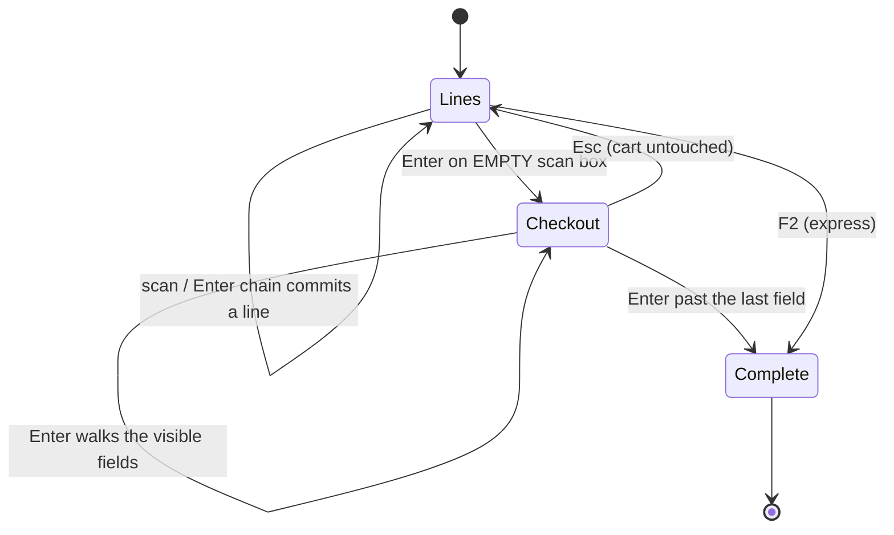

# UI/UX P4 — checkout keyboard chain, and the settings-screen redesign

**Branch:** `feature/UI-UX`
**Predecessor:** [`uiux-P1-P3-keyboard-pos.md`](uiux-P1-P3-keyboard-pos.md) (P1–P3 + D-6, all green)
**Status:** built, **reviewed and KEPT by the user (2026-08-10)**. This document was written
retroactively — see the note below — and the work was accepted on the strength of it.
⚠️ Still ungated: see §6.

> **Why this doc is late, recorded so it is not repeated.** The programme rule is
> Review → Consent → Design/Document → Implement → Test. P1 followed it. These two items did not: they
> arrived as short requests ("improve the Configuration UI", "find a way to reach the customer without
> a mouse") and were implemented on the spot. Both touched far more than the phrasing implied — one
> rewrote a renderer shared by four dashboards, the other added a second interaction model to the sale
> screen with no gate. This document exists so they can be reviewed properly before going further, and
> **nothing here should be treated as agreed.**

---

## 1. Problem

**P4a — the sale could not be completed without a mouse.** P1–P3 gave the LINE a keyboard
(item → qty → price → discount → commit) and P2 gave express keys (F2 complete, F8 exact cash). But the
checkout controls — customer, tender, amount received, due date — live **outside `<form id="Sell">`**;
they are assembled separately by `main.js`. The line chain is bound to `#Sell` and could never reach
them. So a cashier rang every line without touching the mouse, then had to reach for one to name the
customer — at exactly the point in a sale where a queue forms.

**P4b — the Configuration screen did not scale.** The shared renderer emitted one Bootstrap
`form-group` per policy under an `<h4>`. Fine at six settings; the POS catalog now has ~40. Three
consequences: nothing separated one policy from the next; help text sat under the *control* rather than
the label it explains; and the save confirmation was a **single banner at the top of the page**, so
toggling anything below the fold produced no visible feedback — a successful save looked like nothing
had happened.

## 1b. Standards this slice is built to

| Standard | How it is met |
|---|---|
| **Business / domain** — a POS keyboard flow must never change what a sale MEANS | Every keyboard path calls the existing handler (`#addInviceItem`, `#addSell`). Credit-limit checks, the due-date rule, tax, GL posting and the idempotency key are untouched; only *when* they are invoked changes. |
| **SaaS multi-tenancy** | No new data. Both chains read the live DOM, whose visibility is already driven by the per-tenant settings from `BusinessSettingsCatalog`. Nothing is stored per user. |
| **Microservice boundaries** | Client-only. No service, no endpoint, no schema. Correct: this owns no data and has no lifecycle — a library/UI concern, not a service. |
| **SOLID / DRY** | One `walk(list, from, dir)` serves both chains. One `usable()` decides participation for both. The settings renderer stays the single implementation for all four dashboards — the alternative was four copies. |
| **Named patterns** | *Chain of Responsibility* over an ordered field list, filtered by a single predicate; *Template Method* in the shared renderer (fixed skeleton, `controlFor()` varies by type). |
| **Accessibility** | The switch is `appearance:none` on the real `<input type=checkbox>` — one focusable, labelable, screen-reader-correct control, not a decorated `<span>` over a hidden input. |
| **Testing** | P4b is covered by 2 cases in `pos-settings-access.cy.js` (live flag re-applied without reload). **P4a has NO gate — see §6.** |

## 2. Design — P4a, the checkout chain

### 2.1 The bridge: Enter on an empty scan box



**D-21 — the bridge is a keystroke that already existed and did nothing.** After every committed line
the cashier is returned to the scan box, and `sellScanAdd()` returns early on a blank value — so Enter
there was dead. "Nothing left to add" is the most natural thing to express from that box, and it costs
no new key to learn. Refuses on an empty cart: sending someone to payment with nothing to pay for
strands them in fields that cannot complete anything.

### 2.2 The chain

```
customer → payment method → trade discount → store credit → insurance → received → due date → COMPLETE
```

**D-22 — the same `usable()` filter as the line chain, so configuration drives it for free.** Store
credit appears only when the customer has some, insurance only for pharmacy, due date only when the
sale leaves a balance, trade discount only when the tenant enables it — each is *already*
conditionally visible, so it joins or leaves the walk with no per-field branch.

`Shift+Enter` walks back. `Esc` returns to the items with the cart untouched. Enter past the last field
calls the existing `#addSell` handler.

A second binding covers Enter on the **customer picker's** bootstrap-select button — the plugin hides
the real `<select>`, so a keystroke never reaches it (the same trap already handled for the item picker).

### 2.3 Supporting UI

- **Keyboard-flow hint strip**, shown only while the feature is on. A shortcut nobody is told about is
  folklore: used by whoever saw the demo, unknown to anyone hired later.
- **Focus ring on every control in `#sellDiv`.** When the sale is driven by Enter the operator is not
  watching a mouse to know where they are; the next keystroke must not be a guess.
- Both hidden below 992px.

## 3. Design — P4b, the settings redesign

A **settings list**, not a form: card per group, row per policy, label + explanation left, control
right, and a **per-row "Saved" pill** replacing reliance on the top banner. Search appears only at
**12+ settings** — Business Configuration (~40) is unusable without it; Order settings (7) and the
other dashboards are shorter, where a search box costs attention and saves none.

**Contract deliberately unchanged** — `data-key`, the `onchange` hook and the generated element ids are
identical, so every existing save handler and every gate selector still works.

Document Designer got the same card treatment plus the change that mattered: **the preview is sticky**.
It previously scrolled away exactly when the columns and header fields were edited — the settings whose
effect you most need to watch.

## 4. Also in this batch (small, separate concerns)

| # | Change | Why |
|---|---|---|
| 1 | Linear Enter chain — Qty → Price → Discount, no skipping | User decision: a catalog price is a *suggestion* where rates are negotiated per line. Reverses D-15. |
| 2 | **Wheel guard on `<input type=number>`** | A focused number input changes value on scroll. In a billing UI the tender silently changes and posts a figure nobody typed. Passive listener, blur not `preventDefault`. App-wide in `main.js`. |
| 3 | `onsubmit="return false"` on 7 forms; invalid `enctype="utf8"` removed | All had `action="/"`; safety rested on "there is no submit button", which one edit removes — and the cost is a discarded cart. |
| 4 | `inputmode="decimal"` on qty/rate/discount | They are `type="text"`, so a touch till showed a full alphabetic keyboard for a quantity. |

## 5. Files

`js/business/pos-keyboard.js` · `js/common/settings-form.js` · `js/business/business.js` ·
`js/main.js` · `css/settings-form.css` (new) · `css/pos-rowentry.css` ·
`templates/businessDashboard.html` · `templates/fragments/header.html` · `messages*.properties` ×6
(13 new keys, all 6/6).

## 6. ⚠️ Gaps — what is NOT proven

1. **P4a has no Cypress gate.** The checkout chain, the empty-scan bridge, Esc-back, and completion via
   Enter are all unverified. This is the largest gap in the batch and should block sign-off.
2. **Nothing has been re-run since these changes.** P1/P2 were green *before* the linear chain and the
   config re-read landed; those five specs need re-running against a rebuilt monolith.
3. **The wheel guard is untested** — it needs a case asserting a focused number input does not change
   value on wheel.

## 7. Open decisions for the user

1. ~~Keep or revert §2 and §3?~~ **KEPT** (2026-08-10).
2. **Switching customer mode (select ↔ manual) is still mouse-only.** `pos.customer.defaultMode` covers
   the common case per tenant; a shortcut would be a 6th key. Worth one?
3. **Trade discount sits in the checkout chain** and is visible by default, so it costs an Enter on every
   sale for shops that never use it. Better hidden by default (`pos.invoice.tradeDiscountEnabled=false`)?
4. `loadCategories` has the **same edit-path trap** fixed for manufacturer — a category missing from the
   list is silently reassigned on save. Not touched; still open.
