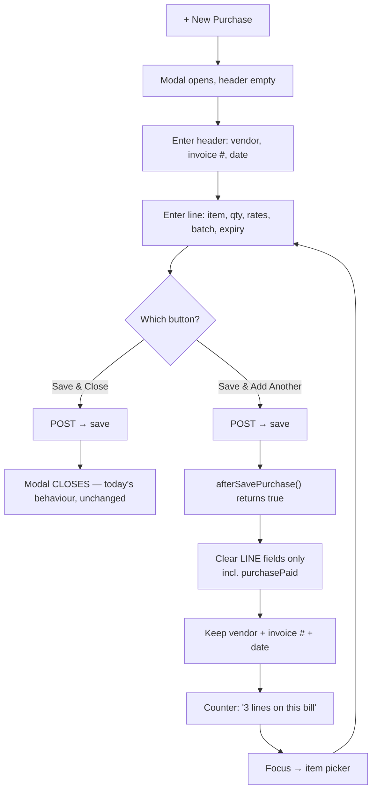

# UI/UX P6 — Purchase form: rapid line entry

**Status:** DESIGN — awaiting consent. Nothing implemented.
**Reported:** "on click of addPurchase close the modal and user need to open it again."

---

## 1. Review — what actually happens today

The close is not in the purchase code. It is the **generic** post-save handler that every
entity screen shares, `src/main/resources/static/js/main.js`:

```js
// line 857-861, inside $.fn.callAjax success
resetForm();                                  // clicks .resetForm  → <button type="reset"> → clears the WHOLE form
clearFormError();
if ($('#' + tableV + 'Modal').length && typeof closeModal === 'function')
        closeModal(tableV + 'Modal');         // ← the reported symptom
if (typeof refreshBulkBar === 'function') refreshBulkBar(tableV);
```

`#addPurchase` has **no handler of its own** — it is bound by convention at `main.js:432`
(`$("#add"+buttonV)`), so Purchase inherits the register behaviour built for Company,
Vendor and Product.

**That behaviour is correct for a register and wrong for Purchase.** A register creates one
record and you are done. A purchase is *repetitive line entry against a shared header*: one
delivery from one vendor on one invoice contains many items, and each item is a separate
`Purchase` row.

### The cost is the header, not the reopen

`resetForm()` resets the entire `<form id="Purchase">`, so the reopen is not the real
expense — retyping the header is. The form's fields split cleanly:

| Header — identical for every line of one delivery | Line — changes per item |
|---|---|
| `purchaseVenderDD` (vendor) | `purchaseItemDD`, `purchaseItemDesc` |
| `purchaseInvoiceNo` | `purchaseQuantity` |
| `purchaseDate` | `purchasePurchaseRate`, `purchaseSellRate` |
| | `purchaseBatchNo`, `purchaseExpiry` |
| | `purchaseTaxRate` |
| | `purchaseTotalAmount`, `purchaseNetAmount`, `purchaseStock` (computed/readonly) |

A 30-line delivery today costs **30 modal opens + 30 vendor selections + 30 invoice numbers
retyped**, to enter 30 items. The vendor picker is a bootstrap-select, so each of those is a
click-scroll-click.

### One field must NOT be sticky — `purchasePaid`

`purchasePaid` looks like a header field (payment is against the *bill*, not the line), but
its placeholder is **"Blank = paid in full (cash)"**. Carrying a typed value across lines
would post that payment once per line and credit the vendor N times. It must reset with the
line fields. This is the single thing in this design that, done carelessly, corrupts money —
so it is called out here rather than left to the implementation.

---

## 2. Two ways to fix it

### Option A — "Save & Add Another" (sticky header)  ← recommended

The modal stays open, line fields clear, header is retained, focus returns to the item
picker, and a running counter shows how many lines have gone onto this bill.

This is the **"Save and New"** pattern from Odoo, Zoho Books, QuickBooks and SAP B1 — the
established answer for repetitive entry against a shared header. Data model unchanged;
nothing server-side changes.

### Option B — true multi-line GRN cart

Mirror the sale screen: build lines in a cart, one submit posts the whole bill. This is the
*correct* document model — one bill is one document with N lines — and it makes the invoice
number a real key instead of a value repeated across rows.

It is also a much bigger change: new DTO, new endpoint, one transaction spanning N stock
movements, GL posted per bill rather than per line, and the purchase table/void/return paths
all reinterpreted. It is the right eventual destination, not a quick fix.

**Recommendation: A now.** It removes the reported pain in one screen with no server change.
Be clear-eyed that A is a UX fix layered over a model where one bill is still N rows — it
does not make the bill a document. If you want that, it is Option B and a proper slice.

---

## 3. Design (Option A)

### Two buttons, no new setting

```
[ Save & Add Another ]   [ Save & Close ]   [ Cancel ]
     primary                 default
```

**Deliberately not a tenant setting.** A setting would force a business-service rebuild to
appear, make the behaviour invisible until someone finds Configuration, and force one answer
on a shop that sometimes enters a 30-line delivery and sometimes a single item. Two buttons
put the choice at the moment of the decision, where it belongs, and cost nothing to discover.
`Save & Close` keeps today's behaviour exactly, so nothing regresses for single-line entry.

### Where the hook goes

The success handler is shared by every entity, so Purchase must not special-case itself
inside it. The file already has a convention for exactly this — `window.bulkDelete<Entity>`
at `main.js:~810`, where a module registers an override and the generic path defers to it.
P6 follows that same convention:

```js
// main.js — replaces the unconditional close
var after = window["afterSave" + tableV];
if (typeof after === "function" && after() === true) {
        // the module handled its own post-save UI (kept the modal open, partial reset)
} else if ($('#' + tableV + 'Modal').length && typeof closeModal === 'function') {
        closeModal(tableV + 'Modal');
}
```

`business.js` then owns all the purchase behaviour in `afterSavePurchase()`. No other entity
is touched, and no other entity can be broken by this change.

### Flow



### Reset split, precisely

`resetForm()` cannot be reused for the sticky path — it clicks a `type="reset"` button, which
is all-or-nothing. `afterSavePurchase()` clears an explicit list instead:

- **cleared:** `purchaseId`, `purchaseItemDD` (via `resetBSDD`), `purchaseItemDesc`,
  `purchaseQuantity`, `purchasePurchaseRate`, `purchaseSellRate`, `purchaseBatchNo`,
  `purchaseExpiry`, `purchaseTaxRate`, `purchaseTotalAmount`, `purchaseNetAmount`,
  `purchaseStock`, **`purchasePaid`**
- **kept:** `purchaseVenderDD`, `purchaseInvoiceNo`, `purchaseDate`, and the vendor-dues row

An explicit list is a maintenance liability — a field added later will not be cleared. It is
still the right call over "clear everything except a keep-list", because a *new* field
silently going sticky is the failure that repeats a payment; a new field silently not
clearing is a visible annoyance. Fail toward the harmless side. A Cypress test pins the list.

### Table refresh

The generic handler runs `datatable.clear().draw(); datatable.ajax.reload();` on every save —
a full server round-trip per line, which fights "quick". On the sticky path the reload is
kept but the `clear().draw()` dropped, so the grid updates without blanking between lines.

### Edit path

`afterSavePurchase()` returns `true` **only when the Save & Add Another button was the one
clicked, and only when `purchaseId` was empty** (a genuine create). Editing an existing
purchase closes the modal as it does today — "add another" has no meaning there.

---

## 4. Test plan — `cypress/e2e/business/purchase-rapid-entry.cy.js`

1. `Save & Close` still closes the modal (no regression)
2. `Save & Add Another` leaves the modal open
3. vendor, invoice # and date survive the save
4. every line field is cleared — asserted **field by field**, so a missed one fails
5. **`purchasePaid` is cleared** — the money case, asserted on its own
6. focus lands on the item picker
7. the counter increments across three consecutive lines
8. three lines land as three rows against one invoice number in the grid
9. editing an existing purchase still closes the modal
10. the Company screen still closes its modal — proof the shared handler was not broken

---

## 5. Scope

| File | Change |
|---|---|
| `main.js` | ~5 lines: `afterSave<Entity>` hook replacing the unconditional close |
| `businessDashboard.html` | one new button + counter span in the Purchase modal |
| `business.js` | `afterSavePurchase()` + the button's click handler |
| `messages*.properties` ×6 | 2 keys: button label, counter text |
| `purchase-rapid-entry.cy.js` | new, 10 tests |

Monolith rebuild only. **No business-service change, no DB change, no new setting.**

### Explicitly out of scope

- Extending the POS Enter-chain (`pos-keyboard.js`) to the purchase form. It would suit this
  screen well and is the natural P7, but it is a separate slice and folding it in here would
  make the change unreviewable.
- Option B (the GRN cart / true bill document).
