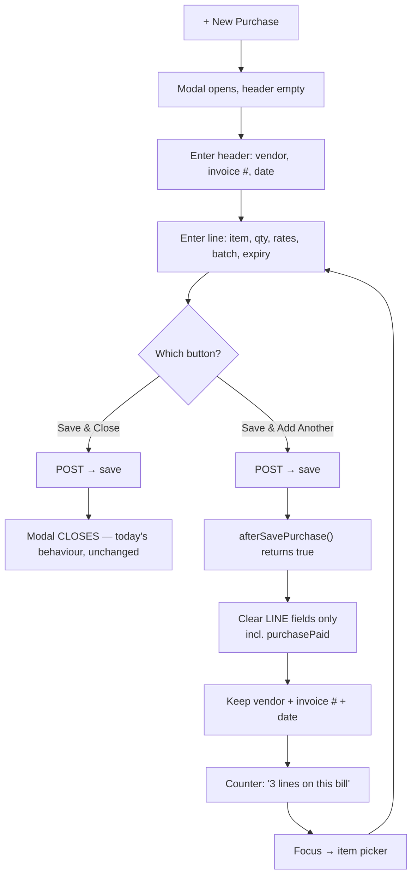

# UI/UX P6 — Purchase form: rapid line entry

**Status:** DESIGN — awaiting consent. Nothing implemented.
**Reported:** "on click of addPurchase close the modal and user need to open it again."

---

## 1. Review — what actually happens today

The close is not in the purchase code. It is the **generic** post-save handler that every
entity screen shares, `src/main/resources/static/js/main.js`:

```js
// line 857-861, inside $.fn.callAjax success
resetForm();                                  // clicks .resetForm  → <button type="reset"> → clears the WHOLE form
clearFormError();
if ($('#' + tableV + 'Modal').length && typeof closeModal === 'function')
        closeModal(tableV + 'Modal');         // ← the reported symptom
if (typeof refreshBulkBar === 'function') refreshBulkBar(tableV);
```

`#addPurchase` has **no handler of its own** — it is bound by convention at `main.js:432`
(`$("#add"+buttonV)`), so Purchase inherits the register behaviour built for Company,
Vendor and Product.

**That behaviour is correct for a register and wrong for Purchase.** A register creates one
record and you are done. A purchase is *repetitive line entry against a shared header*: one
delivery from one vendor on one invoice contains many items, and each item is a separate
`Purchase` row.

### The cost is the header, not the reopen

`resetForm()` resets the entire `<form id="Purchase">`, so the reopen is not the real
expense — retyping the header is. The form's fields split cleanly:

| Header — identical for every line of one delivery | Line — changes per item |
|---|---|
| `purchaseVenderDD` (vendor) | `purchaseItemDD`, `purchaseItemDesc` |
| `purchaseInvoiceNo` | `purchaseQuantity` |
| `purchaseDate` | `purchasePurchaseRate`, `purchaseSellRate` |
| | `purchaseBatchNo`, `purchaseExpiry` |
| | `purchaseTaxRate` |
| | `purchaseTotalAmount`, `purchaseNetAmount`, `purchaseStock` (computed/readonly) |

A 30-line delivery today costs **30 modal opens + 30 vendor selections + 30 invoice numbers
retyped**, to enter 30 items. The vendor picker is a bootstrap-select, so each of those is a
click-scroll-click.

### One field must NOT be sticky — `purchasePaid`

`purchasePaid` looks like a header field (payment is against the *bill*, not the line), but
its placeholder is **"Blank = paid in full (cash)"**. Carrying a typed value across lines
would post that payment once per line and credit the vendor N times. It must reset with the
line fields. This is the single thing in this design that, done carelessly, corrupts money —
so it is called out here rather than left to the implementation.

---

## 2. Two ways to fix it

### Option A — "Save & Add Another" (sticky header)  ← recommended

The modal stays open, line fields clear, header is retained, focus returns to the item
picker, and a running counter shows how many lines have gone onto this bill.

This is the **"Save and New"** pattern from Odoo, Zoho Books, QuickBooks and SAP B1 — the
established answer for repetitive entry against a shared header. Data model unchanged;
nothing server-side changes.

### Option B — true multi-line GRN cart

Mirror the sale screen: build lines in a cart, one submit posts the whole bill. This is the
*correct* document model — one bill is one document with N lines — and it makes the invoice
number a real key instead of a value repeated across rows.

It is also a much bigger change: new DTO, new endpoint, one transaction spanning N stock
movements, GL posted per bill rather than per line, and the purchase table/void/return paths
all reinterpreted. It is the right eventual destination, not a quick fix.

**Recommendation: A now.** It removes the reported pain in one screen with no server change.
Be clear-eyed that A is a UX fix layered over a model where one bill is still N rows — it
does not make the bill a document. If you want that, it is Option B and a proper slice.

---

## 3. Design (Option A)

### Two buttons, no new setting

```
[ Save & Add Another ]   [ Save & Close ]   [ Cancel ]
     primary                 default
```

**Deliberately not a tenant setting.** A setting would force a business-service rebuild to
appear, make the behaviour invisible until someone finds Configuration, and force one answer
on a shop that sometimes enters a 30-line delivery and sometimes a single item. Two buttons
put the choice at the moment of the decision, where it belongs, and cost nothing to discover.
`Save & Close` keeps today's behaviour exactly, so nothing regresses for single-line entry.

### Where the hook goes

The success handler is shared by every entity, so Purchase must not special-case itself
inside it. The file already has a convention for exactly this — `window.bulkDelete<Entity>`
at `main.js:~810`, where a module registers an override and the generic path defers to it.
P6 follows that same convention:

```js
// main.js — replaces the unconditional close
var after = window["afterSave" + tableV];
if (typeof after === "function" && after() === true) {
        // the module handled its own post-save UI (kept the modal open, partial reset)
} else if ($('#' + tableV + 'Modal').length && typeof closeModal === 'function') {
        closeModal(tableV + 'Modal');
}
```

`business.js` then owns all the purchase behaviour in `afterSavePurchase()`. No other entity
is touched, and no other entity can be broken by this change.

### Flow



### Reset split, precisely

`resetForm()` cannot be reused for the sticky path — it clicks a `type="reset"` button, which
is all-or-nothing. `afterSavePurchase()` clears an explicit list instead:

- **cleared:** `purchaseId`, `purchaseItemDD` (via `resetBSDD`), `purchaseItemDesc`,
  `purchaseQuantity`, `purchasePurchaseRate`, `purchaseSellRate`, `purchaseBatchNo`,
  `purchaseExpiry`, `purchaseTaxRate`, `purchaseTotalAmount`, `purchaseNetAmount`,
  `purchaseStock`, **`purchasePaid`**
- **kept:** `purchaseVenderDD`, `purchaseInvoiceNo`, `purchaseDate`, and the vendor-dues row

An explicit list is a maintenance liability — a field added later will not be cleared. It is
still the right call over "clear everything except a keep-list", because a *new* field
silently going sticky is the failure that repeats a payment; a new field silently not
clearing is a visible annoyance. Fail toward the harmless side. A Cypress test pins the list.

### Table refresh

The generic handler runs `datatable.clear().draw(); datatable.ajax.reload();` on every save —
a full server round-trip per line, which fights "quick". On the sticky path the reload is
kept but the `clear().draw()` dropped, so the grid updates without blanking between lines.

### Edit path

`afterSavePurchase()` returns `true` **only when the Save & Add Another button was the one
clicked, and only when `purchaseId` was empty** (a genuine create). Editing an existing
purchase closes the modal as it does today — "add another" has no meaning there.

---

### Mouse-free entry — the Enter chain

Receiving a delivery is the same shape of work as ringing up a sale: one operator, a stack of items, a
keyboard. So the purchase form gets the same contract the sale screen got in P1–P3:

| Key | Action |
|---|---|
| `Enter` | next field — hidden/read-only fields are skipped, so the chain follows configuration |
| `Shift+Enter` | previous field |
| `Enter` on the last field | **Save & Add Another** — a delivery rarely has exactly one line |
| `Ctrl+Enter` | **Save & Close**, from *any* field |
| `Esc` | Cancel |

Chain order — **the form's own top-to-bottom order**:

```
purchaseInvoiceNo → purchaseBatchNo → purchaseVenderDD → (purchaseTaxRate, if the org uses it)
    → purchaseItemDD → purchaseQuantity → purchasePurchaseRate → purchaseSellRate
    → purchaseDate → purchaseExpiry → purchasePaid → [save, stay]
```

The first version grouped this *logically* — header fields, then line fields — which read well on paper
and was wrong on screen: Enter jumped from the invoice box (row 1) to the date (row 8) and back up to
the item picker (row 3). A chain the eye cannot follow is worse than no chain, because the operator has
to look up after every keystroke to find the cursor. **Follow the layout, not the data model.**

Read-only/computed boxes (`purchaseStock`, `purchaseTotalAmount`, `purchaseNetAmount`,
`purchaseItemDesc`) are absent by construction — `usable()` drops them, and a stop on a field nobody can
edit is a dead keystroke.

Opening the modal focuses `purchaseInvoiceNo`. **P6 adds no auto-focus of its own** — `openModal()`
already calls `focusFirstField()` on the next animation frame. An earlier version added a second,
timer-based focus that raced it and stole the cursor from anyone who started typing within 120ms.

### Dates must be typeable — app-wide

The calendar is faster for "some day next month" and slower for "the date I already know", which is what
receiving a delivery is: the date is printed on the paperwork in front of you. Keyboard-first entry needs
the second case.

Masking lives in **`/js/common/date-picker.js`**, the single binder for every calendar in the app
(included via `header.html`, so all seven dashboards get it). Type `11082026`, get `11-08-2026`:

| class | typed | rendered |
|---|---|---|
| `.datePicker` | `11082026` | `11-08-2026` |
| `.datetimepicker` | `11082026` + time | `11-08-2026 14:30:00` |
| `.datePickerWithMonthName` | `11072026` | `11-Jul-2026` |
| `.monthYearDatePicker` | `072026` | `07-2026` |

The wire format is a contract parsed by `AppUtil` on both sides, so the mask emits exactly that. Three
rules keep it from fighting the typist: it only reformats when the caret is **at the end**; an
unparseable value is **left alone** (this field has a history of being cleared on blur, which must never
recur); and `dd-MMM-yyyy` converts the month **name back to digits** before re-masking, or the mask eats
its own output — `11-Jul-2026` strips to `112026` and re-masks as `11-20-26`.

### A pre-existing bug this uncovered: you could not back-date a purchase

`initDates()` (`main.js`) runs on every `.onChangeSelect` change and assigned **unconditionally**, so
selecting the item snapped the purchase date back to today — silently, with no indication. Entering
yesterday's delivery this morning, the normal case, was impossible; on a multi-line bill it re-armed on
every line.

It now **fills** rather than **overwrites**: a blank box still gets today, a value a person put there is
theirs. "Default" and "overwrite" are not the same operation and this only ever wanted the first.

This is not P6's bug — it predates the slice and affects every date field in the app. P6 made it visible
because the header is now supposed to survive a save.

**DRY — one engine, not two.** The mechanics of a chain (is this field usable? what is next? how do you
focus a bootstrap-select?) are not sale-specific; only the *policy* is. Those mechanics move to
**`/js/common/enter-chain.js`**, and `pos-keyboard.js` now delegates `usable()`, `walk()` and
`focusField()` to it instead of holding its own copies. The purchase form calls `EnterChain.bind()`.
Two keyboard-first forms, one definition of what "next field" means.

The two chains can never fight: `pos-keyboard.js` already stands down whenever a `.crud-overlay` is
open, which is exactly when the purchase modal is up.

**Not gated by a setting.** Enter in this form previously did nothing (`<form onsubmit="return false">`),
so there is no behaviour to regress and nothing to opt out of.

---

## 4. Test plan — `cypress/e2e/business/purchase-rapid-entry.cy.js`

1. `Save & Close` still closes the modal (no regression)
2. `Save & Add Another` leaves the modal open
3. vendor, invoice # and date survive the save
4. every line field is cleared — asserted **field by field**, so a missed one fails
5. **`purchasePaid` is cleared** — the money case, asserted on its own
6. focus lands on the item picker
7. the counter increments across three consecutive lines
8. three lines land as three rows against one invoice number in the grid
9. editing an existing purchase still closes the modal
10. the Company screen still closes its modal — proof the shared handler was not broken

Keyboard:

11. `Enter` advances field by field
12. `Shift+Enter` walks back
13. a hidden field is skipped (tax row forced hidden, Expiry → Paid)
14. `Enter` on the last field saves and stays open — a whole line, no mouse
15. `Ctrl+Enter` finishes the bill from the middle of the chain
16. `Esc` cancels and does **not** POST
17. the sale screen's chain still resolves through the shared engine — the P1–P3 refactor is safe

---

## 5. Scope

| File | Change |
|---|---|
| `common/enter-chain.js` | **new** — the shared Enter-to-advance engine |
| `pos-keyboard.js` | `usable`/`walk`/`focusField` now delegate to it (3 bodies deleted) |
| `main.js` | `afterSave<Entity>` hook replacing the unconditional close |
| `businessDashboard.html` | new button, counter, keyboard hint, script include |
| `business.js` | `afterSavePurchase()`, the purchase chain, button handlers |
| `messages*.properties` ×6 | 5 keys |
| `purchase-rapid-entry.cy.js` | new, 17 tests |

Monolith rebuild only. **No business-service change, no DB change, no new setting.**

### Explicitly out of scope

- Option B (the GRN cart / true bill document).
- Migrating the sale screen's *policy* (skip-ahead, F-keys, quick-pick) into the shared engine. Only
  the mechanics moved; the policy stays where it belongs, in `pos-keyboard.js`.

---

## 6. Post-ship defect (found 2026-08-15 by the picker gate, FIXED)

Rapid entry could **silently lose a line**, and the loss got more likely the longer the org had been
in use — which is why P6 shipped green and this surfaced months later.

### The chain

1. `afterSavePurchase()` calls `datatable.ajax.reload()` after every *Save & Add Another*.
2. That reload's success handler preloaded the section's dropdowns — its own comment said "once per
   entity type", but the code ran it on **every** reload, not just on opening the section.
3. `loadUserItems()` and `loadUserVenders()` both do `$sel.empty().append(...)` with **no attempt to
   preserve the current selection**.

So a beat after each saved line the item and vendor pickers were rebuilt **underneath the operator**.
Pick the next item inside that window and the selection is discarded; the save is then refused
client-side by `main.js` ("Select an item and enter a quantity greater than 0.") with **`return false`
— no POST at all**. The operator sees a form that will not save and no explanation.

In Cypress it read as `cy.wait() timed out … No request ever occurred`, on the **third** line — the
window widens as the purchase table and the catalog grow.

### Why it also mattered for performance

`loadUserItems()` fetches `catalogProducts?size=2000`. That was being re-fetched **per saved line**,
in the one flow built for speed.

### The fix — three parts

| Change | Why |
|---|---|
| `pickerPreloadPending` flag, set in `loadDataTable()`, consumed by the grid's first success | Preloading belongs to OPENING A SECTION, which is what the comment always claimed. A reload is not a section open. |
| `loadUserVenders()` preserves the selected value across the rebuild | The vendor is bill HEADER data that P6 promises survives across lines. |
| `loadUserItems()` likewise | This one also serves `sellItemDD`, so the sale screen had the identical wipe. |

**Trade-off, accepted and commented at the site:** a product or vendor created in *another* section now
appears in these pickers only after the section is re-opened. That was already the documented behaviour
of the grid itself ("re-open the section to refresh from DB"); the pickers now agree with it.

**Consequence that had to be paid back explicitly:** the sale-return handler relied on that incidental
reload to refresh `sellCustomerDD`, whose options cache `data-due` / `data-credit-limit`. It now calls
`loadSellCustomers()` itself — the writer refreshes what it invalidated, for that one list, instead of
a grid reload re-fetching 2000 products as a side effect. ⚠ **Needs a monolith image rebuild to go
live** (the container serves static JS from its image, not from the host).

### Gate

`purchase-rapid-entry.cy.js` 26 → 28 cases: the three order-of-the-chain cases now answer the pickers
first (`answerVendor()` / `answerItem()`, native `.select()` so the answer does not also move the
cursor), the picker RULE got its own two cases, and each saved line waits for the grid reload it
triggers (`saveLineAndSettle()`) so the next click cannot land on `#appAjaxOverlay`.

**Lesson:** a test that gets flakier as data grows is a real race, not flake. The 3rd iteration failing
while 1 and 2 pass is the shape of "a background reload overtook the operator".
