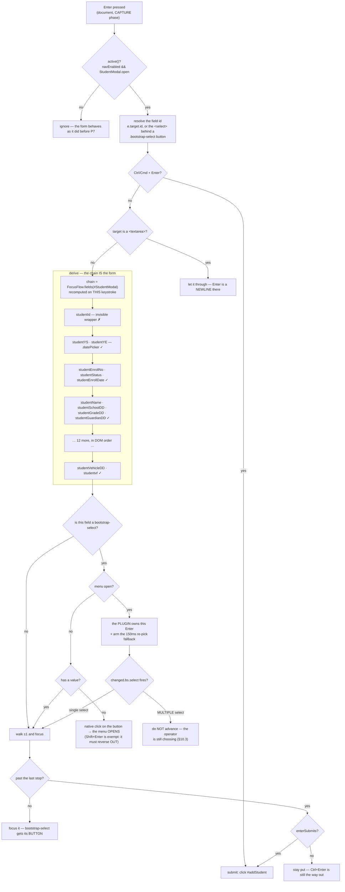

# UI/UX P7 — Keyboard-first registration, everywhere

**Status:** **P7.1 ✅ 81/81 · P7.2 ✅ 97/97 · picker rule ✅ shipped, gate re-run pending ·
P7.3 (education, 9 modals) ✅ implemented, gate written and NOT yet run.**
NEXT = **run the P7.3 gate + the two regression specs it touches (§10.7), then P7.4 (welfare +
agriculture)**. See §9 As-built and §10 for P7.3.
**Goal:** every registration form and modal is completable without a mouse, the way the sale and
purchase screens now are.

---

## 1. Review — what is actually out there

| Module | Modals | `.form-horizontal` forms |
|---|---|---|
| Business | 7 — Company, Customer, Vender, Product, Purchase, ReceivePayment, PayVendor | 16 |
| Education | 9 — School, Student, Guardian, Staff, Owner, Subject, Grade, Discount, Vehicle | 16 |
| Welfare | 2 — Donator, Donation | 3 |
| Agriculture | 3 — Land, AgricultureIncome, AgricultureExpense | 3 |
| **Total** | **21** | **38** |

Two of the 38 are done (sale, purchase). The other 36 are mouse-or-Tab only.

### The decisive finding: the hard part already exists

`/js/common/focus-flow.js` already owns the exact predicate a chain needs, and every modal already
calls into it (`crud-modal.js` → `openModal` → `focusFirstField`):

```js
var TYPEABLE = 'input, select, textarea';
function skip(el) {                       // disabled, readOnly, hidden/submit/button/reset,
    ...                                   // .no-autofocus, or not visible
}
function focusTarget(el) { ... }          // bootstrap-select: focus the BUTTON, not the <select>
function mayAutoFocus() { ... }           // desktop only — never on touch/<992px
```

`enter-chain.js` (P6) owns the movement: `walk()`, `focusField()`, `bind()`.

So P7 is not 21 new features. It is **joining two things that already exist** and letting every form
opt in.

---

## 2. The core decision: derive the chain, never hand-list it

P6 gave the purchase form an explicit array of 11 field ids. Repeating that 21 times would be wrong,
and this codebase has already paid for exactly that mistake twice:

- `CHAIN` listed `sellDiscountTypeDD` but the Enter handler's guard did not → the picker became a
  keyboard **dead end** on the most-used screen.
- P6's first chain grouped fields *logically* while the form was laid out differently → Enter jumped
  row 1 → row 8 → row 3.

**A hand-written field list is a second copy of the form, and the copy drifts.**

So the chain is computed at Enter-time from the DOM:

```
chain(container) = [...container.querySelectorAll('input, select, textarea')]
                       .filter(el => !skip(el))          // focus-flow's predicate, unchanged
```

This buys, for free:

- **Order follows the layout**, because the DOM *is* the layout. The P6 lesson, enforced structurally.
- **Tenant field-visibility config works** with no extra code — a hidden field fails `skip()`.
- **New forms get it automatically.** No registration step, nothing to remember.
- **Nothing to drift**, because there is no second list.

### One predicate, not two

`enter-chain.usable()` and `focus-flow.skip()` are today the same rule written twice, and that is the
precise shape of the `sellDiscountTypeDD` bug. P7 makes `focus-flow` the single owner and has
`enter-chain` consume it. The sale and purchase chains keep working — they change what they *call*,
not what they *do*.

---

## 3. The contract

| Key | Action |
|---|---|
| `Enter` | next field |
| `Shift+Enter` | previous field |
| `Enter` on the last field | submit (`#add<Entity>`, derived from `<Entity>Modal`) |
| `Ctrl+Enter` | submit from anywhere |
| `Esc` | close / cancel |
| `Alt+N` | inline-create from a picker (where the form has a `<Field>New` control) |

### Rules that are not negotiable

**A `<textarea>` never advances on Enter.** Enter inserts a newline — that is what the control is for.
Leave it with `Tab` or `Ctrl+Enter`. Getting this wrong makes every address and description field
unusable, and it is the single most common way a keyboard-nav feature ships broken.

**A picker with its menu open keeps its Enter.** The plugin selects the highlighted row and fires
`changed.bs.select`, and *that* advances. Intercepting would advance without recording the choice.

**An UNANSWERED picker OPENS on Enter; an answered one advances.** Three states, one key — see §9.3.
Shift+Enter is exempt: "go back" never opens anything, or an empty required dropdown is a one-way door.

**Radio and checkbox groups advance**, but `Space` still toggles.

**Touch and narrow screens are excluded**, via the existing `mayAutoFocus()`. A phone keyboard has no
Enter-to-next expectation and hijacking it is worse than doing nothing.

---

## 4. Configurable, and customizable without code

Two different needs, answered two different ways.

### Tenant settings (3, not 30)

Added to each module's existing `SettingsCatalog` via the shared `common-settings` lib:

| Key | Default | Why a tenant would change it |
|---|---|---|
| `ui.keyboard.formNav.enabled` | **ON** | Turn the whole thing off for staff trained on Tab. |
| `ui.keyboard.enterSubmits` | **ON** | OFF = Enter never submits, only `Ctrl+Enter` does. For shops nervous about a half-typed record being saved by a stray Enter. |
| `ui.keyboard.requiredOnly` | **OFF** | ON = Enter visits only `[required]` fields; optional ones are reached with `Tab`. A clerk registering 200 students touches 5 fields instead of 18. |

`requiredOnly` is the one worth selling. It is the difference between "supports the keyboard" and
"designed for someone doing this 200 times before lunch".

Three settings, all failing to today's behaviour, is deliberate. Every extra toggle is a support
question and a screen someone has to understand; the value is in the defaults being right.

### Per-form customization — attributes, no code

A form that needs to differ says so in its own markup:

| Attribute | Effect |
|---|---|
| `data-kbd-skip` | never a stop (e.g. a computed box that is technically editable) |
| `data-kbd-order="N"` | override position for the rare form whose visual order ≠ DOM order |
| `data-kbd-submit="#someButton"` | non-standard submit control |
| `.no-autofocus` | already honoured by `focus-flow` — kept as-is |

This is how a form is customized without touching JavaScript, and it is what lets a future vertical
(clinic, school, distributor) tune its own screens.

---

## 5. Where this puts us against the market

Tally, Busy, Odoo and QuickBooks all sell on keyboard speed; in Pakistan/India wholesale, Tally's
keyboard flow is *the* reason shops refuse to switch. Matching it is table stakes for the segment
this product targets.

Table stakes: Enter-to-next, Esc, submit shortcut.
Where this design goes further: **`requiredOnly`**, **inline-create from a picker without leaving the
keyboard** (`Alt+N`), and **per-form attribute customization** — all three configurable per tenant
rather than compiled in.

---

## 6. Phasing — gated, each phase green before the next

| Phase | Scope | Why this order |
|---|---|---|
| **P7.1** | The engine: `focus-flow` owns the predicate, `enter-chain` gains `bindContainer()` (derived chain), sale + purchase migrated onto it | Prove it on the two screens already covered by 42 passing tests. If those stay green, the engine is sound. |
| **P7.2** | Business — 7 modals + the 3 settings | Highest-volume module; validates the derived chain against real variety (pickers, dates, textareas). |
| **P7.3** | Education — 9 modals | Largest count; Student/Guardian are the longest forms in the app. |
| **P7.4** | Welfare + Agriculture — 5 modals | Small, mechanical once the engine is proven. |
| **P7.5** | `requiredOnly` + `Alt+N` inline-create | The differentiators, once the base is solid everywhere. |

**P7.1 is the one that carries the risk.** It touches two working screens. Its gate is the existing
42 tests staying green — a regression there means the engine is wrong, caught before it reaches 19
other forms.

---

## 7. Test plan

Per phase: every modal gets `Enter` walks it, `Shift+Enter` reverses, hidden fields skipped, `Esc`
closes, submit fires once.

Cross-cutting, written once and run against every form:

1. a `<textarea>` does **not** advance on Enter, and the newline lands
2. a hidden field is skipped; unhiding it makes it a stop
3. `Enter` on the last field submits exactly **once** (no double-submit)
4. `enterSubmits=OFF` → Enter on the last field does nothing; `Ctrl+Enter` still submits
5. `requiredOnly=ON` → the walk visits only `[required]`
6. the form still submits correctly with the **mouse** — the keyboard is additive, never a gate
7. touch/narrow viewport → chain inert

Point 6 matters most. Every one of these forms works today; the failure mode to guard against is P7
breaking mouse users to serve keyboard users.

---

## 8. Scope and risk

**Touched:** `focus-flow.js`, `enter-chain.js`, `crud-modal.js`, 4 dashboard templates (attributes +
hint bars), 4 `SettingsCatalog` classes, i18n ×6, ~6 new spec files.

**No DB change. No service contract change.** Settings ride the existing `common-settings` catalog.

**The real risk is regression, not the new code.** 36 forms that work today start responding to a key
they previously ignored. That is why P7.1 is gated on 42 existing tests, and why "still works with the
mouse" is an explicit assertion rather than an assumption.

**Recommendation:** approve **P7.1 only**. It is the whole engineering argument — derived chain, one
predicate, proven against existing tests. If it lands green, P7.2–P7.5 are largely mechanical. If it
does not, we have learned that cheaply and no other form was touched.

---

## 9. As-built

### 9.1 What shipped

| Phase | State | Gate |
|---|---|---|
| **P7.1** — the engine: `focus-flow` owns the predicate, `enter-chain` gains the derived chain, sale + purchase migrated onto it | ✅ | 81/81 green |
| **P7.2** — business: 7 modals + the 3 settings, bound by convention in `keyboard-forms.js` | ✅ | 97/97 green |
| **Picker rule** — an unanswered dropdown opens instead of being walked past | ✅ implemented | **re-run pending** — see 9.4 |
| **P7.3** — education, 9 modals + 2 settings + 3 engine fixes | ✅ implemented — see §10 | **written, NOT run** — `cypress/e2e/education/education-modal-keyboard.cy.js` |
| **P7.4** — welfare + agriculture, 5 modals | not started | — |
| **P7.5** — `requiredOnly` + `Alt+N` inline-create | not started | — |

### 9.2 Where the code lives

| File | Role |
|---|---|
| `static/js/common/focus-flow.js` | the ONE predicate: `skip()`, `focusTarget()`, `fields()` |
| `static/js/common/enter-chain.js` | the engine: `usable`/`walk`/`focusField`/`fieldsIn`/`bind` |
| `static/js/common/keyboard-forms.js` | P7.2 — binds a chain per `<Entity>Modal`, by convention |
| `static/js/business/business.js` (`EnterChain.bind('purchase')`) | the purchase form's policy |
| `static/js/business/pos-keyboard.js` | the sale screen's policy (delegates the mechanics) |

### 9.3 The dropdown rule, and why it changed twice

Enter on a `bootstrap-select` has to answer three different questions, because the operator means
three different things by the same key:

| State | Enter does | Why |
|---|---|---|
| menu **open** | nothing — the plugin owns it | it selects the highlighted row and fires `changed.bs.select`, which advances. A fallback timer covers re-picking the value that was *already* selected, which fires no event at all and used to be a silent dead end. |
| closed, **empty** | **opens the menu** | a native `.click()` on the button the plugin renders |
| closed, **answered** | advances | the question has been answered; re-asking it is a stall |

`Shift+Enter` is exempt from the middle row and always walks back.

**The first rule advanced in every closed case.** That made a required dropdown impossible to fill
from the keyboard — Enter walked past 71 companies without showing one, leaving the field empty with
no keyboard way to set it.

**The open is a native `btn.click()`, not `selectpicker('toggle')`.** bootstrap-select 1.6.2 has no
`toggle` method, and an unknown method there is a **silent no-op** rather than an error — so a
`try/catch` around it catches nothing and the fallback never runs. A guard only helps against
failures that announce themselves. A native click also means bootstrap's dropdown data-api and the
plugin's own delegated handlers all run exactly as they do for a mouse user.

The handler is on the **capture** phase so `stopPropagation()` can decide between opening and
advancing; without that, bootstrap-select's own keydown on the button would do both at once.

### 9.4 What the rule change cost, and the lesson

Changing the rule silently invalidated **three passing tests** in
`cypress/e2e/business/purchase-rapid-entry.cy.js`, which asserted the *old* contract
("Enter on a picker whose menu is CLOSED advances like any other field"). `#purchaseVenderDD`'s first
option is `value=""` and `openFreshPurchaseModal()` never fills it, so every one of those walks now
opened a menu where it expected to move on. The specs were **not** updated in the same commit.

**A behaviour rule is a contract with the tests that assert it. Changing the rule means grepping for
every test that pinned the old one, in the same change — not the next gate run.**

Fixed by giving the three order-of-the-chain tests an `answerVendor()` step (native `.select()`,
which fires `change` but not `changed.bs.select`, so the answer does not also move the cursor), and
giving the *rule* its own two tests — one for open-on-empty, one for the Shift+Enter exemption. A
failure that names itself is worth more than one fewer test.

### 9.5 Watch items

- The picker-open path is now written in **two** places — `enter-chain.js` (all forms) and
  `pos-keyboard.js` (the sale screen's customer/tender pickers, which carry extra skip-ahead policy).
  They agree today. If the rule changes a third time, they must change together, or the sale screen
  and every other form will disagree about what Enter means.
- `enter-chain.js`'s `changed.bs.select` handler has no `clickedIndex` guard, where `pos-keyboard.js`
  deliberately has one ("only a USER selection may move the cursor"). It is harmless today because
  `selectpicker('refresh')` does not fire the event — but a plugin upgrade that changes that would
  fling focus across the purchase form on every programmatic load.
- **`pos-keyboard.js`'s two picker handlers now fall through into the re-open branch.** See §10.6 —
  found while reviewing the picker rule for P7.3, not yet fixed, and not `enter-chain.js`'s copy.

---

## 10. P7.3 — Education, 9 modals

### 10.1 The modals, enumerated from the template

Counted from `src/main/resources/templates/educationDashboard.html`, not from §1's table — §1 said
"9" and happened to be right, but a count in prose is not evidence. Every `.crud-overlay[id$="Modal"]`
on the page, in DOM order:

| # | Modal | template line | `<form>` | submit button | first chain stop | notable variety |
|---|---|---|---|---|---|---|
| 1 | `OwnerModal` | 349 | `#Owner` | `#addOwner` | `ownerName` | plainest form in the module |
| 2 | `SchoolModal` | 437 | `#School` | `#addSchool` | `schoolOwnerDD` | **starts on a MULTI-select**, and it is `required` |
| 3 | `GradeModal` | 536 | `#Grade` | `#addGrade` | `gradeSchoolDD` | 2 × `.timepicker` |
| 4 | `StaffModal` | 649 | `#Staff` | `#addStaff` | `staffName` | multi-select (`staffGradeDD`), 2 × `.timepicker`, 1 × `.datePicker` |
| 5 | `GuardianModal` | 822 | `#Guardian` | `#addGuardian` | `guardianName` | 9 stops |
| 6 | `StudentModal` | 962 | `#Student` | `#addStudent` | `studentYS` | **27 stops, 4 × `.datePicker`, 11 pickers** — the longest form in the app |
| 7 | `SubjectModal` | 1235 | `#Subject` | `#addSubject` | `subjectGradeDD` | — |
| 8 | `VehicleModal` | 1341 | `#Vehicle` | `#addVehicle` | `vehicleSchoolDD` | — |
| 9 | `DiscountModal` | 1458 | `#Discount` | `#addDiscount` | `discountNameDD` | two options share `value="amount"` |

All nine already satisfy P7.2's convention exactly — `#<Entity>Modal` + `#add<Entity>` + a `<form>` —
so **not one line of per-modal markup is needed**. The whole of the template change is two `<script>`
tags. That is the derived chain paying for itself: the ninth form costs the same as the first.

Every modal opens with its id/`datedStr` fields inside a `<div class="form-group" style="display:none">`.
They are real `<input type="text">` that must keep submitting (an edit sends the id back), so they are
**not** `disabled` and **not** removed — they are invisible, which is exactly the condition
`FocusFlow.skip()` already tests. No `data-kbd-skip` needed anywhere.

### 10.2 The walk, derived



### 10.3 What education's variety broke, and the three engine fixes

P7.2 called business "real variety". Education has two shapes business's seven modals do not, and both
were live defects the moment the chain was switched on. Chasing them turned up a third: a rule this
document has claimed since §3 that no code ever implemented.

**(a) A `multiple` picker advanced after the FIRST choice.** `schoolOwnerDD` (School, `required`) and
`staffGradeDD` (Staff) are multi-selects — and `searchable-selects.js` turns *every* non-nav `<select>`
on the page into a bootstrap-select, so both are pickers. bootstrap-select fires `changed.bs.select`
on each individual toggle and leaves the menu open, so the chain advanced away from the picker after
owner #1 and the operator could never name owner #2 without the mouse. On the very first field of the
School form.

> `changed.bs.select` now returns without advancing when the select is `multiple`. A multi-select is
> not answered by one click; it is answered by *closing it*, and Enter on the closed, answered picker
> advances like any other field. Single selects are untouched, so P7.1/P7.2's chains do not move.

**(b) `Esc` closed the whole modal while a calendar or a dropdown was open.** Student has four
`.datePicker` fields and eleven pickers; Staff and Grade have `.timepicker`s. `date-picker.js` registers
its own capture-phase Escape handler *when the calendar opens* — i.e. **after** `enter-chain.js`
registered its own at page load — and same-phase listeners fire in registration order. So the chain's
Escape ran first, closed the modal, and destroyed a part-typed student record; the calendar then
closed politely over the wreckage.

> Escape now **defers to whatever transient is open** — `.bootstrap-select.open` or `.dp-active` —
> and only means "close the form" when nothing smaller is listening. The innermost open thing owns
> Escape. This makes Escape strictly less destructive everywhere, business included.

**(c) §3's touch/narrow exclusion had never actually been implemented.** §3 and §7 point 7 both say the
chain is inert below 992px "via the existing `mayAutoFocus()`" — but nothing in `enter-chain.js` ever
called it, and no P7.1/P7.2 test looked (the suite runs at 1280px, so it could not have noticed).

> The **walk** now consults `FocusFlow.mayAutoFocus()`, so the same predicate decides where the app
> puts the cursor and where Enter moves it. `Ctrl+Enter` and `Escape` are handled above that line and
> stay live: they are explicit intent, not navigation, and disabling them would only cost Esc to
> someone on a narrow desktop window. `changed.bs.select` is also deliberately left alone — advancing
> on a *chosen* value is the mouse path too, and breaking mouse users to serve a screen-width rule is
> exactly what §7 point 6 exists to prevent.

Neither fix is education-specific; all three live in `enter-chain.js` and they are why P7.3 was worth
running against a different module rather than assuming the engine was finished at P7.2.

### 10.4 Settings — 2, and where they are read

`ui.keyboard.formNav.enabled` and `ui.keyboard.enterSubmits` are added to `EducationSettingsCatalog`
under a **Data entry** group, with the same wording and the same defaults as business's. No third
setting: `requiredOnly` is P7.5 and shipping the toggle before the behaviour would be a control that
lies.

Read once at `$(document).ready` in `education.js` via the existing `getConfig` proxy — education's
`SettingsController` returns a `GenericResponse`, so the catalog arrives in **`collection`**, not
`data`. Both flags **fail OPEN**: an absent key, a 500, a service that is down ⇒ the keyboard works.
That is the opposite polarity to the POS flags, and deliberately so — an unexpected function key on a
till can complete a sale, whereas Enter moving to the next box cannot do anything Tab could not.
Losing the feature to a config hiccup is the worse outcome here. The polarity is commented at the
read site.

No DB change and no service-contract change: both entries ride the existing `common-settings` catalog,
and `SettingsService` is injected **required** (`@Autowired`, not `required=false`) so a missing
`SettingsStore` fails the service at boot rather than silently pinning every tenant to the default.

### 10.5 What P7.3 does NOT do, and why

- **No hint bar.** P7.2 shipped none either (the business hint row at `businessDashboard.html:1473` is
  P6's, inside `PurchaseModal`). Nine copies of a hint row is nine copies; the right shape is one
  injection inside `keyboard-forms.js` so every bound modal on every dashboard gets it from one place —
  and that touches business, so it belongs to its own slice with its own gate, not to P7.3.
  **A keyboard feature nobody can discover is only half-shipped, so this is a real debt, not a
  non-requirement.**
- **§7 point 1 (textarea) is NOT APPLICABLE here.** There is no `<textarea>` in any of education's
  nine modals — the three on the page (`#pam`, `#alertMessage`, `#ntBody`) are all outside a
  `.crud-overlay` and are not chain-bound. Business's seven have none either, so the rule is currently
  unexercised by any modal gate in the app. The education spec therefore asserts the **absence** as a
  property: if anyone adds a textarea to an education modal, that assertion fails and forces the case
  to be written. An untested rule with an alarm on it beats an untested rule.
- **§7 point 5 (`requiredOnly`)** is P7.5. Not implemented, so not asserted.
- **Education's `saveConfigToggle` is deliberately left alone.** It duplicates
  `saveSettingsField`, but the shared helper reports success as `res.success` while education's proxy
  returns a `GenericResponse` whose success is `res.status === 'SUCCESS'`. Switching would make every
  save *look* failed and revert the toggle on screen. The DRY fix needs `saveSettingsField` to accept
  both envelopes first — a separate, gated change.

### 10.6 A defect found while reviewing the ungated picker rule

Commit `1a5a4878` changed both copies of the picker rule. `enter-chain.js`'s copy is coherent: the
menu-open branch `return`s, so it can never reach the re-open branch below it.

**`pos-keyboard.js`'s two copies do not `return` on every path, and now fall through into the re-open
branch they did not previously reach.**

```
if ($bs.hasClass('open')) {
    if ($sel.val()) return;
    e.preventDefault();
    $bs.removeClass('open');            // "the answer is: skip"
    var jumped = skipAhead(pickerId);
    if (jumped === false) return;
    if (jumped) { focusField(jumped); return; }
}                                       // ← skipAhead() returned NULL: falls through
if (!$sel.val() && !e.shiftKey) { ... oBtn.click(); return; }   // ← re-OPENS what we just closed
```

`skipAhead()` returns `null` for every picker except `sellItemDD` and `sellCustomerDD` — so on
`sellPayMethod`, and on any line picker such as `sellDiscountTypeDD`, the second Enter now closes the
menu and immediately re-opens it. Before the change that path hit `if (!$sel.val()) return;` and
stopped. The result is a keyboard **dead end**: Enter toggles the menu forever and the cursor never
moves, which is precisely the class of bug §2 and the `sellDiscountTypeDD` note were written about.

Reachable only when the picker is genuinely empty, so `sellPayMethod` is usually protected by
`pos.tender.default`, and no existing test covers it. **Not fixed here** — `pos-keyboard.js` is not
this stream's file, and the same rule living in two places (watch item, §9.5) is what let the two
copies diverge in the first place.

### 10.7 Gate

`cypress/e2e/education/education-modal-keyboard.cy.js`.

```
npx cypress run --headed --browser chrome --spec cypress/e2e/education/education-modal-keyboard.cy.js
```

Covers, per §7: all nine modals walk / reverse / `Esc` / are bound by convention; hidden field skipped
**and** unhiding it makes it a stop; submit exactly once; `enterSubmits=OFF`; `formNav=OFF`; the
**mouse** path still saves; narrow viewport leaves the chain inert; plus the two education-specific
rules from §10.3 — a multi-select does not advance mid-choice, and Escape with a picker open closes
the picker rather than the record.

**A template change and two new script references mean the monolith must be REBUILT** (it serves from
`target/classes`) before this spec can pass. The two `SettingEntry` rows are a **education-service**
change, so that service needs rebuilding too — until it is, `getConfig` simply will not carry the two
keys and both flags resolve to their fail-open default of ON, which is the designed degradation and not
a failure.

#### Regression — three specs, not one

P7.3's three fixes are in `enter-chain.js`, which every P7 chain shares. The new spec proves education;
it proves nothing about the screens that were already green. **These must be re-run in the same
sitting, and the slice is not green until all three are:**

| Spec | Why it is at risk |
|---|---|
| `cypress/e2e/business/business-modal-keyboard.cy.js` | P7.2's 6 modals run on the same engine. Escape now defers to an open picker; the multi-select rule and the `mayAutoFocus` guard are new code on every keystroke it makes. |
| `cypress/e2e/business/purchase-rapid-entry.cy.js` | The purchase form is the other `EnterChain.bind()` caller, so the `mayAutoFocus` guard is on its path too. It also carries the **already-uncommitted** `answerVendor()` repair for the picker rule (§9.4) — that repair has never been through a gate either, so this run is its first. |
| `cypress/e2e/education/education-modal-keyboard.cy.js` | P7.3 itself. |

Expected to be unaffected either way, and worth knowing: the **sale screen is not covered by the
`mayAutoFocus` guard at all.** `pos-keyboard.js` binds its own `keydown` handlers and only borrows
`walk`/`focusField`/`usable` from the engine, so it never passes through `bindEnterChain`. §3's
touch/narrow exclusion therefore now holds for the purchase form and all fifteen modals, and still does
not hold for the till. That is a gap to close in its own slice, not silently here.
