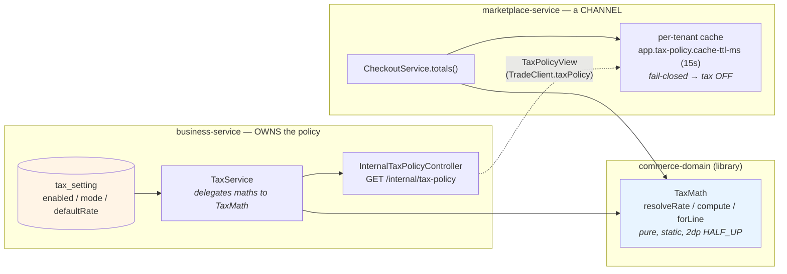
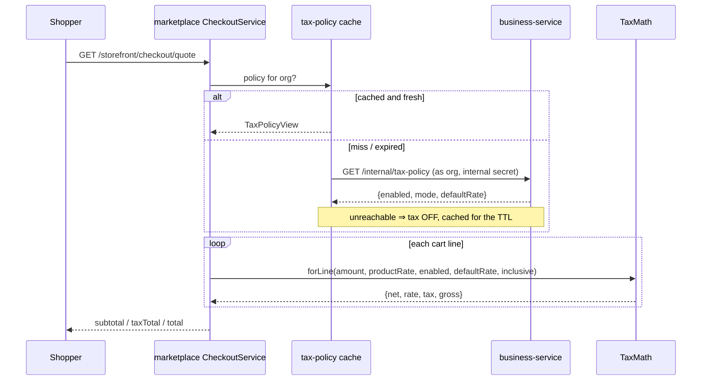

# Storefront tax alignment — one tax engine, one policy owner

**Status:** implemented, awaiting rebuild + Cypress gate
**Branch:** `feature/UI-UX`
**Closes:** the tax half of the "storefront total ≠ invoice total" defect
**Does NOT close:** the shipping-fee and coupon-discount half — see §6

---

## 1. The defect

A shopper was quoted one figure and the books recorded another.

| | quote (marketplace) | invoice (business-service) |
|---|---|---|
| product @10.00 × 2, `taxRate = 10` | subtotal 20, **tax 2**, total **22** | subtotal 20, **tax 0**, total **20** |

Both halves were locally correct:

- `CheckoutService.totals()` computed `net × item.taxRate / 100`. It had **no tenant switch, no org
  default rate, and no INCLUSIVE branch** — a private tax engine that knew only the product's rate.
- `business-service` gates every sale line on `tax_setting.enabled`, and that row **defaults to absent**,
  which the sale path reads as *charges no sales tax*.

So for the very common case of a tenant that has never opened the Tax Codes screen, the storefront showed
and charged a tax line the invoice then did not record. Nothing caught it because **every test asserted one
side**: the checkout tests checked the quote, the sale tests checked the invoice, and the defect existed
only *between* them.

Three further disagreements followed from the same root:

1. A product with no rate of its own was silently zero-rated by the storefront; the books apply the tenant's
   default rate.
2. An INCLUSIVE tenant (shelf prices already contain the tax) was **over-charged** — the storefront added tax
   on top of a tax-inclusive price.
3. The `tax_setting` mode change an owner makes never reached the storefront at all.

## 2. Decision

Split the problem in the only way that makes both sides unable to disagree again:

- **The arithmetic** lives once, in a shared library — `commerce-domain`'s `TaxMath`. Pure, static, no Spring.
- **The policy** stays with the owner of the books — `business-service` — and is *published* over the
  existing trade contract.

A duplicated **rule** is worse than a duplicated function: a duplicated function fails everywhere at once,
where a duplicated rule fails only on whichever copy was not edited. Consolidating the arithmetic without
consolidating the policy would have fixed nothing — the storefront would still not know the switch was off.

**Rejected: have business-service compute and return the tax for a list of lines.** That puts a second
engine on the wire, makes every keystroke-driven re-quote a round trip, and couples the storefront's quote
latency to the books.

## 3. Design



**Sequence of one quote:**



### Trust boundary

`/internal/**` is not routed by the gateway and `HeaderAuthFilter` enforces `service.internal-secret`. The
**tenant is taken from the caller's forwarded identity, never from a parameter** — a channel cannot ask for
another tenant's policy because it has no way to name one.

### Caching

Same shape and default as `app.period-lock.cache-ttl-ms`, and for the same reason: month-end configuration
sitting on a hot path. An owner who flips the switch waits at most the TTL for the storefront to follow —
a *bounded lag*, not the permanent disagreement this change removes.

### Fail-closed

If business-service is unreachable the quote treats tax as **OFF** rather than guessing.

- An **invented** tax line is charged to a shopper and never recorded — that is the defect itself.
- A **missing** tax line is immediately visible to the shopkeeper and recoverable.
- Failing the quote outright would take the storefront down for a configuration read.

## 4. Files

| File | Change |
|---|---|
| `commerce-domain/.../TaxMath.java` | **NEW** — the one tax engine (`resolveRate`, `compute`, `forLine`) |
| `commerce-contracts/.../dto/TaxPolicyView.java` | **NEW** — `enabled` / `mode` / `defaultRate` (+ `isInclusive()`, `@JsonIgnore`) |
| `commerce-contracts/.../client/TradeClient.java` | `@GetExchange("/internal/tax-policy") taxPolicy()` |
| `business-service/.../InternalTaxPolicyController.java` | **NEW** — publishes the calling tenant's policy |
| `business-service/.../TaxService.java` | `resolveRate`/`compute` now delegate to `TaxMath`; local `HUNDRED` removed |
| `marketplace-service/.../CheckoutService.java` | `totals()` uses `TaxMath.forLine` with the fetched policy; cache + fail-closed |

`mode` travels as a **String**, not the books' `TaxMode` enum: that enum is `@Enumerated` against a MySQL
enum column, so moving it into a shared module would couple the wire format to a schema migration.

## 5. Tests

**Unit (run on `mvn test`, no Spring, no containers):**

- `commerce-domain/.../TaxMathTest` — the switch, rate resolution (0/null = *unset*, not zero-rated),
  EXCLUSIVE vs INCLUSIVE, clamping, nulls, scale, and `net + tax == gross` asserted as an **identity** across
  a matrix of amounts and rates rather than against literals.
- `marketplace-service/.../CheckoutServiceTest` — four new cases: tax off, org-default fallback, inclusive
  pricing, and an unreachable books service.

**Gate — `cypress/e2e/business/storefront-checkout.cy.js`:**

The two new tests assert the **property that was broken**, not the artefact:

> place the order, then read the figure back off `/getReceipt` and compare it to the quote —
> under tax **ON** and under tax **OFF**.

Asserting "the quote says 22" was exactly what let this ship: it is a true statement about a wrong system.
The tax-OFF test waits out the cache TTL after flipping the switch, because the staleness is real behaviour
and polling until the number changed would hide a cache that never expired. `after()` restores the tenant's
policy — a spec that leaves tax off reddens every later money spec.

## 6. Shipping and discount — also closed (second pass)

The first pass left these open. They are now done, because `storefront-coupon.cy.js` was red for exactly
this reason: the shopper paid 18 and the books recorded 20.

### What was wrong

`SaleRecordRequest` had no shipping-fee and no order-level discount field, so on a storefront order the
delivery fee was never recorded as income and the coupon was never recorded at all. The order row carried
both; the invoice carried neither, and `order.total` is copied *from* the invoice — so the order silently
adopted the wrong figure too.

### Decision

| | treatment | account |
|---|---|---|
| coupon / whole-document concession | **contra-revenue** — Sales credited at the goods' list value, concession debited | `4200 Sales Discount` (existing) |
| delivery charged to the customer | **its own income line**, added after tax, outside the tax base | `4300 Delivery Income` (**new**) |

**Delivery is not taxed**, because the storefront quote adds the fee after tax and does not tax it. Taxing
it on only one side would re-break the quote-vs-invoice invariant §1 exists to protect. Making delivery
taxable is a legitimate policy question — it just has to change both sides together.

### The journal, and why it balances

Writing `L` for the goods' list value, `d` for the concession, `s` for delivery — and noting the caller's
contract that `sub` and `grand` both arrive **net of the concession**, with `s` inside `grand` but outside
`sub` and `tax`:

```
SALE     Dr Cash/AR (grand) + Dr 4200 (d)  =  Cr Sales (sub + d = L) + Cr Tax (tax) + Cr 4300 (s)
         →  L + tax + s  =  L + tax + s                                                    ✓
VOID     the exact mirror, so every account nets back to zero
```

### A latent B2B defect this exposed

`SagaSaleWriter` computed `grandTotal` as the sum of line grosses and merely **stored** `tradeDiscount`
without subtracting it — while `SalesQuoteService.recomputeTotals` nets it (`sub − tradeDiscount`) and
`PostingService.postSale` states the same expectation in its balance. A quote accepted at 850 would
therefore have converted into an invoice for 1000, and the journal would have credited Sales 1150.

**No invoice in the database has ever carried a trade discount**, so nothing already booked is affected —
but the path was wrong, and the same method had to be corrected to make the coupon work at all.

### Where the figures had to be threaded

Every place that recomputes or reverses an invoice, because each one derives the total independently:

| Path | Behaviour |
|---|---|
| new sale (`SagaSaleWriter.applyInvoice`) | `sub − d`, `grand − d + s`; stores the **applied** (clamped) figures |
| edit (`updateSell`) | reverses the old posting **with** both legs, re-posts the new one with both |
| void (`SaleVoidService`) | reverses both legs, then zeroes them on the header |
| partial return (`saleReturn`) | **keeps delivery in full** (the van went out) and **pro-rates the concession** to the surviving goods |

### 6a. The outbox was eating both figures (found by gating the ledger)

The first rebuild made every spec green **and the books were still wrong.** The invoice carried the right
numbers; the ledger did not.

`gl_outbox` is a **persisted table**, and `GlOutboxService.enqueue` copies the event onto it *field by
field*, with `toReq` rebuilding the event from those columns. A value with no matching column is dropped in
complete silence.

| | consequence |
|---|---|
| `discountTotal` | **Never had a column.** D-4 added the `Dr 4200` rule and the caller passed the value — but it died at the outbox, so **`4200 Sales Discount` has been empty in every tenant since D-4 shipped**. Silent. |
| `shippingFee` | Same drop, but delivery rides *inside* `grandTotal` and outside `sub`/`tax`, so the journal came out short by exactly the fee, `GlService.validate` rejected it, and the sale posted **no journal at all**. Loud. |

Verified on the running system rather than reasoned about:

```
gl_outbox 1620  SALE INV-000133  grand 27.00 sub 20.00 tax 2.00
  status FAILED  attempts 20  →  Dr 27 vs Cr 22
```

Fixed by V40 (`discount_total`, `shipping_fee` columns) plus the copy in `enqueue` and the read in `toReq`.

**No backfill.** Re-posting historic discounts would mean reversing and re-raising journals in their
ORIGINAL periods, several of which are closed. This database has never had a discounted invoice, so there is
nothing to recover; a deployment that does should reconcile 4200 as an opening adjustment rather than let a
migration rewrite closed books.

**The transferable lesson**, and the reason `storefront-gl.cy.js` now exists: *an outbox that rebuilds its
payload from named columns is a place where a new field disappears without an error.* Asserting the invoice
proves the writer worked. Only asserting the **ledger** proves the money arrived.

### Tests

- `SalePostingBalanceTest` (new, pure) — `postSale`/`postSaleReturn` had their journal-building extracted to
  `saleLines` / `saleReturnLines` precisely so the **balance identity** (Σ Dr == Σ Cr) can be asserted
  directly, across every combination of tender split, store credit, discount and delivery. Reaching that
  code previously required posting to a real ledger, which is why a lopsided journal was invisible.
- `storefront-coupon.cy.js` — new test reads the **invoice** and pins `grandTotal 18` + `tradeDiscount 2`.
- `storefront-checkout.cy.js` — new test pins `shippingFee 5` on the invoice, `taxTotal` unchanged at 2
  (delivery untaxed), and the invoice agreeing with the quote.
- **`storefront-gl.cy.js` (new)** — the gate that would have caught §6a. Reads the **trial balance** before
  and after a storefront order and asserts the MOVEMENT: `4300` credited by the fee, `4000` credited at the
  goods' list value (not netted down), `4200` debited by the concession, `2100` unchanged by delivery, and
  `balanced === true` throughout. Movements rather than absolute balances, because the org is shared with
  other specs.
