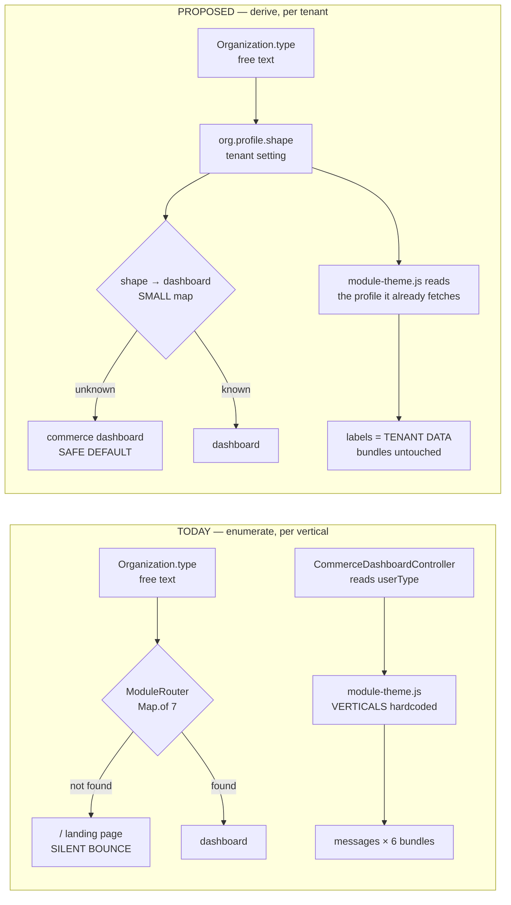

# Onboarding any business — the Vertical Profile

**Status:** ANALYSIS + PROPOSAL — no code written. Raised 2026-08-20 out of the installment review, when the
product goal was restated as *"MaxTheService will adopt **any kind of business, any domain**."*
**Verdict up front:** the commerce core is ready for that. **The way a vertical is DECLARED is not** — it is a
code branch in five places, and three of them fail silently.
**Companion to:** [`SAAS-BUILD-STANDARDS.md`](SAAS-BUILD-STANDARDS.md) (which this proposes to amend) ·
[`installment-dues-reminders-design.md`](installment-dues-reminders-design.md) (the slice that surfaced it) ·
[`project_vertical_aware_dashboard`](commerce-verticals-blueprint.md)

---

## 1. The premise changed, so the standard has to

`SAAS-BUILD-STANDARDS.md` §0 reads:

> *One multi-tenant SaaS platform; one shared commerce core … each vertical is the same core white-labelled by
> **user type** + its own thin differentiating layer.*

That was written for **three** verticals (Retail/POS, Pharmacy, E-commerce). It is a good standard for three and
the wrong one for thirty. Two clauses in particular do not survive the new premise:

| Clause | Fine at N=3 | Breaks at N=any |
|---|---|---|
| *"white-labelled by **user type**"* | one person, one business | one person runs a mobile shop **and** a salon; `userType` can only be one of them |
| *"each vertical … + its own thin differentiating layer"* | a layer per vertical is 3 layers | 30 layers is not a layer, it is a fork |

**Proposed amendment:** *…white-labelled by the **active organization's profile**, which is tenant DATA. A new
business type is configuration. A new bounded context is the exception, and must be argued for.*

---

## 2. Where a vertical is hardcoded today

Every place the platform enumerates its verticals, with the cost of adding one business type.

| # | Place | Shape | Cost per new type | Verdict |
|---|---|---|---|---|
| 1 | `ModuleRouter.DASHBOARD_BY_TYPE` | `Map.of` — **7 entries**; unknown → `LANDING` (`"/"`) | Java edit + redeploy. **Omission = every user in that tenant silently bounced to the landing page on every login.** | 🔴 **not suitable** |
| 2 | `ModuleRouter.COMMERCE_TYPES` | `Set.of("BUSINESS","PHARMA","MARKETPLACE")` | Java edit | 🔴 |
| 3 | `CommerceDashboardController.COMMERCE_MODULES` | `Set.of("BUSINESS","PHARMA","MARKETPLACE")` — **a second copy of #2** | Java edit; **already drifted** — #2 keys on org type, #3 on `userType` | 🔴 duplicate |
| 4 | `module-theme.js` `VERTICALS` | hardcoded JS object with hand-written label dictionaries per vertical | edit shipped JS | 🔴 |
| 5 | i18n — vertical wording in `messages*.properties` | **6 language bundles**, ~1,141 keys | 6 bundle edits, and translation is not mechanical | 🔴 **the hard blocker** |
| 6 | `AuthService.moduleFor()` | binary: `EDUCATION` vs everything-else → which location registry | none today | 🟠 assumes exactly two registries forever |
| 7 | `SetupDataLoader` role seeding | `ROLE_<TYPE>_USER` string lists | **none** | ✅ |
| 8 | gateway demo write-cap | `moduleOf(path)` — derived from `/api/<module>/…` | **none** | ✅ |
| 9 | `role_privileges_*.properties` | 6 files | **none** — there is **no** `_pharma` or `_marketplace` file; **both reuse BUSINESS privileges** | ✅ |

**Five red, three already right — and the three that are right show the pattern.** #7, #8 and #9 all cost nothing
because they **derive** the answer from something that already exists (a URL path, an org row, a shared privilege
set) instead of enumerating verticals. The five red ones enumerate.

> **The sharpest instance**, found while designing INST-8: `Organization.type` is a free-text `String` written by
> `OrganizationService.createTenant(...)` with **no validation, no enum, no allow-list**. So setting
> `type = 'MOBILE'` is trivially "supported" at the column — and would send that tenant's every login to `/`,
> because `ModuleRouter` has never heard of it. **Free-text at the column, enumerated at the router.** That
> mismatch is the bug pattern this whole document is about.

---

## 3. Proposal — the Vertical Profile is tenant data

### 3a. Where it lives

`common-settings`, as an `org.profile.*` catalog. The precedent already exists and is explicit:
`LocaleSettingsCatalog` is documented as *"the one settings catalog that is NOT vertical-specific, so it lives in
the shared library and appears on the Configuration screen of every module"*. A vertical profile is the second
such catalog. Storage is `org_setting` — per-tenant overrides over catalog defaults — which is already built,
already scoped, and already renders its own screen.

| Key | Example | Purpose |
|---|---|---|
| `org.profile.shape` | `retail` · `pharmacy` · `storefront` · `school` · `clinic` · `rental` · `services` | **the information architecture** — which dashboard, which sections |
| `org.profile.brandName` | `MyPlus Mobile` | title + `[data-brand]` |
| `org.profile.labels` | `Item=Handset,Customer=Buyer` | terminology, as **data** |
| `org.profile.features` | `installments,imei` | which `[data-feature]` blocks light up |
| `org.timezone` | `Asia/Karachi` | closes G10 — see §5 |

Note `shape`, not `type`. There are unbounded **business types** and a small number of **shapes**: a mobile shop,
an electronics store, a furniture showroom and a bike dealership are four business types and **one** shape
(`retail`). The enumeration that must stay small is the shape.

**Values are lowercase**, because `SettingsService.getChoice` lower-cases before matching and silently returns the
fallback otherwise. (See the installment doc §12 F1 — this exact trap.)

### 3b. What changes in code — once



1. **`ModuleRouter` keys on shape, and its default becomes the commerce dashboard, not `/`.** Failing to a
   *working* screen beats failing to the landing page. The current javadoc defends `/` as *"better than a
   `/<type>Dashboard` guess that would 404"* — true, and a fixed fallback to a dashboard that certainly exists is
   better than both.
2. **Delete `CommerceDashboardController.COMMERCE_MODULES`** and call `ModuleRouter.moduleOf(user)`. This closes
   the existing `userType`-vs-`activeOrgType` drift as a side effect. One map, one rule — the exact reason
   `ModuleRouter` was extracted in B2B P0.5.
3. **`module-theme.js` reads `labels` / `features` / `brand` from the profile** it can fetch from the settings
   endpoint it already talks to, instead of the hardcoded `VERTICALS` object. `VERTICALS` survives only as the
   **seed defaults** for the known shapes.
4. **i18n bundles stop carrying vertical wording.** Bundles hold the *neutral* string; the profile overrides it
   per tenant. A shop calling an Item a "Handset" then costs nothing and touches no translation.

### 3c. TWO axes, not one — the correction that HRMS/HMS/CRM force

The profile in §3a is necessary and **not sufficient**. It answers *"what do this tenant's screens look like?"*
It does not answer *"what can this tenant DO?"* — and the named future domains (HRMS, hospital, ticket booking,
job board, ERP, CRM) are almost entirely the second question.

```
        A TENANT  =  ONE profile (shape)   ×   a SET of enabled capabilities

  Axis 1 — SHAPE          tenant DATA        no deploy, minutes      §3a
           retail · pharmacy · storefront · school · clinic · rental · services

  Axis 2 — CAPABILITY     bounded CONTEXT    a slice each, code      §7
           trade · inventory · finance · scheduling · clinical · hr · campaign · jobs …
```

A mobile shop and a furniture showroom differ on **Axis 1 only** — same capabilities, different words. A hospital
differs on **Axis 2** — it wants scheduling + clinical + pharmacy + finance, and no amount of relabelling a POS
produces one. Conflating the axes is what produces either a fork per business type (Axis 1 treated as code) or a
monolith per product (Axis 2 treated as configuration).

#### The test for Axis 1 — a new BUSINESS TYPE

> **Q1. Does it need its own SERVICE?** Only if it owns data with its own lifecycle *and* its own integration
> surface. Pharmacy earned one (prescriptions, Rx enforcement, controlled register). A mobile shop does not.
>
> **Q2. Does it need its own DASHBOARD?** Only if its information architecture is genuinely different — education
> earned one (students, timetables, terms). Retail shapes do not.
>
> **Q3. Otherwise → a PROFILE.** The default answer, reached in minutes, by configuration, with no deploy.

Answering Q1 or Q2 "yes" must be argued in a slice doc. Answering Q3 needs no permission at all.

#### The test for Axis 2 — a new CAPABILITY

> **Q4. Is there an existing service whose data this genuinely is?** If yes, it is a slice there, not a service.
>
> **Q5. Will more than one vertical consume it?** If yes it is a **shared capability** and its contract must be
> **domain-free from the first line** — see the D-9 warning in §7.
>
> **Q6. Does it own data + lifecycle + integration of its own?** Only all three justify a new service. Two out of
> three is a library (`common-*`), which is what `common-credit`, `common-subledger`, `common-outbox`,
> `common-import` and `common-settings` all are.

**Entitlement is the missing piece.** `Organization` already carries `plan` and `entryCap`; capabilities belong
beside them as `org.capabilities` — so a hospital tenant is `shape=clinic` + `capabilities=scheduling,clinical,
pharmacy,finance`, and the same platform sells an HR-only tenant without a line of new routing.

---

## 4. ⚠ Highlighted early — what is NOT suitable for "any business"

As asked. Ordered by how expensive they get if left.

### N1 — `userType` on the person is the wrong axis 🔴

A person is not a business type. One owner will run a mobile shop and a salon, and `User.userType` can hold one
value. `activeOrgType` **already exists** end to end (JWT claim → `AuthResponse` → monolith `User.activeOrgType` →
`ModuleRouter.moduleOf`) and is already preferred by the router. The remaining `userType` reads are legacy.
**Deprecate it to a signup default; never read it for behaviour.** `CommerceDashboardController` is the last
behavioural reader and is a one-method fix.

### N2 — terminology in shipped JS + 6 i18n bundles cannot scale 🔴

This is the hard blocker, and it is worth being blunt: **the platform cannot onboard an arbitrary business type
today without a developer, a redeploy and six translations.** Nothing else on this list changes that; §3a does.

### N3 — "unknown module → landing page" is the wrong default for an open-ended product 🔴

A safe-looking default that produces a silent, total failure (every login bounced) for a tenant whose only sin is
a new `type` string. Fail to the commerce dashboard instead.

### N4 — the chart of accounts and posting rules are one fixed set 🟠 → 🔴 at the first non-goods domain

`PostingService` hardcodes `CASH/BANK/AR/INVENTORY/AP/TAX/SALES/COGS/...` as `private static final String`, and
`postEvent` switches on a fixed list of event types. That is right for shops that buy and sell goods. It is wrong
for a **services** business (no inventory, no COGS), a **rental** business (deferred revenue, deposits held), or a
**clinic** (billing an insurer, not a buyer).

The foundation is sound — the `accounts` table is per-org with a unique `(org, code)` and `ensureDefaults()`
seeds it — so the fix is to make **posting rules a per-shape mapping** rather than constants. **Not urgent, and it
must not be discovered mid-slice**: flag it now, design it when the first non-goods domain is real.

### N5 — tender→account mapping fails open, and it is already wrong 🔴 *live defect*

```java
// PostingService.cashAccount(String method)
return (m.startsWith("CARD") || m.startsWith("BANK") || m.startsWith("CHEQUE")) ? BANK : CASH;
```

Anything unrecognised **silently becomes Cash**. Two live consequences today, before any new domain:

- **`SagaSellService` sends `method = ch.getPaymentMode()`, and `PaymentService` sets that to the literal
  `"SPLIT"` whenever there is more than one tender.** So a sale paid 5,000 by card + 2,000 cash posts the
  **entire 7,000 to `1000 Cash`**; `1010 Bank` is understated by the card portion.
- **`WALLET`** is an offered tender on `pos.tender.default` — mobile wallets are ubiquitous in this market — and
  it too lands on `1000 Cash`.

**Why no test caught it:** the journal still *balances*. Every assertion checks debits = credits or a total, so
the trial balance looks healthy while two account balances are wrong. This is the same lesson as the `4200`
incident, in a new place: **assert the account, not the balance.**

Raised as its own task; **not fixed here** — it is out of this slice's scope and deserves its own review.
A prefix `startsWith` chain is also exactly the "fails open" shape that will misfile every tender a new domain
brings, so the fix should be an explicit method→account map, not another `||`.

### N6 — `AuthService.moduleFor()` assumes exactly two location registries 🟠

`EDUCATION` → school branches, everything else → business stores. Correct today, and it is a binary. A domain with
a third kind of location (clinics? depots? routes?) needs it to become a lookup. Cheap to change, cheap to miss.

### N7 — demo/seed accounts are enumerated per module 🟢 minor

`SetupDataLoader` hardcodes `demo.business@`, `demo.pharma@`, `demo.education@`… Every new *shape* wants one.
Fine while shapes stay few — which §3a's `shape`-vs-`type` distinction is designed to ensure.

---

## 5. What this means for the installment slice

**Nothing blocks INST-1 → INST-3.** They ship on `userType = BUSINESS` + `pos.installment.enabled`, touch none of
the above, and are the customer's actual request.

Two items connect:

- **INST-0b** (`CommerceDashboardController` → `ModuleRouter.moduleOf`) is **N1's fix**, scoped to one method. Do
  it there; it is a prerequisite for INST-8 and a down-payment on this document.
- **INST-8** (`Organization.type = 'MOBILE'`) must **either** register `MOBILE` in all three hardcoded sets, **or**
  wait for §3b. Registering it is ~6 lines and is the honest short-term answer; §3b is the answer that stops the
  next twelve business types costing 6 lines each.
- **`org.timezone`** (installment doc §12 F8) belongs in this profile catalog, not in `pos.*`. It is a tenant
  property, not a point-of-sale one.

## 6. Recommended sequence

| | Work | Trigger |
|---|---|---|
| **VP-0** | this document → agree the standard amendment in §1 | now |
| **VP-1** | `CommerceDashboardController` → `ModuleRouter.moduleOf` (= INST-0b) | with INST-0 |
| **VP-2** | `org.profile.*` catalog + `org.timezone`; `ModuleRouter` keys on shape with a **safe commerce default** | before the **second** non-retail business type asks |
| **VP-3** | `module-theme.js` reads the profile; `VERTICALS` demoted to seed defaults; labels become tenant data | with VP-2 |
| **VP-4** | posting rules per shape (N4) | when the first **services / rental** domain is real |
| — | tender→account map (N5) | **independent — it is a live defect, not a roadmap item** |

VP-1 is minutes. VP-2 + VP-3 together are what turn *"we can onboard any business"* from a sales sentence into a
property of the software.

---

## 7. The named future domains, on facts

HRMS · hospital · ticket booking · job posting/search · ERP · CRM. Each checked against the code on
2026-08-20 — entity listings, not recollection. **Platform baseline as measured:** 33 modules, 1,062 Java files,
306 Flyway scripts, 228 Cypress specs.

| Domain | Axis | What ALREADY exists (verified) | Genuinely new | Verdict |
|---|---|---|---|---|
| **HRMS** | 2 — capability | education-service holds `Staff`, `StaffAttendance`, `StaffAbsence`, `LeaveRequest`, `LeaveType`, `Substitution`; party-service `Party` + `PartyRoleLink`; finance GL for payroll postings | payroll run, salary structure, contracts, appraisals | 🟢 **~40% built — in the wrong service.** See W1. |
| **Hospital (HMS)** | 2 + its own shape | appointment-service `Provider`/`Slot`/`Venue`/`Booking`/`Attendee`; `SchedulingClient` is **already domain-free by contract**; pharma-service `Prescription`/`PrescriptionItem`/`Dispensing`/`DrugInteraction`/`MedicineClinical`; party-service patient identity; finance billing | wards/beds, admissions, EMR, insurance claims | 🟢 composite of **four existing capabilities** + a clinical slice |
| **Ticket booking** | 2 — capability | appointment-service's slot engine carries `capacity`, `booked`, `available`, and booking is **idempotent per (slot, attendee)** — that is a seat-reservation engine | seat maps, price tiers, the ticket document, gate scan | 🟢 **the engine exists**; this is mostly a document + pricing slice |
| **Job posting / search** | 2 — new context | party-service identity only | postings, applications, matching, search index | 🟠 **genuinely new** — the only one on this list that is |
| **ERP** | ⚠ **neither** | finance-service (GL, AR/AP, aging, period close, tax register) + inventory + business (purchase/sales/POS) + party + the HR embryo above | **nothing** | 🔴 **not a domain — a packaging decision.** See W2. |
| **CRM** | 2 — capability | campaign-service `Campaign`/`Audience`/`AudienceMember`/`Template`/`CampaignLog`; party-service Contact-360; `Customer` with type/credit/hierarchy; analytics-service `ReportDefinition`/`ReportExecution`/`DashboardWidget`/`AggregatedMetric` | pipeline/opportunities, activities, lead lifecycle | 🟢 **substantially built**, scattered across three services |

### W1 — the HR embryo is trapped inside education-service, and this has happened before

`Staff`, `StaffAttendance`, `StaffAbsence`, `LeaveRequest`, `LeaveType` and `Substitution` are **already a
staff-management system**, and every one of them speaks *school*: a `Substitution` covers a **class period**.

This is precisely the failure `SCHED-1` decision **D-9** records, in the platform's own words:

> *"`appointment-service` was unusable by education precisely because its vocabulary had become a clinic's, so
> the shared surface must stay domain-free or the next consumer inherits education's words instead."*

That cost a whole slice to unpick, and the fix was to strip the contract back to **providers, slots, attendees and
an opaque `ref`**. The identical mistake is now sitting in education-service, one slice away from being called
"the HR module".

**Standing rule, therefore:** the first time a second vertical needs staff/leave/attendance, it is extracted to a
domain-free capability (`hr` — *person, engagement, absence, entitlement*; never *teacher, class, period*)
**before** it acquires a second consumer, not after. The D-9 unpick is the measured cost of doing it after.

### W2 — "ERP" is a name for the union, not a thing to build

Every ERP pillar already has a home: general ledger, AR/AP, aging, period close and a tax register in
finance-service; stock/FEFO/reservations in inventory-service; purchase-to-pay and order-to-cash in
business-service; a shared party master in party-service; reporting in analytics-service.

Treating "ERP" as a new domain would create a **second** system of record for money — the single most damaging
thing that can happen to this platform, and the failure mode the repo has already been burned by twice
(`4200 Sales Discount` empty in every tenant; storefront totals disagreeing with invoices). **There must never be
two ledgers.** ERP is a *packaging and positioning* decision: which capabilities a plan bundles, and what the
navigation calls them. Say so explicitly whenever it is proposed as a build.

### W3 — what these six domains would break that a shop never would

| Assumption baked in today | Holds for | Breaks for |
|---|---|---|
| a transaction moves **goods** (`INVENTORY`, `COGS` legs in `PostingService`) | retail, pharmacy, storefront | HRMS payroll, ticket sales, job board, most of CRM — **N4** |
| a party is a **customer or vendor** (`PartyType`, AR/AP) | commerce | employee, patient, candidate, attendee |
| a **location** is a store or a school (`AuthService.moduleFor` is binary) | commerce + education | wards, venues, depots — **N6** |
| a **document** is an invoice/quote/challan | commerce | payslip, ticket, admission note, offer letter |
| notifications are **event**-triggered | today | HRMS (payroll date), HMS (appointment reminder), ticketing (event reminder) all need the **time**-triggered scanner the installment slice introduces — **build it generic** |

The last row is worth acting on now: **INST-3's due-date scanner is the first instance of a mechanism four of
these six domains need.** That is the second-consumer trigger for extracting `common-reminder` (installment doc
INST-7), and it moves it from "nice later" to "expected".

---

## 8. Standard — evidence, not inference

Adopted at the user's instruction (*"always implement on facts and figures 100%, not on assumptions"*), and it is
already the repo's practice where it has been written down: `customer-requirements-plan.md` opens with *"every
claim checked against the code and against the OMS docs — not assumed"*, and its first finding was that **two of
thirteen requirements were already built**.

**The rule:** every claim in a design doc, review or estimate names the artefact it was read from — a file, a
class, a column, a count — or it is marked as an assumption in the text.

The repo's own incidents show what inference costs, and each is already a numbered standard:

| Inference that felt safe | What it actually was | Standard |
|---|---|---|
| "`mvn test` says BUILD SUCCESS" | 13 Testcontainers tests **skipped**, covering the 4 riskiest areas | **D2a** — read the Skipped count |
| "no `@Table` points at it, so it's dead" | `myplusdb.company` held **336 unmigrated rows** | **D4 / D5** — count it, in every environment |
| "the invoice is right, so the books are right" | `4200 Sales Discount` **empty in every tenant** for months, 3 specs green | gate the **trial balance** |
| "a row exists, so it was delivered" | a delivery count of **zero** passing as success | assert the **property**, not the artefact |
| "`docker ps` works, so Testcontainers works" | API version **1.32 vs a 1.40 minimum** | **D2a** |
| "the gate is green" | a piped exit code **faked 39/39** | read the tool's own output |

Three practices that follow, and that this document was written under:

1. **Quote the artefact.** "`Channel.java`'s javadoc says SMS is deliberately not implemented" beats "SMS isn't
   supported". A reader can check the first in ten seconds.
2. **Count before claiming coverage.** The tables in §7 come from `ls` over each service's `entity/` directory,
   and the baseline figures from `find | wc -l`. Both are reproducible in one command.
3. **Search for the absence explicitly.** "There is no installment code" was established by a repo-wide
   case-insensitive grep for five spellings returning zero hits outside vendored `jsPDF` — not by not having seen
   any.

**Applied to estimates too.** "~40% built" in §7 means *these named entities exist and these named ones do not* —
never a feeling. Where a figure cannot be grounded, the honest output is a question, which is what §10 of the
installment doc is for.
